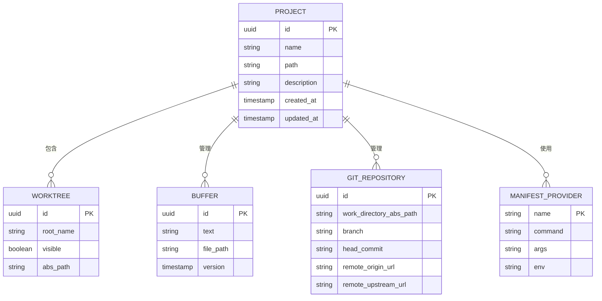

# 项目数据模型

<cite>
**本文档引用的文件**   
- [project.rs](file://crates/project/src/project.rs)
- [git_store.rs](file://crates/project/src/git_store.rs)
- [manifest_tree.rs](file://crates/project/src/manifest_tree.rs)
- [manifest_store.rs](file://crates/project/src/manifest_tree/manifest_store.rs)
- [worktree_store.rs](file://crates/project/src/worktree_store.rs)
- [buffer_store.rs](file://crates/project/src/buffer_store.rs)
- [shared_types/lib.rs](file://crates/shared_types/src/lib.rs)
- [http_interface.rs](file://crates/http_server/src/http_interface.rs)
</cite>

## 目录
1. [引言](#引言)
2. [核心项目实体](#核心项目实体)
3. [项目与工作树的关系](#项目与工作树的关系)
4. [Git存储库与版本控制](#git存储库与版本控制)
5. [清单树与依赖管理](#清单树与依赖管理)
6. [实体关系图](#实体关系图)
7. [典型查询与性能优化](#典型查询与性能优化)
8. [结论](#结论)

## 引言
本文档详细阐述了项目数据模型的设计与实现，重点关注`Project`实体的结构设计与生命周期管理。文档解释了`project.rs`中定义的核心字段如项目ID、名称、路径、状态等的语义和约束条件，描述了项目与工作树（worktree）、清单树（manifest_tree）之间的关系。深入分析了`git_store`如何通过Git仓库实现版本控制功能，包括分支管理、提交历史和冲突处理机制，并说明了`manifest_store`如何维护项目依赖和配置文件结构。最后，通过ER图展示项目相关实体的关系，并列举了典型查询如项目加载、状态同步的实现方式和性能优化策略。

## 核心项目实体

`Project`实体是系统的核心，负责管理项目相关的任务、LSP和协作查询，并同步工作树的状态。`Project`可以是本地的（在同一个主机上打开的项目）或远程的（被多个远程用户浏览的协作项目）。`Project`实体通过`ProjectEntryId`和`ProjectPath`结构映射`Worktree`条目。

`Project`实体包含多个关键组件，如`buffer_store`、`worktree_store`、`git_store`、`lsp_store`等，这些组件共同协作以提供完整的项目管理功能。`Project`实体还负责管理项目的协作状态，通过`collaborators`哈希表跟踪协作用户，并通过`client_subscriptions`列表管理客户端订阅。

**Section sources**
- [project.rs](file://crates/project/src/project.rs#L172-L214)

## 项目与工作树的关系

`Project`与`Worktree`之间的关系是通过`ProjectPath`结构建立的。`ProjectPath`包含`worktree_id`和`path`两个字段，`worktree_id`标识了`Worktree`的ID，`path`标识了文件在`Worktree`中的路径。`Project`通过`ProjectPath`结构将`Worktree`条目与自身的逻辑映射起来。

`WorktreeStore`负责管理`Worktree`的生命周期，包括创建、删除和更新`Worktree`。`WorktreeStore`通过`loading_worktrees`哈希表缓存正在加载的`Worktree`，并通过`worktrees`列表管理所有`Worktree`。`WorktreeStore`还负责处理`Worktree`的可见性，通过`visible_worktrees`方法返回所有可见的`Worktree`。

**Section sources**
- [project.rs](file://crates/project/src/project.rs#L172-L214)
- [worktree_store.rs](file://crates/project/src/worktree_store.rs#L0-L1004)

## Git存储库与版本控制

`GitStore`是`Project`中负责Git版本控制的核心组件。`GitStore`通过`Repository`实体管理Git仓库的状态，包括分支、提交历史和冲突处理。`GitStore`通过`repositories`哈希表管理所有`Repository`，并通过`active_repo_id`标识当前活动的`Repository`。

`GitStore`提供了丰富的Git操作接口，如`stage`、`unstage`、`commit`、`push`、`pull`等，这些接口通过`GitJob`任务异步执行。`GitStore`还通过`loading_diffs`哈希表缓存正在加载的差异，通过`diffs`哈希表管理所有`BufferGitState`。

`ConflictSet`是`GitStore`中用于处理合并冲突的组件。`ConflictSet`通过`parse`方法解析文件中的冲突标记，并通过`resolve`方法解决冲突。`ConflictSet`通过`conflicts`数组管理所有冲突区域，并通过`conflict_updated_futures`列表管理冲突更新的未来。

**Section sources**
- [git_store.rs](file://crates/project/src/git_store.rs#L0-L5250)
- [git_store/conflict_set.rs](file://crates/project/src/git_store/conflict_set.rs#L0-L681)

## 清单树与依赖管理

`ManifestTree`是`Project`中负责管理项目依赖和配置文件结构的组件。`ManifestTree`通过`ManifestProvidersStore`管理所有`ManifestProvider`，并通过`root_points`哈希表管理所有`WorktreeRoots`。

`ManifestProvidersStore`通过`providers`哈希表管理所有`ManifestProvider`，并通过`register`和`unregister`方法注册和注销`ManifestProvider`。`ManifestProvidersStore`还通过`get`方法获取指定名称的`ManifestProvider`。

`ManifestTree`通过`root_for_path`方法查找指定路径的根点，并通过`root_for_path_or_worktree_root`方法查找指定路径的根点或工作树根点。`ManifestTree`还通过`on_worktree_store_event`方法处理`WorktreeStore`事件。

**Section sources**
- [manifest_tree.rs](file://crates/project/src/manifest_tree.rs#L0-L224)
- [manifest_store.rs](file://crates/project/src/manifest_tree/manifest_store.rs#L0-L52)

## 实体关系图

**Diagram sources **
- [project.rs](file://crates/project/src/project.rs#L172-L214)
- [worktree_store.rs](file://crates/project/src/worktree_store.rs#L0-L1004)
- [buffer_store.rs](file://crates/project/src/buffer_store.rs#L0-L1735)
- [git_store.rs](file://crates/project/src/git_store.rs#L0-L5250)
- [manifest_store.rs](file://crates/project/src/manifest_tree/manifest_store.rs#L0-L52)

## 典型查询与性能优化

### 项目加载
项目加载是通过`Project`实体的`create_worktree`方法实现的。`create_worktree`方法首先检查`loading_worktrees`哈希表中是否已经存在正在加载的`Worktree`，如果存在则返回缓存的任务，否则创建新的`Worktree`并将其添加到`loading_worktrees`哈希表中。

### 状态同步
状态同步是通过`WorktreeStore`的`send_project_updates`方法实现的。`send_project_updates`方法通过`downstream_client`将`Worktree`的更新发送到下游客户端。`send_project_updates`方法还通过`observe_updates`方法观察`Worktree`的更新，并将更新发送到下游客户端。

### 性能优化
性能优化主要通过以下几种方式实现：
1. **缓存**：`WorktreeStore`通过`loading_worktrees`哈希表缓存正在加载的`Worktree`，`GitStore`通过`loading_diffs`哈希表缓存正在加载的差异。
2. **异步操作**：`GitStore`通过`GitJob`任务异步执行Git操作，避免阻塞主线程。
3. **批量更新**：`WorktreeStore`通过`send_project_updates`方法批量发送`Worktree`的更新，减少网络请求次数。

**Section sources**
- [worktree_store.rs](file://crates/project/src/worktree_store.rs#L0-L1004)
- [git_store.rs](file://crates/project/src/git_store.rs#L0-L5250)

## 结论
本文档详细阐述了项目数据模型的设计与实现，涵盖了`Project`实体的结构设计、`Worktree`和`GitStore`的关系、`ManifestTree`的依赖管理以及典型查询的实现方式和性能优化策略。通过本文档，开发者可以更好地理解项目数据模型的内部机制，从而更高效地开发和维护项目。