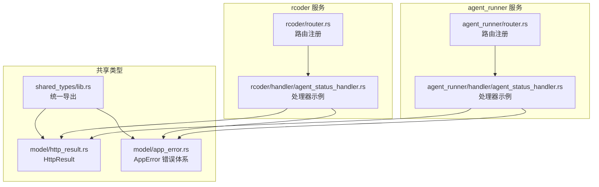
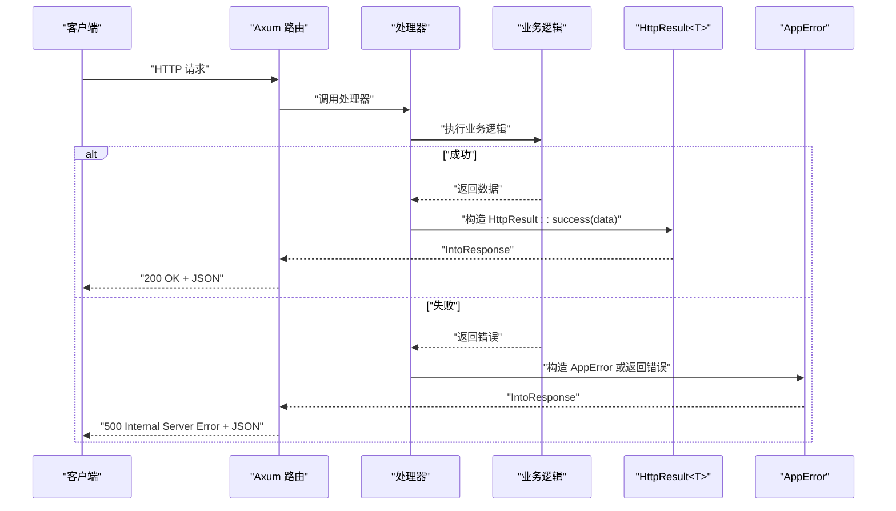
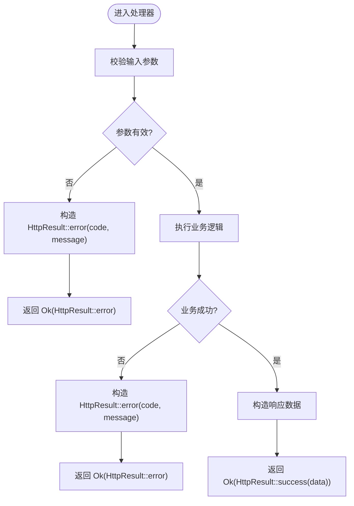
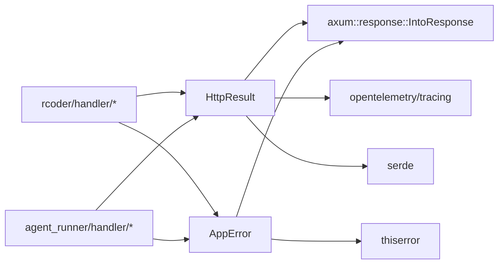

# HTTP结果模型

<cite>
**本文引用的文件**
- [http_result.rs](file://crates/shared_types/src/model/http_result.rs)
- [app_error.rs](file://crates/shared_types/src/model/app_error.rs)
- [lib.rs](file://crates/shared_types/src/lib.rs)
- [agent_status_handler.rs（rcoder）](file://crates/rcoder/src/handler/agent_status_handler.rs)
- [router.rs（rcoder）](file://crates/rcoder/src/router.rs)
- [agent_status_handler.rs（agent_runner）](file://crates/agent_runner/src/handler/agent_status_handler.rs)
- [router.rs（agent_runner）](file://crates/agent_runner/src/router.rs)
- [chat_response.rs](file://crates/shared_types/src/model/chat_response.rs)
- [agent_model.rs](file://crates/shared_types/src/model/agent_model.rs)
</cite>

## 目录
1. [简介](#简介)
2. [项目结构](#项目结构)
3. [核心组件](#核心组件)
4. [架构总览](#架构总览)
5. [详细组件分析](#详细组件分析)
6. [依赖关系分析](#依赖关系分析)
7. [性能考量](#性能考量)
8. [故障排查指南](#故障排查指南)
9. [结论](#结论)
10. [附录](#附录)

## 简介
本文件围绕HTTP结果模型展开，重点说明统一响应格式的设计理念、成功与失败路径的处理逻辑，并结合Axum处理器的返回类型使用，系统性地介绍HttpResult<T>泛型结果类型与AppError错误体系。文档同时梳理错误码与触发条件、错误上下文信息收集机制、序列化输出示例以及客户端错误处理建议，帮助开发者在不同服务中一致地构建标准化API响应。

## 项目结构
- 共享类型位于 crates/shared_types，其中定义了HttpResult<T>与AppError等跨服务通用模型。
- rcoder与agent_runner两个服务各自实现了Axum路由与处理器，广泛采用HttpResult<T>作为成功响应，AppError作为错误响应。
- 通过lib.rs统一导出共享类型，便于服务间复用。

图表来源
- [lib.rs](file://crates/shared_types/src/lib.rs#L15-L53)
- [http_result.rs](file://crates/shared_types/src/model/http_result.rs#L24-L103)
- [app_error.rs](file://crates/shared_types/src/model/app_error.rs#L1-L65)
- [router.rs（rcoder）](file://crates/rcoder/src/router.rs#L52-L84)
- [agent_status_handler.rs（rcoder）](file://crates/rcoder/src/handler/agent_status_handler.rs#L72-L132)
- [router.rs（agent_runner）](file://crates/agent_runner/src/router.rs#L41-L70)
- [agent_status_handler.rs（agent_runner）](file://crates/agent_runner/src/handler/agent_status_handler.rs#L70-L122)

章节来源
- [lib.rs](file://crates/shared_types/src/lib.rs#L15-L53)
- [router.rs（rcoder）](file://crates/rcoder/src/router.rs#L52-L84)
- [router.rs（agent_runner）](file://crates/agent_runner/src/router.rs#L41-L70)

## 核心组件
- HttpResult<T>：统一的成功/失败响应载体，包含业务字段code、message、data、tid以及运行时计算的success布尔值。成功路径通过success(data)构造，失败路径通过error(code, message)或internal_error(message)构造。序列化时自动注入success字段，Axum IntoResponse实现负责HTTP状态码与Content-Type设置。
- AppError：统一的错误类型，封装anyhow、IO与通用错误，提供generic、internal_server_error、validation_error等便捷构造方法。其IntoResponse实现将错误标准化为包含error.code与error.message的对象，状态码固定为500。

章节来源
- [http_result.rs](file://crates/shared_types/src/model/http_result.rs#L24-L103)
- [app_error.rs](file://crates/shared_types/src/model/app_error.rs#L1-L65)

## 架构总览
下图展示了Axum处理器与统一响应模型之间的交互关系，以及错误路径与成功路径的分流。

图表来源
- [agent_status_handler.rs（rcoder）](file://crates/rcoder/src/handler/agent_status_handler.rs#L72-L132)
- [http_result.rs](file://crates/shared_types/src/model/http_result.rs#L77-L103)
- [app_error.rs](file://crates/shared_types/src/model/app_error.rs#L33-L57)

## 详细组件分析

### HttpResult<T> 泛型结果类型
- 设计理念
  - 统一响应格式：所有API响应均包含code、message、data、tid与success字段，便于前端统一解析与展示。
  - 成功路径：success(data)构造，code默认“0000”，success=true。
  - 失败路径：error(code, message)构造，success=false；internal_error(message)为内部错误的快捷方式。
  - 上下文追踪：自动从OpenTelemetry上下文提取trace_id，若无则置空，便于日志与链路追踪。
  - 序列化策略：自定义Serialize实现，显式写出5个字段，其中success根据code是否为“0000”动态计算。
  - 响应适配：实现IntoResponse，优先返回JSON，序列化失败时降级为500与纯文本。

- 关键行为与复杂度
  - 构造函数O(1)，序列化O(n)（n为data序列化开销），IntoResponse序列化O(1)+序列化开销。
  - trace_id提取依赖当前span上下文，若无效则返回None，不影响响应正确性。

- 使用建议
  - 成功场景：优先使用success(data)返回结构化数据。
  - 失败场景：明确错误码与message，避免使用internal_error除非无法确定具体原因。
  - 数据为空：data字段可为None，但需保证业务语义清晰。

章节来源
- [http_result.rs](file://crates/shared_types/src/model/http_result.rs#L24-L103)

### AppError 错误体系
- 设计理念
  - 统一错误抽象：通过枚举封装常见错误来源，便于集中处理与上报。
  - 易于扩展：支持From实现，如tokio mpsc SendError的转换，便于在异步通道中传播错误。
  - 标准化输出：IntoResponse固定返回500状态码与包含error.code与error.message的对象，便于前端统一处理。

- 错误分类与构造
  - AnyhowError：包装底层异常，便于上抛。
  - IoError：包装IO错误。
  - Generic：通用错误，支持validation_error与internal_server_error等便捷方法。

- 使用建议
  - 业务层尽量将错误转换为明确的错误码与message，必要时使用AppError::Generic承载。
  - 对于可恢复的业务错误，优先返回HttpResult::error(...)而非抛出AppError，以便客户端区分业务错误与系统错误。

章节来源
- [app_error.rs](file://crates/shared_types/src/model/app_error.rs#L1-L65)

### Axum处理器中的返回类型使用
- 返回类型约定
  - 成功：Result<HttpResult<T>, AppError>，处理器返回Ok(HttpResult::success(...))或Ok(HttpResult::error(...))。
  - 失败：Result<HttpResult<T>, AppError>，处理器返回Err(AppError::...)或Ok(HttpResult::error(...))。
- 示例：rcoder与agent_runner的agent_status处理器均采用该模式，先做参数校验，再构造AgentStatusResponse并返回HttpResult.success(...)，或在参数非法时返回HttpResult.error(...)。

图表来源
- [agent_status_handler.rs（rcoder）](file://crates/rcoder/src/handler/agent_status_handler.rs#L72-L132)
- [agent_status_handler.rs（agent_runner）](file://crates/agent_runner/src/handler/agent_status_handler.rs#L70-L122)

章节来源
- [agent_status_handler.rs（rcoder）](file://crates/rcoder/src/handler/agent_status_handler.rs#L72-L132)
- [agent_status_handler.rs（agent_runner）](file://crates/agent_runner/src/handler/agent_status_handler.rs#L70-L122)

### 错误码与触发条件
- 内置错误码
  - “0000”：成功。
  - “5000”：内部错误（internal_error(message)构造）。
- 业务错误码示例
  - “INVALID_PARAMS”：参数校验失败（例如agent_status处理器对project_id为空的处理）。
  - “INVALID_SESSION”：会话无效（OpenAPI示例中出现）。
  - “SESSION_NOT_FOUND”：会话不存在（OpenAPI示例中出现）。
- 触发条件
  - 参数校验失败：处理器在进入业务逻辑前进行参数校验，不符合要求时返回HttpResult::error(...)。
  - 业务状态异常：如Agent不存在、会话不存在等，返回相应错误码与message。
  - 系统异常：无法预期的错误，使用AppError或HttpResult::internal_error(...)。

章节来源
- [agent_status_handler.rs（rcoder）](file://crates/rcoder/src/handler/agent_status_handler.rs#L72-L132)
- [agent_status_handler.rs（agent_runner）](file://crates/agent_runner/src/handler/agent_status_handler.rs#L70-L122)
- [http_result.rs](file://crates/shared_types/src/model/http_result.rs#L36-L58)

### 错误上下文信息收集机制
- trace_id采集
  - HttpResult<T>在构造时与IntoResponse阶段均可从OpenTelemetry上下文提取trace_id，若当前span无效则置空。
  - 该机制确保每个响应具备可追踪的链路标识，便于日志聚合与问题定位。
- 请求ID（request_id）
  - 在聊天响应等结构中提供request_id字段，用于标识与追踪请求，便于跨服务关联。
- 会话消息中的错误字段
  - 会话通知结构中包含错误信息字段，便于在SSE流中传递错误详情。

章节来源
- [http_result.rs](file://crates/shared_types/src/model/http_result.rs#L8-L22)
- [chat_response.rs](file://crates/shared_types/src/model/chat_response.rs#L1-L18)
- [agent_model.rs](file://crates/shared_types/src/model/agent_model.rs#L71-L97)

### 序列化输出示例
- 成功响应（示例结构）
  - 字段：code、message、data、tid、success
  - data为对象或数组时，success为true；data为null时，success仍为true
- 失败响应（示例结构）
  - 字段：code、message、data为null、tid、success为false
  - 或AppError的标准化错误对象（error.code与error.message）

章节来源
- [http_result.rs](file://crates/shared_types/src/model/http_result.rs#L61-L74)
- [app_error.rs](file://crates/shared_types/src/model/app_error.rs#L33-L57)

### 客户端错误处理建议
- 成功与失败路径区分
  - 优先依据success字段判断整体成功与否；若为false，读取error.code与error.message进行分支处理。
- 错误码映射
  - 将“0000”视为成功；“5000”视为内部错误，提示用户稍后重试或上报工单。
  - “INVALID_PARAMS”、“INVALID_SESSION”、“SESSION_NOT_FOUND”等业务错误码用于提示用户修正输入或重新发起请求。
- 上下文追踪
  - 记录并回传tid，便于服务端定位问题；在客户端日志中附带request_id，便于跨服务关联。
- 降级与重试
  - 对瞬时性错误（如网络抖动）建议客户端进行指数退避重试；对参数类错误直接提示用户修正。

## 依赖关系分析
- 组件耦合
  - HttpResult<T>与AppError均为共享类型，rcoder与agent_runner通过lib.rs统一导出使用，降低重复实现与耦合。
  - 处理器依赖共享类型，路由层仅负责注册与文档生成，职责清晰。
- 外部依赖
  - OpenTelemetry与tracing用于trace_id采集与日志追踪。
  - serde、utoipa用于序列化与OpenAPI文档生成。
  - axum用于HTTP响应适配与IntoResponse实现。

图表来源
- [http_result.rs](file://crates/shared_types/src/model/http_result.rs#L1-L103)
- [app_error.rs](file://crates/shared_types/src/model/app_error.rs#L1-L65)
- [lib.rs](file://crates/shared_types/src/lib.rs#L15-L53)

章节来源
- [lib.rs](file://crates/shared_types/src/lib.rs#L15-L53)

## 性能考量
- 序列化成本
  - HttpResult<T>的序列化为结构体序列化，主要开销取决于data的大小；建议在成功路径仅返回必要字段，避免冗余数据。
- IntoResponse路径
  - 成功路径返回200+JSON，失败路径返回500+JSON；序列化失败时降级为500+纯文本，避免中间件异常。
- trace_id采集
  - trace_id提取依赖当前span上下文，若无上下文则跳过，不会引入额外开销。

## 故障排查指南
- 常见问题
  - 响应未携带success字段：确认使用HttpResult<T>而非自定义结构体。
  - 错误响应格式不一致：统一使用AppError或HttpResult::error(...)，避免混合返回。
  - trace_id缺失：检查OpenTelemetry中间件是否正确注入span上下文。
- 定位步骤
  - 根据tid在日志系统中检索对应链路。
  - 结合request_id在聊天/会话相关接口中定位具体请求。
  - 对业务错误码进行聚合统计，识别高频错误与潜在输入问题。

## 结论
通过HttpResult<T>与AppError的组合，系统实现了统一、可观测、易维护的API响应模型。成功与失败路径清晰分离，错误码与上下文信息完整，配合Axum的IntoResponse实现，能够稳定地输出标准化响应。建议在所有新接口中遵循该模式，以提升客户端体验与运维效率。

## 附录
- 统一导出入口
  - shared_types::lib.rs统一导出HttpResult与AppError，便于服务间复用。
- OpenAPI示例
  - rcoder与agent_runner的OpenAPI文档中对HttpResult<T>进行了标注与示例展示，便于客户端理解响应结构。

章节来源
- [lib.rs](file://crates/shared_types/src/lib.rs#L15-L53)
- [router.rs（rcoder）](file://crates/rcoder/src/router.rs#L86-L151)
- [router.rs（agent_runner）](file://crates/agent_runner/src/router.rs#L72-L128)