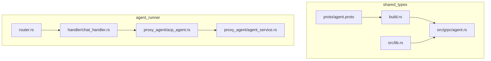
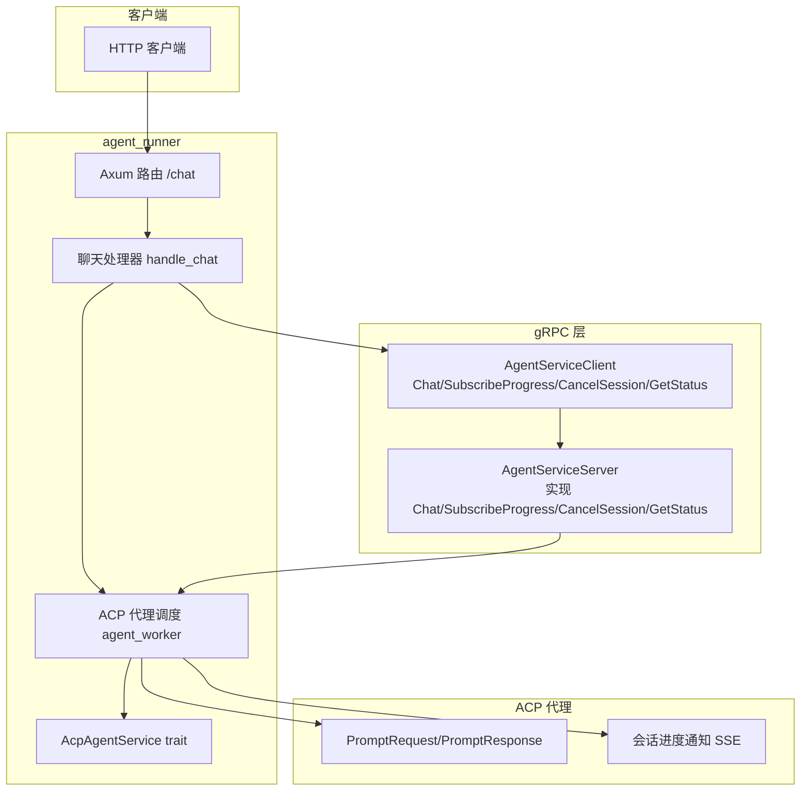
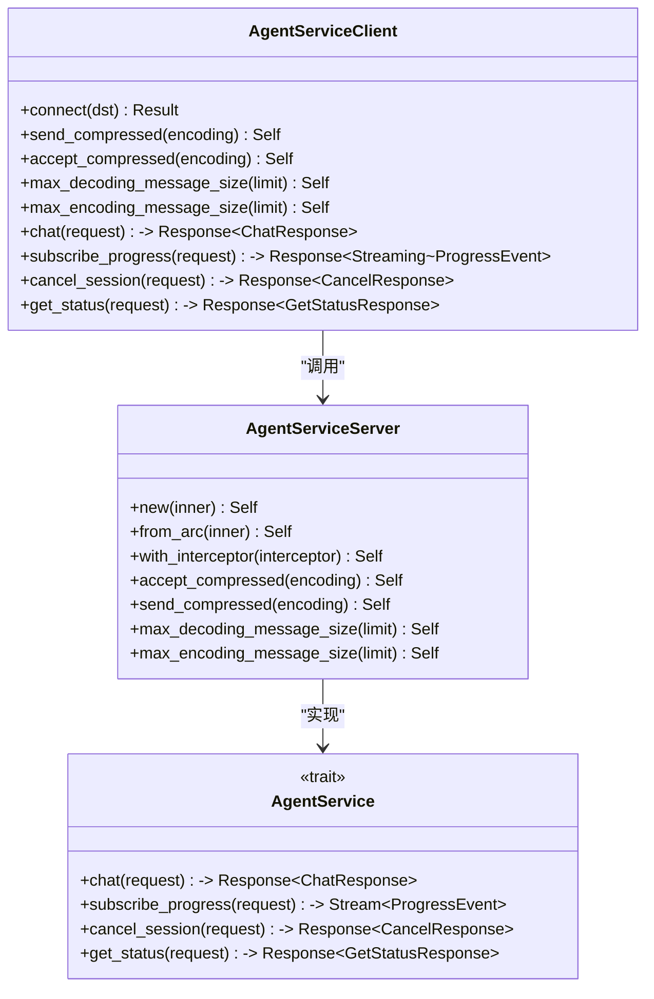
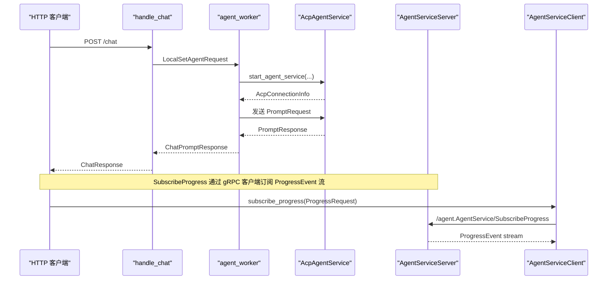
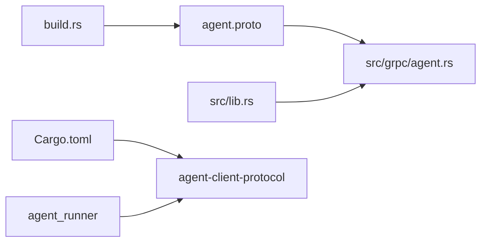

# gRPC数据模型

<cite>
**本文引用的文件**
- [agent.proto](file://crates/shared_types/proto/agent.proto)
- [agent.rs](file://crates/shared_types/src/grpc/agent.rs)
- [build.rs](file://crates/shared_types/build.rs)
- [lib.rs](file://crates/shared_types/src/lib.rs)
- [agent_service.rs](file://crates/agent_runner/src/proxy_agent/agent_service.rs)
- [acp_agent.rs](file://crates/agent_runner/src/proxy_agent/acp_agent.rs)
- [chat_handler.rs](file://crates/agent_runner/src/handler/chat_handler.rs)
- [router.rs](file://crates/agent_runner/src/router.rs)
- [Cargo.toml](file://Cargo.toml)
</cite>

## 目录
1. [简介](#简介)
2. [项目结构](#项目结构)
3. [核心组件](#核心组件)
4. [架构总览](#架构总览)
5. [详细组件分析](#详细组件分析)
6. [依赖分析](#依赖分析)
7. [性能考虑](#性能考虑)
8. [故障排查指南](#故障排查指南)
9. [结论](#结论)
10. [附录](#附录)

## 简介
本文件围绕 agent.proto 协议生成的 Rust gRPC 数据模型，系统性阐述 Protobuf 消息类型（如 AgentRequest、AgentResponse）的字段定义与语义；解释 gRPC 服务接口与 ACP 协议的映射关系，重点覆盖流式调用 SubscribeProgress 的实现细节；提供序列化性能分析、版本兼容性策略与协议扩展指南；并结合 agent_runner 的实际调用场景，展示客户端与服务端之间的数据交换模式。

## 项目结构
- 协议定义位于 shared_types/proto/agent.proto，描述 gRPC 服务与消息类型。
- 生成的 Rust gRPC 客户端与服务端代码位于 shared_types/src/grpc/agent.rs。
- 构建脚本 build.rs 使用 tonic-prost-build 将 .proto 编译为 Rust。
- agent_runner 通过 HTTP 路由与 ACP 代理协作，间接消费 gRPC 数据模型。

图表来源
- [agent.proto](file://crates/shared_types/proto/agent.proto#L1-L98)
- [agent.rs](file://crates/shared_types/src/grpc/agent.rs#L1-L651)
- [build.rs](file://crates/shared_types/build.rs#L1-L14)
- [lib.rs](file://crates/shared_types/src/lib.rs#L1-L71)
- [chat_handler.rs](file://crates/agent_runner/src/handler/chat_handler.rs#L1-L321)
- [router.rs](file://crates/agent_runner/src/router.rs#L1-L200)
- [acp_agent.rs](file://crates/agent_runner/src/proxy_agent/acp_agent.rs#L1-L392)
- [agent_service.rs](file://crates/agent_runner/src/proxy_agent/agent_service.rs#L1-L62)

章节来源
- [agent.proto](file://crates/shared_types/proto/agent.proto#L1-L98)
- [agent.rs](file://crates/shared_types/src/grpc/agent.rs#L1-L651)
- [build.rs](file://crates/shared_types/build.rs#L1-L14)
- [lib.rs](file://crates/shared_types/src/lib.rs#L1-L71)
- [chat_handler.rs](file://crates/agent_runner/src/handler/chat_handler.rs#L1-L321)
- [router.rs](file://crates/agent_runner/src/router.rs#L1-L200)
- [acp_agent.rs](file://crates/agent_runner/src/proxy_agent/acp_agent.rs#L1-L392)
- [agent_service.rs](file://crates/agent_runner/src/proxy_agent/agent_service.rs#L1-L62)

## 核心组件
- gRPC 服务与消息
  - 服务：AgentService，包含 Chat、SubscribeProgress（Server Streaming）、CancelSession、GetStatus 四个 RPC。
  - 消息：ChatRequest、ChatResponse、ProgressRequest、ProgressEvent、CancelRequest、CancelResponse、GetStatusRequest、GetStatusResponse、ModelProviderConfig、Attachment。
- 生成代码
  - 通过 build.rs 调用 tonic-prost-build，生成客户端与服务端桩代码，位于 shared_types/src/grpc/agent.rs。
- ACP 协议映射
  - agent_runner 通过 HTTP 路由与 ACP 代理协作，将 ChatRequest/Response 与 ACP 的 PromptRequest/PromptResponse 对接，实现会话进度的 SSE 通知与取消控制。

章节来源
- [agent.proto](file://crates/shared_types/proto/agent.proto#L1-L98)
- [agent.rs](file://crates/shared_types/src/grpc/agent.rs#L1-L651)
- [build.rs](file://crates/shared_types/build.rs#L1-L14)
- [chat_handler.rs](file://crates/agent_runner/src/handler/chat_handler.rs#L1-L321)
- [acp_agent.rs](file://crates/agent_runner/src/proxy_agent/acp_agent.rs#L1-L392)

## 架构总览
下图展示了 gRPC 数据模型在系统中的位置与交互关系，以及与 ACP 的对接路径。

图表来源
- [agent.rs](file://crates/shared_types/src/grpc/agent.rs#L122-L650)
- [chat_handler.rs](file://crates/agent_runner/src/handler/chat_handler.rs#L1-L321)
- [acp_agent.rs](file://crates/agent_runner/src/proxy_agent/acp_agent.rs#L1-L392)
- [agent_service.rs](file://crates/agent_runner/src/proxy_agent/agent_service.rs#L1-L62)
- [router.rs](file://crates/agent_runner/src/router.rs#L1-L200)

## 详细组件分析

### Protobuf 消息类型与字段语义
- AgentService
  - Chat：一元 RPC，请求 ChatRequest，返回 ChatResponse。
  - SubscribeProgress：服务端流式 RPC，请求 ProgressRequest，返回 ProgressEvent 流。
  - CancelSession：一元 RPC，请求 CancelRequest，返回 CancelResponse。
  - GetStatus：一元 RPC，请求 GetStatusRequest，返回 GetStatusResponse。
- ChatRequest
  - project_id：项目标识。
  - session_id：会话标识。
  - prompt：用户提示词。
  - model_config：可选的模型提供商配置。
  - attachments：可选的附件列表。
  - request_id：可选的请求标识。
- ChatResponse
  - request_id：请求标识。
  - success：是否成功。
  - error：可选的错误信息。
- ProgressRequest
  - session_id：订阅进度的会话标识。
- ProgressEvent
  - event：oneof，包含 log、thought、chunk、done、error 等事件类型。
  - json_payload：保留的原始 JSON，用于兼容过渡。
  - timestamp：Unix 时间戳。
- CancelRequest
  - session_id：要取消的会话标识。
  - reason：取消原因。
- CancelResponse
  - success：是否取消成功。
- GetStatusRequest
  - project_id：项目标识。
- GetStatusResponse
  - status：状态字符串，如 "idle"、"busy"、"error"。
- ModelProviderConfig
  - provider：提供商名称。
  - model：模型名称。
  - api_key：可选的 API 密钥。
  - api_base：可选的 API 基地址。
- Attachment
  - name：附件名称。
  - kind：附件类型（如 text、image、file）。
  - content：内容（文本、base64 或 URL）。
  - source：来源（如 local、upload、paste）。
  - language：可选的语言（仅文本）。

章节来源
- [agent.proto](file://crates/shared_types/proto/agent.proto#L1-L98)

### 生成的 gRPC 客户端与服务端
- 客户端
  - AgentServiceClient 提供 chat、subscribe_progress、cancel_session、get_status 方法，均基于 tonic+prost 编解码。
  - 支持压缩、最大消息大小、拦截器等配置。
- 服务端
  - AgentServiceServer 实现 trait AgentService 的四个方法，并在内部将 HTTP 路径映射到具体 RPC。
  - 支持压缩、最大消息大小等配置。

图表来源
- [agent.rs](file://crates/shared_types/src/grpc/agent.rs#L122-L650)

章节来源
- [agent.rs](file://crates/shared_types/src/grpc/agent.rs#L122-L650)

### 与 ACP 协议的映射关系
- ChatRequest/Response 与 ACP 的 PromptRequest/PromptResponse 对接
  - agent_runner 的聊天处理器将 HTTP 请求转换为 ChatPrompt，并通过 ACP 代理发送 PromptRequest，接收 PromptResponse。
  - 会话进度通过 SSE 推送，与 gRPC 的 SubscribeProgress 语义一致（替代 /agent/progress/{session_id}）。
- 取消与状态
  - CancelSession 对应 ACP 的取消通知；GetStatus 对应查询代理状态。

图表来源
- [chat_handler.rs](file://crates/agent_runner/src/handler/chat_handler.rs#L1-L321)
- [acp_agent.rs](file://crates/agent_runner/src/proxy_agent/acp_agent.rs#L1-L392)
- [agent_service.rs](file://crates/agent_runner/src/proxy_agent/agent_service.rs#L1-L62)
- [agent.rs](file://crates/shared_types/src/grpc/agent.rs#L232-L257)

章节来源
- [chat_handler.rs](file://crates/agent_runner/src/handler/chat_handler.rs#L1-L321)
- [acp_agent.rs](file://crates/agent_runner/src/proxy_agent/acp_agent.rs#L1-L392)
- [agent_service.rs](file://crates/agent_runner/src/proxy_agent/agent_service.rs#L1-L62)
- [agent.rs](file://crates/shared_types/src/grpc/agent.rs#L232-L257)

### 流式调用 SubscribeProgress 的实现细节
- 客户端侧
  - AgentServiceClient.subscribe_progress 返回 Streaming<ProgressEvent>。
  - 可配置压缩与最大消息大小。
- 服务端侧
  - AgentServiceServer 将 /agent.AgentService/SubscribeProgress 映射到 subscribe_progress 方法，返回实现者提供的流。
- 实际使用
  - agent_runner 通过 HTTP SSE 提供 /agent/progress/{session_id}，与 gRPC 流式接口语义一致，便于替换与统一。

章节来源
- [agent.rs](file://crates/shared_types/src/grpc/agent.rs#L232-L257)
- [router.rs](file://crates/agent_runner/src/router.rs#L1-L200)

### 序列化性能分析
- 编解码器
  - 使用 prost+tonic 编解码，二进制序列化，开销低、吞吐高。
- 压缩
  - 支持 send_compressed/accept_compressed，可在高延迟网络中降低带宽占用。
- 消息大小限制
  - 提供 max_decoding_message_size/max_encoding_message_size，默认解码上限通常为 4MB，可根据业务调整。
- oneof 与可选字段
  - ProgressEvent.event 使用 oneof，减少冗余字段存储；可选字段（如 ChatRequest.request_id、ModelProviderConfig.api_key）按需传输，降低体积。
- 附件与 JSON 兼容
  - Attachment.content 支持多种格式；ProgressEvent.json_payload 保留原始 JSON，便于过渡期兼容。

章节来源
- [agent.rs](file://crates/shared_types/src/grpc/agent.rs#L182-L212)
- [agent.rs](file://crates/shared_types/src/grpc/agent.rs#L397-L412)
- [agent.proto](file://crates/shared_types/proto/agent.proto#L1-L98)

### 版本兼容性策略与协议扩展指南
- 向后兼容
  - 新增字段使用 optional，避免破坏已有客户端解析。
  - 保留 json_payload 等兼容字段，逐步迁移至强类型字段。
- 扩展建议
  - 新增 RPC：在 AgentService 中添加新方法，同时在客户端/服务端生成代码中补充实现。
  - 新增消息：在 proto 中新增 message，并在 shared_types/src/grpc/agent.rs 中自动生成。
  - 迁移路径：先提供新接口，再逐步引导客户端切换，最后清理旧接口。
- 构建与发布
  - 修改 proto 后，通过 build.rs 重新生成 agent.rs，确保客户端/服务端一致性。

章节来源
- [agent.proto](file://crates/shared_types/proto/agent.proto#L1-L98)
- [build.rs](file://crates/shared_types/build.rs#L1-L14)
- [agent.rs](file://crates/shared_types/src/grpc/agent.rs#L1-L651)

### 客户端与服务端数据交换模式（结合 agent_runner 场景）
- HTTP 到 gRPC 的桥接
  - HTTP 路由 /chat 由 handle_chat 处理，内部通过 ACP 代理发送 PromptRequest，接收 PromptResponse。
  - gRPC 的 Chat/SubscribeProgress/CancelSession/GetStatus 由 AgentServiceClient/Server 提供，可用于直接的 gRPC 客户端接入。
- 会话与进度
  - 会话 ID 与项目 ID 在 ChatRequest/Response 中传递，服务端据此维护会话状态与进度推送。
- 取消与状态
  - CancelSession 与 GetStatus 与 ACP 的取消与状态查询对齐，保证一致性。

章节来源
- [chat_handler.rs](file://crates/agent_runner/src/handler/chat_handler.rs#L1-L321)
- [agent.rs](file://crates/shared_types/src/grpc/agent.rs#L122-L650)
- [router.rs](file://crates/agent_runner/src/router.rs#L1-L200)

## 依赖分析
- 构建链路
  - build.rs 调用 tonic_prost_build::configure().build_server(true).build_client(true)，输出到 src/grpc/agent.rs。
  - shared_types/src/lib.rs include!("grpc/agent.rs")，统一导出 gRPC 模块。
- 运行时依赖
  - workspace.dependencies 中包含 agent-client-protocol（ACP 协议），用于与 ACP 代理交互。
  - tokio、tonic、prost 等异步与序列化依赖。

图表来源
- [build.rs](file://crates/shared_types/build.rs#L1-L14)
- [agent.proto](file://crates/shared_types/proto/agent.proto#L1-L98)
- [agent.rs](file://crates/shared_types/src/grpc/agent.rs#L1-L651)
- [lib.rs](file://crates/shared_types/src/lib.rs#L1-L71)
- [Cargo.toml](file://Cargo.toml#L1-L205)

章节来源
- [build.rs](file://crates/shared_types/build.rs#L1-L14)
- [lib.rs](file://crates/shared_types/src/lib.rs#L1-L71)
- [Cargo.toml](file://Cargo.toml#L1-L205)

## 性能考虑
- 序列化
  - prost 二进制编码，相比 JSON 更小更快；oneof 与可选字段减少冗余。
- 压缩
  - 在高延迟网络中启用压缩，降低带宽；注意服务端需支持对应编码。
- 消息大小
  - 合理设置 max_decoding_message_size/max_encoding_message_size，避免过大消息导致内存压力。
- 流式传输
  - SubscribeProgress 使用服务端流，分片推送进度，降低一次性传输成本。
- 并发与连接
  - gRPC 客户端连接池与重连策略需结合业务并发量评估；在 agent_runner 中可通过 ACP 代理连接管理策略优化。

## 故障排查指南
- 常见问题
  - 服务未就绪：客户端 ready() 失败，检查服务端启动与网络可达性。
  - 消息过大：触发 max_decoding_message_size 限制，适当增大或拆分消息。
  - 压缩不匹配：客户端启用压缩但服务端不支持，需协商一致的压缩算法。
  - 会话状态异常：确认 project_id/session_id 传递正确，避免跨会话混淆。
- 排查步骤
  - 检查 gRPC 客户端/服务端生成代码是否与 proto 一致。
  - 核对 ACP 代理连接与生命周期管理，确保连接可用且未超时。
  - 结合 agent_runner 的日志，定位 HTTP 到 ACP 的转换与进度推送环节。

章节来源
- [agent.rs](file://crates/shared_types/src/grpc/agent.rs#L182-L212)
- [agent.rs](file://crates/shared_types/src/grpc/agent.rs#L397-L412)
- [acp_agent.rs](file://crates/agent_runner/src/proxy_agent/acp_agent.rs#L1-L392)
- [chat_handler.rs](file://crates/agent_runner/src/handler/chat_handler.rs#L1-L321)

## 结论
本文基于 agent.proto 生成的 Rust gRPC 数据模型，系统梳理了消息类型、服务接口与 ACP 协议的映射关系，给出了流式调用的实现要点、序列化性能分析、版本兼容与扩展策略，并结合 agent_runner 的实际调用场景展示了客户端与服务端的数据交换模式。遵循本文建议可确保在演进过程中保持协议稳定与性能最优。

## 附录
- 相关文件清单
  - 协议与生成：agent.proto、agent.rs、build.rs、lib.rs
  - 业务集成：chat_handler.rs、acp_agent.rs、agent_service.rs、router.rs
  - 依赖声明：Cargo.toml