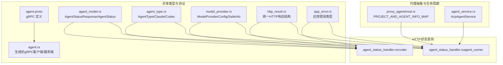
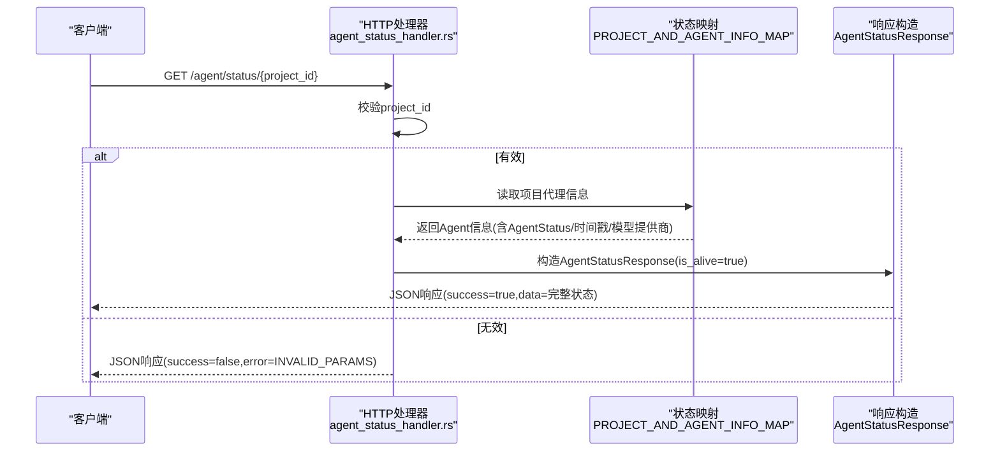
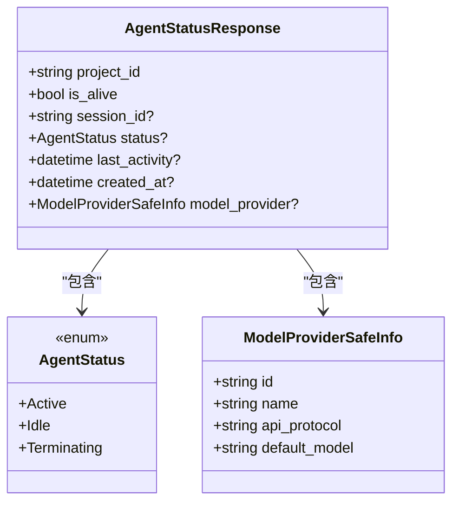
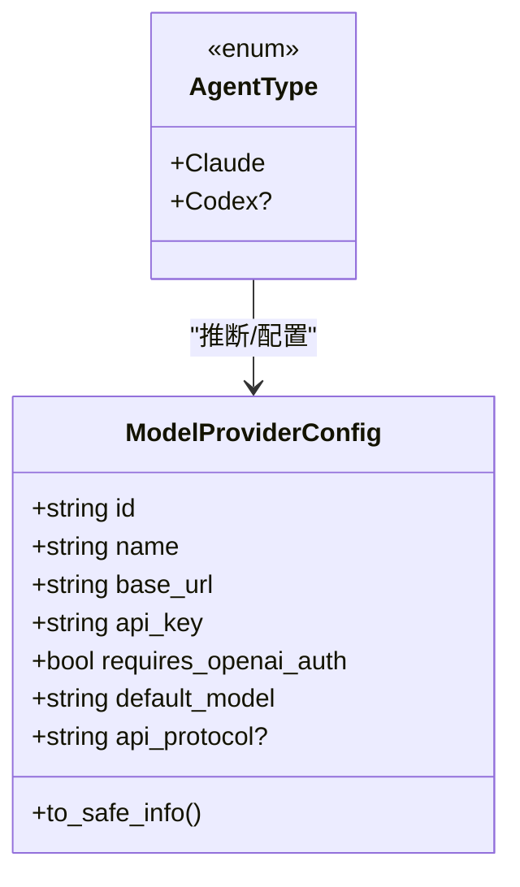
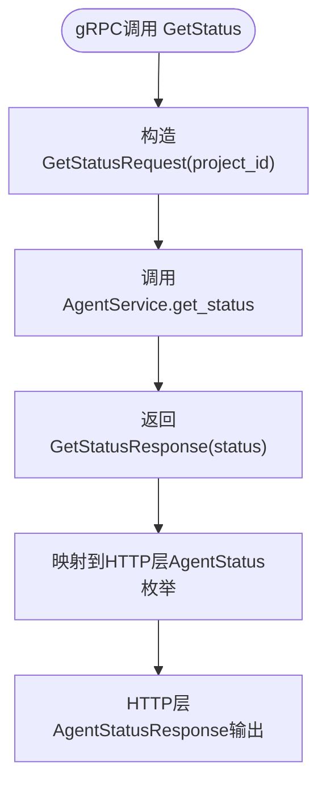
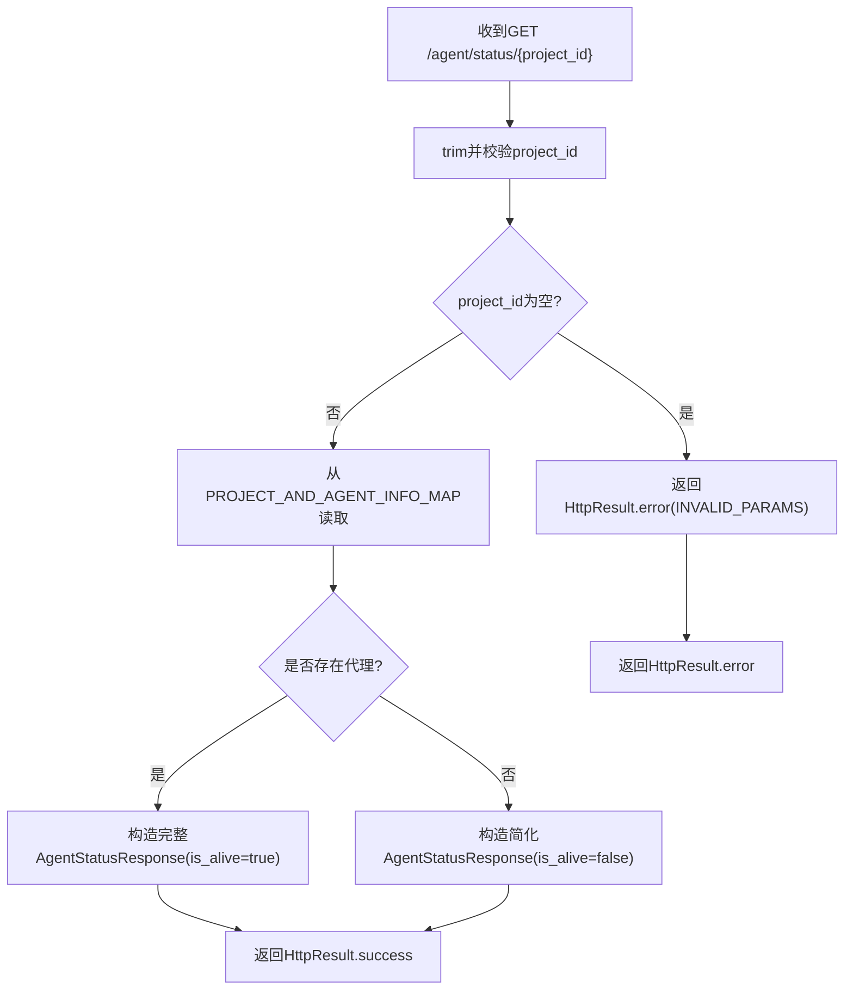
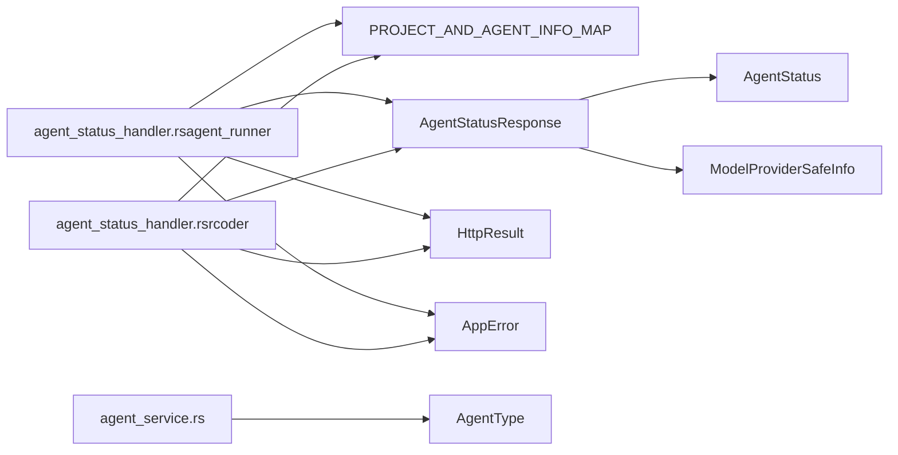

# 代理状态模型

<cite>
**本文引用的文件**
- [agent.proto](file://crates/shared_types/proto/agent.proto)
- [agent.rs](file://crates/shared_types/src/grpc/agent.rs)
- [agent_model.rs](file://crates/shared_types/src/model/agent_model.rs)
- [agent_type.rs](file://crates/shared_types/src/model/agent_type.rs)
- [model_provider.rs](file://crates/shared_types/src/model/model_provider.rs)
- [http_result.rs](file://crates/shared_types/src/model/http_result.rs)
- [app_error.rs](file://crates/shared_types/src/model/app_error.rs)
- [agent_status_handler.rs（agent_runner）](file://crates/agent_runner/src/handler/agent_status_handler.rs)
- [agent_status_handler.rs（rcoder）](file://crates/rcoder/src/handler/agent_status_handler.rs)
- [mod.rs（proxy_agent）](file://crates/agent_runner/src/proxy_agent/mod.rs)
- [agent_service.rs](file://crates/agent_runner/src/proxy_agent/agent_service.rs)
- [agent-abstraction-layer-design.md](file://specs/agent-abstraction-layer-design.md)
</cite>

## 目录
1. [简介](#简介)
2. [项目结构](#项目结构)
3. [核心组件](#核心组件)
4. [架构总览](#架构总览)
5. [详细组件分析](#详细组件分析)
6. [依赖关系分析](#依赖关系分析)
7. [性能考量](#性能考量)
8. [故障排查指南](#故障排查指南)
9. [结论](#结论)

## 简介
本文件系统化梳理代理状态模型，聚焦以下目标：
- 解释 AgentStatusResponse、AgentType 等关键类型
- 对比不同 AI 代理（Codex、Claude Code）的状态表示与统一抽象机制
- 说明状态查询接口的数据输出格式、字段含义与扩展点
- 结合 agent_status_handler 的实现，展示状态聚合逻辑与错误传播路径
- 提供 gRPC 协议映射细节（来自 agent.proto）与 JSON 序列化示例

## 项目结构
围绕“代理状态模型”的相关模块分布如下：
- 协议与序列化：shared_types/proto/agent.proto 与生成的 gRPC 客户端/服务端代码
- 数据模型：shared_types/src/model 下的 agent_model.rs、agent_type.rs、model_provider.rs、http_result.rs、app_error.rs
- HTTP 状态查询处理器：agent_runner 与 rcoder 两处实现
- 代理抽象与生命周期：agent_runner/proxy_agent 下的抽象层与生命周期管理

图表来源
- [agent.proto](file://crates/shared_types/proto/agent.proto#L1-L98)
- [agent.rs](file://crates/shared_types/src/grpc/agent.rs#L1-L120)
- [agent_model.rs](file://crates/shared_types/src/model/agent_model.rs#L32-L117)
- [agent_type.rs](file://crates/shared_types/src/model/agent_type.rs#L16-L63)
- [model_provider.rs](file://crates/shared_types/src/model/model_provider.rs#L43-L132)
- [http_result.rs](file://crates/shared_types/src/model/http_result.rs#L24-L103)
- [app_error.rs](file://crates/shared_types/src/model/app_error.rs#L1-L65)
- [agent_status_handler.rs（agent_runner）](file://crates/agent_runner/src/handler/agent_status_handler.rs#L1-L122)
- [agent_status_handler.rs（rcoder）](file://crates/rcoder/src/handler/agent_status_handler.rs#L1-L132)
- [mod.rs（proxy_agent）](file://crates/agent_runner/src/proxy_agent/mod.rs#L1-L256)
- [agent_service.rs](file://crates/agent_runner/src/proxy_agent/agent_service.rs#L1-L62)

章节来源
- [agent.proto](file://crates/shared_types/proto/agent.proto#L1-L98)
- [agent.rs](file://crates/shared_types/src/grpc/agent.rs#L1-L120)
- [agent_model.rs](file://crates/shared_types/src/model/agent_model.rs#L32-L117)
- [agent_type.rs](file://crates/shared_types/src/model/agent_type.rs#L16-L63)
- [model_provider.rs](file://crates/shared_types/src/model/model_provider.rs#L43-L132)
- [http_result.rs](file://crates/shared_types/src/model/http_result.rs#L24-L103)
- [app_error.rs](file://crates/shared_types/src/model/app_error.rs#L1-L65)
- [agent_status_handler.rs（agent_runner）](file://crates/agent_runner/src/handler/agent_status_handler.rs#L1-L122)
- [agent_status_handler.rs（rcoder）](file://crates/rcoder/src/handler/agent_status_handler.rs#L1-L132)
- [mod.rs（proxy_agent）](file://crates/agent_runner/src/proxy_agent/mod.rs#L1-L256)
- [agent_service.rs](file://crates/agent_runner/src/proxy_agent/agent_service.rs#L1-L62)

## 核心组件
- AgentStatusResponse：HTTP 状态查询的统一响应载体，包含项目标识、存活标记、会话ID、代理状态、时间戳与模型提供商安全信息。
- AgentStatus：共享的代理服务状态枚举，抽象了 Active、Idle、Terminating 等状态。
- AgentType：代理类型枚举，区分 Claude 与 Codex，并提供从模型提供商配置推断类型的能力。
- ModelProviderConfig/SafeInfo：模型提供商配置与脱敏后的安全信息，用于在状态响应中安全暴露必要元数据。
- gRPC GetStatus：agent.proto 中定义的 GetStatusRequest/GetStatusResponse，字段为字符串形式的状态码。
- HTTP 层：agent_status_handler.rs（两套实现）负责参数校验、状态聚合与错误传播。

章节来源
- [agent_model.rs](file://crates/shared_types/src/model/agent_model.rs#L32-L117)
- [agent_type.rs](file://crates/shared_types/src/model/agent_type.rs#L16-L63)
- [model_provider.rs](file://crates/shared_types/src/model/model_provider.rs#L43-L132)
- [agent.proto](file://crates/shared_types/proto/agent.proto#L69-L76)
- [agent.rs](file://crates/shared_types/src/grpc/agent.rs#L82-L91)
- [agent_status_handler.rs（agent_runner）](file://crates/agent_runner/src/handler/agent_status_handler.rs#L70-L122)
- [agent_status_handler.rs（rcoder）](file://crates/rcoder/src/handler/agent_status_handler.rs#L72-L132)

## 架构总览
状态查询的端到端流程如下：
- HTTP 层：接收 /agent/status/{project_id} 请求，进行参数校验与错误传播
- 聚合层：从全局映射中读取项目对应的代理信息（含 AgentStatus、会话ID、时间戳、模型提供商）
- 输出层：构造 AgentStatusResponse，按 is_alive 控制可选字段的序列化
- gRPC 层：GetStatus 以字符串状态码返回，与 HTTP 层的 AgentStatus 枚举形成互补

图表来源
- [agent_status_handler.rs（agent_runner）](file://crates/agent_runner/src/handler/agent_status_handler.rs#L70-L122)
- [agent_status_handler.rs（rcoder）](file://crates/rcoder/src/handler/agent_status_handler.rs#L72-L132)
- [mod.rs（proxy_agent）](file://crates/agent_runner/src/proxy_agent/mod.rs#L1-L256)
- [agent_model.rs](file://crates/shared_types/src/model/agent_model.rs#L32-L117)

## 详细组件分析

### AgentStatusResponse 与 AgentStatus
- 字段与语义
  - project_id：项目唯一标识
  - is_alive：代理是否存活（true 表示存在且健康）
  - session_id：仅在 is_alive=true 时存在
  - status：仅在 is_alive=true 时存在，枚举值为 Active/Idle/Terminating
  - last_activity/created_at：仅在 is_alive=true 时存在
  - model_provider：仅在 is_alive=true 时存在，使用脱敏后的安全信息
- 序列化策略
  - 使用 serde 的 skip_serializing_if 控制可选字段的输出
  - 通过 http_result.rs 的统一结构体包装 success、code、message、tid 与 data

图表来源
- [agent_model.rs](file://crates/shared_types/src/model/agent_model.rs#L70-L117)
- [model_provider.rs](file://crates/shared_types/src/model/model_provider.rs#L117-L132)

章节来源
- [agent_model.rs](file://crates/shared_types/src/model/agent_model.rs#L70-L117)
- [http_result.rs](file://crates/shared_types/src/model/http_result.rs#L24-L103)

### AgentType 抽象与多代理支持
- AgentType 枚举：Claude 与 Codex（条件编译 feature）
- 类型推断：根据 ModelProviderConfig 的 name 推断代理类型，默认 Claude
- 环境注入：提供从环境变量构建 Claude/Codex 模型提供商配置的方法

图表来源
- [agent_type.rs](file://crates/shared_types/src/model/agent_type.rs#L16-L63)
- [model_provider.rs](file://crates/shared_types/src/model/model_provider.rs#L43-L132)

章节来源
- [agent_type.rs](file://crates/shared_types/src/model/agent_type.rs#L16-L63)
- [model_provider.rs](file://crates/shared_types/src/model/model_provider.rs#L43-L132)

### gRPC GetStatus 协议映射
- 定义位置：agent.proto 中的 GetStatusRequest/GetStatusResponse
- 字段：GetStatusResponse.status 为字符串，取值为 "idle"、"busy"、"error"
- 生成代码：agent.rs 中包含 GetStatus 的客户端与服务端方法签名

图表来源
- [agent.proto](file://crates/shared_types/proto/agent.proto#L69-L76)
- [agent.rs](file://crates/shared_types/src/grpc/agent.rs#L82-L91)

章节来源
- [agent.proto](file://crates/shared_types/proto/agent.proto#L69-L76)
- [agent.rs](file://crates/shared_types/src/grpc/agent.rs#L82-L91)

### HTTP 状态查询接口与聚合逻辑
- 参数校验：project_id 必填且非空，否则返回 INVALID_PARAMS
- 存在性判断：从 PROJECT_AND_AGENT_INFO_MAP 获取项目代理信息
- 聚合策略：
  - 存在：填充完整 AgentStatusResponse（包含 session_id、status、时间戳、model_provider.safe）
  - 不存在：仅返回 project_id 与 is_alive=false
- 错误传播：AppError 统一转为 HTTP 响应结构体，包含 success、code、message、tid

图表来源
- [agent_status_handler.rs（agent_runner）](file://crates/agent_runner/src/handler/agent_status_handler.rs#L70-L122)
- [agent_status_handler.rs（rcoder）](file://crates/rcoder/src/handler/agent_status_handler.rs#L72-L132)
- [http_result.rs](file://crates/shared_types/src/model/http_result.rs#L24-L103)
- [app_error.rs](file://crates/shared_types/src/model/app_error.rs#L1-L65)
- [mod.rs（proxy_agent）](file://crates/agent_runner/src/proxy_agent/mod.rs#L1-L256)

章节来源
- [agent_status_handler.rs（agent_runner）](file://crates/agent_runner/src/handler/agent_status_handler.rs#L70-L122)
- [agent_status_handler.rs（rcoder）](file://crates/rcoder/src/handler/agent_status_handler.rs#L72-L132)
- [http_result.rs](file://crates/shared_types/src/model/http_result.rs#L24-L103)
- [app_error.rs](file://crates/shared_types/src/model/app_error.rs#L1-L65)
- [mod.rs（proxy_agent）](file://crates/agent_runner/src/proxy_agent/mod.rs#L1-L256)

### 不同代理（Codex、Claude Code）的状态表示与统一抽象
- HTTP 层：AgentStatusResponse 的 status 字段为 Active/Idle/Terminating 枚举，统一表达代理的运行态
- gRPC 层：GetStatusResponse.status 为字符串，取值为 "idle"、"busy"、"error"，与 HTTP 枚举形成互补
- 类型抽象：AgentType 统一区分 Claude 与 Codex，便于在上层进行差异化配置与行为控制

章节来源
- [agent_model.rs](file://crates/shared_types/src/model/agent_model.rs#L32-L61)
- [agent_type.rs](file://crates/shared_types/src/model/agent_type.rs#L16-L63)
- [agent.proto](file://crates/shared_types/proto/agent.proto#L69-L76)
- [agent.rs](file://crates/shared_types/src/grpc/agent.rs#L82-L91)

### JSON 序列化示例与字段含义
- 成功响应（代理存活）
  - success: true
  - data: 包含 project_id、is_alive(true)、session_id、status、last_activity、created_at、model_provider.safe
- 成功响应（代理不存活）
  - success: true
  - data: 包含 project_id、is_alive(false)
- 失败响应（参数错误）
  - success: false
  - error: 包含 code、message

章节来源
- [agent_status_handler.rs（agent_runner）](file://crates/agent_runner/src/handler/agent_status_handler.rs#L12-L69)
- [agent_status_handler.rs（rcoder）](file://crates/rcoder/src/handler/agent_status_handler.rs#L12-L67)
- [http_result.rs](file://crates/shared_types/src/model/http_result.rs#L24-L103)

## 依赖关系分析
- 低耦合与高内聚
  - HTTP 层仅依赖共享模型（AgentStatusResponse、AgentStatus、ModelProviderSafeInfo），不直接依赖具体代理实现
  - gRPC 层独立于 HTTP 层，二者通过共享的模型与协议文件解耦
- 关键依赖链
  - HTTP 处理器依赖：PROJECT_AND_AGENT_INFO_MAP、AgentStatusResponse、HttpResult、AppError
  - 代理抽象依赖：AgentType、AcpAgentService、生命周期管理（AgentLifecycle）

图表来源
- [agent_status_handler.rs（agent_runner）](file://crates/agent_runner/src/handler/agent_status_handler.rs#L1-L122)
- [agent_status_handler.rs（rcoder）](file://crates/rcoder/src/handler/agent_status_handler.rs#L1-L132)
- [agent_model.rs](file://crates/shared_types/src/model/agent_model.rs#L32-L117)
- [agent_service.rs](file://crates/agent_runner/src/proxy_agent/agent_service.rs#L1-L62)
- [agent_type.rs](file://crates/shared_types/src/model/agent_type.rs#L16-L63)
- [mod.rs（proxy_agent）](file://crates/agent_runner/src/proxy_agent/mod.rs#L1-L256)

章节来源
- [agent_status_handler.rs（agent_runner）](file://crates/agent_runner/src/handler/agent_status_handler.rs#L1-L122)
- [agent_status_handler.rs（rcoder）](file://crates/rcoder/src/handler/agent_status_handler.rs#L1-L132)
- [agent_model.rs](file://crates/shared_types/src/model/agent_model.rs#L32-L117)
- [agent_service.rs](file://crates/agent_runner/src/proxy_agent/agent_service.rs#L1-L62)
- [agent_type.rs](file://crates/shared_types/src/model/agent_type.rs#L16-L63)
- [mod.rs（proxy_agent）](file://crates/agent_runner/src/proxy_agent/mod.rs#L1-L256)

## 性能考量
- 读取开销：状态查询仅访问内存映射表（DashMap），读操作为 O(1) 量级
- 序列化成本：AgentStatusResponse 采用 serde，skip_serializing_if 减少冗余字段输出
- 错误路径短路：参数校验失败立即返回，避免不必要的映射查找
- 并发安全：代理信息结构体通过 Arc/Mutex 等并发原语保护（生命周期管理），状态查询不持有写锁

[本节为通用性能讨论，不直接分析具体文件]

## 故障排查指南
- 参数错误
  - 现象：返回 INVALID_PARAMS
  - 排查：确认 project_id 非空且去除前后空白
- 代理不存在
  - 现象：is_alive=false，其余字段省略
  - 排查：确认项目是否已创建代理服务；检查生命周期管理与清理逻辑
- 错误传播
  - AppError 统一转为 HTTP 响应结构体，包含 success、code、message、tid
  - gRPC 层的 GetStatus 返回字符串状态码，注意与 HTTP 枚举的映射关系

章节来源
- [agent_status_handler.rs（agent_runner）](file://crates/agent_runner/src/handler/agent_status_handler.rs#L70-L122)
- [agent_status_handler.rs（rcoder）](file://crates/rcoder/src/handler/agent_status_handler.rs#L72-L132)
- [app_error.rs](file://crates/shared_types/src/model/app_error.rs#L1-L65)
- [http_result.rs](file://crates/shared_types/src/model/http_result.rs#L24-L103)

## 结论
- AgentStatusResponse 与 AgentStatus 提供了跨代理的一致状态视图，满足 HTTP 与 gRPC 双栈需求
- AgentType 抽象确保 Claude 与 Codex 在配置与行为层面的统一入口
- 状态查询接口通过最小化参数校验与内存映射读取，实现高效稳定的可观测性
- 扩展建议
  - 在 gRPC 层引入更丰富的状态枚举（如 error 详情），并与 HTTP 层对齐
  - 在 AgentStatusResponse 中增加健康检查指标（如最近一次错误时间、重启次数）以增强可观测性
  - 在生命周期管理中补充 Termination 阶段的细化状态，以便更精确地反映代理终止过程