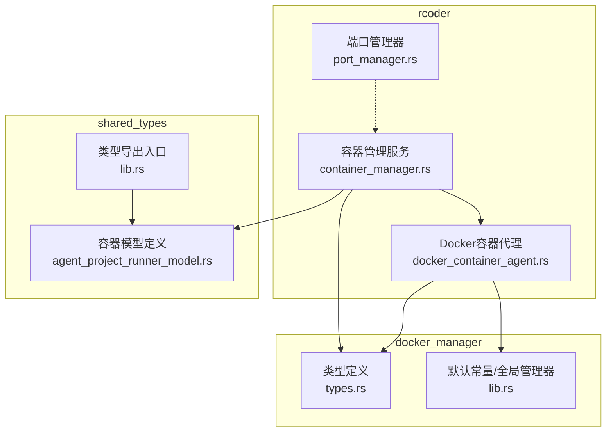
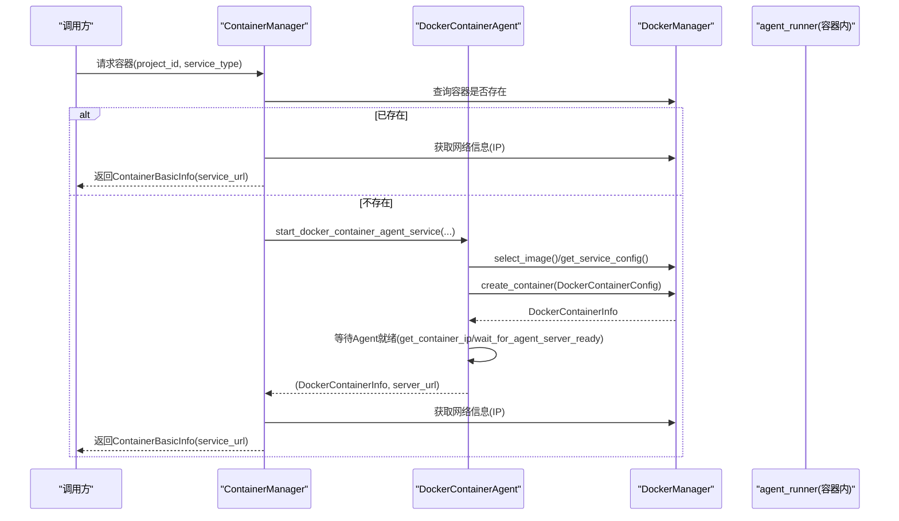
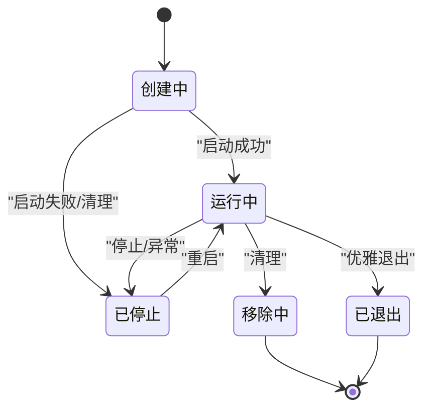
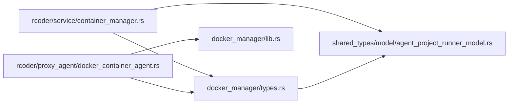

# 容器模型

<cite>
**本文引用的文件**
- [crates/rcoder/src/proxy_agent/docker_container_agent.rs](file://crates/rcoder/src/proxy_agent/docker_container_agent.rs)
- [crates/rcoder/src/service/container_manager.rs](file://crates/rcoder/src/service/container_manager.rs)
- [crates/docker_manager/src/types.rs](file://crates/docker_manager/src/types.rs)
- [crates/docker_manager/src/lib.rs](file://crates/docker_manager/src/lib.rs)
- [crates/shared_types/src/model/agent_project_runner_model.rs](file://crates/shared_types/src/model/agent_project_runner_model.rs)
- [crates/shared_types/src/lib.rs](file://crates/shared_types/src/lib.rs)
- [crates/rcoder/src/proxy_agent/port_manager.rs](file://crates/rcoder/src/proxy_agent/port_manager.rs)
</cite>

## 目录
1. [简介](#简介)
2. [项目结构](#项目结构)
3. [核心组件](#核心组件)
4. [架构总览](#架构总览)
5. [详细组件分析](#详细组件分析)
6. [依赖关系分析](#依赖关系分析)
7. [性能考量](#性能考量)
8. [故障排查指南](#故障排查指南)
9. [结论](#结论)
10. [附录](#附录)

## 简介
本文件聚焦于 RCoder 项目中的“容器模型”，系统性梳理容器相关数据结构（尤其是 ContainerBasicInfo）、状态转换与生命周期管理、以及与 docker_manager 的交互关系。文档还涵盖序列化/反序列化行为、验证约束、性能优化策略，并说明该模型在代理运行时与容器管理中的作用。

## 项目结构
围绕容器模型的关键文件分布如下：
- rcoder 侧：
  - 容器生命周期编排与服务 URL 构建：[crates/rcoder/src/service/container_manager.rs](file://crates/rcoder/src/service/container_manager.rs)
  - 容器创建与健康检查：[crates/rcoder/src/proxy_agent/docker_container_agent.rs](file://crates/rcoder/src/proxy_agent/docker_container_agent.rs)
  - 端口管理（历史/兼容）：[crates/rcoder/src/proxy_agent/port_manager.rs](file://crates/rcoder/src/proxy_agent/port_manager.rs)
- docker_manager 侧：
  - 容器配置与信息、状态枚举、清理工具等：[crates/docker_manager/src/types.rs](file://crates/docker_manager/src/types.rs)
  - 默认镜像、网络常量、全局管理器等：[crates/docker_manager/src/lib.rs](file://crates/docker_manager/src/lib.rs)
- shared_types 侧：
  - 容器基本信息结构体定义与导出：[crates/shared_types/src/model/agent_project_runner_model.rs](file://crates/shared_types/src/model/agent_project_runner_model.rs)
  - 类型导出入口：[crates/shared_types/src/lib.rs](file://crates/shared_types/src/lib.rs)

图表来源
- [crates/rcoder/src/service/container_manager.rs](file://crates/rcoder/src/service/container_manager.rs#L1-L200)
- [crates/rcoder/src/proxy_agent/docker_container_agent.rs](file://crates/rcoder/src/proxy_agent/docker_container_agent.rs#L1-L120)
- [crates/docker_manager/src/types.rs](file://crates/docker_manager/src/types.rs#L1-L120)
- [crates/docker_manager/src/lib.rs](file://crates/docker_manager/src/lib.rs#L1-L120)
- [crates/shared_types/src/model/agent_project_runner_model.rs](file://crates/shared_types/src/model/agent_project_runner_model.rs#L1-L60)
- [crates/shared_types/src/lib.rs](file://crates/shared_types/src/lib.rs#L1-L71)

章节来源
- [crates/rcoder/src/service/container_manager.rs](file://crates/rcoder/src/service/container_manager.rs#L1-L120)
- [crates/rcoder/src/proxy_agent/docker_container_agent.rs](file://crates/rcoder/src/proxy_agent/docker_container_agent.rs#L1-L120)
- [crates/docker_manager/src/types.rs](file://crates/docker_manager/src/types.rs#L1-L120)
- [crates/shared_types/src/model/agent_project_runner_model.rs](file://crates/shared_types/src/model/agent_project_runner_model.rs#L1-L60)

## 核心组件
- ContainerBasicInfo：跨模块共享的容器基本信息，包含容器 ID、名称、IP、内外端口、项目 ID、状态、创建时间、服务 URL 等字段，用于对外暴露与持久化。
- DockerContainerConfig/DockerContainerInfo：docker_manager 提供的容器配置与运行期信息，前者用于创建容器，后者用于描述已存在容器。
- ContainerStatus：容器状态枚举，支持从字符串转换与序列化。
- 全局 DockerManager：提供容器生命周期操作、网络信息查询、镜像选择、清理等能力。
- 容器管理服务 ContainerManager：在 rcoder 侧协调容器创建、复用、网络检测与服务 URL 构建。

章节来源
- [crates/shared_types/src/model/agent_project_runner_model.rs](file://crates/shared_types/src/model/agent_project_runner_model.rs#L1-L60)
- [crates/docker_manager/src/types.rs](file://crates/docker_manager/src/types.rs#L85-L174)
- [crates/docker_manager/src/lib.rs](file://crates/docker_manager/src/lib.rs#L130-L211)
- [crates/rcoder/src/service/container_manager.rs](file://crates/rcoder/src/service/container_manager.rs#L1-L120)

## 架构总览
容器模型在 RCoder 中的职责链路：
- rcoder 的容器管理服务负责按需创建/复用容器，并基于动态网络名称与容器 IP 构建服务 URL。
- docker_container_agent 负责具体创建容器、注入环境变量与挂载、等待 agent_runner 就绪。
- docker_manager 提供底层 Docker 操作、镜像选择、资源限制、网络与清理工具。
- shared_types 统一导出容器模型，保证跨模块一致性。

图表来源
- [crates/rcoder/src/service/container_manager.rs](file://crates/rcoder/src/service/container_manager.rs#L153-L274)
- [crates/rcoder/src/proxy_agent/docker_container_agent.rs](file://crates/rcoder/src/proxy_agent/docker_container_agent.rs#L19-L130)
- [crates/docker_manager/src/types.rs](file://crates/docker_manager/src/types.rs#L1-L120)

## 详细组件分析

### 数据结构：ContainerBasicInfo
- 字段定义与业务含义
  - container_id：容器唯一标识，用于定位与日志追踪。
  - container_name：容器名称，便于可视化与调试。
  - container_ip：容器在动态网络中的 IP，用于内部通信。
  - internal_port：容器内服务监听端口（固定为代理容器默认端口）。
  - external_port：外部映射端口（当前实现为 0，表示无宿主机端口映射）。
  - project_id：项目标识，用于多租户隔离与容器复用。
  - status：容器状态字符串，便于对外展示与持久化。
  - created_at：容器创建时间，UTC 时间戳。
  - service_url：服务访问 URL，由容器 IP 与固定端口拼接而成。
- 序列化/反序列化
  - 采用标准的 serde Serialize/Deserialize，支持 JSON 序列化，便于 API 返回与日志输出。
- 验证约束
  - 字段均为简单标量或时间类型，无复杂校验；业务层通过 DockerManager 返回的网络信息与端口常量保证 service_url 有效性。
- 性能优化
  - 作为轻量结构体，拷贝成本低；对外仅暴露必要字段，减少冗余数据传输。

章节来源
- [crates/shared_types/src/model/agent_project_runner_model.rs](file://crates/shared_types/src/model/agent_project_runner_model.rs#L1-L60)
- [crates/rcoder/src/service/container_manager.rs](file://crates/rcoder/src/service/container_manager.rs#L242-L269)

### 数据结构：DockerContainerConfig 与 DockerContainerInfo
- DockerContainerConfig
  - 用途：创建容器时的配置载体，包含镜像、名称前缀、宿主机/容器路径、工作目录、环境变量、端口映射、网络模式、资源限制、额外挂载、命令/入口点、网络名称等。
  - 关键点：当前实现中端口映射为空，网络模式与工作目录来自服务配置；资源限制来自配置；容器路径通过变量替换与宿主机路径解析。
- DockerContainerInfo
  - 用途：描述已存在容器的运行期信息，包含 ID、名称、项目 ID、镜像、状态、创建/启动时间、主机/容器路径、端口映射、分配端口、健康状态、内部服务端口、网络名称等。
- 序列化/反序列化
  - 均实现 serde Serialize/Deserialize，便于与 Docker API 返回结构互通。
- 验证约束
  - 通过服务配置与镜像选择策略保证镜像与网络模式的有效性；端口映射为空时，内部通信不依赖宿主机端口映射。

章节来源
- [crates/docker_manager/src/types.rs](file://crates/docker_manager/src/types.rs#L1-L120)
- [crates/docker_manager/src/types.rs](file://crates/docker_manager/src/types.rs#L85-L174)

### 状态转换与生命周期管理
- 状态来源
  - ContainerStatus 枚举支持从字符串转换与序列化，覆盖常见容器状态（创建中、运行中、已停止、已暂停、重启中、移除中、已退出、已死亡、未知）。
- 生命周期流程
  - 容器创建：由 docker_container_agent 基于服务配置与镜像选择策略创建容器。
  - 就绪等待：等待容器内 agent_runner 健康检查通过，超时则清理失败容器。
  - 复用与查询：ContainerManager 在后续请求中复用已存在容器，动态获取网络 IP 并构建服务 URL。
  - 清理：docker_manager 提供清理工具与过滤条件，支持按状态/标签/名称模式筛选并批量删除。
- 端口策略
  - 当前实现采用内部网络通信，无需宿主机端口映射；external_port 字段为 0，端口管理器主要用于历史/兼容场景。

图表来源
- [crates/docker_manager/src/types.rs](file://crates/docker_manager/src/types.rs#L120-L174)

章节来源
- [crates/docker_manager/src/types.rs](file://crates/docker_manager/src/types.rs#L120-L174)
- [crates/rcoder/src/proxy_agent/docker_container_agent.rs](file://crates/rcoder/src/proxy_agent/docker_container_agent.rs#L111-L130)
- [crates/rcoder/src/service/container_manager.rs](file://crates/rcoder/src/service/container_manager.rs#L277-L472)

### 与 docker_manager 的交互关系
- 配置与镜像选择
  - docker_container_agent 通过 docker_manager 的镜像选择与服务配置接口获取镜像与运行参数。
- 容器创建与查询
  - docker_container_agent 调用 create_container 获取 DockerContainerInfo；ContainerManager 通过 get_container_info 与 get_container_network_info 获取网络 IP 与状态。
- 网络与端口
  - 使用动态网络名称（由 docker_manager 检测），容器内部服务端口固定为代理容器默认端口；当前实现不进行宿主机端口映射。
- 默认常量与全局管理器
  - docker_manager 提供默认工作目录、网络模式、镜像选择策略与全局 DockerManager 单例，rcoder 侧通过全局实例获取管理器并执行操作。

章节来源
- [crates/rcoder/src/proxy_agent/docker_container_agent.rs](file://crates/rcoder/src/proxy_agent/docker_container_agent.rs#L58-L130)
- [crates/rcoder/src/service/container_manager.rs](file://crates/rcoder/src/service/container_manager.rs#L142-L274)
- [crates/docker_manager/src/lib.rs](file://crates/docker_manager/src/lib.rs#L130-L211)

### 实际使用模式与示例路径
- 容器创建与就绪等待
  - 示例路径：[start_docker_container_agent_service](file://crates/rcoder/src/proxy_agent/docker_container_agent.rs#L19-L130)
  - 该函数负责检查已有容器、选择镜像与服务配置、创建容器、等待 agent_runner 就绪并返回容器信息与服务 URL。
- 容器复用与服务 URL 构建
  - 示例路径：[get_or_create_container](file://crates/rcoder/src/service/container_manager.rs#L153-L208)、[ensure_container_exists](file://crates/rcoder/src/service/container_manager.rs#L277-L360)、[create_container_for_request](file://crates/rcoder/src/service/container_manager.rs#L361-L472)
  - 该流程在容器存在时直接复用，不存在时创建并获取网络 IP，最终构造服务 URL。
- 网络 IP 获取与健康检查
  - 示例路径：[get_container_ip](file://crates/rcoder/src/proxy_agent/docker_container_agent.rs#L375-L417)、[wait_for_agent_server_ready](file://crates/rcoder/src/proxy_agent/docker_container_agent.rs#L348-L374)
  - 通过 docker_manager 的网络信息查询与健康检查端点轮询确认容器内服务可用。

章节来源
- [crates/rcoder/src/proxy_agent/docker_container_agent.rs](file://crates/rcoder/src/proxy_agent/docker_container_agent.rs#L19-L130)
- [crates/rcoder/src/service/container_manager.rs](file://crates/rcoder/src/service/container_manager.rs#L153-L208)

### 序列化/反序列化行为与验证约束
- 序列化
  - ContainerBasicInfo、DockerContainerConfig、DockerContainerInfo、ContainerStatus 均实现 serde Serialize/Deserialize，支持 JSON 输出与 API 交互。
- 反序列化
  - ContainerStatus 支持从字符串转换，便于从 Docker API 返回的状态字符串映射到枚举。
- 验证约束
  - 服务配置与镜像选择在 docker_manager 层保证有效；rcoder 侧通过固定端口与动态网络名称确保 service_url 有效性；容器状态字符串映射为枚举，避免非法状态传播。

章节来源
- [crates/shared_types/src/model/agent_project_runner_model.rs](file://crates/shared_types/src/model/agent_project_runner_model.rs#L1-L60)
- [crates/docker_manager/src/types.rs](file://crates/docker_manager/src/types.rs#L1-L120)
- [crates/docker_manager/src/types.rs](file://crates/docker_manager/src/types.rs#L120-L174)

### 性能优化策略
- 端口映射优化
  - 采用内部网络通信，避免端口分配与释放开销，external_port 设为 0，简化网络管理。
- 路径解析与挂载
  - 通过容器路径解析器将容器内路径转换为宿主机绝对路径，减少挂载错误与重复 IO。
- 写时复制与共享
  - shared_types 中的 ProjectState 使用 Arc 实现高效共享与写时复制，降低频繁更新带来的内存复制成本。
- 超时与重试
  - 健康检查采用 1 秒间隔与 30 次上限，避免长时间阻塞；失败时快速清理失败容器，降低资源占用。

章节来源
- [crates/rcoder/src/proxy_agent/docker_container_agent.rs](file://crates/rcoder/src/proxy_agent/docker_container_agent.rs#L111-L130)
- [crates/rcoder/src/service/container_manager.rs](file://crates/rcoder/src/service/container_manager.rs#L474-L521)
- [crates/shared_types/src/model/agent_project_runner_model.rs](file://crates/shared_types/src/model/agent_project_runner_model.rs#L106-L160)

## 依赖关系分析
- 模块耦合
  - rcoder 的容器管理服务依赖 docker_manager 的容器信息与网络查询能力；docker_container_agent 依赖 docker_manager 的镜像选择与容器创建能力。
  - shared_types 统一导出 ContainerBasicInfo，避免跨模块重复定义。
- 外部依赖
  - Docker API（bollard）用于容器查询与网络信息获取。
  - serde 用于结构体序列化/反序列化。
- 循环依赖
  - 通过 shared_types 导出类型，避免 rcoder 与 docker_manager 之间的循环导入。

图表来源
- [crates/rcoder/src/service/container_manager.rs](file://crates/rcoder/src/service/container_manager.rs#L1-L120)
- [crates/rcoder/src/proxy_agent/docker_container_agent.rs](file://crates/rcoder/src/proxy_agent/docker_container_agent.rs#L1-L120)
- [crates/docker_manager/src/types.rs](file://crates/docker_manager/src/types.rs#L1-L120)
- [crates/docker_manager/src/lib.rs](file://crates/docker_manager/src/lib.rs#L1-L120)
- [crates/shared_types/src/model/agent_project_runner_model.rs](file://crates/shared_types/src/model/agent_project_runner_model.rs#L1-L60)

章节来源
- [crates/rcoder/src/service/container_manager.rs](file://crates/rcoder/src/service/container_manager.rs#L1-L120)
- [crates/rcoder/src/proxy_agent/docker_container_agent.rs](file://crates/rcoder/src/proxy_agent/docker_container_agent.rs#L1-L120)
- [crates/docker_manager/src/types.rs](file://crates/docker_manager/src/types.rs#L1-L120)
- [crates/shared_types/src/model/agent_project_runner_model.rs](file://crates/shared_types/src/model/agent_project_runner_model.rs#L1-L60)

## 性能考量
- 端口管理
  - 当前实现不使用宿主机端口映射，external_port 为 0；端口管理器仍可用于历史/兼容场景，避免不必要的端口占用。
- 路径解析
  - 宿主机路径解析与容器内路径标准化减少挂载错误与 IO 重试，提升稳定性。
- 状态与网络查询
  - 通过 docker_manager 的网络信息查询与固定端口，避免多次网络探测与端口冲突。
- 资源限制
  - 服务配置提供资源限制，结合 docker_manager 的资源限制结构，控制容器资源占用，避免资源争用。

章节来源
- [crates/rcoder/src/proxy_agent/port_manager.rs](file://crates/rcoder/src/proxy_agent/port_manager.rs#L1-L96)
- [crates/rcoder/src/proxy_agent/docker_container_agent.rs](file://crates/rcoder/src/proxy_agent/docker_container_agent.rs#L192-L242)
- [crates/docker_manager/src/types.rs](file://crates/docker_manager/src/types.rs#L51-L61)

## 故障排查指南
- 容器创建失败
  - 检查镜像选择与服务配置是否正确；查看 docker_manager 的错误日志与镜像拉取状态。
  - 参考路径：[start_docker_container_agent_service](file://crates/rcoder/src/proxy_agent/docker_container_agent.rs#L88-L130)
- 容器内服务未就绪
  - 观察健康检查轮询与超时设置；确认容器内 agent_runner 启动日志与端口监听情况。
  - 参考路径：[wait_for_agent_server_ready](file://crates/rcoder/src/proxy_agent/docker_container_agent.rs#L348-L374)
- 网络连接问题
  - 确认动态网络名称与容器网络映射；检查容器是否连接到预期网络。
  - 参考路径：[get_container_ip](file://crates/rcoder/src/proxy_agent/docker_container_agent.rs#L375-L417)、[get_dynamic_network_name](file://crates/rcoder/src/service/container_manager.rs#L142-L151)
- 端口冲突（历史/兼容）
  - 若使用宿主机端口映射，检查端口管理器分配与释放逻辑。
  - 参考路径：[PortManager](file://crates/rcoder/src/proxy_agent/port_manager.rs#L1-L96)

章节来源
- [crates/rcoder/src/proxy_agent/docker_container_agent.rs](file://crates/rcoder/src/proxy_agent/docker_container_agent.rs#L88-L130)
- [crates/rcoder/src/proxy_agent/docker_container_agent.rs](file://crates/rcoder/src/proxy_agent/docker_container_agent.rs#L348-L417)
- [crates/rcoder/src/service/container_manager.rs](file://crates/rcoder/src/service/container_manager.rs#L142-L151)
- [crates/rcoder/src/proxy_agent/port_manager.rs](file://crates/rcoder/src/proxy_agent/port_manager.rs#L1-L96)

## 结论
RCoder 的容器模型以 ContainerBasicInfo 为核心，结合 docker_manager 的配置与生命周期能力，在 rcoder 侧实现了按需创建、复用与健康检查的容器管理流程。通过内部网络通信与固定端口策略，显著降低了端口管理复杂度与资源占用；shared_types 的统一导出保证了跨模块一致性。整体设计在可维护性、性能与可扩展性之间取得良好平衡。

## 附录
- 关键实现路径参考
  - 容器创建与就绪等待：[start_docker_container_agent_service](file://crates/rcoder/src/proxy_agent/docker_container_agent.rs#L19-L130)
  - 容器复用与服务 URL 构建：[get_or_create_container](file://crates/rcoder/src/service/container_manager.rs#L153-L208)
  - 网络 IP 获取与健康检查：[get_container_ip](file://crates/rcoder/src/proxy_agent/docker_container_agent.rs#L375-L417)、[wait_for_agent_server_ready](file://crates/rcoder/src/proxy_agent/docker_container_agent.rs#L348-L374)
  - 容器状态与序列化：[ContainerStatus](file://crates/docker_manager/src/types.rs#L120-L174)
  - 容器模型定义：[ContainerBasicInfo](file://crates/shared_types/src/model/agent_project_runner_model.rs#L1-L60)