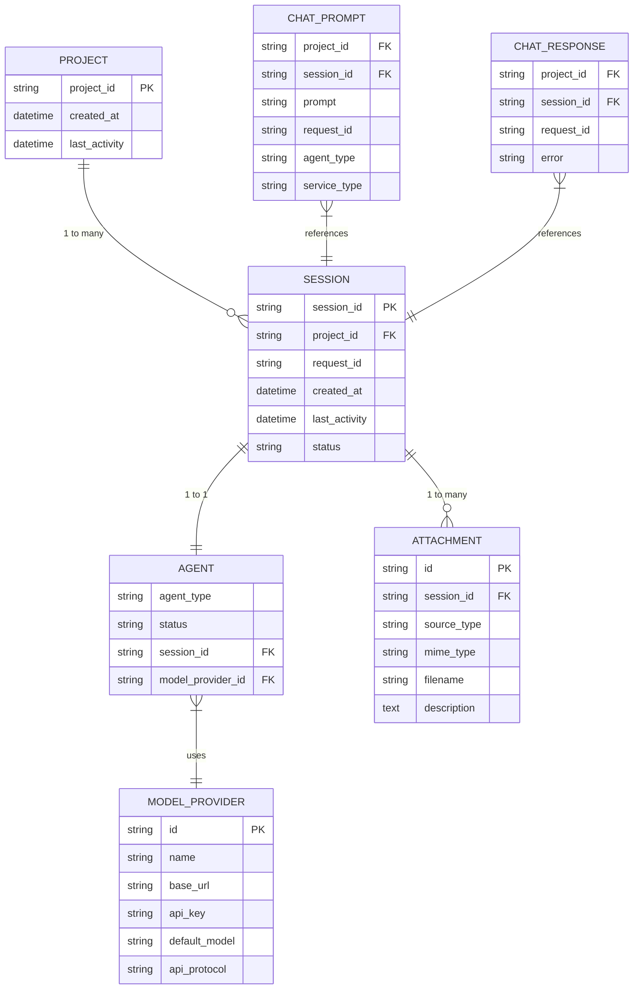

# 数据模型与类型

<cite>
**本文档引用的文件**  
- [agent_model.rs](file://crates/shared_types/src/model/agent_model.rs)
- [chat_prompt.rs](file://crates/shared_types/src/model/chat_prompt.rs)
- [chat_response.rs](file://crates/shared_types/src/model/chat_response.rs)
- [attachment.rs](file://crates/shared_types/src/model/attachment.rs)
- [model_provider.rs](file://crates/shared_types/src/model/model_provider.rs)
- [agent_session_notify.rs](file://crates/shared_types/src/model/agent_session_notify.rs)
- [agent_type.rs](file://crates/shared_types/src/model/agent_type.rs)
- [http_result.rs](file://crates/shared_types/src/model/http_result.rs)
- [agent_project_runner_model.rs](file://crates/shared_types/src/model/agent_project_runner_model.rs)
- [agent.proto](file://crates/shared_types/proto/agent.proto)
- [config.yml](file://config.yml)
- [rcoder_default.yml](file://crates/rcoder/src/rcoder_default.yml)
- [agent-abstraction-layer-design.md](file://specs/agent-abstraction-layer-design.md)
</cite>

## 目录
1. [引言](#引言)
2. [核心实体与关系](#核心实体与关系)
3. [字段定义与数据类型](#字段定义与数据类型)
4. [主键/外键、索引与约束](#主键外键索引与约束)
5. [数据验证规则与业务规则](#数据验证规则与业务规则)
6. [数据库模式图](#数据库模式图)
7. [示例数据](#示例数据)
8. [数据访问模式、缓存策略与性能考虑](#数据访问模式缓存策略与性能考虑)
9. [数据生命周期、保留策略与归档规则](#数据生命周期保留策略与归档规则)
10. [数据迁移路径与版本管理](#数据迁移路径与版本管理)

## 引言
RCoder项目是一个基于AI代理的开发辅助系统，其数据模型设计围绕AI代理服务、会话管理、项目状态和用户交互等核心功能构建。本数据模型文档旨在全面介绍RCoder项目的数据结构、类型定义、实体关系以及相关的业务规则和性能策略。通过分析`shared_types` crate中的Rust结构体和`proto`文件中的gRPC消息定义，我们能够理解系统中数据的组织方式和流转过程。该模型支持多代理类型（如Claude和Codex）、灵活的模型提供商配置、丰富的附件类型，并通过gRPC协议实现服务间的通信。此外，系统的配置文件（YAML）定义了服务部署和运行时的参数，这些参数也构成了系统数据模型的一部分。

## 核心实体与关系
RCoder项目的数据模型围绕几个核心实体构建，这些实体通过明确的关系相互连接，形成了一个支持AI代理服务生命周期管理的系统。主要实体包括`Agent`（代理）、`Project`（项目）、`Session`（会话）、`ModelProvider`（模型提供商）和`Attachment`（附件）。

`Project`（项目）是用户工作的核心单元，每个项目由唯一的`project_id`标识。一个项目可以关联一个正在运行的`Agent`实例。这种关系通过`ProjectAndAgentInfo`结构体体现，其中`project_id`作为关键字段将项目与代理实例绑定。`Agent`实例的生命周期由`AgentLifecycleGuard`管理，当代理被创建时，它会与一个`Session`（会话）相关联，会话ID（`session_id`）是代理与用户交互过程中的唯一标识。

`ModelProvider`（模型提供商）为`Agent`提供AI模型能力。`Agent`通过`model_provider`字段引用一个`ModelProviderConfig`对象，该对象包含了访问AI模型API所需的所有信息，如API密钥、基础URL和默认模型名称。一个`ModelProvider`可以被多个`Agent`实例共享，但一个`Agent`在同一时间只能使用一个`ModelProvider`。

`Attachment`（附件）是用户在与AI代理交互时可以附加到提示（prompt）中的数据。一个`ChatPrompt`请求可以包含多个`Attachment`，形成一对多的关系。`Attachment`是一个枚举类型，支持多种媒体类型，如文本、图像、音频和文档，这使得用户可以提供丰富的上下文信息给AI代理。

最后，`Session`（会话）不仅是代理运行的上下文，也是状态更新和消息通知的载体。`AgentSessionUpdate`、`SessionPromptStart`和`SessionPromptEnd`等结构体都包含`session_id`，用于将状态更新与特定的会话关联起来。这些更新通过`SessionNotify`枚举被统一处理，并最终转换为`UnifiedSessionMessage`发送给前端，实现服务端到客户端的实时通信。



**图源**  
- [agent_model.rs](file://crates/shared_types/src/model/agent_model.rs#L47-L68)
- [chat_prompt.rs](file://crates/shared_types/src/model/chat_prompt.rs#L8-L29)
- [chat_response.rs](file://crates/shared_types/src/model/chat_response.rs#L5-L17)
- [attachment.rs](file://crates/shared_types/src/model/attachment.rs#L93-L104)
- [model_provider.rs](file://crates/shared_types/src/model/model_provider.rs#L45-L67)

**本节来源**  
- [agent_model.rs](file://crates/shared_types/src/model/agent_model.rs)
- [chat_prompt.rs](file://crates/shared_types/src/model/chat_prompt.rs)
- [attachment.rs](file://crates/shared_types/src/model/attachment.rs)
- [model_provider.rs](file://crates/shared_types/src/model/model_provider.rs)

## 字段定义与数据类型
本节详细定义RCoder数据模型中各核心实体的字段及其数据类型。所有类型均基于Rust语言定义，并通过`serde`和`utoipa`等库支持序列化、反序列化和API文档生成。

### ProjectAndAgentInfo (项目与代理信息)
该结构体是`rcoder`和`agent_runner`共用的核心结构，代表一个项目与其实例化代理的关联。
- `project_id` (`String`): 项目的唯一标识符。
- `session_id` (`SessionId`): 代理服务的会话ID，由代理启动时创建。
- `prompt_tx` (`mpsc::UnboundedSender<PromptRequest>`): 用于向代理发送提示请求的异步通道。
- `cancel_tx` (`mpsc::UnboundedSender<CancelNotificationRequest>`): 用于向代理发送取消通知的异步通道。
- `model_provider` (`Option<ModelProviderConfig>`): 可选的模型提供商配置，为代理提供AI模型能力。
- `request_id` (`Option<String>`): 当前活跃的用户请求ID，用于追踪单个请求。
- `status` (`AgentStatus`): 代理的当前服务状态（`Active`, `Idle`, `Terminating`）。
- `last_activity` (`DateTime<Utc>`): 代理最后一次活动的时间戳。
- `created_at` (`DateTime<Utc>`): 代理实例的创建时间戳。
- `stop_handle` (`Option<Arc<dyn AgentLifecycle>>`): 代理生命周期管理的句柄，用于优雅停止代理。

### ChatPrompt (聊天提示)
该结构体定义了用户向AI代理发送的请求。
- `project_id` (`String`): 关联的项目ID。
- `project_path` (`PathBuf`): 项目在文件系统中的路径。
- `session_id` (`Option<String>`): 可选的会话ID。如果未提供，代理将自动创建一个新会话。
- `prompt` (`String`): 用户输入的提示内容。
- `attachments` (`Vec<Attachment>`): 可选的附件列表，`Builder`模式下默认为空。
- `data_source_attachments` (`Vec<String>`): 用于AI开发的外部数据源信息，以JSON字符串数组形式传递。
- `agent_type` (`AgentType`): 指定使用的代理类型（`Claude`或`Codex`），`Builder`模式下默认值。
- `service_type` (`ServiceType`): 必填字段，指定使用的服务类型（`rcoder`或`agent-runner`）。
- `request_id` (`Option<String>`): 可选的请求ID，用于标识和追踪。
- `model_provider` (`Option<ModelProviderConfig>`): 可选的模型提供商配置，用于覆盖默认配置。

### ChatResponse (聊天响应)
该结构体定义了AI代理对用户请求的响应。
- `project_id` (`String`): 关联的项目ID。
- `session_id` (`String`): 代理的会话ID。
- `error` (`Option<String>`): 可选的错误信息，如果请求失败则填充。
- `request_id` (`Option<String>`): 请求ID，用于标识和追踪。
- `service_type` (`ServiceType`): 使用的服务类型。

### Attachment (附件)
`Attachment`是一个枚举类型，支持多种媒体格式。
- **通用字段**:
  - `id` (`String`): 附件的唯一标识符，使用UUID生成。
  - `source` (`AttachmentSource`): 附件数据源，枚举类型，包含`FilePath`、`Base64`和`Url`。
  - `filename` (`Option<String>`): 可选的文件名。
  - `description` (`Option<String>`): 可选的描述。
- **TextAttachment (文本附件)**: 无额外字段。
- **ImageAttachment (图像附件)**:
  - `mime_type` (`String`): MIME类型（如`image/jpeg`）。
  - `dimensions` (`Option<ImageDimensions>`): 可选的图像尺寸信息。
- **AudioAttachment (音频附件)**:
  - `mime_type` (`String`): MIME类型（如`audio/mp3`）。
  - `duration` (`Option<f64>`): 可选的音频时长（秒）。
- **DocumentAttachment (文档附件)**:
  - `mime_type` (`String`): MIME类型（如`application/pdf`）。
  - `size` (`Option<u64>`): 可选的文件大小（字节）。

### ModelProviderConfig (模型提供商配置)
该结构体封装了访问AI模型API所需的所有凭证和配置。
- `id` (`String`): 模型提供商的唯一ID。
- `name` (`String`): 提供商名称（如`openai`, `anthropic`）。
- `base_url` (`String`): API的基础URL。
- `api_key` (`String`): 访问API的密钥。
- `requires_openai_auth` (`bool`): 是否需要OpenAI兼容的认证头。
- `default_model` (`String`): 默认使用的模型名称。
- `api_protocol` (`Option<String>`): 模型接口协议类型（`anthropic`或`openai`），可选。

### AgentSessionUpdate (代理会话更新)
该结构体封装了代理在执行任务过程中产生的各种更新事件。
- `session_id` (`String`): 关联的会话ID。
- `session_update` (`SessionUpdate`): 具体的更新内容，为枚举类型，包含`UserMessageChunk`、`AgentMessageChunk`、`ToolCall`等。
- `request_id` (`Option<String>`): 可选的请求ID。

**本节来源**  
- [agent_model.rs](file://crates/shared_types/src/model/agent_model.rs#L47-L68)
- [chat_prompt.rs](file://crates/shared_types/src/model/chat_prompt.rs#L8-L29)
- [chat_response.rs](file://crates/shared_types/src/model/chat_response.rs#L5-L17)
- [attachment.rs](file://crates/shared_types/src/model/attachment.rs#L23-L90)
- [model_provider.rs](file://crates/shared_types/src/model/model_provider.rs#L45-L67)
- [agent_session_notify.rs](file://crates/shared_types/src/model/agent_session_notify.rs#L61-L65)

## 主键外键索引与约束
RCoder的数据模型主要在内存和进程间通信层面运作，其“主键”和“外键”概念更多地体现在数据结构的逻辑关联和唯一性保证上，而非传统的关系型数据库约束。

### 主键 (Primary Keys)
- **`project_id`**: 在`ProjectAndAgentInfo`和`ChatPrompt`等结构体中，`project_id`是项目实体的逻辑主键。它确保了每个项目在系统中的唯一性，并作为查找和管理项目相关资源（如代理、会话）的主要依据。
- **`session_id`**: 在`ProjectAndAgentInfo`和`AgentSessionUpdate`等结构体中，`session_id`是会话实体的逻辑主键。它唯一标识一个代理的运行实例，所有与该代理的交互（如发送提示、接收更新、取消任务）都通过此ID进行。
- **`id`**: 在`Attachment`结构体中，`id`字段（由`Uuid::new_v4()`生成）是每个附件的唯一标识符，作为附件的主键。

### 外键 (Foreign Keys)
- **`project_id` in `ProjectAndAgentInfo`**: 该字段作为外键，将`ProjectAndAgentInfo`记录与一个具体的`Project`实体关联起来。它确保了代理实例的归属。
- **`session_id` in `ProjectAndAgentInfo`**: 该字段作为外键，将`ProjectAndAgentInfo`记录与一个具体的`Session`实体关联起来。它建立了项目、代理和会话三者之间的联系。
- **`session_id` in `AgentSessionUpdate`**: 该字段作为外键，将状态更新事件与一个具体的会话关联，确保前端能够正确地将更新渲染到对应的会话流中。
- **`request_id` in `ChatPrompt` and `ChatResponse`**: 虽然`request_id`不是严格的外键，但它起到了关联请求和响应的作用，是实现请求-响应追踪的关键。

### 索引与约束
由于数据主要存储在内存数据结构（如`DashMap`）中，索引是隐式存在的。
- **内存索引**: `ProjectAndAgentInfo`通常被存储在以`project_id`为键的`DashMap<String, ProjectAndAgentInfo>`中。这使得通过`project_id`查找代理信息的操作具有接近O(1)的时间复杂度，相当于在`project_id`上创建了一个哈希索引。
- **业务约束**:
  1. **唯一性约束**: 系统设计上保证一个`project_id`在同一时间只能关联一个活跃的`Agent`实例。当为一个已有代理的项目创建新会话时，旧的代理实例会被终止。
  2. **非空约束**: `ChatPrompt`中的`project_id`、`prompt`和`service_type`字段是必填的，由`Builder`模式和业务逻辑保证。
  3. **枚举约束**: `AgentType`和`AgentStatus`等字段的值被限制在预定义的枚举范围内，由Rust的类型系统强制执行。
  4. **格式约束**: `model_provider.api_key`等敏感字段在日志中会被脱敏（如显示为`sk-***abc`），通过`Display` trait的实现来保证。

**本节来源**  
- [agent_model.rs](file://crates/shared_types/src/model/agent_model.rs#L47-L68)
- [chat_prompt.rs](file://crates/shared_types/src/model/chat_prompt.rs#L10-L29)
- [agent_session_notify.rs](file://crates/shared_types/src/model/agent_session_notify.rs#L61-L65)

## 数据验证规则与业务规则
RCoder项目通过Rust的强类型系统、`derive_builder`宏和自定义验证逻辑来实施数据验证和业务规则。

### 数据验证规则
- **类型安全**: Rust的编译时类型检查确保了字段的数据类型正确，例如`last_activity`必须是`DateTime<Utc>`，`status`必须是`AgentStatus`枚举的成员。
- **必填字段验证**: `ChatPrompt`结构体使用`derive_builder`宏。`project_id`、`prompt`和`service_type`没有`#[builder(default)]`属性，因此在构建时必须显式提供，否则编译失败。
- **枚举值验证**: `AgentType`实现了`FromStr` trait，当从字符串解析时，会检查输入是否为有效的类型（`"claude"`或`"codex"`），否则返回错误。
- **附件处理验证**: `Attachment`模块定义了`AttachmentError`枚举，用于处理文件读取、Base64解码、URL访问等操作中可能出现的错误，确保附件数据的完整性和可用性。

### 业务规则
- **代理生命周期管理**: 代理的创建、运行和销毁遵循严格的业务流程。`AgentLifecycleGuard`实现了RAII（资源获取即初始化）原则，当其被`drop`时会自动触发资源清理。`graceful_stop`方法首先发送取消信号，等待任务自然退出，最后强制清理资源，确保了代理的优雅关闭。
- **会话与项目绑定**: 一个`project_id`在同一时间只能有一个活跃的代理会话。当收到新的`ChatPrompt`请求时，如果该项目已有代理在运行，系统会先取消旧的会话，再启动新的会话，避免资源冲突。
- **模型提供商推断**: `AgentType::from_model_provider`方法根据`ModelProviderConfig`的`name`字段自动推断应使用的代理类型（`anthropic` -> `Claude`），简化了用户配置。
- **环境变量注入**: `AgentType`提供了`claude_from_env`和`codex_from_env`等方法，能够从进程环境变量中读取配置，并自动注入必要的启动参数（如`--dangerously-skip-permissions`），确保代理能够正确启动。
- **状态更新的统一处理**: 所有的会话状态更新（开始、结束、错误、进度）都通过`SessionNotify`枚举被转换为统一的`UnifiedSessionMessage`格式。这保证了前端接收到的消息格式一致，简化了前端的处理逻辑。
- **配置优先级**: 当`ChatPrompt`中提供了`model_provider`时，它会覆盖系统默认的模型提供商配置，实现了按请求级别的配置覆盖。

**本节来源**  
- [agent_model.rs](file://crates/shared_types/src/model/agent_model.rs#L339-L403)
- [chat_prompt.rs](file://crates/shared_types/src/model/chat_prompt.rs#L6-L29)
- [agent_type.rs](file://crates/shared_types/src/model/agent_type.rs#L115-L124)
- [agent_session_notify.rs](file://crates/shared_types/src/model/agent_session_notify.rs#L77-L162)

## 数据库模式图
RCoder项目并未使用传统的关系型数据库，其数据主要存储在内存中，并通过gRPC进行服务间通信。因此，其“数据库”模式更准确地描述为**数据结构与通信协议模式**。

```mermaid
classDiagram
class ProjectAndAgentInfo {
+project_id : String
+session_id : SessionId
+prompt_tx : mpsc : : UnboundedSender<PromptRequest>
+cancel_tx : mpsc : : UnboundedSender<CancelNotificationRequest>
+model_provider : Option<ModelProviderConfig>
+request_id : Option<String>
+status : AgentStatus
+last_activity : DateTime<Utc>
+created_at : DateTime<Utc>
+stop_handle : Option<Arc<dyn AgentLifecycle>>
}
class ChatPrompt {
+project_id : String
+project_path : PathBuf
+session_id : Option<String>
+prompt : String
+attachments : Vec<Attachment>
+data_source_attachments : Vec<String>
+agent_type : AgentType
+service_type : ServiceType
+request_id : Option<String>
+model_provider : Option<ModelProviderConfig>
}
class ChatResponse {
+project_id : String
+session_id : String
+error : Option<String>
+request_id : Option<String>
+service_type : ServiceType
}
class Attachment {
+id : String
+source : AttachmentSource
+filename : Option<String>
+description : Option<String>
}
class AttachmentSource {
<<enumeration>>
+FilePath{ path : String }
+Base64{ data : String, mime_type : String }
+Url{ url : String }
}
class ModelProviderConfig {
+id : String
+name : String
+base_url : String
+api_key : String
+requires_openai_auth : bool
+default_model : String
+api_protocol : Option<String>
}
class AgentSessionUpdate {
+session_id : String
+session_update : SessionUpdate
+request_id : Option<String>
}
class SessionUpdate {
<<enumeration>>
+UserMessageChunk
+AgentMessageChunk
+ToolCall
+Plan
+AvailableCommandsUpdate
+CurrentModeUpdate
}
class UnifiedSessionMessage {
+session_id : String
+message_type : SessionMessageType
+sub_type : String
+data : serde_json : : Value
+timestamp : DateTime<Utc>
}
class HttpResult~T~ {
+code : String
+message : String
+data : Option~T~
+tid : Option<String>
+success : bool
}
ProjectAndAgentInfo --> ModelProviderConfig : "uses"
ChatPrompt --> Attachment : "has many"
ChatPrompt --> ModelProviderConfig : "can override"
AgentSessionUpdate --> SessionUpdate : "contains"
AgentSessionUpdate --> UnifiedSessionMessage : "converts to"
HttpResult --> ChatResponse : "wraps"
HttpResult --> AgentStatusResponse : "wraps"
```

**图源**  
- [agent_model.rs](file://crates/shared_types/src/model/agent_model.rs)
- [chat_prompt.rs](file://crates/shared_types/src/model/chat_prompt.rs)
- [chat_response.rs](file://crates/shared_types/src/model/chat_response.rs)
- [attachment.rs](file://crates/shared_types/src/model/attachment.rs)
- [model_provider.rs](file://crates/shared_types/src/model/model_provider.rs)
- [agent_session_notify.rs](file://crates/shared_types/src/model/agent_session_notify.rs)
- [http_result.rs](file://crates/shared_types/src/model/http_result.rs)

## 示例数据
以下是根据数据模型生成的JSON格式示例数据，展示了API请求和响应的典型结构。

### ChatPrompt 请求示例
```json
{
  "project_id": "my-web-app",
  "project_path": "/home/user/project_workspace/my-web-app",
  "session_id": null,
  "prompt": "请帮我创建一个React组件，实现一个带有搜索功能的用户列表。",
  "attachments": [
    {
      "type": "text",
      "content": {
        "id": "att-123",
        "source": {
          "source_type": "FilePath",
          "data": {
            "path": "src/components/UserList.js"
          }
        },
        "filename": "UserList.js",
        "description": "现有用户列表组件"
      }
    }
  ],
  "data_source_attachments": [],
  "agent_type": "Claude",
  "service_type": "rcoder",
  "request_id": "req-abc123",
  "model_provider": {
    "id": "openai-gpt4",
    "name": "openai",
    "base_url": "https://api.openai.com/v1",
    "api_key": "sk-very-long-secret-key",
    "requires_openai_auth": true,
    "default_model": "gpt-4-turbo",
    "api_protocol": "openai"
  }
}
```

### ChatResponse 响应示例
```json
{
  "project_id": "my-web-app",
  "session_id": "sess-456def",
  "error": null,
  "request_id": "req-abc123",
  "service_type": "rcoder"
}
```

### AgentStatusResponse 响应示例
```json
{
  "project_id": "my-web-app",
  "is_alive": true,
  "session_id": "sess-456def",
  "status": "Active",
  "last_activity": "2024-01-01T12:05:30Z",
  "created_at": "2024-01-01T12:00:00Z",
  "model_provider": {
    "id": "openai-gpt4",
    "name": "openai",
    "api_protocol": "openai",
    "default_model": "gpt-4-turbo"
  }
}
```

### UnifiedSessionMessage (SSE流) 示例
```json
{
  "session_id": "sess-456def",
  "message_type": "AgentSessionUpdate",
  "sub_type": "agent_message_chunk",
  "data": {
    "content": {
      "text": "好的，我将为您创建一个React组件...",
      "type": "text"
    },
    "request_id": "req-abc123"
  },
  "timestamp": "2024-01-01T12:05:35Z"
}
```

**本节来源**  
- [chat_prompt.rs](file://crates/shared_types/src/model/chat_prompt.rs)
- [chat_response.rs](file://crates/shared_types/src/model/chat_response.rs)
- [agent_model.rs](file://crates/shared_types/src/model/agent_model.rs#L71-L97)
- [agent_session_notify.rs](file://crates/shared_types/src/model/agent_session_notify.rs#L17-L30)

## 数据访问模式缓存策略与性能考虑
RCoder项目的数据访问模式、缓存策略和性能优化紧密围绕其高并发、低延迟的实时交互需求设计。

### 数据访问模式
- **内存优先**: 核心状态（如`ProjectAndAgentInfo`）存储在全局的`DashMap`或`RwLock<HashMap>`中，提供极快的读写速度。通过`project_id`作为键进行哈希查找，实现O(1)的平均时间复杂度。
- **异步通道通信**: `rcoder`主服务与`agent_runner`代理服务之间通过`tokio`的`mpsc`（多生产者单消费者）无界通道进行通信。`prompt_tx`用于发送提示，`cancel_tx`用于发送取消指令。这种模式避免了直接的函数调用开销，实现了服务间的解耦和非阻塞通信。
- **gRPC流式传输**: 代理的执行进度通过gRPC的服务器流式RPC（`SubscribeProgress`）或SSE（Server-Sent Events）实时推送给前端。`UnifiedSessionMessage`被序列化为JSON并通过流发送，确保了低延迟的用户体验。
- **原子操作与锁优化**: `ProjectState`结构体使用`Arc<ProjectCoreState>`和`Arc<ProjectExtendedState>`，结合`Arc::make_mut`实现写时复制（Copy-on-Write），在读多写少的场景下极大减少了锁竞争。`AtomicBool`用于`AgentLifecycleGuard`的状态标记，避免了对整个结构体的加锁。

### 缓存策略
- **配置缓存**: `MultiImageConfig`中的`cache_config`允许缓存Docker镜像选择的结果，避免重复的镜像解析和选择计算，提高容器启动速度。
- **内存缓存**: 整个`ProjectAndAgentInfo`映射本身就是一种内存缓存，避免了每次请求都重新创建或查询代理实例。
- **无持久化缓存**: 项目未使用Redis等外部缓存系统，所有缓存均为进程内内存缓存，简化了架构，但依赖于单个进程的可用性。

### 性能考虑
- **零拷贝与高效克隆**: 广泛使用`Arc`（原子引用计数）来共享数据，避免了不必要的数据复制。`ProjectState`的设计确保了核心状态的高效克隆。
- **异步非阻塞I/O**: 整个系统基于`tokio`异步运行时构建，所有I/O操作（文件读写、网络通信、进程管理）都是非阻塞的，能够高效处理大量并发连接。
- **资源限制**: 通过`docker_config`中的`resource_limits`（如`memory_limit`, `cpu_limit`）对Docker容器施加资源限制，防止单个代理消耗过多系统资源，影响整体稳定性。
- **连接池与复用**: 虽然未明确提及，但`reqwest`客户端等HTTP库通常会内部维护连接池，复用TCP连接，减少握手开销。
- **批处理与合并**: `ProjectAndContainerInfo`的`update_extended_from_request`方法允许一次性批量更新多个字段，减少状态更新的次数。

**本节来源**  
- [agent_model.rs](file://crates/shared_types/src/model/agent_model.rs#L47-L68)
- [agent_project_runner_model.rs](file://crates/shared_types/src/model/agent_project_runner_model.rs)
- [config.yml](file://config.yml#L144-L147)
- [agent.proto](file://crates/shared_types/proto/agent.proto#L9-L11)

## 数据生命周期保留策略与归档规则
RCoder项目的数据生命周期管理主要通过自动化和配置驱动的策略来实现，侧重于临时性和运行时数据的管理。

### 数据生命周期
1. **创建 (Creation)**:
   - 当用户发起`ChatPrompt`请求时，系统检查`project_id`。
   - 如果该项目没有活跃的代理，则创建一个新的`ProjectAndAgentInfo`实例，启动`agent_runner`进程，并生成新的`session_id`。
   - 代理的生命周期由`AgentLifecycleGuard`管理，其创建标志着代理生命周期的开始。

2. **活跃 (Active)**:
   - 代理处于`Active`状态，通过`prompt_tx`接收用户提示，并通过`SessionNotify`发送状态更新。
   - `last_activity`字段在每次交互时被更新，用于判断代理的活跃度。

3. **终止 (Termination)**:
   - **正常终止**: 当代理完成任务或用户主动取消时，调用`AgentLifecycleGuard::graceful_stop`。该方法发送取消信号，等待任务退出，然后清理资源（终止子进程、关闭通道）。
   - **超时终止**: 配置文件中的`container_ttl_seconds`（默认3600秒）定义了容器的存活时间。后台任务会定期检查超过TTL的代理并自动终止。
   - **错误终止**: 如果代理进程崩溃或发生严重错误，`Drop`实现会确保资源被清理。

4. **销毁 (Destruction)**:
   - `AgentLifecycleGuard`被`drop`时，其`Drop`实现会执行最终的清理工作，确保子进程被杀死，通道被关闭。
   - `ProjectAndAgentInfo`记录从`DashMap`中被移除，相关内存被回收。

### 保留策略与归档规则
- **临时性数据**: 会话（`Session`）和代理（`Agent`）实例被视为临时工作负载。它们的生命周期与用户的开发会话绑定，一旦任务完成或超时，就会被销毁。
- **无长期归档**: 项目当前的设计中，没有明确的机制将聊天记录、生成的代码或会话日志归档到持久化存储（如数据库或文件系统）。所有数据在代理终止后即丢失。
- **配置驱动的保留**: `container_ttl_seconds`是主要的保留策略配置，它强制性地保留了代理实例的最长时间。
- **自动清理**: `docker_config.auto_cleanup`设置为`true`，表明系统会在代理终止后自动清理Docker容器，释放系统资源。

**本节来源**  
- [agent_model.rs](file://crates/shared_types/src/model/agent_model.rs#L218-L249)
- [agent_model.rs](file://crates/shared_types/src/model/agent_model.rs#L348-L403)
- [config.yml](file://config.yml#L160-L161)
- [rcoder_default.yml](file://crates/rcoder/src/rcoder_default.yml#L173-L174)

## 数据迁移路径与版本管理
RCoder项目的数据迁移和版本管理主要体现在配置文件和gRPC协议的演进上。

### 数据迁移路径
- **配置文件迁移**: 从`config.yml`到`rcoder_default.yml`的演变，以及`multi_image_config`的引入，代表了系统配置的演进。迁移路径通常由代码中的默认值和向后兼容逻辑处理。例如，`create_legacy_multi_image_config`函数可以将旧的简单配置转换为新的多镜像配置格式。
- **gRPC协议迁移**: `agent.proto`文件定义了服务间的通信协议。当需要添加新功能（如新的`ProgressEvent`类型）时，会通过添加新的字段或消息来实现，遵循gRPC的向后兼容原则（如使用`optional`关键字）。
- **数据结构演进**: Rust结构体通过添加新字段（通常为`Option<T>`类型）来实现向后兼容。例如，`ChatPrompt`中的`data_source_attachments`是一个后来添加的字段，旧的客户端可以忽略它，而新的服务器可以安全地处理缺失的字段。

### 版本管理
- **语义化版本控制**: 项目使用`Cargo.toml`进行依赖管理，遵循语义化版本控制（SemVer）。`crates/shared_types`等内部crate的版本号变化反映了API的稳定性。
- **配置版本**: 配置文件本身没有明确的`version`字段，但其结构的变化（如`docker_config`的复杂化）隐式地代表了版本迭代。代码通过检查字段是否存在来处理不同版本的配置。
- **gRPC服务版本**: `agent.proto`中的`package agent;`和`service AgentService`定义了服务的命名空间。未来可以通过创建新的`AgentServiceV2`服务来实现不兼容的API变更。
- **环境变量映射**: `agent-abstraction-layer-design.md`中的JSON配置展示了如何通过模板（如`{MODEL_PROVIDER_API_KEY}`）将不同模型提供商的环境变量映射到代理的启动参数中，这是一种灵活的配置版本管理方式。

**本节来源**  
- [config.yml](file://config.yml)
- [rcoder_default.yml](file://crates/rcoder/src/rcoder_default.yml)
- [agent.proto](file://crates/shared_types/proto/agent.proto)
- [agent-abstraction-layer-design.md](file://specs/agent-abstraction-layer-design.md#L545-L610)