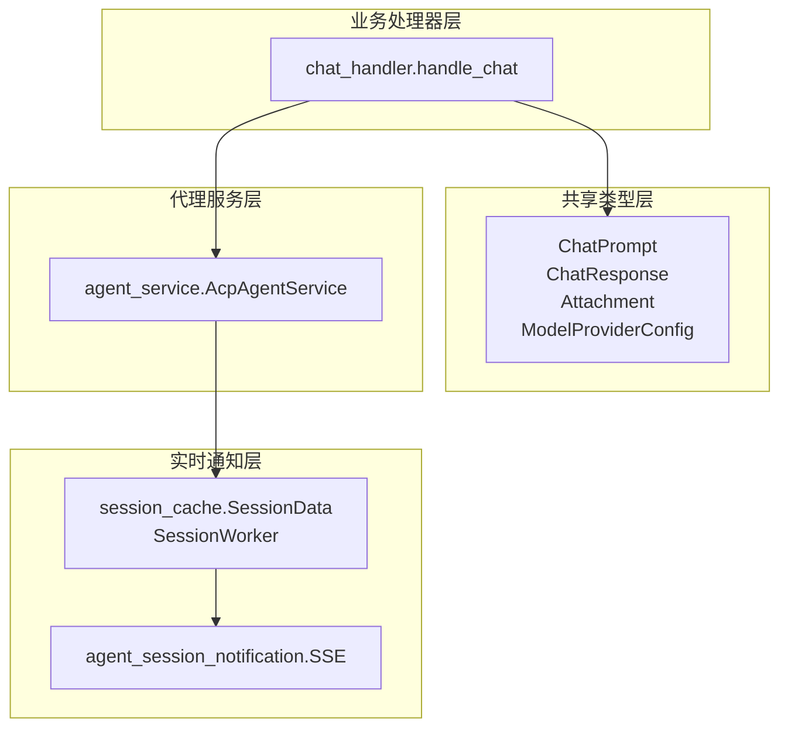
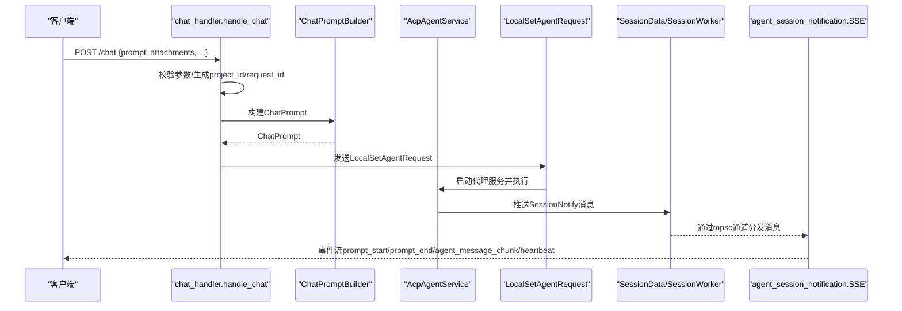
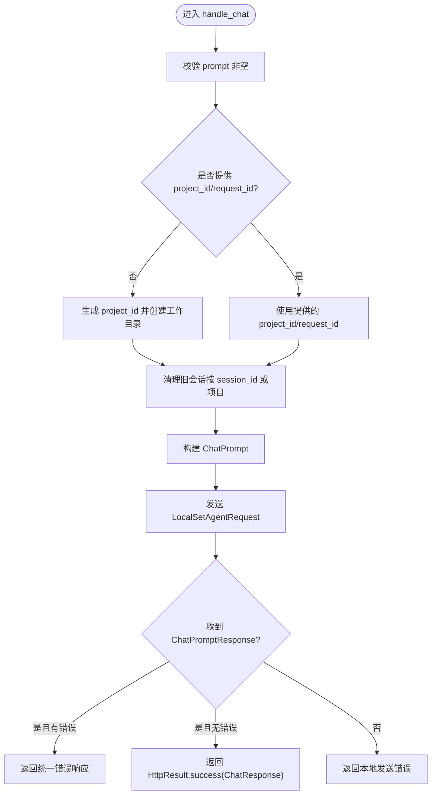
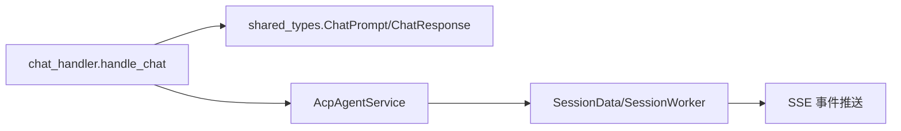

# 聊天数据模型

<cite>
**本文引用的文件**
- [chat_prompt.rs](file://crates/shared_types/src/model/chat_prompt.rs)
- [chat_response.rs](file://crates/shared_types/src/model/chat_response.rs)
- [attachment.rs](file://crates/shared_types/src/model/attachment.rs)
- [model_provider.rs](file://crates/shared_types/src/model/model_provider.rs)
- [http_result.rs](file://crates/shared_types/src/model/http_result.rs)
- [app_error.rs](file://crates/shared_types/src/model/app_error.rs)
- [chat_handler.rs](file://crates/agent_runner/src/handler/chat_handler.rs)
- [agent_session_notification.rs](file://crates/agent_runner/src/handler/agent_session_notification.rs)
- [session_cache.rs](file://crates/agent_runner/src/service/session_cache.rs)
- [agent_service.rs](file://crates/agent_runner/src/proxy_agent/agent_service.rs)
- [channel_utils.rs](file://crates/agent_runner/src/proxy_agent/channel_utils.rs)
- [agent_session_notify.rs](file://crates/shared_types/src/model/agent_session_notify.rs)
- [router.rs](file://crates/agent_runner/src/router.rs)
- [http_test.rest](file://http_test.rest)
</cite>

## 目录
1. [简介](#简介)
2. [项目结构](#项目结构)
3. [核心组件](#核心组件)
4. [架构总览](#架构总览)
5. [详细组件分析](#详细组件分析)
6. [依赖关系分析](#依赖关系分析)
7. [性能考量](#性能考量)
8. [故障排查指南](#故障排查指南)
9. [结论](#结论)
10. [附录](#附录)

## 简介
本文件聚焦于聊天数据模型，系统性阐述 ChatPrompt 与 ChatResponse 的结构定义、提示词构造规则、上下文管理机制与附件处理方式；同时结合 chat_handler 的实现逻辑，完整描述从请求到响应的数据转换流程，并给出流式响应（SSE）的数据分块格式、进度更新机制与终止条件。最后提供 HTTP 请求/响应示例与边界情况、错误处理模式，帮助开发者快速理解并正确使用该系统。

## 项目结构
围绕聊天数据模型的关键文件分布如下：
- 共享类型层：定义 ChatPrompt、ChatResponse、附件与模型提供商配置等核心数据结构
- 业务处理器层：chat_handler 负责接收请求、构建 ChatPrompt、调度代理并返回统一响应
- 实时通知层：SSE 通道 agent_session_notification 将会话消息以事件形式推送给客户端
- 会话缓存层：session_cache 提供会话级消息缓冲与推送，支持心跳、取消与清理
- 代理服务层：根据模型提供商选择具体代理类型并启动 ACP 代理服务

图表来源
- [chat_handler.rs](file://crates/agent_runner/src/handler/chat_handler.rs#L176-L320)
- [agent_service.rs](file://crates/agent_runner/src/proxy_agent/agent_service.rs#L1-L62)
- [session_cache.rs](file://crates/agent_runner/src/service/session_cache.rs#L1-L140)
- [agent_session_notification.rs](file://crates/agent_runner/src/handler/agent_session_notification.rs#L355-L483)

章节来源
- [router.rs](file://crates/agent_runner/src/router.rs#L41-L70)

## 核心组件
- ChatPrompt：承载一次聊天请求的全部上下文，包括项目ID、工作目录、会话ID、提示词、附件、数据源附件、代理类型、服务类型、请求ID与模型提供商配置
- ChatResponse：统一的聊天响应载体，包含项目ID、会话ID、可选错误信息与请求ID
- Attachment：多形态附件抽象，支持文本、图像、音频、文档，统一通过 AttachmentSource 表达数据来源（文件路径、Base64、URL）
- ModelProviderConfig：模型提供商配置，决定代理类型与 API 协议
- HttpResult：统一的 HTTP 响应包装，包含 code、message、data、tid 与 success 字段
- AppError：应用级错误封装，统一映射为 HTTP 响应

章节来源
- [chat_prompt.rs](file://crates/shared_types/src/model/chat_prompt.rs#L1-L52)
- [chat_response.rs](file://crates/shared_types/src/model/chat_response.rs#L1-L18)
- [attachment.rs](file://crates/shared_types/src/model/attachment.rs#L1-L216)
- [model_provider.rs](file://crates/shared_types/src/model/model_provider.rs#L1-L132)
- [http_result.rs](file://crates/shared_types/src/model/http_result.rs#L1-L103)
- [app_error.rs](file://crates/shared_types/src/model/app_error.rs#L1-L65)

## 架构总览
下图展示从 HTTP 请求到 SSE 实时推送的整体流程，涵盖提示词构造、代理调度、会话管理与事件分发。

图表来源
- [chat_handler.rs](file://crates/agent_runner/src/handler/chat_handler.rs#L176-L320)
- [agent_service.rs](file://crates/agent_runner/src/proxy_agent/agent_service.rs#L1-L62)
- [session_cache.rs](file://crates/agent_runner/src/service/session_cache.rs#L140-L222)
- [agent_session_notification.rs](file://crates/agent_runner/src/handler/agent_session_notification.rs#L355-L483)

## 详细组件分析

### ChatPrompt 与 ChatResponse 数据模型
- ChatPrompt 字段要点
  - project_id：项目唯一标识，用于隔离工作空间
  - project_path：项目工作目录路径
  - session_id：会话标识，可选；若未提供则由代理自动创建并返回
  - prompt：用户提示词
  - attachments：附件列表，支持文本、图像、音频、文档
  - data_source_attachments：数据源附件（JSON 字符串数组），用于外部数据源信息传递
  - agent_type：代理类型（由模型提供商配置推导）
  - service_type：服务类型（固定为 RCoder）
  - request_id：请求追踪ID，可选
  - model_provider：模型提供商配置，决定代理与协议
- ChatResponse 字段要点
  - project_id：项目ID
  - session_id：会话ID
  - error：可选错误信息
  - request_id：可选请求追踪ID

提示词构造规则
- 若未提供 project_id，处理器会自动生成 UUID 并移除连字符，随后创建项目工作目录
- 若未提供 session_id，处理器会清理该项目下的所有旧会话，确保全新开始
- 若未提供 request_id，处理器会自动生成 UUID 并移除连字符
- 代理类型由模型提供商配置推导，服务类型固定为 RCoder

附件处理方式
- 附件通过统一的 Attachment 抽象表达，支持三种数据源：
  - FilePath：相对项目目录的文件路径
  - Base64：包含数据与 MIME 类型
  - Url：远程链接
- 附件类型包括 Text、Image、Audio、Document，均包含可选的元数据（如文件名、尺寸、时长、大小）

章节来源
- [chat_prompt.rs](file://crates/shared_types/src/model/chat_prompt.rs#L1-L52)
- [chat_response.rs](file://crates/shared_types/src/model/chat_response.rs#L1-L18)
- [attachment.rs](file://crates/shared_types/src/model/attachment.rs#L1-L216)
- [model_provider.rs](file://crates/shared_types/src/model/model_provider.rs#L1-L132)
- [chat_handler.rs](file://crates/agent_runner/src/handler/chat_handler.rs#L198-L210)
- [chat_handler.rs](file://crates/agent_runner/src/handler/chat_handler.rs#L225-L258)
- [chat_handler.rs](file://crates/agent_runner/src/handler/chat_handler.rs#L266-L283)

### 上下文管理机制
- 项目与会话映射
  - 通过 PROJECT_SESSION_MAP 确保同一 project_id 仅对应一个活跃 session_id
  - 当 session_id 变化时，自动清理旧 session 的数据并更新映射
- 会话缓存与推送
  - SessionData 维护当前连接与取消令牌，支持即时推送与环形缓冲
  - SessionWorker 负责将消息写入环形缓冲并实时推送到当前连接
  - 心跳消息定期发送，保持连接活性
- 会话清理策略
  - 处理器在收到请求时，若指定 session_id 则移除该会话；否则清理该项目下所有会话
  - 取消任务时，主动触发 CancellationToken 并关闭发送端，确保连接及时断开

章节来源
- [session_cache.rs](file://crates/agent_runner/src/service/session_cache.rs#L1-L140)
- [session_cache.rs](file://crates/agent_runner/src/service/session_cache.rs#L140-L222)
- [session_cache.rs](file://crates/agent_runner/src/service/session_cache.rs#L224-L355)
- [chat_handler.rs](file://crates/agent_runner/src/handler/chat_handler.rs#L225-L258)

### 流式响应（SSE）数据分块格式与终止条件
SSE 事件格式
- 事件名称与消息类型映射
  - prompt_start：会话开始
  - prompt_end：会话结束（包含停止原因与可选错误信息）
  - agent_message_chunk：代理输出片段
  - user_message_chunk：用户输入片段
  - agent_thought_chunk：代理思考片段
  - tool_call/tool_call_update：工具调用与更新
  - plan/available_commands_update/current_mode_update：计划、可用命令与当前模式更新
  - heartbeat：心跳事件
- 数据内容
  - 统一以 UnifiedSessionMessage 形式推送，包含 session_id、message_type、sub_type、data 与时间戳
  - data 内容根据子类型不同而异，例如 agent_message_chunk 的 data.content 包含文本内容与类型

进度更新机制
- SSE 连接建立后立即发送 heartbeat，随后持续推送实时更新
- 心跳定时器每 30 秒发送一次，用于维持连接活性
- 当取消令牌被触发或发送端被关闭时，SSE 自然断开

终止条件
- 会话结束事件（prompt_end）携带停止原因（如 EndTurn、MaxTokens、MaxTurnRequests、Refusal、Cancelled）
- 取消任务时，主动关闭连接并清理旧消息
- 容器连接失败或读取 SSE 流失败时，发送 error 事件并断开连接

章节来源
- [agent_session_notification.rs](file://crates/agent_runner/src/handler/agent_session_notification.rs#L36-L57)
- [agent_session_notification.rs](file://crates/agent_runner/src/handler/agent_session_notification.rs#L355-L483)
- [agent_session_notify.rs](file://crates/shared_types/src/model/agent_session_notify.rs#L1-L180)
- [session_cache.rs](file://crates/agent_runner/src/service/session_cache.rs#L140-L222)

### 请求到响应的完整数据转换流程
- 输入：HTTP 请求体包含 prompt、可选 project_id、session_id、attachments、data_source_attachments、model_provider、request_id
- 处理：
  - 参数校验（prompt 非空）
  - 自动生成 project_id 与 request_id（如缺失）
  - 清理旧会话（按 session_id 或项目维度）
  - 构建 ChatPrompt 并发送到本地任务通道
  - 等待 ChatPromptResponse，若包含错误则返回统一错误响应
- 输出：HttpResult<ChatResponse>，包含项目ID、会话ID与可选错误信息

图表来源
- [chat_handler.rs](file://crates/agent_runner/src/handler/chat_handler.rs#L176-L320)
- [http_result.rs](file://crates/shared_types/src/model/http_result.rs#L1-L103)

章节来源
- [chat_handler.rs](file://crates/agent_runner/src/handler/chat_handler.rs#L176-L320)
- [http_result.rs](file://crates/shared_types/src/model/http_result.rs#L1-L103)

### 代理类型与模型提供商配置
- 代理类型选择
  - 根据模型提供商配置推导代理类型（Claude、Codex 等）
  - 通过 AcpAgentService trait 启动对应代理服务
- 模型提供商配置
  - 包含 id、name、base_url、api_key、requires_openai_auth、default_model、api_protocol
  - api_protocol 默认 OpenAI，支持 Anthropic 与 OpenAI

章节来源
- [agent_service.rs](file://crates/agent_runner/src/proxy_agent/agent_service.rs#L1-L62)
- [model_provider.rs](file://crates/shared_types/src/model/model_provider.rs#L1-L132)

## 依赖关系分析
- 组件耦合与内聚
  - chat_handler 与 shared_types 的 ChatPrompt/ChatResponse 强耦合，但通过 Builder 模式降低复杂度
  - 代理服务通过 trait 解耦，便于扩展新代理类型
  - SSE 层通过 SessionData/SessionWorker 与处理器解耦，实现高内聚低耦合
- 外部依赖
  - Axum 路由与响应封装
  - Tokio mpsc 通道用于异步消息传递
  - DashMap 用于全局会话缓存

图表来源
- [chat_handler.rs](file://crates/agent_runner/src/handler/chat_handler.rs#L176-L320)
- [agent_service.rs](file://crates/agent_runner/src/proxy_agent/agent_service.rs#L1-L62)
- [session_cache.rs](file://crates/agent_runner/src/service/session_cache.rs#L1-L140)
- [agent_session_notification.rs](file://crates/agent_runner/src/handler/agent_session_notification.rs#L355-L483)

章节来源
- [router.rs](file://crates/agent_runner/src/router.rs#L41-L70)

## 性能考量
- 会话消息缓冲
  - 使用环形缓冲（ringbuf）提升消息吞吐，避免阻塞
  - 心跳消息不入环形缓冲，确保实时性
- 连接管理
  - 通过 CancellationToken 主动关闭旧连接，避免资源泄漏
  - 即时推送失败时自动降级为丢弃，保证系统稳定性
- 并发控制
  - 项目级并发限制：同一项目仅允许一个活跃代理任务
  - 会话级清理：确保新会话不会混入旧消息

章节来源
- [session_cache.rs](file://crates/agent_runner/src/service/session_cache.rs#L140-L222)
- [chat_handler.rs](file://crates/agent_runner/src/handler/chat_handler.rs#L211-L224)

## 故障排查指南
常见错误与处理
- 参数校验失败
  - prompt 为空：返回统一错误响应
- 并发请求限制
  - 项目存在活跃代理任务：返回“Agent正在执行任务，请等待当前任务完成后再发送新请求”
- 本地发送错误
  - 任务通道发送失败：返回本地发送错误
- SSE 连接问题
  - 容器连接失败或读取流失败：发送 error 事件并断开连接
  - 未找到对应容器：返回“未找到 session_id 对应的活跃容器”

章节来源
- [chat_handler.rs](file://crates/agent_runner/src/handler/chat_handler.rs#L137-L168)
- [chat_handler.rs](file://crates/agent_runner/src/handler/chat_handler.rs#L211-L224)
- [agent_session_notification.rs](file://crates/agent_runner/src/handler/agent_session_notification.rs#L135-L153)
- [agent_session_notification.rs](file://crates/agent_runner/src/handler/agent_session_notification.rs#L231-L244)

## 结论
本文系统梳理了聊天数据模型的核心结构与处理流程，明确了提示词构造规则、上下文管理机制与附件处理方式，并深入解析了 SSE 的事件格式、进度更新与终止条件。结合 chat_handler 的实现逻辑，读者可以准确把握从请求到响应的全链路数据转换过程，并据此编写正确的 HTTP 请求与客户端消费逻辑。

## 附录

### HTTP 请求/响应示例
- 创建聊天会话（POST /chat）
  - 请求体字段：prompt、project_id（可选）、session_id（可选）、attachments（可选）、data_source_attachments（可选）、model_provider（可选）、request_id（可选）
  - 成功响应：HttpResult.success(ChatResponse)，包含 project_id、session_id、request_id
  - 错误响应：HttpResult.error(code, message)
- 建立 SSE 连接（GET /agent/progress/{session_id}）
  - 事件类型：prompt_start、prompt_end、agent_message_chunk、user_message_chunk、agent_thought_chunk、tool_call、tool_call_update、plan、available_commands_update、current_mode_update、heartbeat
  - 断开条件：取消令牌触发、发送端关闭、容器连接失败
- 取消会话（POST /agent/session/cancel）
  - 参数：project_id、session_id
  - 行为：主动关闭 SSE 连接并清理旧消息

章节来源
- [http_test.rest](file://http_test.rest#L1-L109)
- [chat_handler.rs](file://crates/agent_runner/src/handler/chat_handler.rs#L102-L173)
- [agent_session_notification.rs](file://crates/agent_runner/src/handler/agent_session_notification.rs#L355-L483)