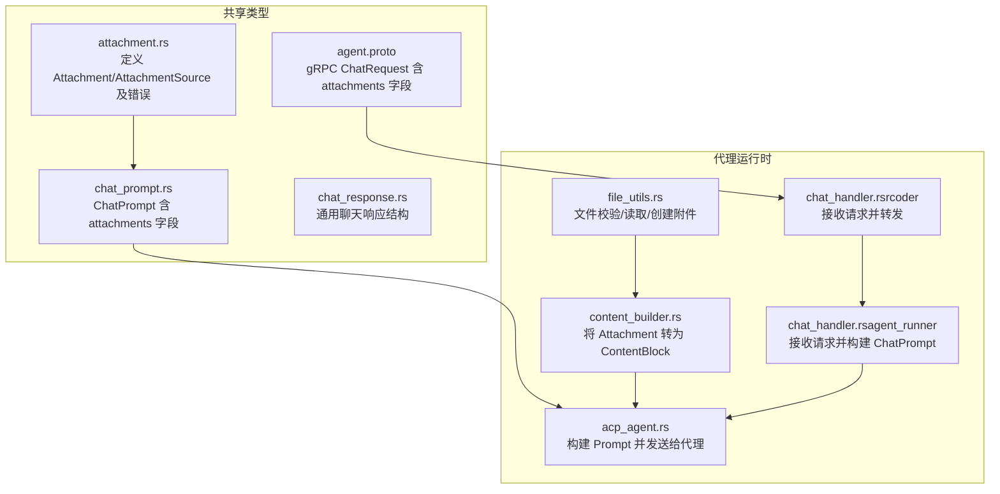
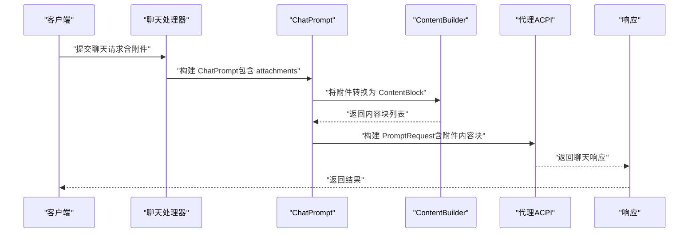
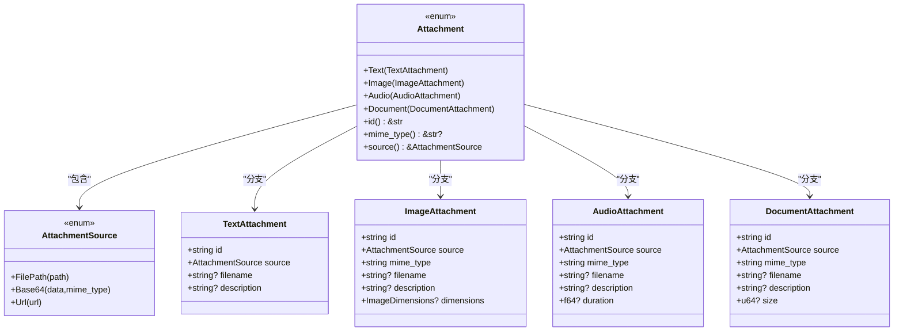
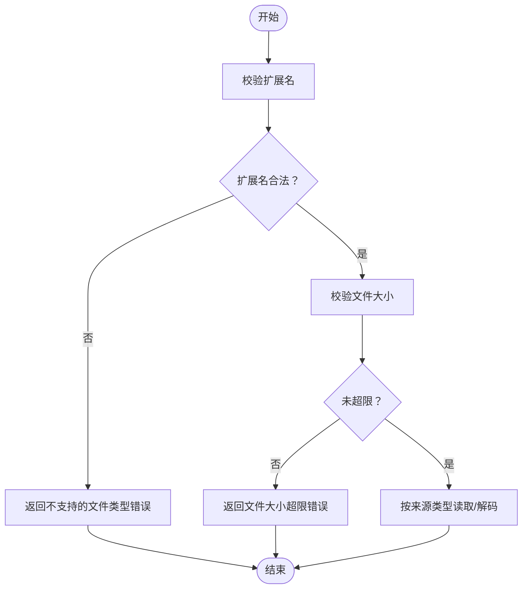
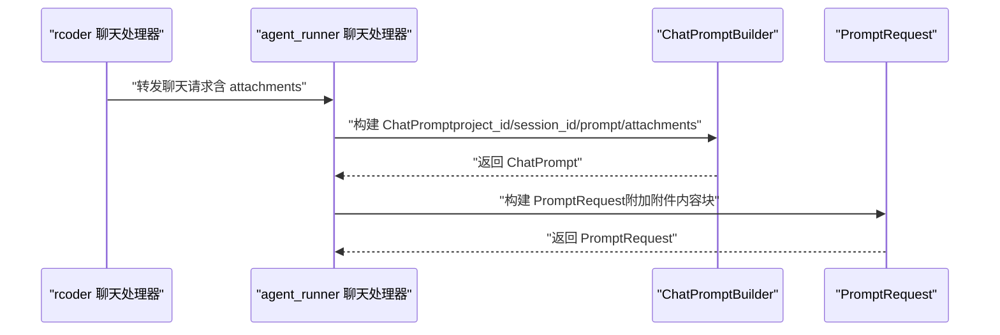
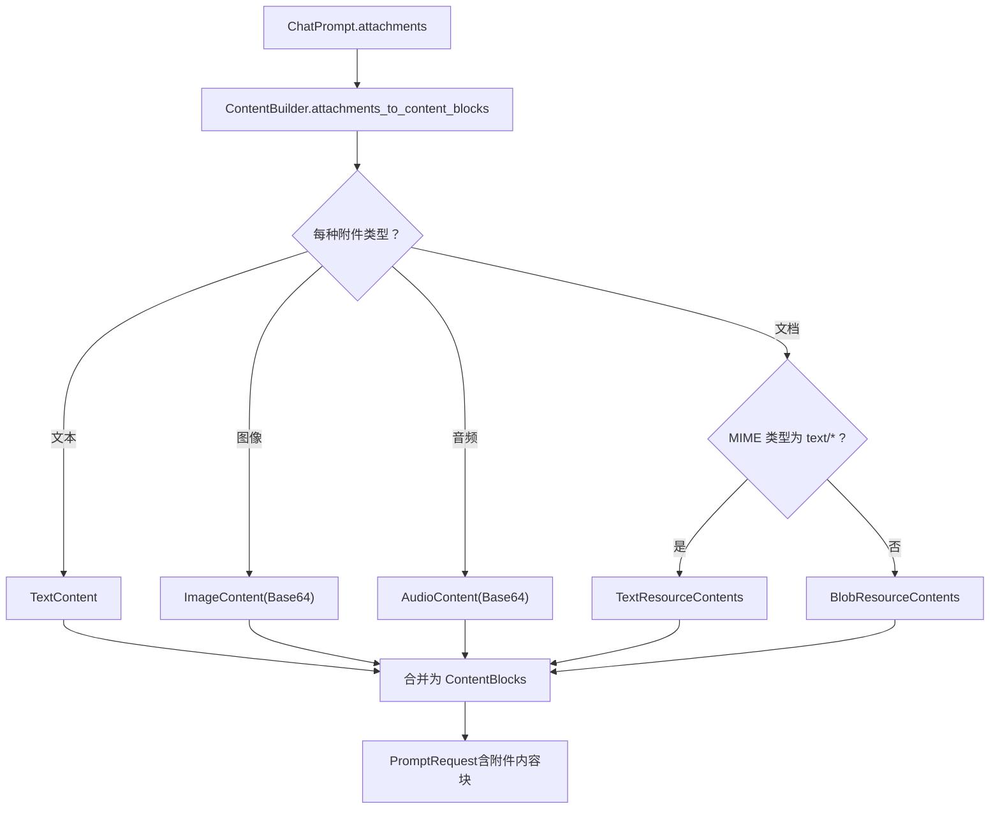
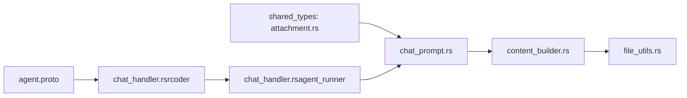

# 附件模型

<cite>
**本文引用的文件**
- [attachment.rs](file://crates/shared_types/src/model/attachment.rs)
- [chat_prompt.rs](file://crates/shared_types/src/model/chat_prompt.rs)
- [chat_response.rs](file://crates/shared_types/src/model/chat_response.rs)
- [content_builder.rs](file://crates/agent_runner/src/utils/content_builder.rs)
- [file_utils.rs](file://crates/agent_runner/src/utils/file_utils.rs)
- [acp_agent.rs](file://crates/agent_runner/src/proxy_agent/acp_agent.rs)
- [chat_handler.rs（rcoder）](file://crates/rcoder/src/handler/chat_handler.rs)
- [chat_handler.rs（agent_runner）](file://crates/agent_runner/src/handler/chat_handler.rs)
- [lib.rs（shared_types）](file://crates/shared_types/src/lib.rs)
- [agent.proto](file://crates/shared_types/proto/agent.proto)
</cite>

## 目录
1. [简介](#简介)
2. [项目结构](#项目结构)
3. [核心组件](#核心组件)
4. [架构总览](#架构总览)
5. [详细组件分析](#详细组件分析)
6. [依赖分析](#依赖分析)
7. [性能考虑](#性能考虑)
8. [故障排查指南](#故障排查指南)
9. [结论](#结论)

## 简介
本文件系统化阐述附件模型的设计与用途，覆盖以下方面：
- Attachment 结构体族的组成与职责边界
- 文件元数据（路径、大小、MIME 类型）的存储方式与来源
- 附件在聊天上下文中的引用机制、与提示词构造的关系
- 安全检查策略（文件扩展名、大小限制、来源类型）
- 资源清理流程（临时文件、会话与代理资源）
- 实际用例：附件如何参与 AI 代理交互并影响提示词构造

## 项目结构
附件模型位于共享类型模块中，围绕该模型构建了聊天提示、内容转换、文件工具与代理交互链路。

图表来源
- [attachment.rs](file://crates/shared_types/src/model/attachment.rs#L1-L216)
- [chat_prompt.rs](file://crates/shared_types/src/model/chat_prompt.rs#L1-L52)
- [chat_response.rs](file://crates/shared_types/src/model/chat_response.rs#L1-L18)
- [content_builder.rs](file://crates/agent_runner/src/utils/content_builder.rs#L1-L418)
- [file_utils.rs](file://crates/agent_runner/src/utils/file_utils.rs#L1-L339)
- [acp_agent.rs](file://crates/agent_runner/src/proxy_agent/acp_agent.rs#L343-L391)
- [chat_handler.rs（rcoder）](file://crates/rcoder/src/handler/chat_handler.rs#L17-L53)
- [chat_handler.rs（agent_runner）](file://crates/agent_runner/src/handler/chat_handler.rs#L1-L275)
- [agent.proto](file://crates/shared_types/proto/agent.proto#L1-L43)

章节来源
- [attachment.rs](file://crates/shared_types/src/model/attachment.rs#L1-L216)
- [chat_prompt.rs](file://crates/shared_types/src/model/chat_prompt.rs#L1-L52)
- [content_builder.rs](file://crates/agent_runner/src/utils/content_builder.rs#L1-L418)
- [file_utils.rs](file://crates/agent_runner/src/utils/file_utils.rs#L1-L339)
- [acp_agent.rs](file://crates/agent_runner/src/proxy_agent/acp_agent.rs#L343-L391)
- [chat_handler.rs（rcoder）](file://crates/rcoder/src/handler/chat_handler.rs#L17-L53)
- [chat_handler.rs（agent_runner）](file://crates/agent_runner/src/handler/chat_handler.rs#L1-L275)
- [agent.proto](file://crates/shared_types/proto/agent.proto#L1-L43)

## 核心组件
- 附件数据源类型：支持文件路径、Base64、URL 三种来源，统一通过枚举承载
- 附件类型：文本、图像、音频、文档四类，均包含 id、source、可选元数据（如 filename、description、size、mime_type、dimensions、duration）
- 附件错误：集中定义文件读取、类型不支持、Base64 解码、大小超限、URL 访问等错误
- 聊天提示：ChatPrompt 携带 attachments 与 data_source_attachments，驱动代理侧提示词构建
- 内容构建：将附件转换为 ACP ContentBlock，支撑多模态提示词
- 文件工具：校验扩展名、大小限制、读取与创建附件、清理临时文件
- 代理交互：构建 PromptRequest，将附件内容块注入提示词，并携带 request_id 等元信息

章节来源
- [attachment.rs](file://crates/shared_types/src/model/attachment.rs#L1-L216)
- [chat_prompt.rs](file://crates/shared_types/src/model/chat_prompt.rs#L1-L52)
- [content_builder.rs](file://crates/agent_runner/src/utils/content_builder.rs#L1-L418)
- [file_utils.rs](file://crates/agent_runner/src/utils/file_utils.rs#L1-L339)
- [acp_agent.rs](file://crates/agent_runner/src/proxy_agent/acp_agent.rs#L343-L391)

## 架构总览
附件在系统中的流转路径如下：
- 客户端/上游服务通过 gRPC/HTTP 请求携带附件
- 服务端解析请求，构建 ChatPrompt（含 attachments 与 data_source_attachments）
- 代理侧将附件转换为 ContentBlock，拼接到提示词中
- 代理执行推理，返回结果；同时进行资源清理

图表来源
- [chat_handler.rs（rcoder）](file://crates/rcoder/src/handler/chat_handler.rs#L17-L53)
- [chat_handler.rs（agent_runner）](file://crates/agent_runner/src/handler/chat_handler.rs#L1-L275)
- [chat_prompt.rs](file://crates/shared_types/src/model/chat_prompt.rs#L1-L52)
- [content_builder.rs](file://crates/agent_runner/src/utils/content_builder.rs#L1-L418)
- [acp_agent.rs](file://crates/agent_runner/src/proxy_agent/acp_agent.rs#L343-L391)
- [agent.proto](file://crates/shared_types/proto/agent.proto#L1-L43)

## 详细组件分析

### 附件数据模型与元数据
- 数据源类型
  - 文件路径：相对项目路径，便于在工作区定位
  - Base64：携带数据与 MIME 类型，适合内联传输
  - URL：远程资源，需网络访问
- 附件类型与元数据
  - 文本附件：id、source、filename、description
  - 图像附件：id、source、mime_type、filename、description、dimensions
  - 音频附件：id、source、mime_type、filename、description、duration
  - 文档附件：id、source、mime_type、filename、description、size
- 元数据来源
  - MIME 类型：由创建时指定或从扩展名推断
  - 大小：文档附件可选 size 字段
  - 尺寸/时长：图像/音频附件可选 dimensions/duration
- 访问与查询
  - 提供 id()、mime_type()、source() 等便捷方法

图表来源
- [attachment.rs](file://crates/shared_types/src/model/attachment.rs#L1-L216)

章节来源
- [attachment.rs](file://crates/shared_types/src/model/attachment.rs#L1-L216)

### 文件元数据存储与验证规则
- 存储方式
  - MIME 类型：显式传入或通过扩展名推断
  - 大小：文档附件可选 size 字段；文件工具在读取时校验大小
  - 尺寸/时长：图像/音频附件可选 dimensions/duration 字段
- 验证规则
  - 扩展名白名单：仅允许预设扩展名集合
  - 文件大小上限：默认 50MB，可通过配置调整
  - 来源类型约束：
    - 文本附件：禁止压缩文件作为文本附件
    - 图像/音频/文档：按来源类型分别读取或下载
- 错误类型
  - 文件读取失败、不支持的文件类型、Base64 解码失败、文件大小超限、URL 访问失败

图表来源
- [file_utils.rs](file://crates/agent_runner/src/utils/file_utils.rs#L1-L339)
- [attachment.rs](file://crates/shared_types/src/model/attachment.rs#L184-L216)

章节来源
- [file_utils.rs](file://crates/agent_runner/src/utils/file_utils.rs#L1-L339)
- [attachment.rs](file://crates/shared_types/src/model/attachment.rs#L184-L216)

### 附件在聊天上下文中的引用机制
- 请求结构
  - rcoder 与 agent_runner 的聊天处理器均支持 attachments 字段
  - ChatPromptBuilder 用于组装 ChatPrompt，包含 attachments 与 data_source_attachments
- 引用与传递
  - ChatRequest/ChatPrompt 持有附件列表
  - gRPC ChatRequest 也包含 attachments 字段，便于跨服务传递
- 会话与请求追踪
  - request_id 可选，若未提供则自动生成
  - 构建 PromptRequest 时将 request_id 放入 meta，便于后续追踪

图表来源
- [chat_handler.rs（rcoder）](file://crates/rcoder/src/handler/chat_handler.rs#L17-L53)
- [chat_handler.rs（agent_runner）](file://crates/agent_runner/src/handler/chat_handler.rs#L1-L275)
- [chat_prompt.rs](file://crates/shared_types/src/model/chat_prompt.rs#L1-L52)
- [acp_agent.rs](file://crates/agent_runner/src/proxy_agent/acp_agent.rs#L343-L391)
- [agent.proto](file://crates/shared_types/proto/agent.proto#L1-L43)

章节来源
- [chat_handler.rs（rcoder）](file://crates/rcoder/src/handler/chat_handler.rs#L17-L53)
- [chat_handler.rs（agent_runner）](file://crates/agent_runner/src/handler/chat_handler.rs#L1-L275)
- [chat_prompt.rs](file://crates/shared_types/src/model/chat_prompt.rs#L1-L52)
- [agent.proto](file://crates/shared_types/proto/agent.proto#L1-L43)

### 安全检查策略
- 文件扩展名校验：仅允许白名单扩展名，避免恶意文件
- 文件大小限制：防止过大附件导致内存压力与网络开销
- 来源类型安全：
  - 文本附件禁止压缩文件
  - URL 读取采用网络客户端，失败即忽略并记录告警
- 附件转换容错：读取失败或网络异常时静默忽略，不影响主流程

章节来源
- [file_utils.rs](file://crates/agent_runner/src/utils/file_utils.rs#L1-L339)
- [content_builder.rs](file://crates/agent_runner/src/utils/content_builder.rs#L1-L418)

### 资源清理流程
- 临时文件清理：文件工具提供批量清理临时文件的能力
- 代理与会话资源：代理侧通过生命周期守卫与连接池管理，结合定时清理任务，确保代理进程、会话与 SSE 消息得到回收
- 清理策略要点：
  - 基于 RAII 的自动清理：移除映射后由生命周期守卫触发资源回收
  - 超时保护：清理过程设置超时，避免阻塞
  - 统计与日志：记录清理统计，便于运维监控

章节来源
- [file_utils.rs](file://crates/agent_runner/src/utils/file_utils.rs#L312-L322)
- [acp_agent.rs](file://crates/agent_runner/src/proxy_agent/acp_agent.rs#L343-L391)

### 附件与 AI 代理交互及提示词构造
- 附件到内容块的转换
  - 文本：优先按文本读取，失败则忽略
  - 图像/音频：按来源读取为 Base64，附带 URI
  - 文档：按 MIME 类型区分文本/二进制，文本走 TextResourceContents，二进制走 BlobResourceContents，URL 走 ResourceLink
- 提示词构造
  - 将最终提示词与附件内容块合并为 ContentBlocks
  - 若存在 data_source_attachments，则在构建时加入数据源信息
  - 将 request_id 放入 meta，便于通道层追踪

图表来源
- [content_builder.rs](file://crates/agent_runner/src/utils/content_builder.rs#L1-L418)
- [acp_agent.rs](file://crates/agent_runner/src/proxy_agent/acp_agent.rs#L343-L391)

章节来源
- [content_builder.rs](file://crates/agent_runner/src/utils/content_builder.rs#L1-L418)
- [acp_agent.rs](file://crates/agent_runner/src/proxy_agent/acp_agent.rs#L343-L391)

## 依赖分析
- 低耦合高内聚
  - shared_types 的附件模型独立于具体实现，便于跨服务复用
  - 代理侧通过 ContentBuilder 与 file_utils 解耦附件读取与转换
- 关键依赖关系
  - ChatPrompt 依赖 Attachment/AttachmentSource
  - ContentBuilder 依赖 agent_client_protocol 的 ContentBlock 类型
  - file_utils 依赖 base64、tokio fs、reqwest
  - 聊天处理器依赖 ChatPromptBuilder 与模型提供商配置

图表来源
- [attachment.rs](file://crates/shared_types/src/model/attachment.rs#L1-L216)
- [chat_prompt.rs](file://crates/shared_types/src/model/chat_prompt.rs#L1-L52)
- [content_builder.rs](file://crates/agent_runner/src/utils/content_builder.rs#L1-L418)
- [file_utils.rs](file://crates/agent_runner/src/utils/file_utils.rs#L1-L339)
- [chat_handler.rs（rcoder）](file://crates/rcoder/src/handler/chat_handler.rs#L17-L53)
- [chat_handler.rs（agent_runner）](file://crates/agent_runner/src/handler/chat_handler.rs#L1-L275)
- [agent.proto](file://crates/shared_types/proto/agent.proto#L1-L43)

章节来源
- [lib.rs（shared_types）](file://crates/shared_types/src/lib.rs#L1-L71)
- [attachment.rs](file://crates/shared_types/src/model/attachment.rs#L1-L216)
- [chat_prompt.rs](file://crates/shared_types/src/model/chat_prompt.rs#L1-L52)
- [content_builder.rs](file://crates/agent_runner/src/utils/content_builder.rs#L1-L418)
- [file_utils.rs](file://crates/agent_runner/src/utils/file_utils.rs#L1-L339)
- [chat_handler.rs（rcoder）](file://crates/rcoder/src/handler/chat_handler.rs#L17-L53)
- [chat_handler.rs（agent_runner）](file://crates/agent_runner/src/handler/chat_handler.rs#L1-L275)
- [agent.proto](file://crates/shared_types/proto/agent.proto#L1-L43)

## 性能考虑
- 附件读取与转换
  - 优先使用 Base64 内联传输，减少磁盘 IO；对大文件建议使用 URL 或文件路径
  - 文档附件优先按文本读取，失败再降级为二进制，避免不必要的解码
- 网络访问
  - URL 读取采用异步客户端，失败即短路，避免阻塞
- 大小限制
  - 默认 50MB 上限，可根据部署环境调优，平衡吞吐与稳定性
- 清理与回收
  - 定时清理代理与会话资源，避免长期运行导致资源泄漏

## 故障排查指南
- 常见错误与定位
  - 文件读取失败：检查路径是否存在、权限是否足够
  - 不支持的文件类型：确认扩展名在白名单中
  - Base64 解码失败：确认数据格式正确且未被截断
  - 文件大小超限：调整上传策略或增大阈值
  - URL 访问失败：检查网络连通性与目标可达性
- 日志与追踪
  - 附件转换失败会记录告警日志，建议结合 request_id 追踪
  - 清理任务输出统计信息，便于发现异常增长

章节来源
- [attachment.rs](file://crates/shared_types/src/model/attachment.rs#L184-L216)
- [file_utils.rs](file://crates/agent_runner/src/utils/file_utils.rs#L1-L339)
- [content_builder.rs](file://crates/agent_runner/src/utils/content_builder.rs#L1-L418)

## 结论
附件模型通过统一的数据源与类型抽象，为多模态聊天提供了清晰的扩展点。配合严格的验证规则与容错转换，既保证了安全性，又提升了可用性。在代理交互层面，附件被无缝注入提示词，显著增强了 AI 的上下文理解能力。建议在生产环境中合理设置大小阈值与扩展名白名单，并持续监控清理任务与日志，确保系统稳定高效运行。