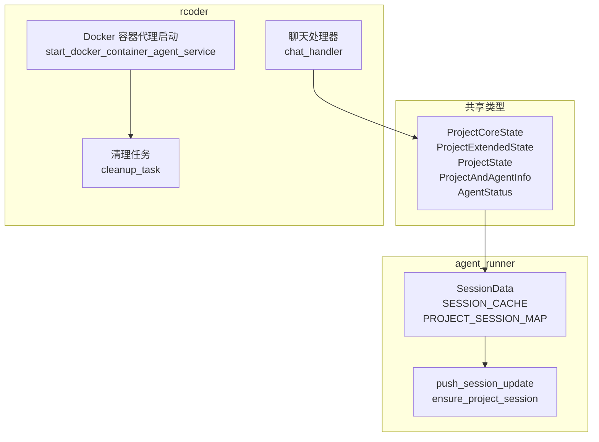
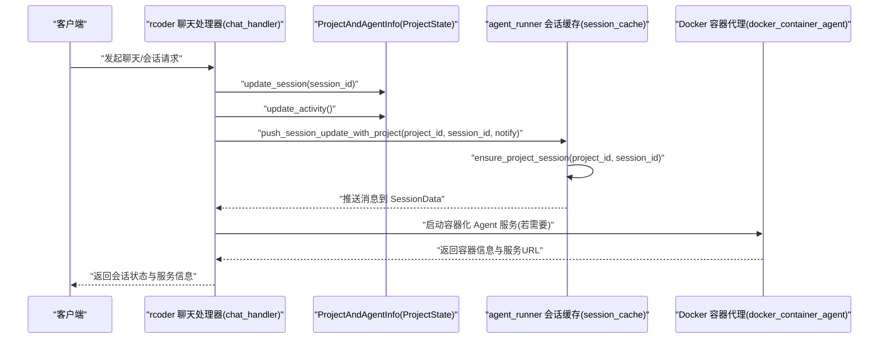
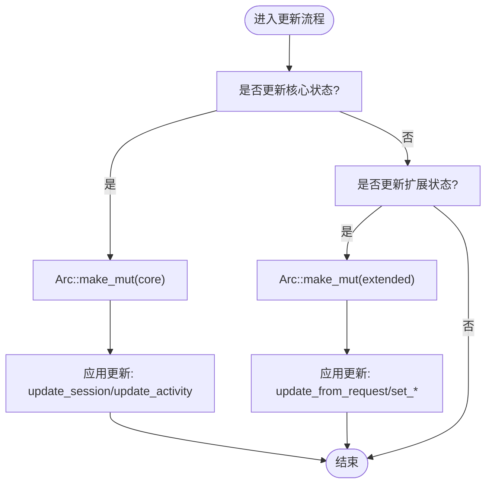
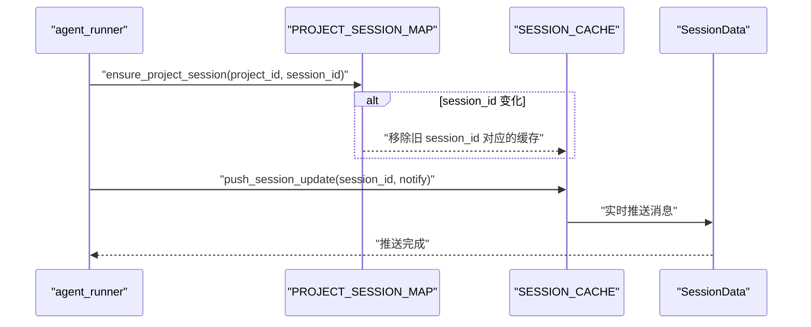
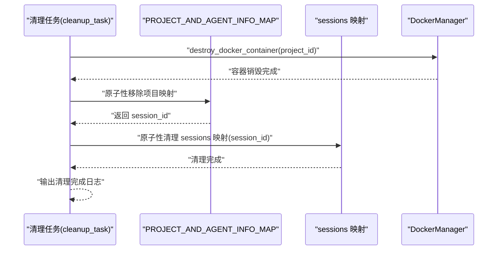
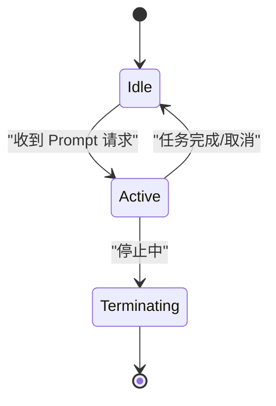
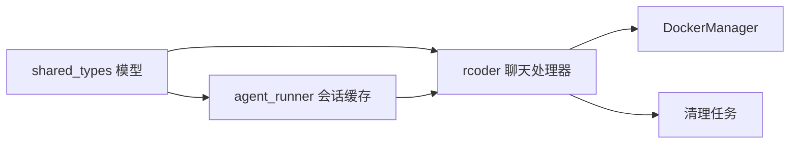

# 项目状态模型

<cite>
**本文引用的文件**
- [agent_project_runner_model.rs](file://crates/shared_types/src/model/agent_project_runner_model.rs)
- [agent_model.rs](file://crates/shared_types/src/model/agent_model.rs)
- [session_cache.rs](file://crates/agent_runner/src/service/session_cache.rs)
- [docker_container_agent.rs](file://crates/rcoder/src/proxy_agent/docker_container_agent.rs)
- [chat_handler.rs](file://crates/rcoder/src/handler/chat_handler.rs)
- [cleanup_task.rs](file://crates/rcoder/src/proxy_agent/cleanup_task.rs)
- [agent-abstraction-layer-design.md](file://specs/agent-abstraction-layer-design.md)
</cite>

## 目录
1. [简介](#简介)
2. [项目结构](#项目结构)
3. [核心组件](#核心组件)
4. [架构总览](#架构总览)
5. [详细组件分析](#详细组件分析)
6. [依赖关系分析](#依赖关系分析)
7. [性能考量](#性能考量)
8. [故障排查指南](#故障排查指南)
9. [结论](#结论)

## 简介
本文件围绕“项目状态模型”展开，重点解析 ProjectCoreState、ProjectExtendedState、ProjectState 以及 ProjectAndAgentInfo 等核心状态结构，阐明其字段语义、变更触发条件与同步机制；结合 agent_runner 与 rcoder 模块的实际用例，说明状态在 AI 代理生命周期中的流转；提供状态图示例与典型场景下的数据快照；解释线程安全处理方式（如 Arc、DashMap、Arc::make_mut、CancellationToken 等）与并发访问模式，并给出一致性保障措施。

## 项目结构
本仓库采用多 crate 分层组织，其中与“项目状态模型”直接相关的模块包括：
- shared_types：跨模块共享的模型定义，包含 ProjectCoreState、ProjectExtendedState、ProjectState、ProjectAndAgentInfo、AgentStatus 等。
- agent_runner：会话缓存与消息推送，涉及 session_id 与 Project 的映射管理。
- rcoder：代理容器化启动、状态清理与生命周期管理，涉及 Docker 容器生命周期与状态清理。
- specs：抽象层设计文档，描述 AgentStatus 的状态机与生命周期管理。

图表来源
- [agent_project_runner_model.rs](file://crates/shared_types/src/model/agent_project_runner_model.rs#L30-L189)
- [session_cache.rs](file://crates/agent_runner/src/service/session_cache.rs#L1-L120)
- [docker_container_agent.rs](file://crates/rcoder/src/proxy_agent/docker_container_agent.rs#L21-L130)
- [chat_handler.rs](file://crates/rcoder/src/handler/chat_handler.rs#L245-L270)
- [cleanup_task.rs](file://crates/rcoder/src/proxy_agent/cleanup_task.rs#L650-L720)

章节来源
- [agent_project_runner_model.rs](file://crates/shared_types/src/model/agent_project_runner_model.rs#L30-L189)
- [session_cache.rs](file://crates/agent_runner/src/service/session_cache.rs#L1-L120)
- [docker_container_agent.rs](file://crates/rcoder/src/proxy_agent/docker_container_agent.rs#L21-L130)
- [chat_handler.rs](file://crates/rcoder/src/handler/chat_handler.rs#L245-L270)
- [cleanup_task.rs](file://crates/rcoder/src/proxy_agent/cleanup_task.rs#L650-L720)

## 核心组件
本节聚焦“项目状态模型”的核心结构及其职责边界。

- ProjectCoreState
  - 字段语义：project_id（项目唯一标识）、session_id（会话标识，可选）、last_activity（最后活动时间）、created_at（创建时间）。
  - 变更触发：update_session 在创建会话时设置 session_id 并刷新 last_activity；update_activity 仅刷新 last_activity。
  - 访问模式：高频读写，适合通过 Arc 共享与写时复制更新。

- ProjectExtendedState
  - 字段语义：model_provider（模型提供商配置，可选）、container（容器信息，可选）、request_id（当前活跃请求ID，可选）、status（Agent 服务状态，可选）。
  - 变更触发：update_from_request 批量更新容器、模型提供商与请求ID；也可通过可变访问器逐项更新。
  - 访问模式：相对稳定的扩展字段，适合 Arc 共享与写时复制更新。

- ProjectState
  - 设计要点：将 core 与 extended 分离，分别使用 Arc 共享，提供 update_core/update_extended 方法，内部通过 Arc::make_mut 实现写时复制，避免不必要的深拷贝。
  - 便捷访问器：project_id、session_id、last_activity。

- ProjectAndAgentInfo
  - 字段语义：在共享类型中提供向后兼容的结构，内部持有 ProjectState，暴露与 ProjectState 对应的更新与访问方法。
  - 变更触发：update_session、update_activity、set_* 系列方法触发状态更新。

- AgentStatus
  - 枚举值：Active（活跃）、Idle（空闲）、Terminating（正在终止）。
  - 用途：表示 Agent 服务的运行状态，配合 last_activity、request_id 等字段共同反映代理生命周期。

章节来源
- [agent_project_runner_model.rs](file://crates/shared_types/src/model/agent_project_runner_model.rs#L30-L189)
- [agent_model.rs](file://crates/shared_types/src/model/agent_model.rs#L32-L41)

## 架构总览
下图展示“项目状态模型”在 rcoder 与 agent_runner 之间的交互，以及状态在代理生命周期中的流转。

图表来源
- [chat_handler.rs](file://crates/rcoder/src/handler/chat_handler.rs#L245-L270)
- [session_cache.rs](file://crates/agent_runner/src/service/session_cache.rs#L259-L355)
- [docker_container_agent.rs](file://crates/rcoder/src/proxy_agent/docker_container_agent.rs#L21-L130)
- [agent_project_runner_model.rs](file://crates/shared_types/src/model/agent_project_runner_model.rs#L170-L202)

## 详细组件分析

### ProjectCoreState 与 ProjectExtendedState 的字段语义与更新流程
- 字段语义
  - project_id：项目唯一标识，贯穿整个生命周期。
  - session_id：会话标识，首次创建会话时设置，用于区分不同会话。
  - last_activity：最近一次活动时间，用于空闲检测与清理策略。
  - created_at：创建时间，用于统计与审计。
  - model_provider/container/request_id/status：扩展状态，承载容器、模型提供商、请求ID与服务状态等信息。

- 更新流程
  - update_session：设置 session_id 并刷新 last_activity。
  - update_activity：仅刷新 last_activity。
  - update_from_request：批量更新容器、模型提供商与请求ID。

- 写时复制更新
  - ProjectState.update_core/update_extended 内部使用 Arc::make_mut，在需要修改时才触发写时复制，避免不必要的深拷贝。

图表来源
- [agent_project_runner_model.rs](file://crates/shared_types/src/model/agent_project_runner_model.rs#L117-L159)

章节来源
- [agent_project_runner_model.rs](file://crates/shared_types/src/model/agent_project_runner_model.rs#L30-L189)

### 会话映射与消息推送（agent_runner）
- SESSION_CACHE：按 session_id 分组缓存会话消息，使用环形缓冲区与实时推送相结合的方式，减少内存占用并保证消息及时送达。
- PROJECT_SESSION_MAP：确保一个 project_id 只对应一个活跃的 session_id。当 session_id 变化时，自动清理旧 session 的缓存数据。
- push_session_update/push_session_update_with_project：将通知转换为统一消息并推送到 SessionData；ensure_project_session 负责维护映射关系与清理旧数据。

图表来源
- [session_cache.rs](file://crates/agent_runner/src/service/session_cache.rs#L259-L355)

章节来源
- [session_cache.rs](file://crates/agent_runner/src/service/session_cache.rs#L1-L120)
- [session_cache.rs](file://crates/agent_runner/src/service/session_cache.rs#L259-L355)

### rcoder 中的状态更新与生命周期清理
- 聊天处理器（chat_handler）
  - 在收到请求时，检查并更新项目会话状态：若 session_id 不同则更新会话并刷新 last_activity；若相同则仅更新活动时间。
  - 使用 Arc::make_mut 与写时复制更新，避免不必要的深拷贝。

- 清理任务（cleanup_task）
  - 通过 DashMap 的 Entry API 原子性地移除项目到代理的映射，触发 AgentLifecycleGuard 的 Drop，从而自动清理资源。
  - 清理顺序：销毁 Docker 容器 -> 原子性移除项目映射 -> 原子性清理 sessions 映射 -> 输出清理完成日志。
  - 超时保护：清理过程整体超时控制，防止阻塞。

图表来源
- [cleanup_task.rs](file://crates/rcoder/src/proxy_agent/cleanup_task.rs#L650-L720)
- [docker_container_agent.rs](file://crates/rcoder/src/proxy_agent/docker_container_agent.rs#L733-L785)

章节来源
- [chat_handler.rs](file://crates/rcoder/src/handler/chat_handler.rs#L245-L270)
- [cleanup_task.rs](file://crates/rcoder/src/proxy_agent/cleanup_task.rs#L650-L720)
- [docker_container_agent.rs](file://crates/rcoder/src/proxy_agent/docker_container_agent.rs#L733-L785)

### AgentStatus 状态机与生命周期
- AgentStatus 枚举：Active、Idle、Terminating。
- 状态切换时机（基于现有实现抽象）：
  - Active：收到 Prompt 请求时。
  - Idle：Prompt 处理完成或被取消时。
  - Terminating：Agent 停止过程中。
- AgentLifecycleGuard：遵循 RAII 原则，当守卫被 drop 时自动清理资源；提供 graceful_stop、cancel、is_stopped、cancellation_token 等接口。

图表来源
- [agent_model.rs](file://crates/shared_types/src/model/agent_model.rs#L32-L41)
- [agent-abstraction-layer-design.md](file://specs/agent-abstraction-layer-design.md#L1157-L1225)

章节来源
- [agent_model.rs](file://crates/shared_types/src/model/agent_model.rs#L32-L41)
- [agent-abstraction-layer-design.md](file://specs/agent-abstraction-layer-design.md#L1157-L1225)

### 线程安全与并发访问模式
- Arc 共享与写时复制
  - ProjectState 将 core 与 extended 分离，分别使用 Arc 共享，通过 Arc::make_mut 在需要修改时才触发写时复制，降低锁竞争与内存拷贝成本。
- DashMap 原子性操作
  - cleanup_task 使用 DashMap::entry API 原子性地移除映射，避免读写锁竞争，确保清理过程的一致性。
- CancellationToken
  - AgentLifecycleGuard 使用 CancellationToken 实现非阻塞取消，优雅停止时先 cancel 再强制清理，保证资源释放与一致性。
- 会话连接管理
  - SessionData 直接共享当前连接与取消令牌，避免命令传递带来的额外开销；close_current_connection 主动触发取消令牌并显式关闭发送端，确保接收端能及时感知连接关闭。

章节来源
- [agent_project_runner_model.rs](file://crates/shared_types/src/model/agent_project_runner_model.rs#L117-L159)
- [cleanup_task.rs](file://crates/rcoder/src/proxy_agent/cleanup_task.rs#L661-L704)
- [agent_model.rs](file://crates/shared_types/src/model/agent_model.rs#L218-L338)
- [session_cache.rs](file://crates/agent_runner/src/service/session_cache.rs#L1-L120)

## 依赖关系分析
- ProjectState 依赖于 chrono 时间类型与 serde 序列化能力，用于时间戳与持久化。
- ProjectAndAgentInfo 依赖于 shared_types 中的 AgentStatus、ModelProviderConfig 等类型，用于承载代理状态与模型配置。
- agent_runner 的 session_cache 依赖 DashMap、ringbuf、tokio channels 等并发与缓冲机制。
- rcoder 的清理任务依赖 DockerManager、DashMap、Tokio 定时器与超时控制。

图表来源
- [agent_project_runner_model.rs](file://crates/shared_types/src/model/agent_project_runner_model.rs#L30-L189)
- [session_cache.rs](file://crates/agent_runner/src/service/session_cache.rs#L1-L120)
- [chat_handler.rs](file://crates/rcoder/src/handler/chat_handler.rs#L245-L270)
- [docker_container_agent.rs](file://crates/rcoder/src/proxy_agent/docker_container_agent.rs#L21-L130)
- [cleanup_task.rs](file://crates/rcoder/src/proxy_agent/cleanup_task.rs#L650-L720)

章节来源
- [agent_project_runner_model.rs](file://crates/shared_types/src/model/agent_project_runner_model.rs#L30-L189)
- [session_cache.rs](file://crates/agent_runner/src/service/session_cache.rs#L1-L120)
- [chat_handler.rs](file://crates/rcoder/src/handler/chat_handler.rs#L245-L270)
- [docker_container_agent.rs](file://crates/rcoder/src/proxy_agent/docker_container_agent.rs#L21-L130)
- [cleanup_task.rs](file://crates/rcoder/src/proxy_agent/cleanup_task.rs#L650-L720)

## 性能考量
- 写时复制（Arc::make_mut）：在频繁读取、偶发更新的场景下显著降低锁竞争与内存拷贝成本。
- 会话缓存优化：RingBuffer 缓冲与实时推送结合，既能保证消息及时性，又能控制内存占用。
- 原子性操作：DashMap::entry API 在清理映射时避免读写锁竞争，提升清理吞吐。
- 取消令牌：CancellationToken 非阻塞取消，配合优雅停止流程，减少资源泄漏与阻塞风险。
- 端口与网络优化：容器内部网络通信，避免宿主机端口映射与释放带来的额外开销。

## 故障排查指南
- 会话映射异常
  - 现象：同一 project_id 出现多个活跃 session。
  - 排查：确认 ensure_project_session 是否正确清理旧 session；检查 PROJECT_SESSION_MAP 的原子性插入与移除。
  - 参考路径：[session_cache.rs](file://crates/agent_runner/src/service/session_cache.rs#L282-L355)

- 清理任务超时或阻塞
  - 现象：清理任务超时或长时间不结束。
  - 排查：检查 destroy_docker_container 是否成功；确认清理流程中的超时保护与日志输出。
  - 参考路径：[cleanup_task.rs](file://crates/rcoder/src/proxy_agent/cleanup_task.rs#L787-L836)

- 代理资源未释放
  - 现象：Agent 停止后仍占用资源。
  - 排查：确认 AgentLifecycleGuard 的 Drop 是否触发；检查 cancellation_token 是否正确 cancel。
  - 参考路径：[agent_model.rs](file://crates/shared_types/src/model/agent_model.rs#L340-L404)

- 会话连接无法断开
  - 现象：SSE 连接长时间不关闭。
  - 排查：确认 close_current_connection 是否被调用；检查 CancellationToken 与发送端的显式关闭。
  - 参考路径：[session_cache.rs](file://crates/agent_runner/src/service/session_cache.rs#L115-L140)

章节来源
- [session_cache.rs](file://crates/agent_runner/src/service/session_cache.rs#L282-L355)
- [cleanup_task.rs](file://crates/rcoder/src/proxy_agent/cleanup_task.rs#L787-L836)
- [agent_model.rs](file://crates/shared_types/src/model/agent_model.rs#L340-L404)
- [session_cache.rs](file://crates/agent_runner/src/service/session_cache.rs#L115-L140)

## 结论
本项目通过 ProjectCoreState/ProjectExtendedState/ProjectState 的分层设计，结合 Arc 共享与写时复制，实现了高性能、低锁争用的状态管理；借助 DashMap 原子性操作与 CancellationToken，确保在高并发场景下的一致性与可靠性。agent_runner 的会话缓存与 rcoder 的清理任务共同构成了完整的生命周期管理闭环，覆盖从会话创建、消息推送、状态更新到资源清理的全链路。建议在新增状态字段时，遵循“核心小字段高频更新、扩展大字段低频更新”的设计原则，并优先使用写时复制与原子性操作，以获得最佳的性能与一致性表现。