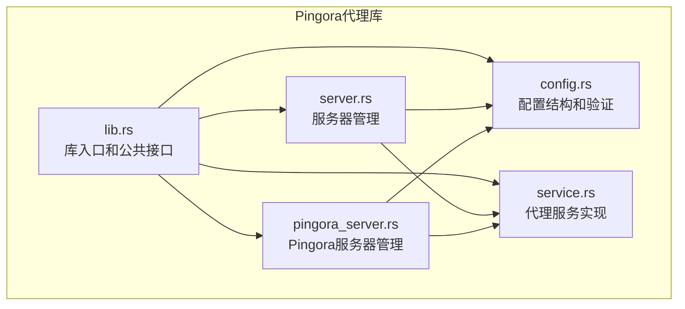
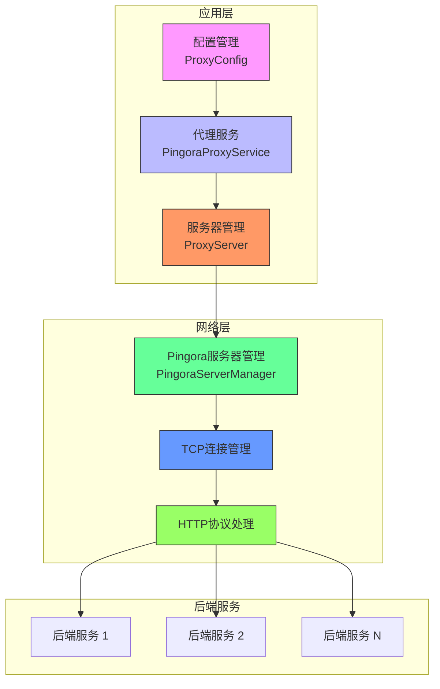
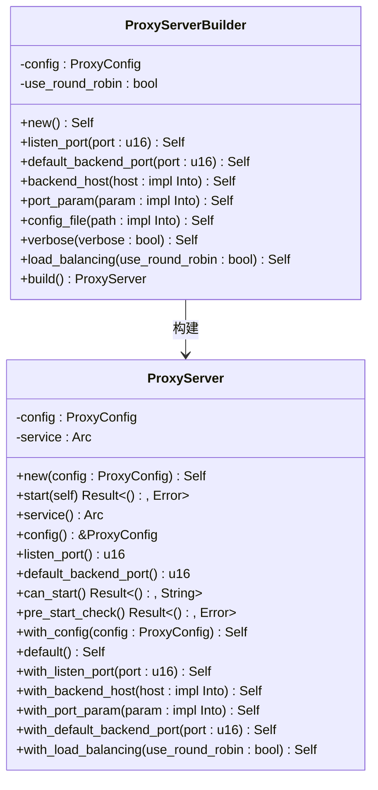
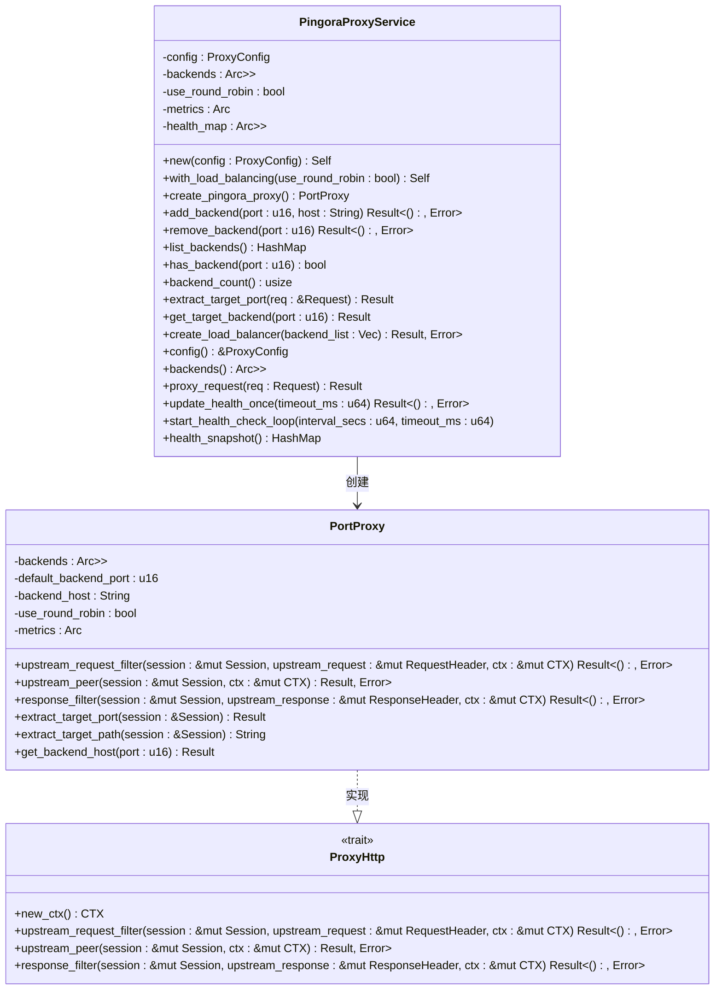
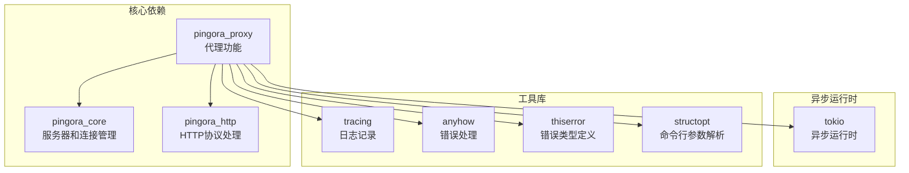

# Pingora代理实现

<cite>
**本文档引用的文件**   
- [lib.rs](file://crates/pingora-proxy/src/lib.rs)
- [config.rs](file://crates/pingora-proxy/src/config.rs)
- [server.rs](file://crates/pingora-proxy/src/server.rs)
- [service.rs](file://crates/pingora-proxy/src/service.rs)
- [pingora_server.rs](file://crates/pingora-proxy/src/pingora_server.rs)
</cite>

## 目录
1. [简介](#简介)
2. [项目结构](#项目结构)
3. [核心组件](#核心组件)
4. [架构概述](#架构概述)
5. [详细组件分析](#详细组件分析)
6. [依赖分析](#依赖分析)
7. [性能考量](#性能考量)
8. [故障排除指南](#故障排除指南)
9. [结论](#结论)

## 简介
Pingora代理库是一个基于Cloudflare Pingora库的高性能反向代理实现，专为Docker容器环境中统一端口访问多个前端应用而设计。该库支持通过URL参数中的端口信息将请求代理到对应的后端服务，提供端口路由、动态后端管理、高性能异步处理等特性。核心功能包括基于查询参数或路径的端口路由、运行时动态添加和移除后端服务、以及基于Axum和Reqwest的异步处理能力。该实现充分利用了Pingora库的高级特性，如负载均衡、健康检查、连接池和连接复用，支持HTTP/1.1和HTTP/2协议，确保了高性能的异步I/O处理能力。

## 项目结构
Pingora代理库的项目结构遵循Rust crate的标准组织方式，核心功能分布在`crates/pingora-proxy/src`目录下的多个模块文件中。主要模块包括`lib.rs`作为库的入口点，`config.rs`定义配置结构，`server.rs`封装服务器逻辑，`service.rs`实现请求处理服务，以及`pingora_server.rs`管理Pingora服务器实例。这种模块化设计使得各个组件职责清晰，便于维护和扩展。库提供了丰富的配置选项和便捷的API，支持命令行参数和配置文件，同时具备完整的日志记录和错误处理机制。整体结构体现了高内聚低耦合的设计原则，各模块通过清晰的接口进行交互，确保了系统的可维护性和可扩展性。



**图示来源**
- [lib.rs](file://crates/pingora-proxy/src/lib.rs#L1-L250)
- [config.rs](file://crates/pingora-proxy/src/config.rs#L1-L95)
- [server.rs](file://crates/pingora-proxy/src/server.rs#L1-L372)
- [service.rs](file://crates/pingora-proxy/src/service.rs#L1-L723)
- [pingora_server.rs](file://crates/pingora-proxy/src/pingora_server.rs#L1-L182)

**本节来源**
- [lib.rs](file://crates/pingora-proxy/src/lib.rs#L1-L250)
- [config.rs](file://crates/pingora-proxy/src/config.rs#L1-L95)
- [server.rs](file://crates/pingora-proxy/src/server.rs#L1-L372)
- [service.rs](file://crates/pingora-proxy/src/service.rs#L1-L723)
- [pingora_server.rs](file://crates/pingora-proxy/src/pingora_server.rs#L1-L182)

## 核心组件
Pingora代理库的核心组件包括配置管理、服务器管理、代理服务和Pingora服务器管理器。`ProxyConfig`结构体定义了代理服务器的所有配置选项，包括监听端口、默认后端端口、后端主机地址、端口参数名等，并提供了验证机制确保配置的有效性。`ProxyServer`结构体作为主要的服务器管理器，负责创建和启动代理服务，提供了构建器模式来灵活配置服务器实例。`PingoraProxyService`是核心的代理服务实现，处理请求的路由、后端选择和响应过滤，支持动态后端管理和负载均衡。`PingoraServerManager`则负责管理Pingora服务器的生命周期，包括启动、停止和信号处理。这些组件通过清晰的接口相互协作，形成了一个高性能、可扩展的反向代理系统。

**本节来源**
- [lib.rs](file://crates/pingora-proxy/src/lib.rs#L1-L250)
- [config.rs](file://crates/pingora-proxy/src/config.rs#L1-L95)
- [server.rs](file://crates/pingora-proxy/src/server.rs#L1-L372)
- [service.rs](file://crates/pingora-proxy/src/service.rs#L1-L723)
- [pingora_server.rs](file://crates/pingora-proxy/src/pingora_server.rs#L1-L182)

## 架构概述
Pingora代理库的架构基于事件驱动和异步I/O模型，充分利用了Pingora库的高性能特性。系统架构分为配置层、服务层、服务器层和网络层四个主要部分。配置层负责管理代理服务器的所有配置选项，确保配置的有效性和一致性。服务层实现了核心的代理逻辑，包括请求路由、后端选择、请求过滤和响应处理。服务器层管理Pingora服务器的生命周期，处理TCP连接的建立和关闭。网络层则负责与后端服务的通信，实现了连接池和连接复用，提高了网络I/O的效率。整个架构采用了零拷贝数据传输技术，减少了内存复制的开销，同时通过异步处理模型实现了高并发的请求处理能力。



**图示来源**
- [config.rs](file://crates/pingora-proxy/src/config.rs#L1-L95)
- [service.rs](file://crates/pingora-proxy/src/service.rs#L1-L723)
- [server.rs](file://crates/pingora-proxy/src/server.rs#L1-L372)
- [pingora_server.rs](file://crates/pingora-proxy/src/pingora_server.rs#L1-L182)

## 详细组件分析

### 配置管理分析
配置管理组件通过`ProxyConfig`结构体实现，定义了代理服务器的所有可配置参数。该结构体使用`structopt`库支持命令行参数解析，同时提供了默认值和验证机制。配置项包括监听端口、默认后端端口、后端主机地址、端口参数名、配置文件路径和详细日志开关。验证方法确保了关键配置项的有效性，如端口不能为0，主机地址不能为空等。这种设计使得配置既灵活又安全，支持多种配置方式，满足不同部署场景的需求。

```mermaid
classDiagram
class ProxyConfig {
+listen_port : u16
+default_backend_port : u16
+backend_host : String
+port_param : String
+config_file : Option<String>
+verbose : bool
+validate() Result<(), String>
+with_listen_port(port : u16) Self
+with_backend_host(host : impl Into<String>) Self
+with_port_param(param : impl Into<String>) Self
}
note right of ProxyConfig
代理服务器配置结构体
支持命令行参数和配置文件
提供配置验证和便捷构造方法
end
```

**图示来源**
- [config.rs](file://crates/pingora-proxy/src/config.rs#L1-L95)

**本节来源**
- [config.rs](file://crates/pingora-proxy/src/config.rs#L1-L95)

### 服务器管理分析
服务器管理组件由`ProxyServer`和`ProxyServerBuilder`两个主要结构体组成。`ProxyServer`是核心的服务器管理器，负责创建和启动代理服务，提供了丰富的配置选项和生命周期管理方法。`ProxyServerBuilder`则实现了构建器模式，允许以流畅的API方式配置服务器实例。这种设计模式提高了API的可用性和灵活性，使得服务器配置更加直观和易于使用。服务器管理器还提供了预启动检查功能，确保在实际启动前配置的有效性，提高了系统的稳定性和可靠性。



**图示来源**
- [server.rs](file://crates/pingora-proxy/src/server.rs#L1-L372)

**本节来源**
- [server.rs](file://crates/pingora-proxy/src/server.rs#L1-L372)

### 代理服务分析
代理服务组件是Pingora代理库的核心，由`PingoraProxyService`和`PortProxy`两个主要结构体实现。`PingoraProxyService`负责管理后端服务列表、负载均衡策略和健康检查，提供了动态添加和移除后端服务的能力。`PortProxy`则实现了Pingora的`ProxyHttp` trait，处理具体的请求路由、请求过滤和响应处理。服务组件采用了异步编程模型，通过`Arc<RwLock<HashMap<u16, String>>>`实现线程安全的后端映射管理，确保了高并发场景下的数据一致性。同时，服务组件还实现了详细的指标收集功能，包括请求计数、响应时间统计和活跃连接数监控。



**图示来源**
- [service.rs](file://crates/pingora-proxy/src/service.rs#L1-L723)

**本节来源**
- [service.rs](file://crates/pingora-proxy/src/service.rs#L1-L723)

### Pingora服务器管理分析
Pingora服务器管理组件由`PingoraServerManager`结构体实现，负责管理Pingora服务器的完整生命周期。该组件创建并启动Pingora服务器实例，处理TCP连接的建立和关闭，以及服务器的优雅关闭。通过`oneshot`通道实现关闭信号的传递，确保服务器能够响应外部的停止请求。服务器管理器还提供了获取服务引用的方法，允许外部组件访问代理服务的内部状态和指标。这种设计模式将服务器的生命周期管理与业务逻辑分离，提高了系统的模块化程度和可维护性。

```mermaid
classDiagram
class PingoraServerManager {
-config : ProxyConfig
-service : Arc<PingoraProxyService>
-shutdown_tx : Option<oneshot : : Sender<()>>
+new(config : ProxyConfig) Self
+start(&mut self) Result<(), Error>
+stop(&mut self) Result<(), Error>
+service(&self) Arc<PingoraProxyService>
}
class ProxyServiceWrapper {
-inner : Arc<PortProxy>
+new_ctx() CTX
+upstream_peer(session : &mut Session, _ctx : &mut CTX) Result<Box<HttpPeer>, Error>
+upstream_request_filter(session : &mut Session, upstream_request : &mut RequestHeader, ctx : &mut CTX) Result<(), Error>
+response_filter(session : &mut Session, upstream_response : &mut ResponseHeader, ctx : &mut CTX) Result<(), Error>
}
PingoraServerManager --> ProxyServiceWrapper : 使用
ProxyServiceWrapper --> PortProxy : 包装
```

**图示来源**
- [pingora_server.rs](file://crates/pingora-proxy/src/pingora_server.rs#L1-L182)

**本节来源**
- [pingora_server.rs](file://crates/pingora-proxy/src/pingora_server.rs#L1-L182)

## 依赖分析
Pingora代理库的依赖关系清晰且层次分明，主要依赖于Cloudflare的Pingora库来实现高性能的反向代理功能。核心依赖包括`pingora_core`、`pingora_http`和`pingora_proxy`，这些库提供了服务器管理、HTTP协议处理和代理功能的基础实现。此外，库还依赖于`tokio`作为异步运行时，`tracing`用于日志记录，`anyhow`和`thiserror`用于错误处理，`structopt`用于命令行参数解析。这些依赖的选择体现了对性能、可靠性和开发效率的综合考虑，确保了库的高性能和易用性。



**图示来源**
- [Cargo.toml](file://crates/pingora-proxy/Cargo.toml)
- [lib.rs](file://crates/pingora-proxy/src/lib.rs#L1-L250)

**本节来源**
- [Cargo.toml](file://crates/pingora-proxy/Cargo.toml)
- [lib.rs](file://crates/pingora-proxy/src/lib.rs#L1-L250)

## 性能考量
Pingora代理库在设计时充分考虑了性能优化，采用了多种技术手段来确保高吞吐量和低延迟。首先，基于Pingora库的事件驱动架构和异步I/O模型，能够高效处理大量并发连接，避免了传统阻塞I/O的性能瓶颈。其次，实现了连接池和连接复用机制，减少了TCP连接的建立和关闭开销，提高了网络I/O的效率。第三，采用了零拷贝数据传输技术，在请求和响应的转发过程中尽量减少内存复制，降低了CPU和内存的使用。此外，库还实现了负载均衡和健康检查功能，能够智能地分配请求到健康的后端服务，提高了系统的可用性和性能。最后，通过详细的指标收集和监控，可以实时了解系统的性能状况，为性能调优提供数据支持。

## 故障排除指南
在使用Pingora代理库时，可能会遇到配置错误、网络连接问题或性能瓶颈等常见问题。对于配置错误，应首先检查`ProxyConfig`的验证结果，确保所有配置项都符合要求，特别是端口不能为0，主机地址不能为空等。对于网络连接问题，可以检查后端服务是否正常运行，防火墙设置是否正确，以及网络延迟是否过高。对于性能瓶颈，可以通过监控系统的指标数据，如请求处理时间、活跃连接数和CPU/内存使用率，来定位问题所在。此外，启用详细日志可以帮助诊断问题，通过日志中的错误信息和调试信息来快速定位和解决问题。

**本节来源**
- [config.rs](file://crates/pingora-proxy/src/config.rs#L1-L95)
- [service.rs](file://crates/pingora-proxy/src/service.rs#L1-L723)
- [server.rs](file://crates/pingora-proxy/src/server.rs#L1-L372)

## 结论
Pingora代理库是一个高性能、可扩展的反向代理实现，充分利用了Cloudflare Pingora库的先进特性。通过模块化的设计和清晰的接口定义，库提供了灵活的配置选项和强大的功能，能够满足各种复杂的代理需求。核心的代理服务实现了高效的请求路由、负载均衡和健康检查功能，同时通过异步I/O模型和连接池技术确保了高性能的请求处理能力。库的设计充分考虑了性能优化和错误处理，提供了详细的日志记录和指标监控，便于系统的维护和调优。总体而言，Pingora代理库是一个可靠、高效的反向代理解决方案，适用于需要高性能和高可用性的应用场景。