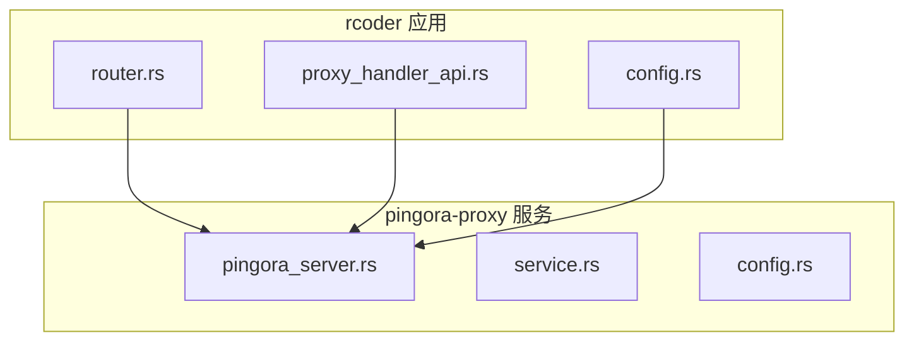
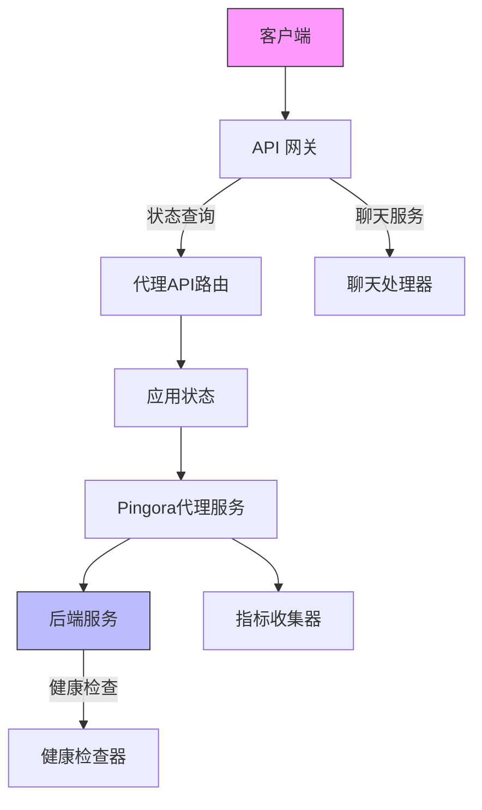
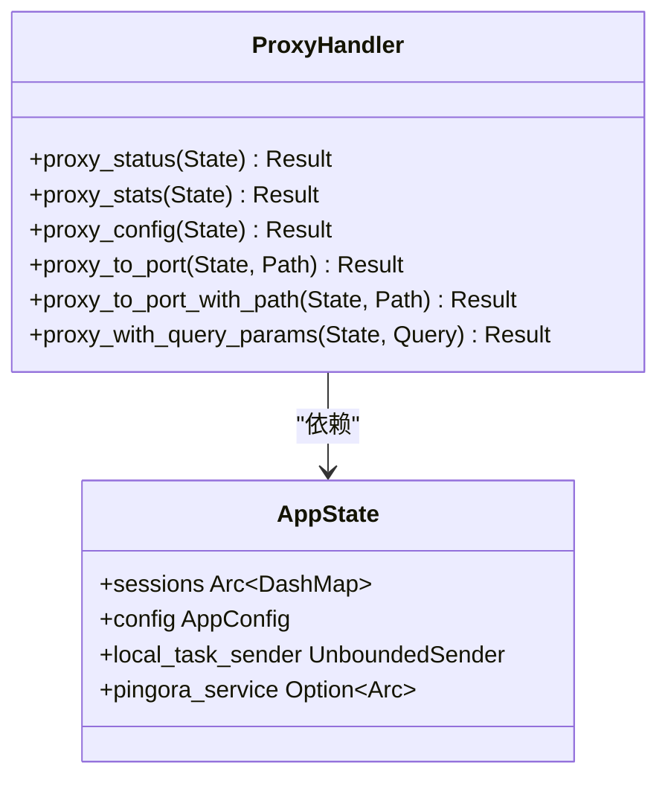
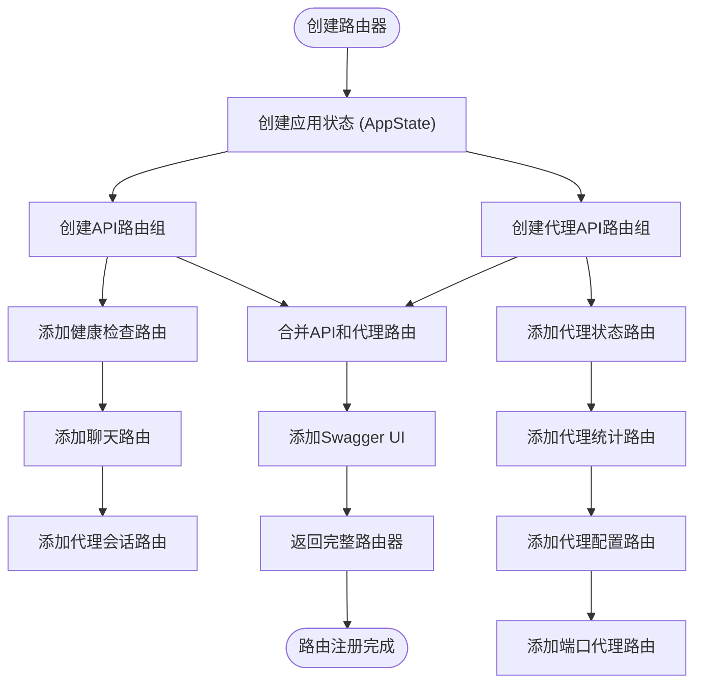
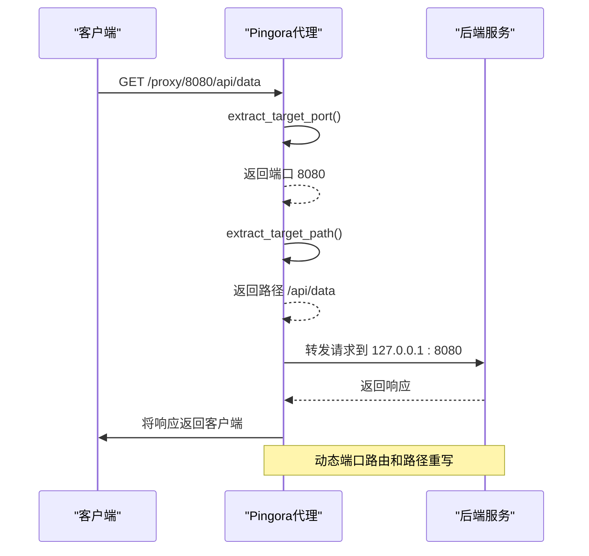
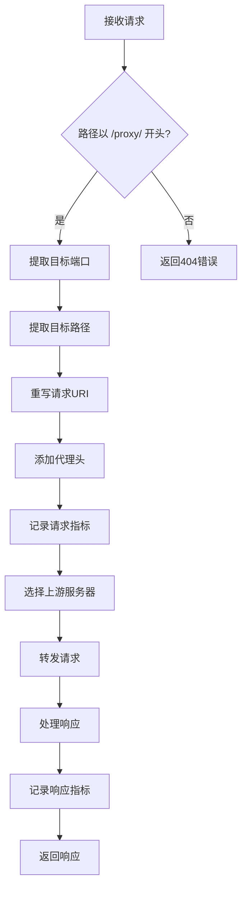
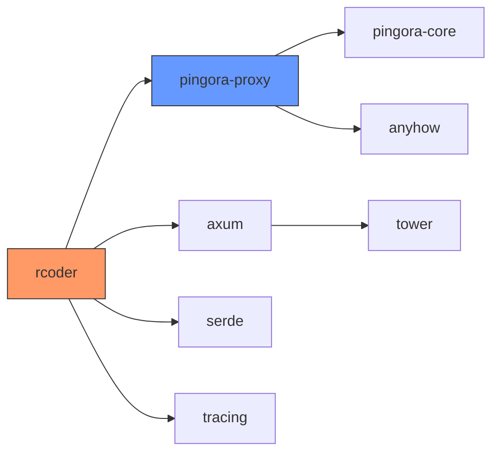

# 代理路由机制

<cite>
**本文档引用的文件**
- [proxy_handler_api.rs](file://crates/rcoder/src/handler/proxy_handler_api.rs)
- [router.rs](file://crates/rcoder/src/router.rs)
- [config.rs](file://crates/rcoder/src/config.rs)
- [pingora_server.rs](file://crates/pingora-proxy/src/pingora_server.rs)
- [service.rs](file://crates/pingora-proxy/src/service.rs)
</cite>

## 目录
1. [引言](#引言)
2. [项目结构](#项目结构)
3. [核心组件](#核心组件)
4. [架构概述](#架构概述)
5. [详细组件分析](#详细组件分析)
6. [依赖分析](#依赖分析)
7. [性能考虑](#性能考虑)
8. [故障排除指南](#故障排除指南)
9. [结论](#结论)

## 引言
本文档深入分析了基于 Cloudflare Pingora 构建的高性能反向代理路由机制。重点解析了 HTTP 请求的转发逻辑、路由规则的注册方式、中间件处理流程以及动态更新机制。系统通过端口映射实现灵活的服务路由，支持健康检查和负载均衡，为 AI 驱动开发平台提供了可靠的网络基础设施。

## 项目结构
系统采用模块化设计，主要分为核心应用模块和独立的代理服务模块。代理功能由专门的 `pingora-proxy` crate 实现，与主应用 `rcoder` 解耦，确保了高内聚低耦合的设计原则。

**图示来源**
- [router.rs](file://crates/rcoder/src/router.rs#L1-L203)
- [pingora_server.rs](file://crates/pingora-proxy/src/pingora_server.rs#L1-L182)

**本节来源**
- [router.rs](file://crates/rcoder/src/router.rs#L1-L203)
- [pingora_server.rs](file://crates/pingora-proxy/src/pingora_server.rs#L1-L182)

## 核心组件
系统的核心组件包括路由注册器、代理处理器、配置管理器和 Pingora 服务实例。这些组件协同工作，实现了动态的端口级反向代理功能，支持实时的后端服务发现和健康状态监控。

**本节来源**
- [proxy_handler_api.rs](file://crates/rcoder/src/handler/proxy_handler_api.rs#L1-L437)
- [service.rs](file://crates/pingora-proxy/src/service.rs#L1-L723)

## 架构概述
系统采用分层架构设计，上层为 Axum Web 框架处理 API 请求，下层为 Pingora 高性能代理服务器处理实际的流量转发。这种设计既保证了开发效率，又确保了生产环境的性能表现。

**图示来源**
- [router.rs](file://crates/rcoder/src/router.rs#L1-L203)
- [service.rs](file://crates/pingora-proxy/src/service.rs#L1-L723)

## 详细组件分析

### 代理处理器分析
代理处理器负责处理与代理相关的 API 请求，提供状态查询、统计信息和配置查看等功能。这些接口主要用于监控和调试，不直接参与实际的流量转发。

**图示来源**
- [proxy_handler_api.rs](file://crates/rcoder/src/handler/proxy_handler_api.rs#L1-L437)
- [router.rs](file://crates/rcoder/src/router.rs#L1-L203)

### 路由注册分析
路由注册器负责将不同的 API 端点映射到相应的处理函数，并将应用状态注入到路由上下文中。系统通过合并多个路由组来构建完整的 API 路由表。

**图示来源**
- [router.rs](file://crates/rcoder/src/router.rs#L1-L203)
- [proxy_handler_api.rs](file://crates/rcoder/src/handler/proxy_handler_api.rs#L1-L437)

### 请求转发分析
请求转发是代理系统的核心功能，通过 Pingora 框架实现高性能的流量代理。系统能够根据请求路径动态提取目标端口，并将请求转发到相应的后端服务。

**图示来源**
- [service.rs](file://crates/pingora-proxy/src/service.rs#L1-L723)
- [pingora_server.rs](file://crates/pingora-proxy/src/pingora_server.rs#L1-L182)

### 中间件处理分析
中间件处理流程包括请求头重写、指标收集和响应处理。系统在转发请求前会添加必要的代理头信息，并在处理过程中收集详细的性能指标。

**图示来源**
- [service.rs](file://crates/pingora-proxy/src/service.rs#L1-L723)
- [config.rs](file://crates/rcoder/src/config.rs#L1-L267)

**本节来源**
- [proxy_handler_api.rs](file://crates/rcoder/src/handler/proxy_handler_api.rs#L1-L437)
- [router.rs](file://crates/rcoder/src/router.rs#L1-L203)
- [service.rs](file://crates/pingora-proxy/src/service.rs#L1-L723)

## 依赖分析
系统各组件之间存在明确的依赖关系，主应用依赖于代理服务提供网络功能，而代理服务则独立运行，确保了系统的稳定性和可维护性。

**图示来源**
- [Cargo.toml](file://Cargo.toml#L1-L20)
- [pingora-proxy/Cargo.toml](file://crates/pingora-proxy/Cargo.toml#L1-L15)

**本节来源**
- [Cargo.toml](file://Cargo.toml#L1-L20)
- [pingora-proxy/Cargo.toml](file://crates/pingora-proxy/Cargo.toml#L1-L15)

## 性能考虑
系统在设计时充分考虑了性能因素，采用异步非阻塞I/O模型，使用原子操作和无锁数据结构来提高并发性能。指标收集器使用原子计数器，避免了锁竞争，确保了高吞吐量下的性能稳定。

## 故障排除指南
当代理服务出现问题时，可以通过以下步骤进行排查：首先检查代理服务是否已启用，然后验证配置文件的正确性，最后查看日志中的错误信息。系统提供了详细的健康检查和统计接口，有助于快速定位问题。

**本节来源**
- [proxy_handler_api.rs](file://crates/rcoder/src/handler/proxy_handler_api.rs#L1-L437)
- [service.rs](file://crates/pingora-proxy/src/service.rs#L1-L723)

## 结论
本文档详细分析了代理路由机制的实现细节，展示了如何基于 Pingora 构建高性能的反向代理系统。通过合理的架构设计和组件划分，系统实现了灵活的路由规则、高效的请求转发和可靠的健康检查，为 AI 驱动开发平台提供了坚实的网络基础。