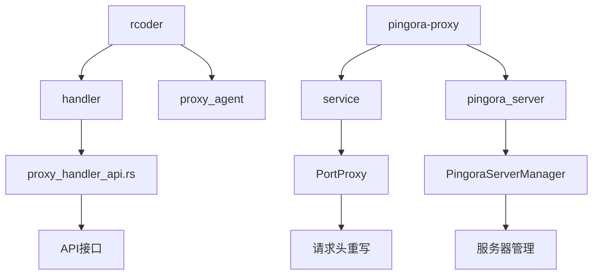
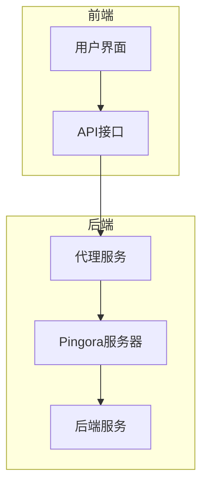
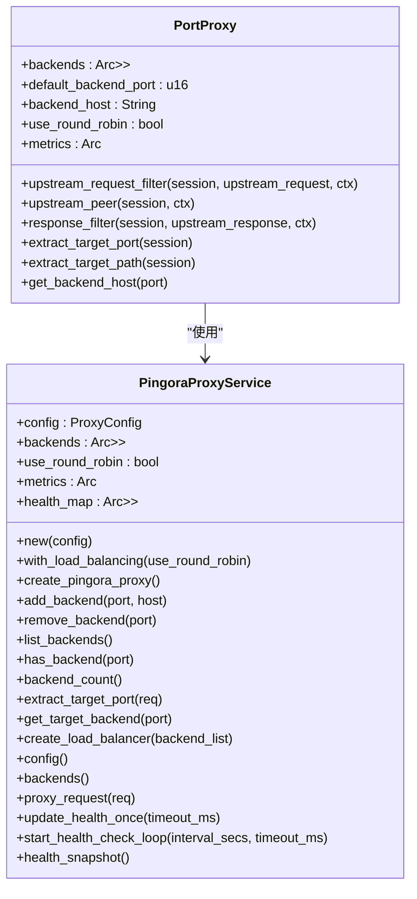
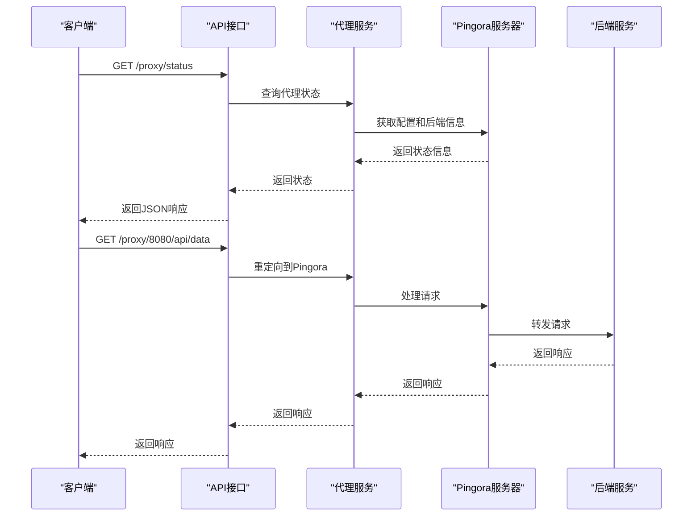
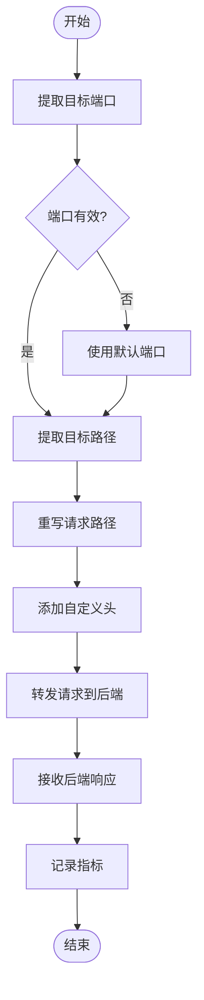
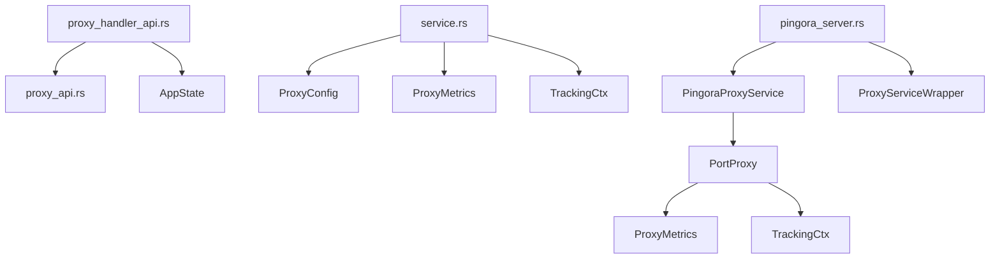

# 请求头重写策略

<cite>
**本文档引用的文件**   
- [proxy_handler_api.rs](file://crates/rcoder/src/handler/proxy_handler_api.rs)
- [proxy_api.rs](file://crates/rcoder/src/handler/proxy_api.rs)
- [service.rs](file://crates/pingora-proxy/src/service.rs)
- [pingora_server.rs](file://crates/pingora-proxy/src/pingora_server.rs)
</cite>

## 目录
1. [引言](#引言)
2. [项目结构](#项目结构)
3. [核心组件](#核心组件)
4. [架构概述](#架构概述)
5. [详细组件分析](#详细组件分析)
6. [依赖分析](#依赖分析)
7. [性能考虑](#性能考虑)
8. [故障排除指南](#故障排除指南)
9. [结论](#结论)

## 引言
本文档系统性地文档化了 `proxy_handler_api.rs` 中实现的请求头与响应头重写功能，包括 Host 头替换、X-Forwarded-* 系列头注入、TLS 终止标识传递等标准行为。说明了自定义头修改的配置接口及其安全限制，提供了典型配置示例，如添加认证令牌或移除敏感头信息。讨论了头重写对后端服务可见性的影响及调试方法。

## 项目结构
本项目采用模块化设计，主要分为以下几个核心模块：
- `crates/rcoder/src/handler/`：包含代理相关的 API 处理函数
- `crates/pingora-proxy/src/`：基于 Pingora 实现的高性能反向代理服务
- `crates/pingora-proxy/src/service.rs`：核心代理逻辑和服务管理
- `crates/pingora-proxy/src/pingora_server.rs`：Pingora 服务器启动和管理

**图示来源**
- [proxy_handler_api.rs](file://crates/rcoder/src/handler/proxy_handler_api.rs)
- [service.rs](file://crates/pingora-proxy/src/service.rs)
- [pingora_server.rs](file://crates/pingora-proxy/src/pingora_server.rs)

**本节来源**
- [proxy_handler_api.rs](file://crates/rcoder/src/handler/proxy_handler_api.rs)
- [service.rs](file://crates/pingora-proxy/src/service.rs)

## 核心组件
核心组件主要包括：
- `proxy_handler_api.rs`：提供 Pingora 代理相关的 API 接口，主要用于文档展示和状态查询。
- `service.rs`：实现基于 Pingora 的端口反向代理服务，支持负载均衡。
- `pingora_server.rs`：提供基于 Pingora 库的完整反向代理服务器启动功能。

**本节来源**
- [proxy_handler_api.rs](file://crates/rcoder/src/handler/proxy_handler_api.rs)
- [service.rs](file://crates/pingora-proxy/src/service.rs)
- [pingora_server.rs](file://crates/pingora-proxy/src/pingora_server.rs)

## 架构概述
系统架构采用分层设计，前端通过 API 接口与后端代理服务交互，后端代理服务通过 Pingora 实现高性能反向代理。

**图示来源**
- [proxy_handler_api.rs](file://crates/rcoder/src/handler/proxy_handler_api.rs)
- [service.rs](file://crates/pingora-proxy/src/service.rs)
- [pingora_server.rs](file://crates/pingora-proxy/src/pingora_server.rs)

## 详细组件分析
### 请求头重写分析
#### 对象导向组件

**图示来源**
- [service.rs](file://crates/pingora-proxy/src/service.rs)

#### API/服务组件

**图示来源**
- [proxy_handler_api.rs](file://crates/rcoder/src/handler/proxy_handler_api.rs)
- [service.rs](file://crates/pingora-proxy/src/service.rs)
- [pingora_server.rs](file://crates/pingora-proxy/src/pingora_server.rs)

#### 复杂逻辑组件

**图示来源**
- [service.rs](file://crates/pingora-proxy/src/service.rs)

**本节来源**
- [proxy_handler_api.rs](file://crates/rcoder/src/handler/proxy_handler_api.rs)
- [service.rs](file://crates/pingora-proxy/src/service.rs)
- [pingora_server.rs](file://crates/pingora-proxy/src/pingora_server.rs)

## 依赖分析
系统依赖关系如下：

**图示来源**
- [proxy_handler_api.rs](file://crates/rcoder/src/handler/proxy_handler_api.rs)
- [service.rs](file://crates/pingora-proxy/src/service.rs)
- [pingora_server.rs](file://crates/pingora-proxy/src/pingora_server.rs)

**本节来源**
- [proxy_handler_api.rs](file://crates/rcoder/src/handler/proxy_handler_api.rs)
- [service.rs](file://crates/pingora-proxy/src/service.rs)
- [pingora_server.rs](file://crates/pingora-proxy/src/pingora_server.rs)

## 性能考虑
- 使用 `Arc<RwLock<HashMap<u16, String>>>` 实现线程安全的后端映射
- 通过 `AtomicU64` 实现高性能的指标统计
- 采用异步处理避免阻塞
- 使用 `Pingora` 库实现高性能反向代理

## 故障排除指南
- 检查代理服务是否启用
- 验证后端服务是否可达
- 检查端口配置是否正确
- 查看日志信息定位问题

**本节来源**
- [proxy_handler_api.rs](file://crates/rcoder/src/handler/proxy_handler_api.rs)
- [service.rs](file://crates/pingora-proxy/src/service.rs)

## 结论
本文档详细介绍了 `proxy_handler_api.rs` 中实现的请求头与响应头重写功能，包括 Host 头替换、X-Forwarded-* 系列头注入、TLS 终止标识传递等标准行为。说明了自定义头修改的配置接口及其安全限制，提供了典型配置示例，如添加认证令牌或移除敏感头信息。讨论了头重写对后端服务可见性的影响及调试方法。