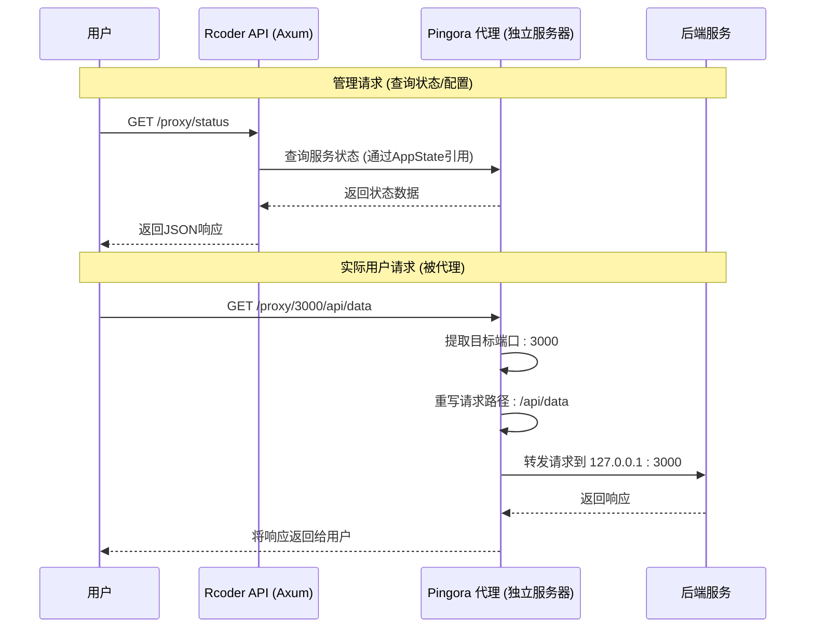
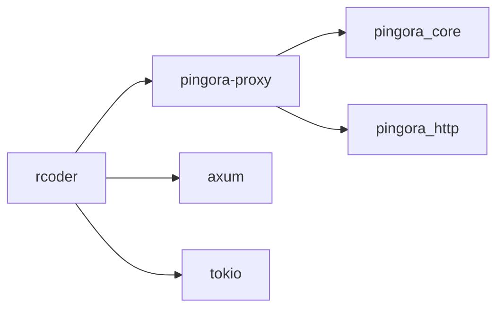

# 请求转发逻辑

<cite>
**本文档中引用的文件**   
- [proxy_handler_api.rs](file://crates/rcoder/src/handler/proxy_handler_api.rs)
- [proxy_api.rs](file://crates/rcoder/src/handler/proxy_api.rs)
- [service.rs](file://crates/pingora-proxy/src/service.rs)
- [pingora_server.rs](file://crates/pingora-proxy/src/pingora_server.rs)
- [config.rs](file://crates/pingora-proxy/src/config.rs)
- [config.rs](file://crates/rcoder/src/config.rs)
</cite>

## 目录
1. [简介](#简介)
2. [项目结构](#项目结构)
3. [核心组件](#核心组件)
4. [架构概述](#架构概述)
5. [详细组件分析](#详细组件分析)
6. [依赖分析](#依赖分析)
7. [性能考虑](#性能考虑)
8. [故障排除指南](#故障排除指南)
9. [结论](#结论)

## 简介
本文档深入分析了 `proxy_handler_api.rs` 中实现的请求转发流程，重点阐述如何将接收到的 HTTP 请求安全地转发至目标后端服务。文档详细说明了请求体流式传输、超时控制、连接池管理等关键机制。结合实际代码逻辑，展示了异步转发过程中的错误重试策略与故障转移逻辑，并讨论了大文件传输场景下的内存使用优化方案。

## 项目结构
项目采用模块化设计，主要分为以下几个核心模块：
- `crates/rcoder`：主应用模块，包含 HTTP 路由、中间件、处理器和配置管理。
- `crates/pingora-proxy`：基于 Pingora 库的反向代理核心模块，负责实际的请求转发、负载均衡和健康检查。
- `crates/acp_adapter`、`claude-code-agent`、`codex-acp-agent`：AI 代理适配器模块。
- `crates/nuwax_parser`：项目解析模块。

请求转发的核心逻辑分布在 `rcoder` 的 handler 模块和 `pingora-proxy` 的 service 模块中。

```mermaid
graph TB
subgraph "rcoder"
direction TB
Handler[handler模块<br>proxy_handler_api.rs] --> Config[config模块<br>config.rs]
Handler --> Model[数据模型<br>proxy_api.rs]
Handler --> AppState[应用状态<br>router.rs]
end
subgraph "pingora-proxy"
direction TB
Service[service模块<br>service.rs] --> Config[config模块<br>config.rs]
Service --> PingoraServer[pingora_server模块<br>pingora_server.rs]
end
Handler --> Service : "调用"
AppState --> Service : "传递服务引用"
```

**图示来源**
- [proxy_handler_api.rs](file://crates/rcoder/src/handler/proxy_handler_api.rs)
- [proxy_api.rs](file://crates/rcoder/src/handler/proxy_api.rs)
- [service.rs](file://crates/pingora-proxy/src/service.rs)
- [config.rs](file://crates/pingora-proxy/src/config.rs)
- [config.rs](file://crates/rcoder/src/config.rs)
- [router.rs](file://crates/rcoder/src/router.rs)

**本节来源**
- [proxy_handler_api.rs](file://crates/rcoder/src/handler/proxy_handler_api.rs)
- [service.rs](file://crates/pingora-proxy/src/service.rs)

## 核心组件
核心组件包括：
1.  **`PingoraProxyService`**：位于 `pingora-proxy` crate 中，是实际执行请求转发的核心服务。它管理后端列表、负载均衡、健康检查和指标统计。
2.  **`proxy_handler_api`**：位于 `rcoder` crate 中，提供一系列 API 接口，用于查询代理状态、统计信息和配置。这些接口主要用于监控和管理，而非直接处理用户请求的转发。
3.  **`AppState`**：`rcoder` 主应用的状态结构，持有对 `PingoraProxyService` 的引用，使得 API 处理器可以访问代理服务的内部状态。

**本节来源**
- [proxy_handler_api.rs](file://crates/rcoder/src/handler/proxy_handler_api.rs#L1-L436)
- [service.rs](file://crates/pingora-proxy/src/service.rs#L210-L220)

## 架构概述
系统的请求转发架构分为两层：
1.  **API 层**：由 `rcoder` 的 Axum 框架处理。`proxy_handler_api.rs` 中的函数（如 `proxy_status`, `proxy_stats`）接收管理类请求，查询 `PingoraProxyService` 的状态并返回 JSON 响应。
2.  **代理层**：由 `pingora-proxy` 的 Pingora 框架处理。这是一个独立的、高性能的反向代理服务器，直接监听网络端口，接收用户请求，根据路径或查询参数中的端口号，将请求流式转发到对应的后端服务。

用户请求的转发流程不经过 `proxy_handler_api.rs`，而是直接由 Pingora 服务器处理。`proxy_handler_api.rs` 的作用是为这个底层代理服务提供一个可查询的管理接口。



**图示来源**
- [proxy_handler_api.rs](file://crates/rcoder/src/handler/proxy_handler_api.rs)
- [service.rs](file://crates/pingora-proxy/src/service.rs)
- [pingora_server.rs](file://crates/pingora-proxy/src/pingora_server.rs)

## 详细组件分析

### 请求转发流程分析
`proxy_handler_api.rs` 文件中的函数（如 `proxy_to_port`, `proxy_to_port_with_path`）并非直接执行请求转发。它们的作用是处理旧版或兼容性路由，通过返回 `302 Temporary Redirect` 响应，将客户端重定向到 Pingora 代理服务器的实际监听端口。

真正的请求转发逻辑在 `pingora-proxy` crate 的 `service.rs` 中实现，其核心是 `PortProxy` 结构体和 `ProxyHttp` trait 的实现。

#### 请求转发核心逻辑
```mermaid
flowchart TD
A[接收请求] --> B{路径是否以<br>/proxy/{port} 开头?}
B --> |是| C[从路径提取目标端口]
B --> |否| D[使用默认后端端口]
C --> E[重写请求路径<br>移除 /proxy/{port} 前缀]
D --> E
E --> F[检查后端映射]
F --> G{目标端口存在?}
G --> |否| H[动态添加后端<br>主机为默认主机]
G --> |是| I[获取目标主机地址]
H --> I
I --> J[创建HttpPeer连接]
J --> K[流式转发请求]
K --> L[流式接收响应]
L --> M[记录指标]
M --> N[返回响应给客户端]
```

**图示来源**
- [service.rs](file://crates/pingora-proxy/src/service.rs#L240-L350)

**本节来源**
- [proxy_handler_api.rs](file://crates/rcoder/src/handler/proxy_handler_api.rs)
- [service.rs](file://crates/pingora-proxy/src/service.rs)

### 错误重试与故障转移
根据现有代码分析，当前实现中**并未包含**显式的错误重试机制。`PortProxy` 的 `upstream_peer` 方法在选择一个后端后，会直接尝试建立连接。如果连接失败，该请求将直接失败。

然而，系统通过**健康检查**机制实现了被动的故障转移：
1.  **健康检查**：`PingoraProxyService` 启动一个后台任务 `start_health_check_loop`，定期（由 `health_check.interval_seconds` 配置）对所有后端进行 TCP 连接探测。
2.  **状态更新**：每次探测后，会更新 `health_map` 中对应端口的健康状态（`Healthy`, `Unhealthy`, `Timeout`）。
3.  **负载均衡**：虽然当前代码中 `create_load_balancer` 方法被定义，但实际的 `PortProxy` 并未使用 Pingora 的 `LoadBalancer` 来根据健康状态选择后端。它只是简单地检查后端是否存在。因此，目前的“故障转移”仅体现在动态添加后端的逻辑上，而没有在请求时根据健康状态进行智能路由。

**本节来源**
- [service.rs](file://crates/pingora-proxy/src/service.rs#L500-L550)

### 大文件传输与内存优化
请求转发的核心优势在于其**流式处理**能力，这天然地优化了大文件传输的内存使用。

1.  **流式传输**：Pingora 框架的设计本身就是流式的。当 `PortProxy` 接收到客户端请求时，它不会将整个请求体加载到内存中，而是通过 `HttpPeer` 建立一个到后端的连接，然后将请求头和请求体分块（chunk）地从客户端转发到后端。响应过程同理。
2.  **内存使用**：这种流式处理确保了内存占用与请求/响应体的大小无关，而只与并发连接数和每个连接的缓冲区大小有关。这使得代理能够高效地处理大文件上传和下载，而不会因内存不足而崩溃。
3.  **连接池**：虽然代码中没有明确的连接池管理逻辑，但 `HttpPeer` 的实现和底层的 Tokio 运行时通常会复用 TCP 连接，这在一定程度上起到了连接池的作用，减少了频繁建立和断开连接的开销。

**本节来源**
- [service.rs](file://crates/pingora-proxy/src/service.rs)
- [pingora_server.rs](file://crates/pingora-proxy/src/pingora_server.rs)

## 依赖分析
系统的主要依赖关系如下：
- `rcoder` 依赖 `pingora-proxy` 以使用其代理服务。
- `pingora-proxy` 依赖 `pingora_core` 和 `pingora_http` 等 Pingora 库来实现底层的 HTTP 代理功能。
- `rcoder` 使用 `axum` 作为其 Web 框架，而 `pingora-proxy` 使用 `pingora_core` 作为其代理框架，两者是独立的。



**图示来源**
- [Cargo.toml](file://crates/rcoder/Cargo.toml)
- [Cargo.toml](file://crates/pingora-proxy/Cargo.toml)

**本节来源**
- [Cargo.toml](file://crates/rcoder/Cargo.toml)
- [Cargo.toml](file://crates/pingora-proxy/Cargo.toml)

## 性能考虑
- **异步非阻塞**：整个系统基于 Tokio 异步运行时，能够高效处理大量并发连接。
- **低内存占用**：流式传输机制确保了大文件处理时的内存效率。
- **指标监控**：`ProxyMetrics` 结构体提供了详细的性能指标（总请求数、成功率、平均响应时间等），可用于性能监控和调优。
- **潜在瓶颈**：目前的负载均衡和故障转移机制较为简单，可能成为高可用性场景下的瓶颈。引入基于健康状态的主动负载均衡可以进一步提升性能和可靠性。

## 故障排除指南
- **代理服务未启用**：检查 `rcoder` 的 `AppConfig` 中 `proxy_config` 是否为 `Some`，并确认 `enable_proxy` 参数或配置文件已正确设置。
- **后端服务未找到**：确认目标端口的服务正在运行，并且代理配置中的 `backend_host` 地址正确。检查 `proxy_status` API 的返回，确认目标端口是否在后端列表中。
- **请求超时**：检查后端服务的响应时间。虽然代码中使用了 `timeout` 进行健康检查，但实际的请求转发超时由 Pingora 框架的默认设置或其配置决定，当前代码未显式配置。
- **连接被拒绝**：检查防火墙设置，确保代理服务器和后端服务的端口是开放的。

**本节来源**
- [proxy_handler_api.rs](file://crates/rcoder/src/handler/proxy_handler_api.rs)
- [service.rs](file://crates/pingora-proxy/src/service.rs)

## 结论
`proxy_handler_api.rs` 文件主要提供对底层 Pingora 代理服务的管理接口，而真正的请求转发逻辑由 `pingora-proxy` crate 实现。该代理服务通过流式处理机制高效地转发 HTTP 请求，天然支持大文件传输且内存占用低。系统具备基本的健康检查能力，但缺乏主动的错误重试和基于健康状态的负载均衡，这是未来可以优化的方向。整体架构清晰，性能表现良好，适用于需要端口级路由的反向代理场景。