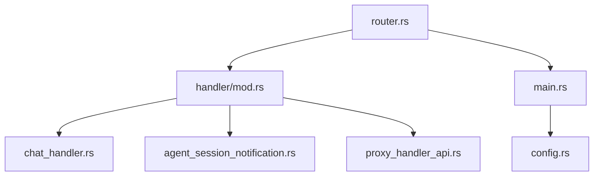
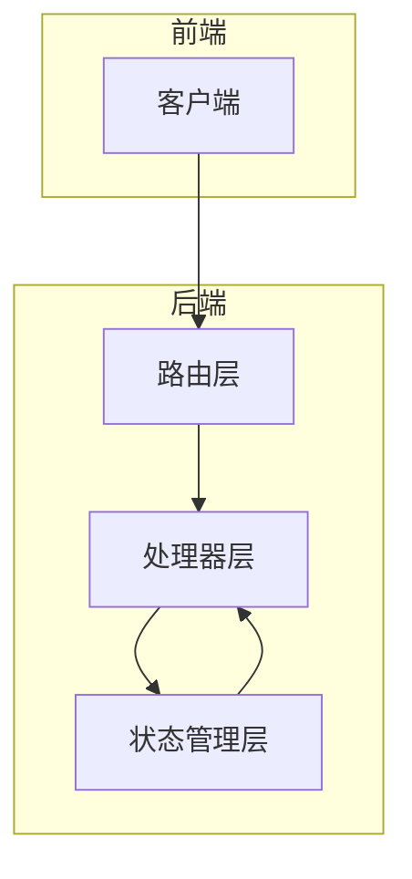
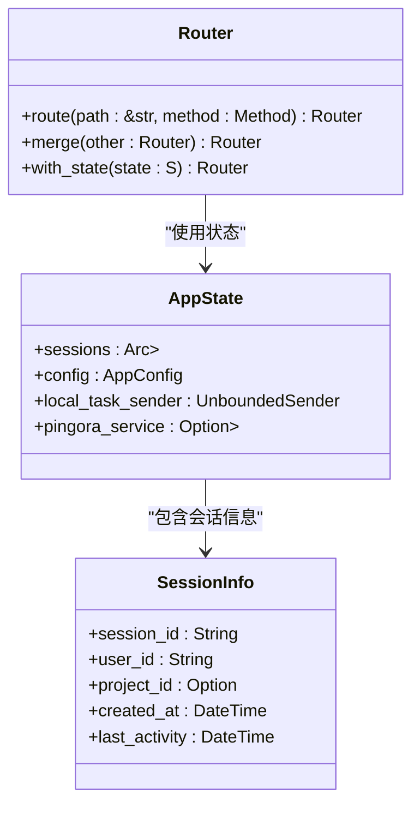
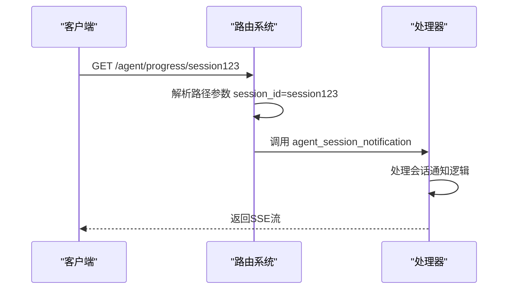
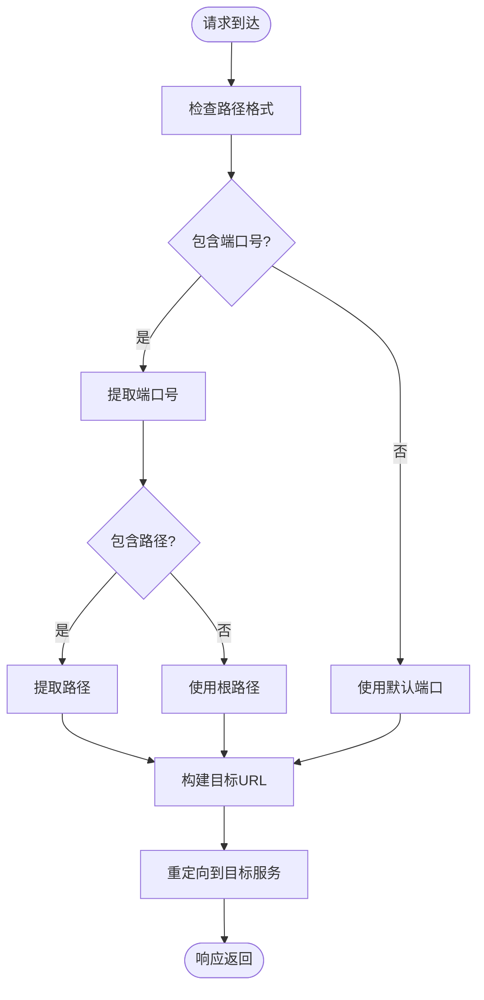
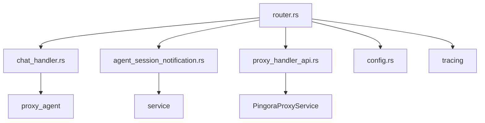

# 路由匹配机制

<cite>
**本文档引用的文件**
- [router.rs](file://crates/rcoder/src/router.rs)
- [handler/mod.rs](file://crates/rcoder/src/handler/mod.rs)
- [chat_handler.rs](file://crates/rcoder/src/handler/chat_handler.rs)
- [agent_session_notification.rs](file://crates/rcoder/src/handler/agent_session_notification.rs)
- [proxy_handler_api.rs](file://crates/rcoder/src/handler/proxy_handler_api.rs)
- [main.rs](file://crates/rcoder/src/main.rs)
</cite>

## 目录
1. [项目结构](#项目结构)
2. [核心组件](#核心组件)
3. [架构概述](#架构概述)
4. [详细组件分析](#详细组件分析)
5. [依赖分析](#依赖分析)
6. [性能考虑](#性能考虑)
7. [故障排除指南](#故障排除指南)
8. [结论](#结论)

## 项目结构

本项目采用模块化设计，主要功能集中在 `crates/rcoder` 目录下。核心路由功能由 `router.rs` 文件实现，该文件通过 Axum 框架定义了 API 路由规则。处理器逻辑分布在 `handler` 模块中，包括健康检查、聊天处理、代理API等。应用状态通过 `AppState` 结构体管理，包含会话信息、配置和任务发送器等。

**图示来源**
- [router.rs](file://crates/rcoder/src/router.rs#L1-L202)
- [handler/mod.rs](file://crates/rcoder/src/handler/mod.rs#L1-L16)

**本节来源**
- [router.rs](file://crates/rcoder/src/router.rs#L1-L202)
- [handler/mod.rs](file://crates/rcoder/src/handler/mod.rs#L1-L16)

## 核心组件

`router.rs` 文件中的 `create_router` 函数是路由系统的核心，它创建并合并多个路由组。路由系统基于 Axum 框架，支持路径前缀、HTTP方法和动态参数的多维匹配。`AppState` 结构体作为共享状态，包含会话管理、配置信息和任务通道等关键数据。Swagger UI 集成提供了API文档功能，通过 `create_swagger_ui` 函数实现。

**本节来源**
- [router.rs](file://crates/rcoder/src/router.rs#L39-L70)
- [router.rs](file://crates/rcoder/src/router.rs#L24-L37)

## 架构概述

系统采用分层架构设计，前端通过HTTP请求与后端交互。路由层负责请求分发，将不同路径的请求导向相应的处理器。处理器层实现具体业务逻辑，如聊天处理、会话通知和代理功能。状态管理层通过 `AppState` 统一管理应用状态，确保数据一致性。整个系统基于异步I/O模型，利用Tokio运行时实现高并发处理能力。

**图示来源**
- [router.rs](file://crates/rcoder/src/router.rs#L39-L70)
- [main.rs](file://crates/rcoder/src/main.rs#L1-L220)

## 详细组件分析

### 路由注册与匹配机制分析

#### 路由表数据结构设计

**图示来源**
- [router.rs](file://crates/rcoder/src/router.rs#L39-L70)
- [router.rs](file://crates/rcoder/src/router.rs#L24-L37)

#### 动态参数提取实现

**图示来源**
- [router.rs](file://crates/rcoder/src/router.rs#L39-L70)
- [agent_session_notification.rs](file://crates/rcoder/src/handler/agent_session_notification.rs#L1-L438)

#### 通配符路由实现

**图示来源**
- [router.rs](file://crates/rcoder/src/router.rs#L39-L70)
- [proxy_handler_api.rs](file://crates/rcoder/src/handler/proxy_handler_api.rs#L1-L436)

**本节来源**
- [router.rs](file://crates/rcoder/src/router.rs#L39-L70)
- [agent_session_notification.rs](file://crates/rcoder/src/handler/agent_session_notification.rs#L1-L438)
- [proxy_handler_api.rs](file://crates/rcoder/src/handler/proxy_handler_api.rs#L1-L436)

## 依赖分析

系统依赖关系清晰，`router.rs` 依赖 `handler` 模块中的各个处理器函数。`AppState` 作为共享状态，被所有处理器共享。配置系统通过 `config.rs` 提供，支持命令行参数、环境变量和配置文件的多级覆盖。日志系统使用 `tracing` 库，支持结构化日志输出和OpenTelemetry集成。

**图示来源**
- [router.rs](file://crates/rcoder/src/router.rs#L1-L202)
- [main.rs](file://crates/rcoder/src/main.rs#L1-L220)

**本节来源**
- [router.rs](file://crates/rcoder/src/router.rs#L1-L202)
- [main.rs](file://crates/rcoder/src/main.rs#L1-L220)

## 性能考虑

路由系统设计考虑了性能优化，使用 `DashMap` 实现高效的会话管理，支持高并发访问。SSE（Server-Sent Events）用于实时推送会话更新，减少客户端轮询开销。代理功能通过Pingora实现高性能反向代理，支持负载均衡和健康检查。异步任务通过 `mpsc` 通道传递，避免阻塞主线程。

## 故障排除指南

当路由匹配失败时，系统会返回相应的错误码。404错误表示路径未找到，500错误表示服务器内部错误。对于SSE连接问题，检查会话ID是否有效。代理功能异常时，验证目标端口和服务是否可达。日志系统提供详细的请求处理信息，可通过 `tracing` 日志定位问题。

**本节来源**
- [router.rs](file://crates/rcoder/src/router.rs#L39-L70)
- [agent_session_notification.rs](file://crates/rcoder/src/handler/agent_session_notification.rs#L1-L438)

## 结论

本系统基于Axum框架实现了灵活的路由匹配机制，支持多维路由规则和动态参数提取。通过合理的架构设计和性能优化，系统能够高效处理各种API请求。Swagger UI集成提供了完善的API文档，便于开发者使用和调试。整体设计考虑了可扩展性和维护性，为后续功能迭代奠定了良好基础。