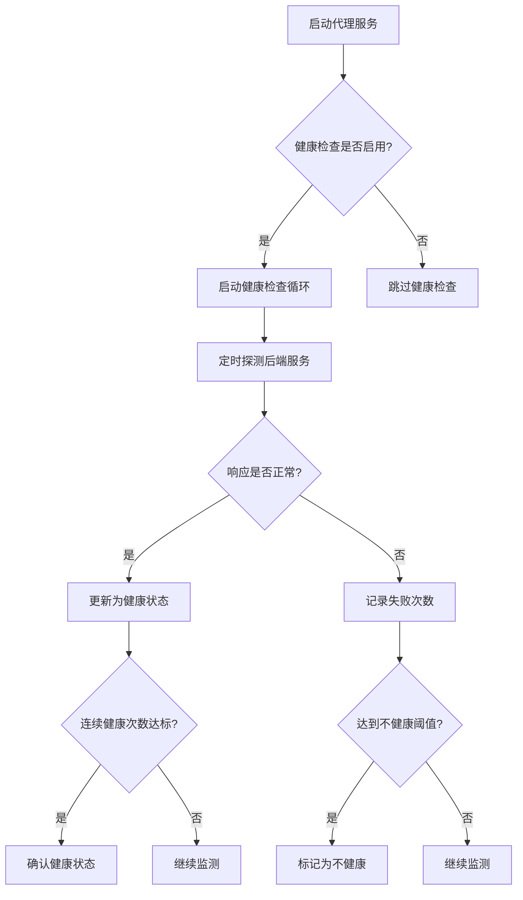
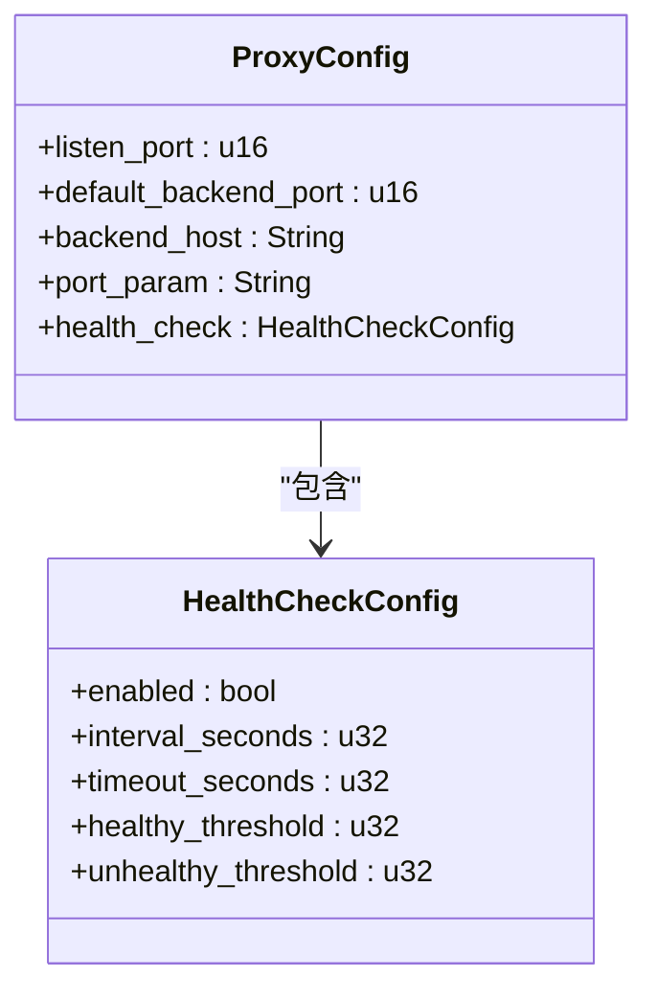
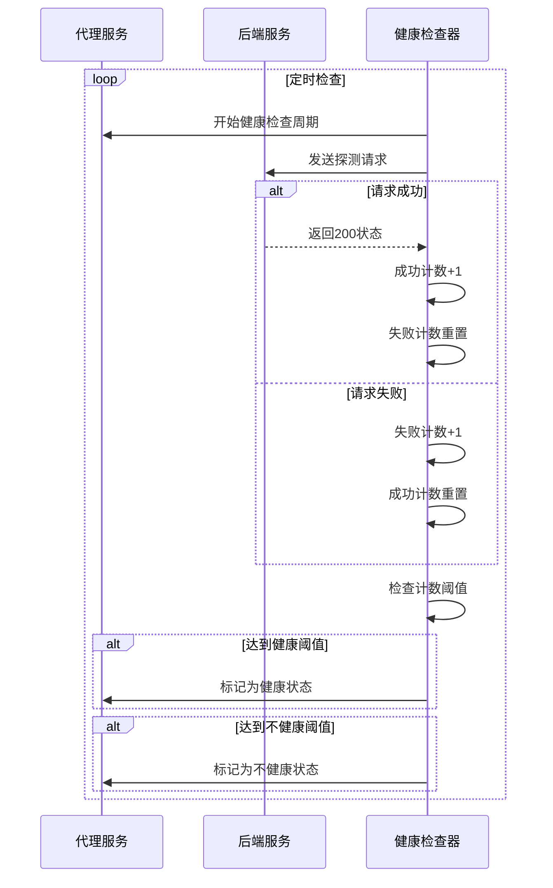
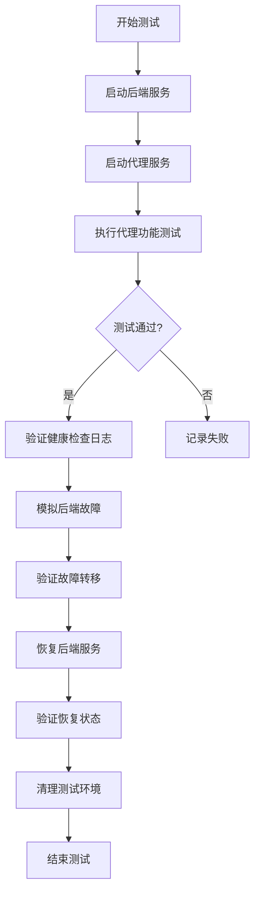

# 健康检查机制

<cite>
**本文档引用的文件**
- [config.rs](file://crates/rcoder/src/config.rs)
- [proxy_api.rs](file://crates/rcoder/src/handler/proxy_api.rs)
- [proxy_handler_api.rs](file://crates/rcoder/src/handler/proxy_handler_api.rs)
- [main.rs](file://crates/rcoder/src/main.rs)
- [tests.rs](file://crates/pingora-proxy/src/tests.rs)
- [test_proxy.sh](file://test_proxy.sh)
</cite>

## 目录
1. [引言](#引言)
2. [健康检查机制设计](#健康检查机制设计)
3. [配置参数说明](#配置参数说明)
4. [健康检查触发与状态更新逻辑](#健康检查触发与状态更新逻辑)
5. [端到端验证流程](#端到端验证流程)
6. [测试用例分析](#测试用例分析)
7. [最佳实践建议](#最佳实践建议)

## 引言
本文档全面记录了RCoder系统中健康检查机制的设计与验证方法。该机制通过定期探测后端服务状态，实现故障自动转移，确保代理服务的高可用性。文档详细分析了健康检查的触发条件、响应判断逻辑和状态更新机制，并结合端到端测试脚本展示了完整的验证流程。

## 健康检查机制设计
健康检查机制是RCoder代理服务高可用性的核心组件。系统通过定期向后端服务发送探测请求，评估其健康状态，并根据结果动态调整流量分配。

该机制在`main.rs`中初始化，当代理配置启用健康检查时，会调用`start_health_check_loop`方法启动健康检查循环。健康状态信息存储在`PingoraProxyService`结构体的`health_map`字段中，这是一个线程安全的哈希映射，记录每个后端端口的健康信息。

**Diagram sources**
- [main.rs](file://crates/rcoder/src/main.rs#L76-L102)
- [service.rs](file://crates/pingora-proxy/src/service.rs#L210-L220)

**Section sources**
- [main.rs](file://crates/rcoder/src/main.rs#L76-L102)
- [service.rs](file://crates/pingora-proxy/src/service.rs#L210-L220)

## 配置参数说明
健康检查机制通过一系列配置参数进行控制，这些参数在`HealthCheckConfig`结构体中定义，允许用户根据实际需求进行调整。

| 参数 | 说明 | 示例值 | 默认值 |
|------|------|--------|--------|
| enabled | 是否启用健康检查 | true/false | true |
| interval_seconds | 检查间隔（秒） | 5 | 5 |
| timeout_seconds | 请求超时时间（秒） | 3 | 3 |
| healthy_threshold | 健康阈值 | 2 | 2 |
| unhealthy_threshold | 不健康阈值 | 3 | 3 |

这些配置参数在系统启动时从配置文件加载，并传递给Pingora代理服务。配置结构在`config.rs`和`proxy_api.rs`中定义，确保了配置的一致性和可序列化性。

**Diagram sources**
- [config.rs](file://crates/rcoder/src/config.rs#L50-L57)
- [proxy_api.rs](file://crates/rcoder/src/handler/proxy_api.rs#L175-L193)

**Section sources**
- [config.rs](file://crates/rcoder/src/config.rs#L50-L57)
- [proxy_api.rs](file://crates/rcoder/src/handler/proxy_api.rs#L175-L193)

## 健康检查触发与状态更新逻辑
健康检查的触发和状态更新遵循严格的逻辑流程。系统根据配置的间隔时间定期发起健康探测，通过累积成功和失败的探测结果来决定后端服务的最终状态。

当健康检查启用时，系统会启动一个异步循环，按照`interval_seconds`指定的时间间隔定期执行健康检查。每次检查都会设置`timeout_seconds`的超时限制，防止因后端响应缓慢而阻塞整个代理服务。

状态更新机制采用双阈值设计：
- **健康阈值（healthy_threshold）**：连续成功探测次数达到此值时，将后端标记为健康状态
- **不健康阈值（unhealthy_threshold）**：连续失败探测次数达到此值时，将后端标记为不健康状态

这种设计避免了因网络抖动导致的误判，提高了系统的稳定性。状态信息存储在`health_map`中，供负载均衡器在路由决策时参考。

**Diagram sources**
- [main.rs](file://crates/rcoder/src/main.rs#L76-L102)
- [service.rs](file://crates/pingora-proxy/src/service.rs#L210-L220)

**Section sources**
- [main.rs](file://crates/rcoder/src/main.rs#L76-L102)
- [service.rs](file://crates/pingora-proxy/src/service.rs#L210-L220)

## 端到端验证流程
系统提供了`test_proxy.sh`脚本，用于验证健康检查机制的端到端功能。该脚本模拟了完整的测试场景，包括后端服务的启动、代理服务的配置和健康检查行为的验证。

测试流程如下：
1. 启动两个Python HTTP服务器作为后端服务（端口3000和3001）
2. 启动RCoder代理服务，配置健康检查参数
3. 通过curl命令向代理发送请求，验证流量是否正确路由
4. 模拟后端服务故障，观察健康检查是否能正确检测并转移流量
5. 恢复后端服务，验证健康检查是否能正确识别恢复状态

脚本通过检查代理日志和响应内容来验证健康检查机制的正确性。测试完成后，脚本会自动清理所有测试进程，确保测试环境的整洁。

**Diagram sources**
- [test_proxy.sh](file://test_proxy.sh#L0-L89)

**Section sources**
- [test_proxy.sh](file://test_proxy.sh#L0-L89)

## 测试用例分析
`tests.rs`文件中包含了多个与健康检查相关的单元测试用例，这些测试验证了健康检查机制的核心功能。

虽然`tests.rs`中的测试主要集中在代理服务的基础功能上，但其中的`test_concurrent_backend_operations`测试间接验证了健康检查所需的基础组件。该测试验证了后端管理的并发操作能力，这是健康检查机制正常工作的前提。

其他相关测试包括：
- `test_config_validation`：验证配置参数的正确性，确保健康检查配置的有效性
- `test_service_backend_management`：验证后端服务的增删改查功能
- `test_edge_cases`：验证边界条件下的系统行为，提高健康检查的鲁棒性

这些测试共同确保了健康检查机制所依赖的基础组件的可靠性。

**Section sources**
- [tests.rs](file://crates/pingora-proxy/src/tests.rs#L0-L398)

## 最佳实践建议
为了确保健康检查机制的有效性和稳定性，建议遵循以下最佳实践：

### 配置参数设置建议
- **检查间隔（interval_seconds）**：生产环境建议设置为5-10秒，平衡检测灵敏度和系统开销
- **超时时间（timeout_seconds）**：建议设置为检查间隔的30%-50%，避免因网络延迟导致误判
- **健康阈值（healthy_threshold）**：建议设置为2-3次，避免短暂波动导致状态误判
- **不健康阈值（unhealthy_threshold）**：建议设置为3-5次，防止网络抖动导致不必要的故障转移

### 监控与告警
- 配置日志监控，及时发现健康检查异常
- 设置健康状态变更告警，便于运维人员及时响应
- 定期检查健康检查日志，分析后端服务的稳定性趋势

### 性能考虑
- 避免过于频繁的健康检查，防止对后端服务造成过大压力
- 在大规模部署场景下，考虑分片健康检查策略
- 监控健康检查自身的资源消耗，确保不会成为性能瓶颈

合理配置健康检查参数，可以有效提高系统的可用性和稳定性，同时避免不必要的资源浪费。

**Section sources**
- [config.rs](file://crates/rcoder/src/config.rs#L50-L57)
- [proxy_api.rs](file://crates/rcoder/src/handler/proxy_api.rs#L175-L193)
- [main.rs](file://crates/rcoder/src/main.rs#L76-L102)