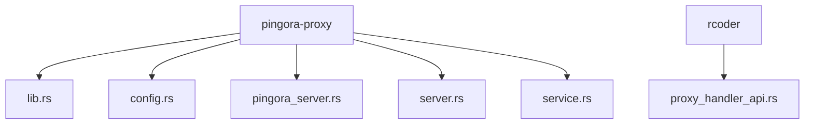
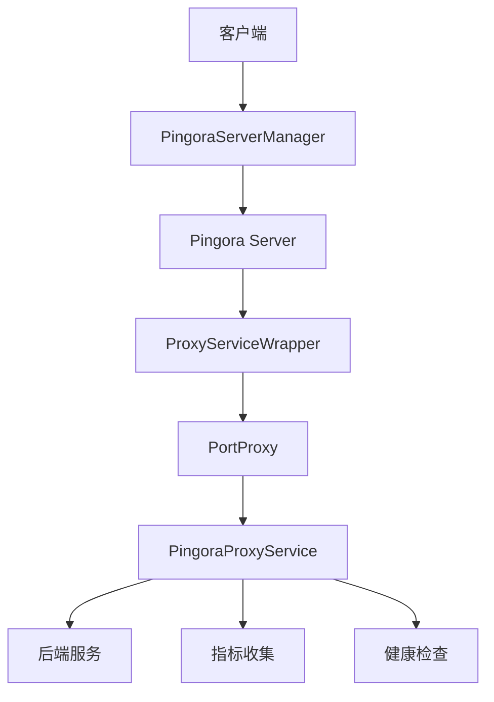
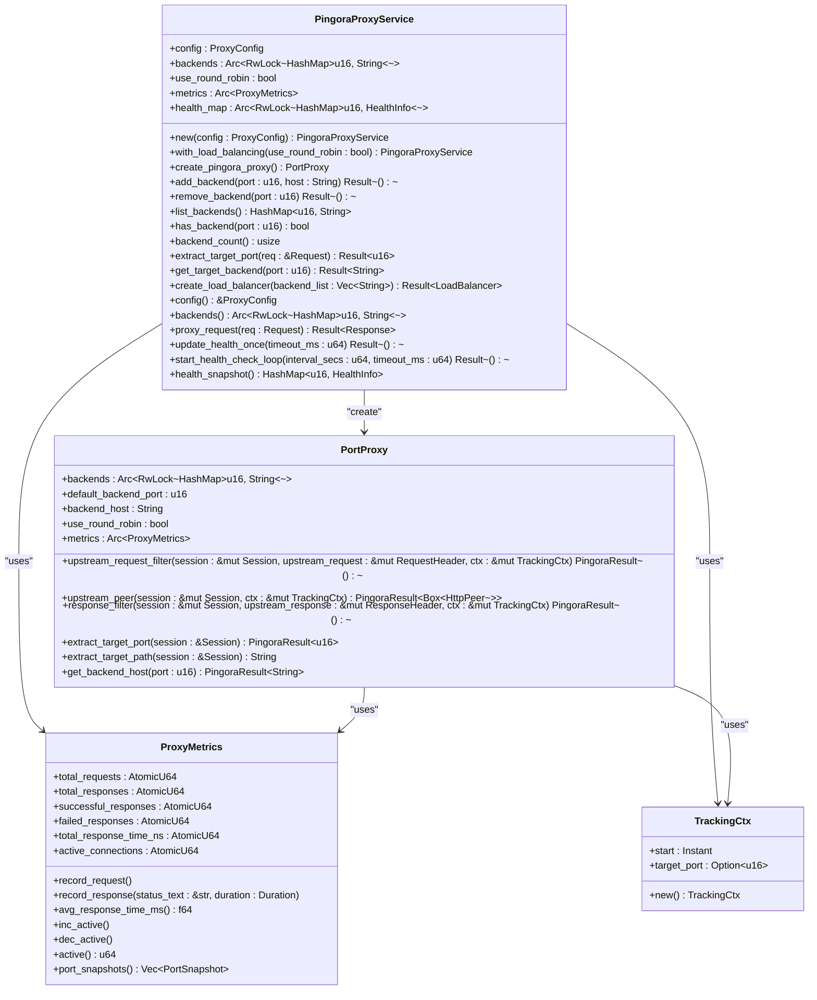
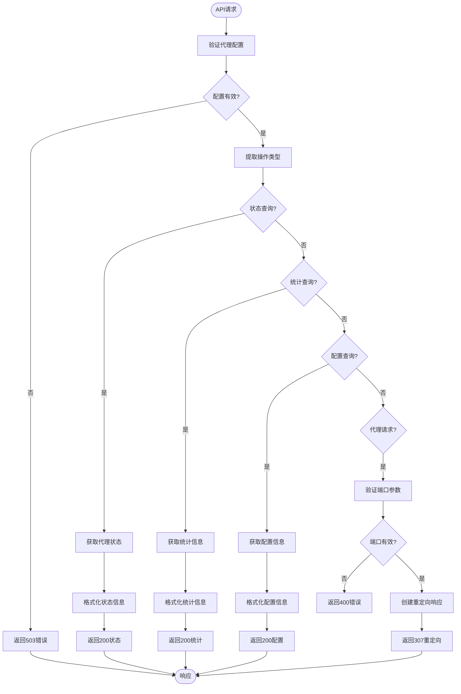
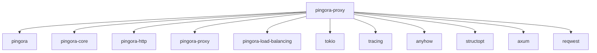

# 反向代理集成

<cite>
**本文档引用的文件**
- [lib.rs](file://crates/pingora-proxy/src/lib.rs)
- [config.rs](file://crates/pingora-proxy/src/config.rs)
- [pingora_server.rs](file://crates/pingora-proxy/src/pingora_server.rs)
- [server.rs](file://crates/pingora-proxy/src/server.rs)
- [service.rs](file://crates/pingora-proxy/src/service.rs)
- [proxy_handler_api.rs](file://crates/rcoder/src/handler/proxy_handler_api.rs)
- [Cargo.toml](file://crates/pingora-proxy/Cargo.toml)
</cite>

## 目录
1. [简介](#简介)
2. [项目结构](#项目结构)
3. [核心组件](#核心组件)
4. [架构概述](#架构概述)
5. [详细组件分析](#详细组件分析)
6. [依赖分析](#依赖分析)
7. [性能考虑](#性能考虑)
8. [故障排除指南](#故障排除指南)
9. [结论](#结论)

## 简介
本文档详细描述了基于Pingora引擎的高性能反向代理实现。该系统通过`pingora-proxy` crate封装底层网络操作，支持端口路由、负载均衡和健康检查等关键功能。文档将深入分析`proxy_handler_api.rs`中HTTP请求如何被转发至后端服务，以及如何处理响应流和错误传播。同时讨论与主应用的安全隔离机制，以及在高并发场景下的性能优化技巧，如连接池管理和超时控制。

## 项目结构
`pingora-proxy` crate的项目结构清晰地组织了反向代理功能的各个组件。核心功能分布在`lib.rs`、`config.rs`、`pingora_server.rs`、`server.rs`和`service.rs`文件中，而`proxy_handler_api.rs`则提供了与主应用集成的API接口。



**图表来源**
- [lib.rs](file://crates/pingora-proxy/src/lib.rs#L1-L250)
- [config.rs](file://crates/pingora-proxy/src/config.rs#L1-L95)
- [pingora_server.rs](file://crates/pingora-proxy/src/pingora_server.rs#L1-L182)
- [server.rs](file://crates/pingora-proxy/src/server.rs#L1-L282)
- [service.rs](file://crates/pingora-proxy/src/service.rs#L1-L723)
- [proxy_handler_api.rs](file://crates/rcoder/src/handler/proxy_handler_api.rs#L1-L437)

**章节来源**
- [lib.rs](file://crates/pingora-proxy/src/lib.rs#L1-L250)
- [config.rs](file://crates/pingora-proxy/src/config.rs#L1-L95)
- [pingora_server.rs](file://crates/pingora-proxy/src/pingora_server.rs#L1-L182)
- [server.rs](file://crates/pingora-proxy/src/server.rs#L1-L282)
- [service.rs](file://crates/pingora-proxy/src/service.rs#L1-L723)
- [proxy_handler_api.rs](file://crates/rcoder/src/handler/proxy_handler_api.rs#L1-L437)

## 核心组件
`pingora-proxy` crate的核心组件包括配置管理、服务实现、服务器管理和Pingora集成。`ProxyConfig`结构体定义了代理的基本配置，`PingoraProxyService`实现了核心代理逻辑，`PingoraServerManager`负责服务器的生命周期管理，而`PortProxy`则作为Pingora库的适配层。

**章节来源**
- [config.rs](file://crates/pingora-proxy/src/config.rs#L1-L95)
- [service.rs](file://crates/pingora-proxy/src/service.rs#L1-L723)
- [pingora_server.rs](file://crates/pingora-proxy/src/pingora_server.rs#L1-L182)
- [server.rs](file://crates/pingora-proxy/src/server.rs#L1-L282)

## 架构概述
基于Pingora的反向代理架构采用分层设计，将配置、服务逻辑和服务器管理分离。`PingoraProxyService`作为核心服务层，管理后端服务列表、负载均衡和健康检查。`PortProxy`实现Pingora的`ProxyHttp` trait，处理具体的HTTP请求转发。`PingoraServerManager`则负责启动和管理Pingora服务器实例。



**图表来源**
- [pingora_server.rs](file://crates/pingora-proxy/src/pingora_server.rs#L18-L23)
- [service.rs](file://crates/pingora-proxy/src/service.rs#L222-L231)
- [service.rs](file://crates/pingora-proxy/src/service.rs#L198-L202)

## 详细组件分析

### Pingora代理服务分析
`PingoraProxyService`是反向代理的核心，负责管理后端服务、负载均衡和健康检查。它使用`Arc<RwLock<HashMap<u16, String>>>`来安全地共享后端服务映射，支持运行时动态添加和移除后端。

#### 类图


**图表来源**
- [service.rs](file://crates/pingora-proxy/src/service.rs#L198-L202)
- [service.rs](file://crates/pingora-proxy/src/service.rs#L222-L231)
- [service.rs](file://crates/pingora-proxy/src/service.rs#L51-L61)

**章节来源**
- [service.rs](file://crates/pingora-proxy/src/service.rs#L1-L723)

### Pingora服务器管理分析
`PingoraServerManager`负责启动和管理Pingora服务器实例。它创建Pingora服务器配置，添加TCP监听器，并在后台任务中运行服务器。通过`oneshot`通道实现优雅的关闭机制。

#### 序列图
```mermaid
sequenceDiagram
participant Client as "客户端"
participant Manager as "PingoraServerManager"
participant Server as "Pingora Server"
participant Service as "PingoraProxyService"
participant Proxy as "PortProxy"
Client->>Manager : start()
Manager->>Manager : 创建Pingora服务器配置
Manager->>Manager : 创建代理服务实例
Manager->>Manager : 添加TCP监听器
Manager->>Manager : 创建关闭信号通道
Manager->>Server : run_forever()
loop 等待信号
Manager->>Manager : select! {
shutdown_rx => abort()
server_handle => 处理结果
}
end
Client->>Manager : stop()
Manager->>Manager : 发送关闭信号
Manager->>Server : abort()
```

**图表来源**
- [pingora_server.rs](file://crates/pingora-proxy/src/pingora_server.rs#L18-L23)
- [pingora_server.rs](file://crates/pingora-proxy/src/pingora_server.rs#L76-L116)

**章节来源**
- [pingora_server.rs](file://crates/pingora-proxy/src/pingora_server.rs#L1-L182)

### 代理API处理分析
`proxy_handler_api.rs`提供了与主应用集成的API接口，用于查询代理状态、统计信息和配置。这些API主要用于文档展示和状态查询，实际的代理请求由Pingora服务器直接处理。

#### 流程图


**图表来源**
- [proxy_handler_api.rs](file://crates/rcoder/src/handler/proxy_handler_api.rs#L1-L437)

**章节来源**
- [proxy_handler_api.rs](file://crates/rcoder/src/handler/proxy_handler_api.rs#L1-L437)

## 依赖分析
`pingora-proxy` crate依赖于多个关键库来实现其功能。核心依赖包括Pingora系列库（`pingora`、`pingora-core`、`pingora-http`、`pingora-proxy`、`pingora-load-balancing`），用于提供高性能的反向代理功能。其他依赖包括`tokio`（异步运行时）、`tracing`（日志记录）、`anyhow`（错误处理）、`structopt`（命令行参数解析）和`axum`（Web框架）。



**图表来源**
- [Cargo.toml](file://crates/pingora-proxy/Cargo.toml#L1-L29)

**章节来源**
- [Cargo.toml](file://crates/pingora-proxy/Cargo.toml#L1-L29)

## 性能考虑
在高并发场景下，`pingora-proxy`通过多种机制优化性能。使用`Arc<RwLock<HashMap>>`实现高效的后端服务映射共享，避免了全局锁的瓶颈。`ProxyMetrics`使用原子操作记录请求统计，确保高性能的指标收集。连接池和连接复用由Pingora库自动管理，减少了TCP连接的开销。健康检查采用独立的异步任务，避免阻塞主请求处理流程。

## 故障排除指南
当遇到代理服务问题时，首先检查配置是否正确，特别是监听端口和后端主机地址。验证Pingora服务器是否成功启动，查看日志中的启动信息。如果请求无法路由到后端服务，检查端口提取逻辑是否正确工作。对于性能问题，监控`ProxyMetrics`中的活跃连接数和响应时间，识别潜在的瓶颈。

**章节来源**
- [service.rs](file://crates/pingora-proxy/src/service.rs#L51-L61)
- [pingora_server.rs](file://crates/pingora-proxy/src/pingora_server.rs#L37-L71)

## 结论
基于Pingora引擎的反向代理实现提供了一个高性能、可扩展的解决方案，支持端口路由、负载均衡和健康检查等关键功能。通过`pingora-proxy` crate的封装，底层网络操作被抽象化，使得集成和使用变得简单。`proxy_handler_api.rs`中的API处理函数提供了与主应用的安全隔离，同时允许查询代理状态和统计信息。在高并发场景下，通过连接池管理、原子操作和异步健康检查等机制，确保了系统的高性能和稳定性。