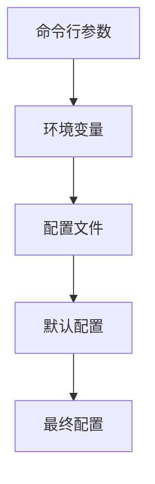

# 流量控制策略

<cite>
**本文档引用的文件**
- [config.rs](file://crates/pingora-proxy/src/config.rs)
- [config.yml](file://config.yml)
- [service.rs](file://crates/pingora-proxy/src/service.rs)
- [rcoder/src/config.rs](file://crates/rcoder/src/config.rs)
- [pingora_server.rs](file://crates/pingora-proxy/src/pingora_server.rs)
- [server.rs](file://crates/pingora-proxy/src/server.rs)
</cite>

## 目录
1. [引言](#引言)
2. [配置结构与参数](#配置结构与参数)
3. [超时设置](#超时设置)
4. [连接池与连接复用](#连接池与连接复用)
5. [健康检查机制](#健康检查机制)
6. [生产环境推荐配置](#生产环境推荐配置)
7. [负载场景调优策略](#负载场景调优策略)
8. [配置调整案例](#配置调整案例)
9. [结论](#结论)

## 引言
RCoder平台集成了Cloudflare Pingora作为高性能反向代理，实现了基于端口的路由转发功能。本系统通过灵活的流量控制策略，确保在不同负载场景下都能提供稳定可靠的服务。流量控制策略主要涵盖超时设置、连接池管理、健康检查等关键参数，这些配置直接影响代理服务的性能、可靠性和响应能力。通过合理配置这些参数，可以有效应对突发流量，提高系统整体稳定性。

## 配置结构与参数
流量控制策略的核心配置主要分布在`config.yml`配置文件和`crates/pingora-proxy/src/config.rs`代码文件中。配置系统遵循多层优先级原则：命令行参数 > 环境变量 > 配置文件 > 默认配置。这种设计使得配置可以在不同环境中灵活调整。



**配置来源**
- [config.yml](file://config.yml#L0-L28)
- [config.rs](file://crates/pingora-proxy/src/config.rs#L0-L94)
- [rcoder/src/config.rs](file://crates/rcoder/src/config.rs#L0-L266)

## 超时设置
超时设置是流量控制策略中的关键参数，直接影响代理服务的响应行为和资源利用率。系统主要包含以下几种超时配置：

### 读写超时
读写超时控制着代理与后端服务之间的通信时间。当后端服务响应缓慢或不可用时，适当的超时设置可以防止连接长时间占用，避免资源耗尽。在`crates/pingora-proxy/src/service.rs`中，通过`timeout`函数实现了超时控制：

```rust
let status = match timeout(
    std::time::Duration::from_millis(timeout_ms),
    TcpStream::connect((host.as_str(), port)),
).await
```

### 健康检查超时
健康检查超时是评估后端服务可用性的重要参数。在`config.yml`中，`health_check.timeout_seconds`设置为1秒，这意味着如果后端服务在1秒内没有响应，将被视为不健康。较短的超时时间可以快速发现故障，但可能会误判网络波动为服务故障；较长的超时时间则可能延迟故障发现。

### 生产环境建议
对于生产环境，建议将健康检查超时设置为2-3秒，以平衡故障检测速度和误判率。对于读写超时，建议根据后端服务的平均响应时间进行设置，通常为平均响应时间的2-3倍。

**配置来源**
- [service.rs](file://crates/pingora-proxy/src/service.rs#L541-L545)
- [config.yml](file://config.yml#L24-L28)

## 连接池与连接复用
Pingora代理内置了连接池和连接复用机制，这是提高性能的关键特性。连接池通过复用已建立的TCP连接，减少了频繁建立和关闭连接的开销，显著提高了吞吐量。

### 连接管理
系统通过`Arc<RwLock<HashMap<u16, String>>>`结构管理后端服务连接，支持动态添加和移除后端。当请求到达时，代理会从连接池中获取可用连接，如果没有可用连接则创建新连接。连接在使用完毕后会被放回连接池，供后续请求复用。

### 连接复用优势
连接复用带来了以下优势：
- 减少TCP三次握手和四次挥手的开销
- 降低CPU和内存消耗
- 提高请求处理速度
- 改善整体系统性能

### 配置建议
在高并发场景下，建议适当增加连接池大小，以避免连接不足导致的性能瓶颈。同时，应设置合理的连接空闲超时时间，及时回收长时间未使用的连接，防止资源浪费。

**配置来源**
- [service.rs](file://crates/pingora-proxy/src/service.rs#L204-L237)
- [server.rs](file://crates/pingora-proxy/src/server.rs#L37-L71)

## 健康检查机制
健康检查是确保服务高可用的重要机制。系统通过定期检查后端服务的可用性，自动将流量从不健康的服务实例转移到健康实例。

### 健康检查配置
在`config.yml`中，健康检查配置如下：
```yaml
health_check:
  enabled: true
  interval_seconds: 5
  timeout_seconds: 1
  healthy_threshold: 2
  unhealthy_threshold: 3
```

### 检查流程
健康检查流程如下：
1. 每5秒执行一次健康检查
2. 尝试连接后端服务，超时时间为1秒
3. 如果连续3次检查失败，服务状态变为不健康
4. 如果连续2次检查成功，服务状态恢复为健康

### 状态管理
系统使用`Arc<RwLock<HashMap<u16, HealthInfo>>>`结构缓存后端健康状态，避免频繁的网络探测。健康状态包括`Healthy`、`Unhealthy`和`Timeout`三种。

### 调优建议
在生产环境中，可以根据服务的稳定性和网络状况调整健康检查参数。对于稳定性较高的服务，可以适当延长检查间隔，减少系统开销；对于关键服务，则应缩短检查间隔，快速发现故障。

**配置来源**
- [config.yml](file://config.yml#L21-L28)
- [service.rs](file://crates/pingora-proxy/src/service.rs#L566-L571)

## 生产环境推荐配置
基于系统特性和最佳实践，以下是生产环境的推荐配置：

### 基础配置
```yaml
proxy_config:
  listen_port: 8080
  default_backend_port: 3000
  backend_host: "127.0.0.1"
  port_param: "port"
```

### 健康检查优化
```yaml
health_check:
  enabled: true
  interval_seconds: 10
  timeout_seconds: 2
  healthy_threshold: 1
  unhealthy_threshold: 2
```

### 性能优化
- 启用Round Robin负载均衡算法
- 配置合理的连接池大小（建议100-500）
- 启用HTTP/2支持以提高传输效率
- 配置适当的日志级别，避免过度日志影响性能

### 安全配置
- 限制监听地址为内网IP
- 配置适当的请求大小限制
- 启用访问日志以监控异常流量

**配置来源**
- [config.yml](file://config.yml#L0-L28)
- [server.rs](file://crates/pingora-proxy/src/server.rs#L37-L71)

## 负载场景调优策略
不同负载场景下，流量控制策略需要进行相应调整，以确保系统稳定性和性能。

### 低负载场景
在低负载场景下，系统资源充足，可以适当降低健康检查频率，减少系统开销。建议配置：
- 健康检查间隔：15-30秒
- 连接池大小：50-100
- 超时时间：根据实际需求设置

### 高并发场景
高并发场景下，系统面临较大压力，需要优化配置以提高吞吐量和稳定性：
- 增加连接池大小至500以上
- 缩短健康检查间隔至3-5秒
- 启用连接复用和HTTP/2
- 配置适当的请求队列大小

### 突发流量场景
应对突发流量时，系统需要快速响应并保持稳定：
- 预先增加连接池大小
- 启用自动扩展机制
- 配置适当的熔断策略
- 监控系统资源使用情况

### 长连接场景
对于长连接应用，需要特别关注连接管理：
- 延长连接空闲超时时间
- 配置心跳机制
- 监控连接状态
- 避免连接泄漏

**配置来源**
- [service.rs](file://crates/pingora-proxy/src/service.rs#L566-L571)
- [config.yml](file://config.yml#L21-L28)

## 配置调整案例
以下通过具体案例展示如何通过配置文件或环境变量调整流量控制行为以应对不同场景。

### 案例一：应对突发流量
当系统面临突发流量时，可以通过以下方式快速调整配置：

**通过命令行参数调整**
```bash
cargo run --bin rcoder -- --enable-proxy \
  --proxy-port 8080 \
  --default-backend-port 3000
```

**通过环境变量调整**
```bash
export RCODER_PROXY_PORT=8080
export RCODER_BACKEND_PORT=3000
cargo run --bin rcoder -- --enable-proxy
```

### 案例二：生产环境优化
在生产环境中，通过配置文件进行优化：

```yaml
# config.yml
proxy_config:
  listen_port: 8080
  default_backend_port: 3000
  backend_host: "127.0.0.1"
  port_param: "port"
  health_check:
    enabled: true
    interval_seconds: 10
    timeout_seconds: 2
    healthy_threshold: 1
    unhealthy_threshold: 2
```

### 案例三：开发环境调试
在开发环境中，启用详细日志以便调试：

```bash
cargo run --bin rcoder -- --enable-proxy \
  --proxy-port 8080 \
  --verbose
```

### 动态配置调整
系统支持运行时动态调整配置，通过API接口可以实时修改流量控制参数，无需重启服务。

**配置来源**
- [config.yml](file://config.yml#L0-L28)
- [rcoder/src/config.rs](file://crates/rcoder/src/config.rs#L106-L144)

## 结论
RCoder平台的流量控制策略通过超时设置、连接池管理、健康检查等关键参数，实现了高性能、高可用的反向代理服务。合理的配置不仅能够提高系统性能，还能增强系统的稳定性和可靠性。在实际应用中，应根据具体场景和需求，灵活调整各项参数，以达到最佳效果。通过配置文件、环境变量和命令行参数的多层配置机制，系统提供了极大的灵活性，能够适应不同环境和需求。未来可以进一步优化流量控制策略，如引入更智能的负载均衡算法、动态调整连接池大小等，以应对更复杂的使用场景。