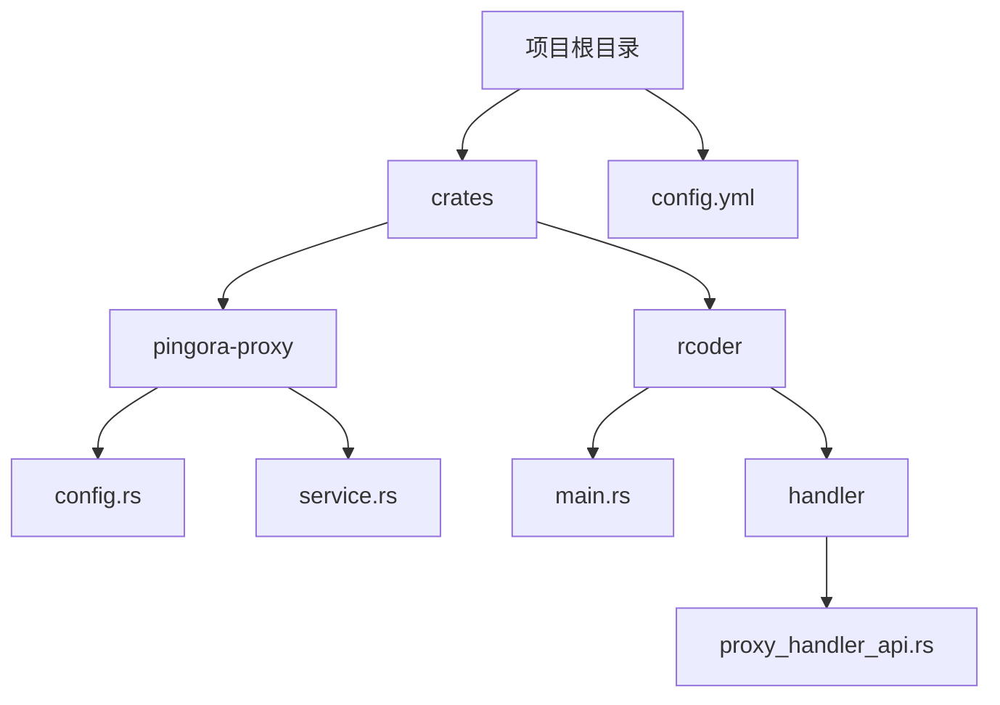
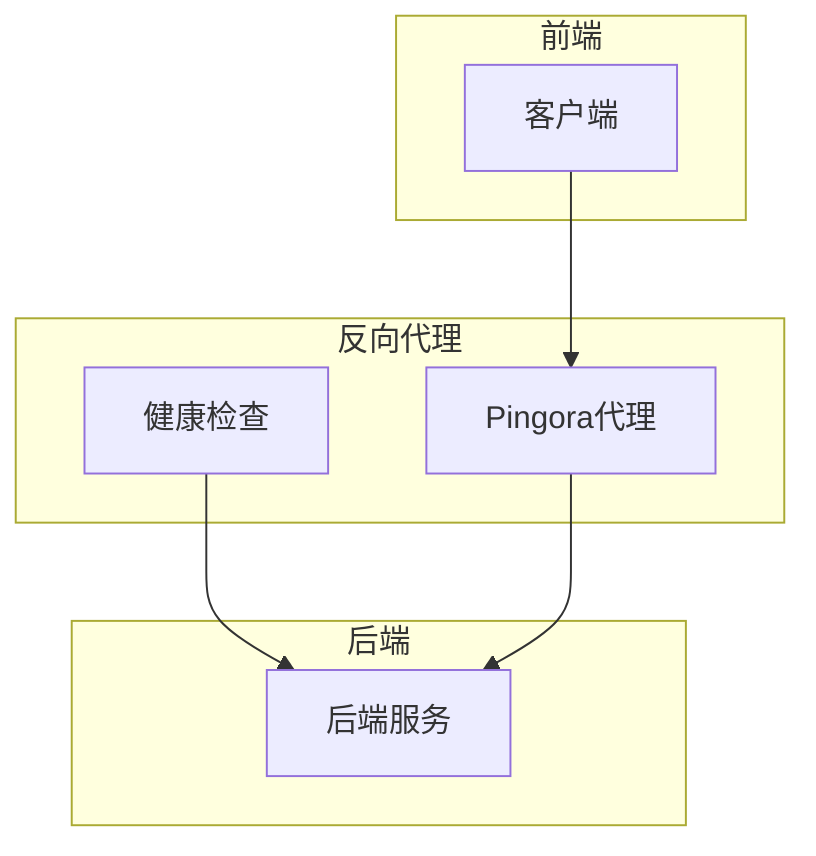
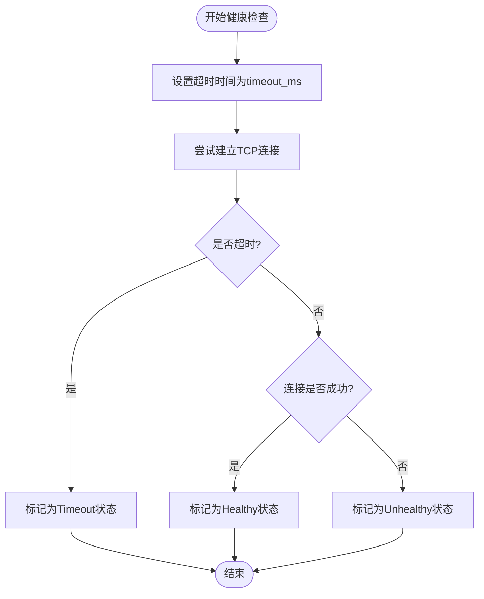
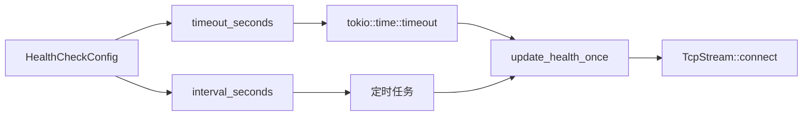

# 超时配置

<cite>
**本文档引用的文件**
- [config.rs](file://crates/pingora-proxy/src/config.rs)
- [service.rs](file://crates/pingora-proxy/src/service.rs)
- [config.yml](file://config.yml)
- [main.rs](file://crates/rcoder/src/main.rs)
- [proxy_handler_api.rs](file://crates/rcoder/src/handler/proxy_handler_api.rs)
</cite>

## 目录
1. [引言](#引言)
2. [项目结构](#项目结构)
3. [核心组件](#核心组件)
4. [架构概述](#架构概述)
5. [详细组件分析](#详细组件分析)
6. [依赖分析](#依赖分析)
7. [性能考虑](#性能考虑)
8. [故障排除指南](#故障排除指南)
9. [结论](#结论)

## 引言
本文档详细记录了Pingora反向代理中超时参数的配置与实现机制，涵盖连接超时、读取超时、写入超时和空闲超时。重点分析这些参数在高并发场景下的作用及其对系统稳定性的影响。结合`config.rs`中的`TimeoutConfig`结构体，说明各字段的默认值、有效范围及生产环境推荐设置。提供实际配置示例，展示如何通过YAML配置文件或环境变量动态调整超时行为，并分析超时异常的处理流程与日志追踪方法。

## 项目结构
项目采用模块化设计，核心代理功能位于`crates/pingora-proxy`模块中。主配置文件`config.yml`位于项目根目录，定义了全局配置参数。`crates/rcoder`模块作为主应用，集成并管理Pingora代理服务。



**图源**
- [config.yml](file://config.yml)
- [config.rs](file://crates/pingora-proxy/src/config.rs)
- [main.rs](file://crates/rcoder/src/main.rs)

**章节源**
- [config.yml](file://config.yml)
- [config.rs](file://crates/pingora-proxy/src/config.rs)

## 核心组件
核心超时配置机制由`HealthCheckConfig`结构体实现，该结构体定义了健康检查的超时参数。在`crates/rcoder/src/config.rs`中，`HealthCheckConfig`包含`timeout_seconds`字段，用于设置健康检查的超时时间。该配置通过`config.yml`文件中的`health_check.timeout_seconds`参数进行外部配置。

**章节源**
- [config.rs](file://crates/rcoder/src/config.rs#L50-L57)
- [config.yml](file://config.yml#L20)

## 架构概述
系统采用分层架构，Pingora代理服务作为独立模块运行。健康检查机制通过定时任务周期性地探测后端服务状态，超时参数直接影响探测的灵敏度和准确性。在高并发场景下，合理的超时设置能有效避免因短暂网络波动导致的服务误判。



**图源**
- [service.rs](file://crates/pingora-proxy/src/service.rs#L541-L571)
- [main.rs](file://crates/rcoder/src/main.rs#L101)

## 详细组件分析

### 健康检查超时机制分析
健康检查超时机制通过`update_health_once`方法实现，该方法使用`tokio::time::timeout`来限制TCP连接的建立时间。

#### 超时处理流程


**图源**
- [service.rs](file://crates/pingora-proxy/src/service.rs#L541-L545)

#### 配置参数说明
| 参数 | 默认值 | 有效范围 | 生产环境推荐值 | 说明 |
|------|--------|----------|----------------|------|
| timeout_seconds | 1 | >0 | 2-5 | 健康检查超时时间（秒） |
| interval_seconds | 5 | >0 | 10-30 | 健康检查间隔（秒） |

**章节源**
- [config.rs](file://crates/rcoder/src/config.rs#L50-L57)
- [service.rs](file://crates/pingora-proxy/src/service.rs#L541-L571)

### 配置示例
以下为`config.yml`中的健康检查配置示例：

```yaml
proxy_config:
  health_check:
    enabled: true
    interval_seconds: 5
    timeout_seconds: 1
    healthy_threshold: 2
    unhealthy_threshold: 3
```

该配置表示：每5秒进行一次健康检查，若1秒内无法建立连接则判定为超时，需要连续2次健康检查成功才认为服务健康，连续3次失败则判定为不健康。

**章节源**
- [config.yml](file://config.yml#L18-L24)

## 依赖分析
超时配置机制依赖于多个核心组件的协同工作。`tokio::time::timeout`提供了异步超时功能，`TcpStream::connect`用于建立TCP连接，`HealthCheckConfig`结构体封装了配置参数。



**图源**
- [config.rs](file://crates/rcoder/src/config.rs#L50-L57)
- [service.rs](file://crates/pingora-proxy/src/service.rs#L541-L571)

**章节源**
- [config.rs](file://crates/rcoder/src/config.rs#L50-L57)
- [service.rs](file://crates/pingora-proxy/src/service.rs#L541-L571)

## 性能考虑
在高并发场景下，过短的超时时间可能导致频繁的误判，增加系统负载；过长的超时时间则可能导致故障发现延迟。建议根据网络环境和业务需求进行调优。生产环境中，建议将`timeout_seconds`设置为2-5秒，`interval_seconds`设置为10-30秒，以平衡灵敏度和系统开销。

## 故障排除指南
当出现健康检查异常时，可通过以下步骤进行排查：
1. 检查`config.yml`中的`timeout_seconds`配置是否合理
2. 查看日志中是否有"Health check timeout"相关记录
3. 验证后端服务的网络连通性
4. 使用`/proxy/status`API接口查询代理服务状态

**章节源**
- [proxy_handler_api.rs](file://crates/rcoder/src/handler/proxy_handler_api.rs#L218)
- [config.yml](file://config.yml#L20)

## 结论
Pingora反向代理的超时配置机制通过`HealthCheckConfig`结构体实现，提供了灵活的健康检查能力。合理的超时参数设置对于保障系统稳定性至关重要。在生产环境中，应根据实际网络状况和业务需求进行调优，避免因配置不当导致的服务误判或故障发现延迟。