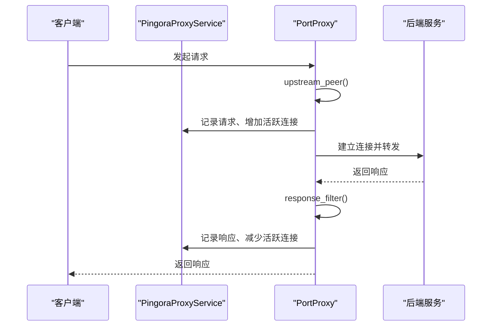
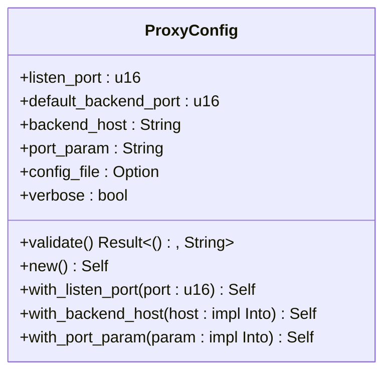
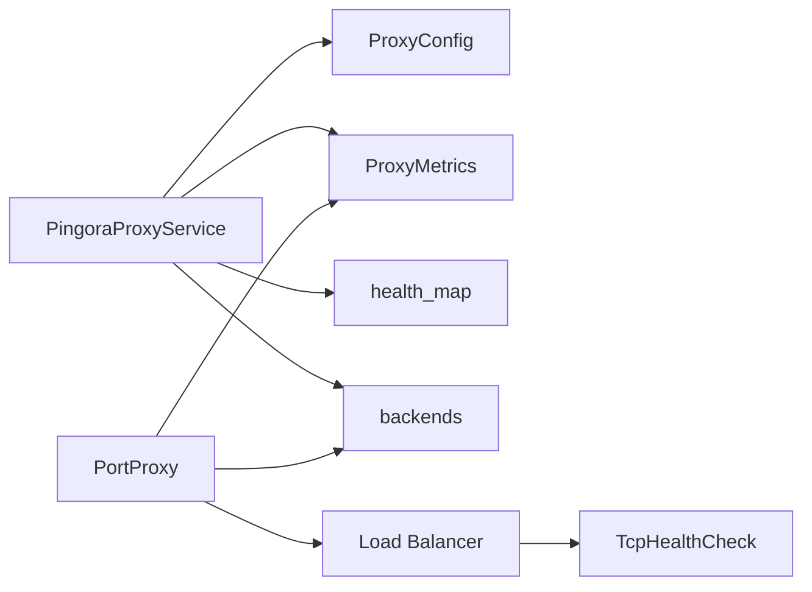

# 连接池管理

<cite>
**本文档中引用的文件**  
- [config.rs](file://crates/pingora-proxy/src/config.rs)
- [service.rs](file://crates/pingora-proxy/src/service.rs)
</cite>

## 目录
1. [引言](#引言)
2. [项目结构](#项目结构)
3. [核心组件](#核心组件)
4. [架构概述](#架构概述)
5. [详细组件分析](#详细组件分析)
6. [依赖分析](#依赖分析)
7. [性能考量](#性能考量)
8. [故障排查指南](#故障排查指南)
9. [结论](#结论)

## 引言
本文档旨在深入解析基于 Pingora 构建的反向代理系统中的连接池机制。重点涵盖连接池的配置选项、运行时行为、健康检查与故障转移策略，并结合 `ProxyConfig` 和 `ProxyMetrics` 结构说明其在多后端服务间的资源管理方式。同时分析系统在高并发场景下的表现，提供连接耗尽的诊断方法和优化建议。

## 项目结构
该连接池功能主要实现在 `pingora-proxy` crate 中，作为独立模块被集成到整体代理服务中。其结构清晰，配置与服务逻辑分离，便于扩展和维护。

```mermaid
graph TB
subgraph "pingora-proxy crate"
Config[config.rs<br/>ProxyConfig]
Service[service.rs<br/>PingoraProxyService]
Metrics[ProxyMetrics<br/>PerPortMetrics]
Health[HealthState<br/>HealthInfo]
end
Config --> Service : "作为参数注入"
Service --> Metrics : "持有指标引用"
Service --> Health : "维护健康状态"
```

**Diagram sources**
- [config.rs](file://crates/pingora-proxy/src/config.rs#L1-L95)
- [service.rs](file://crates/pingora-proxy/src/service.rs#L1-L723)

**Section sources**
- [config.rs](file://crates/pingora-proxy/src/config.rs#L1-L95)
- [service.rs](file://crates/pingora-proxy/src/service.rs#L1-L723)

## 核心组件
核心组件包括 `ProxyConfig`（配置结构）、`PingoraProxyService`（服务主控）、`PortProxy`（代理实现）以及 `ProxyMetrics`（连接与性能指标）。这些组件共同协作，实现连接的创建、分发、监控与回收。

**Section sources**
- [config.rs](file://crates/pingora-proxy/src/config.rs#L1-L95)
- [service.rs](file://crates/pingora-proxy/src/service.rs#L1-L723)

## 架构概述
系统采用模块化设计，`PingoraProxyService` 封装了所有业务逻辑和状态，通过 `create_pingora_proxy` 方法生成可被 Pingora 服务器调用的 `PortProxy` 实例。连接池的状态（如活跃连接数）由 `ProxyMetrics` 统一管理，确保线程安全。



**Diagram sources**
- [service.rs](file://crates/pingora-proxy/src/service.rs#L222-L231)
- [service.rs](file://crates/pingora-proxy/src/service.rs#L210-L220)

## 详细组件分析

### 配置选项分析
`ProxyConfig` 结构定义了代理服务的基本参数，虽然未直接包含传统意义上的“最大连接数”字段，但通过 `listen_port` 和 `default_backend_port` 间接影响连接的建立。其设计遵循默认值与可配置性原则，支持通过方法链进行灵活配置。

#### 配置结构


**Diagram sources**
- [config.rs](file://crates/pingora-proxy/src/config.rs#L10-L95)

**Section sources**
- [config.rs](file://crates/pingora-proxy/src/config.rs#L10-L95)

### 连接池运行时行为分析
连接池的运行时行为主要体现在 `ProxyMetrics` 对活跃连接数的精确追踪上。通过 `AtomicU64` 和 `Ordering::Relaxed`，实现了高性能的并发计数。

#### 活跃连接管理
```mermaid
flowchart TD
A[请求到达] --> B[调用 inc_active()]
B --> C[active_connections.fetch_add(1)]
C --> D[连接处理中]
D --> E[响应发送]
E --> F[调用 dec_active()]
F --> G{active_connections > 0?}
G --> |是| H[compare_exchange 尝试减1]
H --> I[成功则退出，失败则重试]
I --> G
G --> |否| J[保持为0，不减]
J --> K[连接释放]
```

**Diagram sources**
- [service.rs](file://crates/pingora-proxy/src/service.rs#L51-L61)
- [service.rs](file://crates/pingora-proxy/src/service.rs#L127-L159)

**Section sources**
- [service.rs](file://crates/pingora-proxy/src/service.rs#L127-L159)

### 健康检查与故障转移机制
系统实现了主动的健康检查机制。通过 `start_health_check_loop` 启动一个异步任务，定期对所有后端服务进行 TCP 探活，并将结果（`HealthState`）缓存在 `health_map` 中。虽然当前的 `PortProxy` 实现未直接使用此健康状态进行故障转移，但该机制为后续实现基于健康状态的路由（如从故障节点切换）提供了数据基础。

**Section sources**
- [service.rs](file://crates/pingora-proxy/src/service.rs#L645-L707)

## 依赖分析
系统依赖于 `pingora-core` 和 `pingora-proxy` 库来处理底层的 HTTP 代理逻辑，依赖 `tokio` 提供异步运行时和同步原语（如 `RwLock`、`AtomicU64`），依赖 `tracing` 进行日志记录。`ProxyMetrics` 和 `HealthInfo` 等结构被 `PingoraProxyService` 和 `PortProxy` 共享，形成了清晰的依赖关系。



**Diagram sources**
- [service.rs](file://crates/pingora-proxy/src/service.rs#L210-L220)
- [service.rs](file://crates/pingora-proxy/src/service.rs#L222-L231)

**Section sources**
- [service.rs](file://crates/pingora-proxy/src/service.rs#L1-L723)

## 性能考量
在突发流量下，连接池通过原子操作管理活跃连接数，避免了锁竞争，保证了高性能。`active_connections` 指标可用于监控系统负载。当该值接近系统极限时，可能预示着连接耗尽的风险。建议通过监控此指标并结合后端服务的响应延迟来评估系统容量。

## 故障排查指南
当出现连接问题时，可按以下步骤排查：
1.  **检查活跃连接数**：通过 `ProxyMetrics::active()` 获取当前活跃连接数，判断是否达到系统或后端服务的连接上限。
2.  **检查后端健康状态**：调用 `health_snapshot()` 获取所有后端的健康状态，确认目标后端是否处于 `Healthy` 状态。
3.  **查看日志**：检查 `tracing` 生成的日志，特别是 `debug` 和 `info` 级别的日志，寻找如“动态添加后端服务”、“收到上游响应”等关键信息，以及可能的错误信息。
4.  **验证配置**：使用 `ProxyConfig::validate()` 确保配置项（如端口、主机地址）有效。

**Section sources**
- [service.rs](file://crates/pingora-proxy/src/service.rs#L127-L159)
- [service.rs](file://crates/pingora-proxy/src/service.rs#L685-L707)

## 结论
本系统通过 `ProxyMetrics` 中的 `active_connections` 原子计数器，实现了对连接池状态的高效、线程安全的管理。虽然未实现复杂的连接预热或空闲回收策略，但其简洁的设计确保了核心代理功能的稳定与高性能。健康检查机制已就位，为未来实现更智能的故障转移和负载均衡策略奠定了基础。在面对连接耗尽问题时，应优先通过监控活跃连接数和后端健康状态来进行诊断。