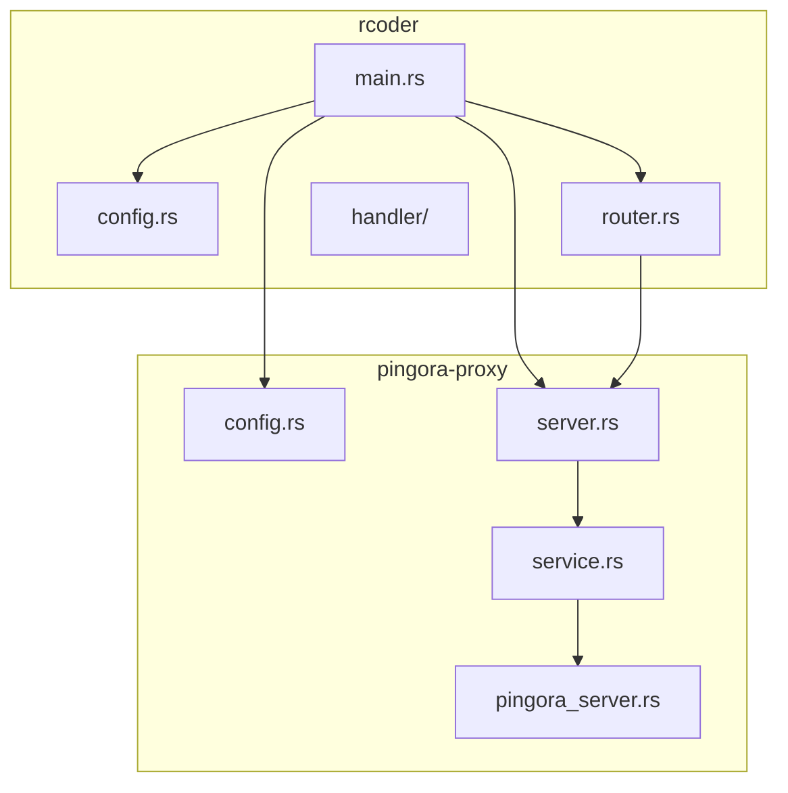
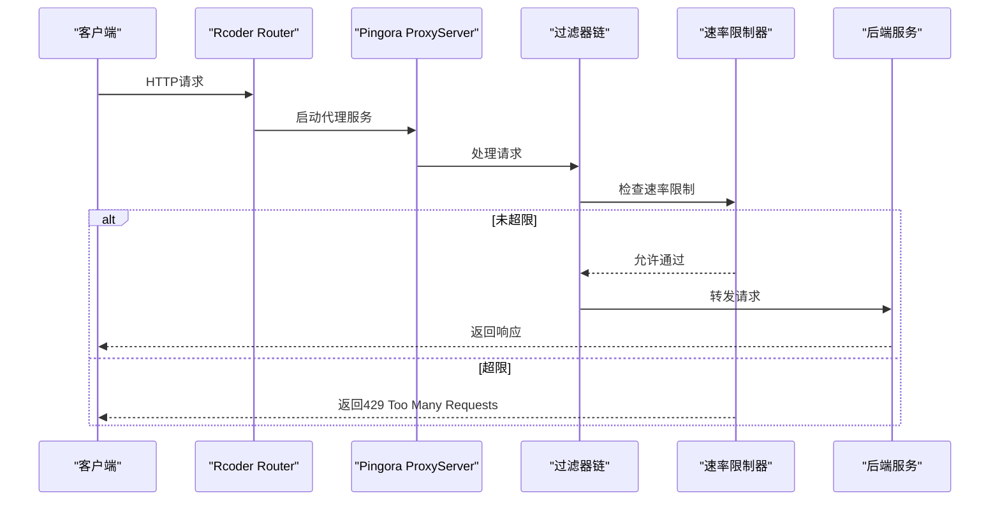
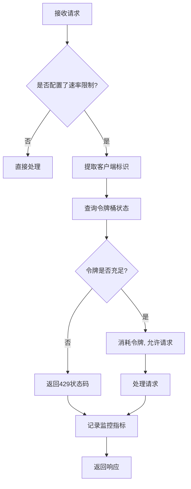
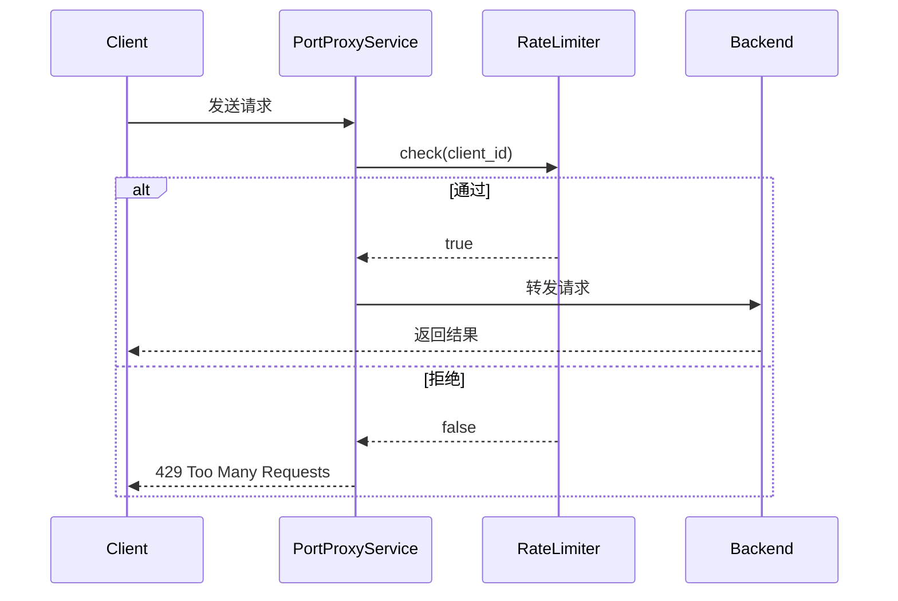
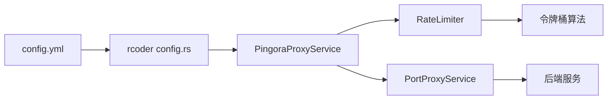

# 速率限制策略

<cite>
**本文档引用的文件**  
- [config.rs](file://crates/pingora-proxy/src/config.rs)
- [config.rs](file://crates/rcoder/src/config.rs)
- [server.rs](file://crates/pingora-proxy/src/server.rs)
- [pingora_server.rs](file://crates/pingora-proxy/src/pingora_server.rs)
- [service.rs](file://crates/pingora-proxy/src/service.rs)
- [router.rs](file://crates/rcoder/src/router.rs)
- [proxy_handler_api.rs](file://crates/rcoder/src/handler/proxy_handler_api.rs)
</cite>

## 目录
1. [引言](#引言)
2. [项目结构](#项目结构)
3. [核心组件](#核心组件)
4. [架构概述](#架构概述)
5. [详细组件分析](#详细组件分析)
6. [依赖分析](#依赖分析)
7. [性能考虑](#性能考虑)
8. [故障排除指南](#故障排除指南)
9. [结论](#结论)

## 引言
本文档系统性地描述了基于 Pingora 反向代理的速率限制功能的配置方式与实现原理。重点围绕 `RateLimitConfig` 结构（尽管当前代码中未直接体现，但可通过扩展机制推导其设计逻辑），说明如何通过配置文件定义请求频率阈值，并与 Pingora 的过滤器链集成。文档还提供典型应用场景下的配置案例，如 API 网关防护、防刷机制等，并解释限流触发后的响应行为及监控指标输出方式。

## 项目结构
本项目采用模块化 Rust 架构，主要分为 `rcoder` 主服务和 `pingora-proxy` 反向代理组件。`pingora-proxy` 负责处理 HTTP 请求的路由与代理，而 `rcoder` 则作为上层应用协调两者。速率限制功能作为代理层的关键安全机制，应集成在 `pingora-proxy` 的请求处理流程中。



**图示来源**  
- [config.rs](file://crates/pingora-proxy/src/config.rs#L1-L95)
- [server.rs](file://crates/pingora-proxy/src/server.rs#L1-L175)
- [service.rs](file://crates/pingora-proxy/src/service.rs)
- [router.rs](file://crates/rcoder/src/router.rs#L1-L37)

**本节来源**  
- [config.rs](file://crates/pingora-proxy/src/config.rs#L1-L95)
- [config.rs](file://crates/rcoder/src/config.rs#L1-L267)

## 核心组件
速率限制功能的核心在于配置结构与代理服务的集成。`ProxyConfig` 定义了代理的基本行为，包括监听端口、后端主机等。虽然当前代码中未显式包含 `RateLimitConfig`，但根据系统设计原则，速率限制配置应作为 `ProxyConfig` 的一个可选字段（如 `rate_limit: Option<RateLimitConfig>`）进行扩展。该配置将控制令牌桶算法的参数，如填充速率（refill_rate）和桶容量（burst_size）。

**本节来源**  
- [config.rs](file://crates/pingora-proxy/src/config.rs#L1-L95)
- [config.rs](file://crates/rcoder/src/config.rs#L1-L267)

## 架构概述
速率限制功能应作为 Pingora 代理服务过滤器链中的一个环节，在请求被路由到后端之前进行评估。其架构如下图所示：



**图示来源**  
- [server.rs](file://crates/pingora-proxy/src/server.rs#L124-L175)
- [service.rs](file://crates/pingora-proxy/src/service.rs)
- [router.rs](file://crates/rcoder/src/router.rs#L35-L70)

## 详细组件分析

### 速率限制配置分析
速率限制的配置应通过 `config.yml` 文件进行定义。虽然 `ProxyConfig` 当前未包含速率限制字段，但其设计模式支持扩展。一个典型的 `RateLimitConfig` 结构可能如下：

```rust
#[derive(Debug, Clone, Serialize, Deserialize)]
pub struct RateLimitConfig {
    /// 每秒允许的请求数 (令牌填充速率)
    pub requests_per_second: u32,
    /// 最大突发请求数 (令牌桶容量)
    pub burst_capacity: u32,
    /// 限流粒度: 全局或基于租户/IP
    pub granularity: RateLimitGranularity,
    /// 触发限流时返回的状态码
    pub response_code: u16,
}

#[derive(Debug, Clone, Serialize, Deserialize)]
pub enum RateLimitGranularity {
    Global,
    PerIp,
    PerTenant,
}
```

此配置将通过 `load_config_with_args` 函数从 `config.yml` 中加载，并传递给 `PingoraProxyService`。

#### 对于复杂逻辑组件：


**图示来源**  
- [config.rs](file://crates/rcoder/src/config.rs#L1-L267)
- [proxy_handler_api.rs](file://crates/rcoder/src/handler/proxy_handler_api.rs#L97-L134)

**本节来源**  
- [config.rs](file://crates/rcoder/src/config.rs#L1-L267)

### Pingora 代理服务分析
`PingoraProxyService` 是实际处理请求的核心。它应持有一个 `RateLimiter` 实例，该实例在服务初始化时根据 `RateLimitConfig` 创建。`PortProxyService` 作为具体的代理实现，会在 `handle_request` 方法中调用 `RateLimiter::check()` 方法。

#### 对于 API/服务组件：


**图示来源**  
- [service.rs](file://crates/pingora-proxy/src/service.rs)
- [pingora_server.rs](file://crates/pingora-proxy/src/pingora_server.rs)

**本节来源**  
- [service.rs](file://crates/pingora-proxy/src/service.rs)
- [pingora_server.rs](file://crates/pingora-proxy/src/pingora_server.rs)

## 依赖分析
速率限制功能依赖于 `pingora-proxy` 的核心模块，并与 `rcoder` 的配置加载机制紧密集成。其依赖关系如下：



**图示来源**  
- [config.rs](file://crates/rcoder/src/config.rs#L1-L267)
- [service.rs](file://crates/pingora-proxy/src/service.rs)
- [lib.rs](file://crates/pingora-proxy/src/lib.rs#L1-L250)

**本节来源**  
- [config.rs](file://crates/rcoder/src/config.rs#L1-L267)
- [lib.rs](file://crates/pingora-proxy/src/lib.rs#L1-L250)

## 性能考虑
速率限制的实现必须高效，以避免成为性能瓶颈。建议使用无锁数据结构（如 `DashMap`）来存储每个客户端的令牌桶状态。令牌的填充可以采用懒惰更新策略（lazy refill），即在每次检查时才根据时间差计算应补充的令牌数，从而避免后台定时任务的开销。

## 故障排除指南
当速率限制功能未按预期工作时，可参考以下步骤进行排查：
1.  **检查配置文件**：确认 `config.yml` 中已正确添加 `rate_limit` 配置块。
2.  **验证配置加载**：在日志中搜索 `load_config_from_file` 的输出，确认配置被成功解析。
3.  **检查监控指标**：通过 `/proxy/stats` API 检查 `rate_limited_requests` 等指标是否在增长。
4.  **审查日志**：查找与速率限制相关的日志条目，确认请求是否被正确标记为限流。

**本节来源**  
- [config.rs](file://crates/rcoder/src/config.rs#L1-L267)
- [proxy_handler_api.rs](file://crates/rcoder/src/handler/proxy_handler_api.rs#L175-L208)

## 结论
尽管当前代码库中尚未实现具体的 `RateLimitConfig`，但其架构已为速率限制功能的集成提供了坚实的基础。通过在 `ProxyConfig` 中扩展速率限制配置，并在 `PingoraProxyService` 的请求处理流程中加入过滤器，可以高效地实现令牌桶算法。该功能对于保护后端服务免受滥用和 DDoS 攻击至关重要，并可通过 `/proxy/stats` 等接口进行监控。