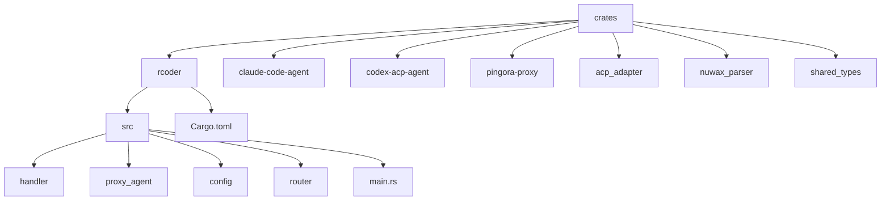
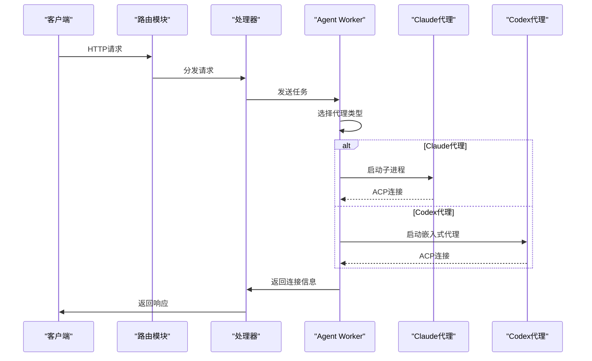
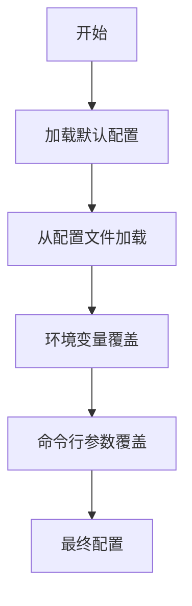
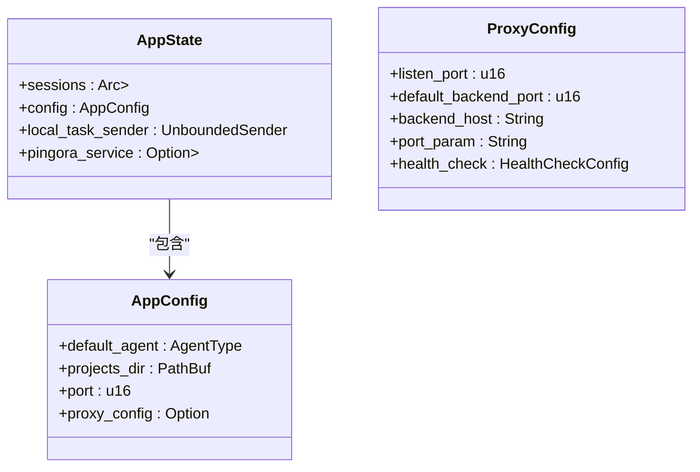
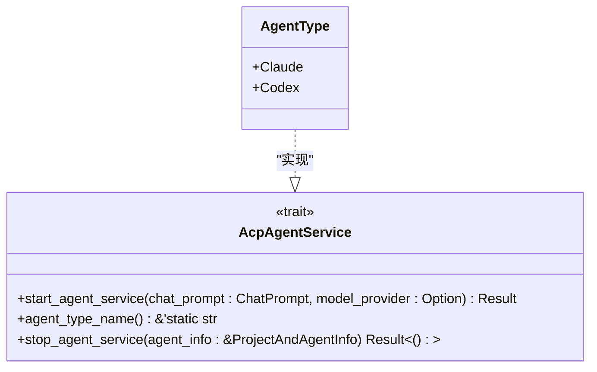
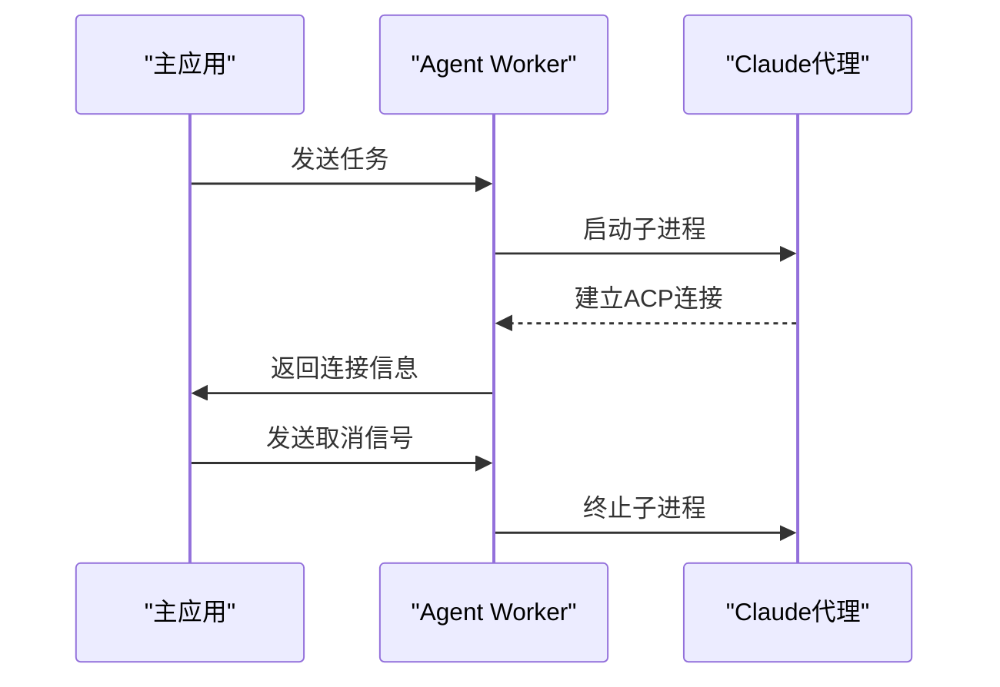
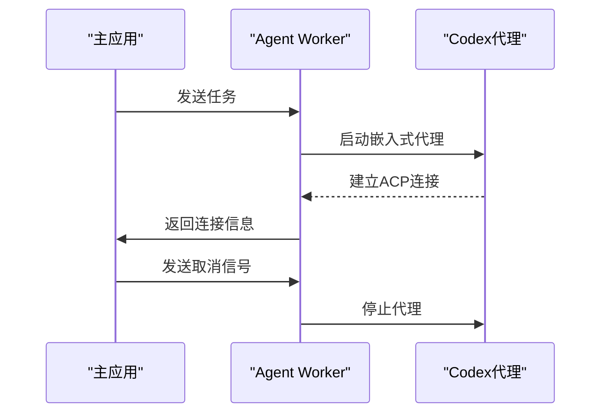
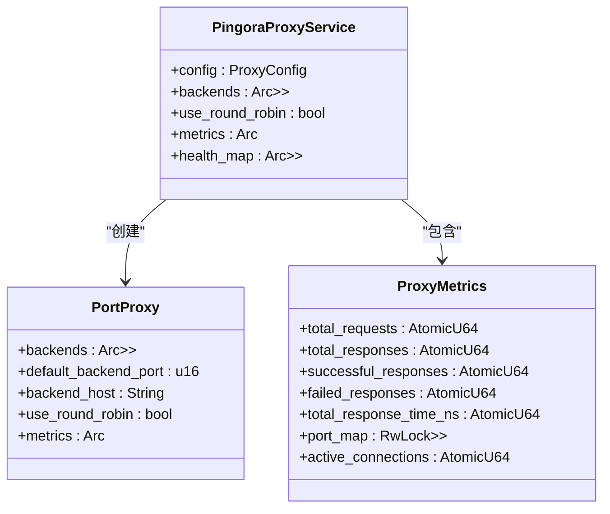
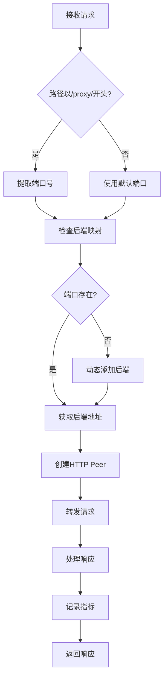
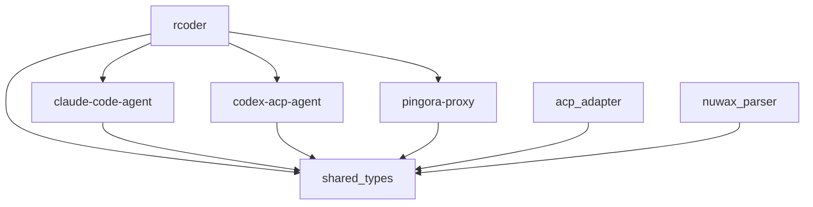

# 架构设计

<cite>
**本文档引用的文件**
- [main.rs](file://crates/rcoder/src/main.rs)
- [config.rs](file://crates/rcoder/src/config.rs)
- [agent_service.rs](file://crates/rcoder/src/proxy_agent/agent_service.rs)
- [acp_agent.rs](file://crates/rcoder/src/proxy_agent/acp_agent.rs)
- [claude_code_agent.rs](file://crates/rcoder/src/proxy_agent/claude_code_agent.rs)
- [codex_agent.rs](file://crates/rcoder/src/proxy_agent/codex_agent.rs)
- [agent_stop_handle.rs](file://crates/rcoder/src/proxy_agent/agent_stop_handle.rs)
- [chat_handler.rs](file://crates/rcoder/src/handler/chat_handler.rs)
- [router.rs](file://crates/rcoder/src/router.rs)
- [pingora_server.rs](file://crates/pingora-proxy/src/pingora_server.rs)
- [service.rs](file://crates/pingora-proxy/src/service.rs)
- [lib.rs](file://crates/pingora-proxy/src/lib.rs)
</cite>

## 目录
1. [简介](#简介)
2. [项目结构](#项目结构)
3. [核心组件](#核心组件)
4. [架构概述](#架构概述)
5. [详细组件分析](#详细组件分析)
6. [依赖分析](#依赖分析)
7. [性能考虑](#性能考虑)
8. [故障排除指南](#故障排除指南)
9. [结论](#结论)

## 简介
rcoder系统是一个基于Rust Workspace的多crate架构的AI驱动开发平台，通过Agent Client Protocol（ACP）协议集成多种AI代理服务。系统采用模块化设计，将核心功能分解为独立的crates，包括主应用rcoder、代理适配器acp_adapter、Claude代码代理、Codex ACP代理以及基于Pingora的反向代理服务。该架构支持高并发请求处理，通过Tokio异步运行时和LocalSet单线程运行时解决!Send类型agent worker的执行问题。配置管理系统支持命令行参数、环境变量、配置文件和默认值的优先级逻辑，确保了系统的灵活性和可配置性。

## 项目结构
rcoder项目的目录结构体现了清晰的模块化设计原则，所有核心功能组件均位于crates目录下，形成一个Rust Workspace。这种组织方式使得各个组件可以独立开发、测试和维护，同时又能无缝集成到主应用中。

**图源**
- [main.rs](file://crates/rcoder/src/main.rs#L1-L217)
- [Cargo.toml](file://Cargo.toml)

**本节来源**
- [Cargo.toml](file://Cargo.toml)

## 核心组件
rcoder系统的核心组件包括主应用rcoder、AI代理服务（claude-code-agent和codex-acp-agent）、反向代理服务（pingora-proxy）以及共享类型库（shared_types）。主应用rcoder负责协调各个组件的工作，通过HTTP API接收用户请求并分发给相应的AI代理。AI代理服务实现了与不同AI模型的交互逻辑，而pingora-proxy提供了高性能的反向代理功能。shared_types库定义了跨组件共享的数据结构和枚举类型，确保了类型一致性。

**本节来源**
- [main.rs](file://crates/rcoder/src/main.rs#L1-L217)
- [Cargo.toml](file://Cargo.toml)

## 架构概述
rcoder系统采用分层架构设计，从HTTP请求进入系统到AI代理响应返回的完整路径清晰明确。系统入口是基于Axum框架的HTTP服务器，接收来自客户端的聊天请求。请求经过路由模块分发到相应的处理器，然后通过本地任务通道传递给在独立线程中运行的agent worker。agent worker根据请求中的模型提供商配置选择合适的AI代理服务，启动相应的代理进程或嵌入式代理，并通过ACP协议与代理进行通信。同时，系统集成了基于Pingora的反向代理服务，可以将特定路径的请求代理到后端服务。

**图源**
- [main.rs](file://crates/rcoder/src/main.rs#L48-L67)
- [chat_handler.rs](file://crates/rcoder/src/handler/chat_handler.rs#L1-L232)
- [acp_agent.rs](file://crates/rcoder/src/proxy_agent/acp_agent.rs#L1-L298)

**本节来源**
- [main.rs](file://crates/rcoder/src/main.rs#L1-L217)
- [router.rs](file://crates/rcoder/src/router.rs#L1-L203)
- [chat_handler.rs](file://crates/rcoder/src/handler/chat_handler.rs#L1-L232)

## 详细组件分析

### 主应用rcoder分析
rcoder主应用作为系统的协调中心，负责初始化配置、启动HTTP服务器和管理各个组件的生命周期。应用启动时首先解析命令行参数，然后加载配置文件，最后根据配置决定是否启动Pingora反向代理服务。

#### 配置管理

**图源**
- [config.rs](file://crates/rcoder/src/config.rs#L1-L267)

#### 异步运行时管理
rcoder系统使用Tokio异步运行时处理高并发请求，同时通过LocalSet单线程运行时解决!Send类型agent worker的执行问题。主应用在独立的OS线程中启动单线程Tokio运行时，专门用于运行agent worker任务。

**图源**
- [main.rs](file://crates/rcoder/src/main.rs#L48-L67)
- [router.rs](file://crates/rcoder/src/router.rs#L1-L203)

**本节来源**
- [main.rs](file://crates/rcoder/src/main.rs#L1-L217)
- [config.rs](file://crates/rcoder/src/config.rs#L1-L267)
- [router.rs](file://crates/rcoder/src/router.rs#L1-L203)

### AI代理服务分析
AI代理服务通过统一的AcpAgentService trait接口进行管理，支持Claude和Codex两种代理类型。系统根据模型提供商配置自动选择合适的代理服务。

#### 代理服务接口

**图源**
- [agent_service.rs](file://crates/rcoder/src/proxy_agent/agent_service.rs#L1-L72)

#### Claude代码代理实现
Claude代码代理通过子进程方式启动claude-code-acp命令，使用stdin/stdout与子进程进行ACP协议通信。代理进程的生命周期由CancellationToken控制，当收到取消信号时，子进程会被自动终止。

**图源**
- [claude_code_agent.rs](file://crates/rcoder/src/proxy_agent/claude_code_agent.rs#L21-L304)

#### Codex ACP代理实现
Codex ACP代理采用嵌入式方式运行，直接在当前进程中启动CodexAgent实例。通过piper管道在agent和客户端之间传递数据，避免了进程间通信的开销。

**图源**
- [codex_agent.rs](file://crates/rcoder/src/proxy_agent/codex_agent.rs#L24-L246)

**本节来源**
- [agent_service.rs](file://crates/rcoder/src/proxy_agent/agent_service.rs#L1-L72)
- [claude_code_agent.rs](file://crates/rcoder/src/proxy_agent/claude_code_agent.rs#L1-L304)
- [codex_agent.rs](file://crates/rcoder/src/proxy_agent/codex_agent.rs#L1-L246)

### 反向代理服务分析
pingora-proxy组件基于Cloudflare的Pingora库实现，提供高性能的反向代理功能。代理服务支持通过URL参数或路径指定目标端口，将请求代理到相应的后端服务。

#### 代理服务架构

**图源**
- [service.rs](file://crates/pingora-proxy/src/service.rs#L1-L723)

#### 请求处理流程

**图源**
- [service.rs](file://crates/pingora-proxy/src/service.rs#L1-L723)
- [pingora_server.rs](file://crates/pingora-proxy/src/pingora_server.rs#L1-L182)

**本节来源**
- [pingora_server.rs](file://crates/pingora-proxy/src/pingora_server.rs#L1-L182)
- [service.rs](file://crates/pingora-proxy/src/service.rs#L1-L723)
- [lib.rs](file://crates/pingora-proxy/src/lib.rs#L1-L250)

## 依赖分析
rcoder系统的组件间依赖关系清晰，遵循松耦合设计原则。主应用rcoder依赖于各个代理组件和共享类型库，但代理组件之间相互独立，通过统一的接口进行交互。

**图源**
- [Cargo.toml](file://Cargo.toml)
- [main.rs](file://crates/rcoder/src/main.rs#L1-L217)

**本节来源**
- [Cargo.toml](file://Cargo.toml)

## 性能考虑
rcoder系统在设计时充分考虑了性能因素。通过使用Tokio异步运行时，系统能够高效处理高并发请求。LocalSet单线程运行时的使用避免了跨线程通信的开销，特别适合处理!Send类型的agent worker。Pingora反向代理服务基于Rust异步I/O，提供了高性能的代理功能。系统还实现了连接池和会话缓存，减少了重复创建代理服务的开销。

## 故障排除指南
当系统出现故障时，可以从以下几个方面进行排查：
1. 检查配置文件是否正确加载
2. 确认代理服务是否正常启动
3. 查看日志文件中的错误信息
4. 验证网络连接是否正常
5. 检查资源使用情况

**本节来源**
- [main.rs](file://crates/rcoder/src/main.rs#L1-L217)
- [config.rs](file://crates/rcoder/src/config.rs#L1-L267)

## 结论
rcoder系统通过模块化设计和Rust Workspace架构，实现了高度可维护和可扩展的AI代理平台。系统采用松耦合设计，各个组件可以独立开发和测试。异步运行时和LocalSet的使用解决了!Send类型agent worker的执行问题，确保了系统的高性能。配置管理系统的优先级逻辑提供了灵活的配置选项。选择Pingora作为反向代理引擎，充分利用了其高性能和低延迟的优势。整体架构设计合理，为未来的功能扩展和性能优化奠定了坚实的基础。