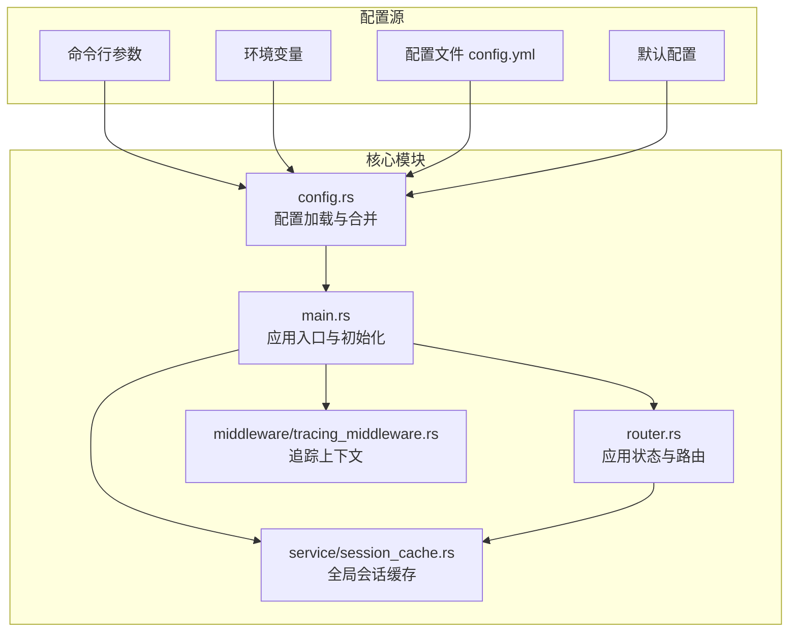
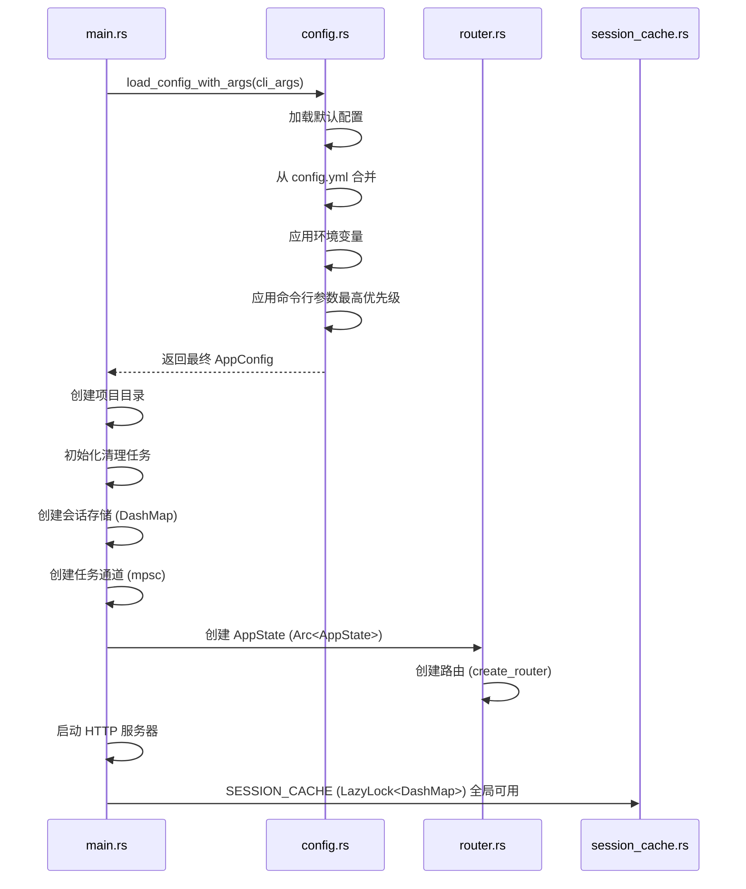
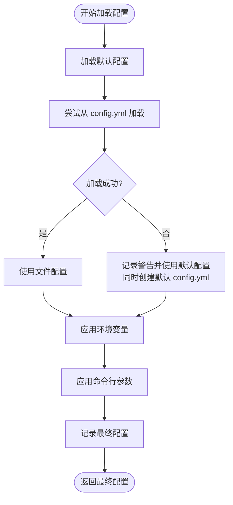
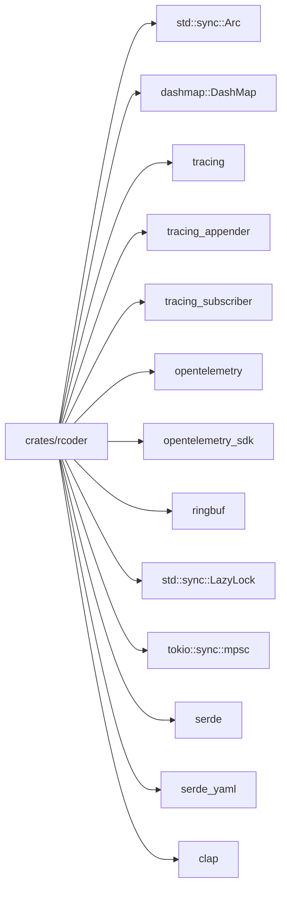

# 全局上下文构建

<cite>
**本文档中引用的文件**  
- [config.rs](file://crates/rcoder/src/config.rs)
- [main.rs](file://crates/rcoder/src/main.rs)
- [router.rs](file://crates/rcoder/src/router.rs)
- [session_cache.rs](file://crates/rcoder/src/service/session_cache.rs)
- [tracing_middleware.rs](file://crates/rcoder/src/middleware/tracing_middleware.rs)
</cite>

## 目录
1. [引言](#引言)  
2. [项目结构](#项目结构)  
3. [核心组件](#核心组件)  
4. [架构概览](#架构概览)  
5. [详细组件分析](#详细组件分析)  
6. [依赖分析](#依赖分析)  
7. [性能考量](#性能考量)  
8. [故障排除指南](#故障排除指南)  
9. [结论](#结论)

## 引言
本文档详细阐述了 `rcoder` 项目中全局上下文的构建机制，重点分析应用启动时如何初始化共享状态。文档涵盖配置加载优先级、同步原语的应用、全局资源注入方式以及错误处理策略，旨在为开发者提供清晰的系统理解与扩展指导。

## 项目结构
`rcoder` 是一个基于 Rust 的 AI 驱动开发平台，采用多 crate 模块化设计。其核心为 `crates/rcoder`，负责主服务、配置管理、会话处理和代理功能。全局上下文的构建主要集中在 `config`、`main`、`router` 和 `service` 等模块中。

**Diagram sources**
- [config.rs](file://crates/rcoder/src/config.rs#L1-L266)
- [main.rs](file://crates/rcoder/src/main.rs#L1-L220)
- [router.rs](file://crates/rcoder/src/router.rs#L1-L202)
- [session_cache.rs](file://crates/rcoder/src/service/session_cache.rs#L1-L96)
- [tracing_middleware.rs](file://crates/rcoder/src/middleware/tracing_middleware.rs#L1-L178)

**Section sources**
- [config.rs](file://crates/rcoder/src/config.rs#L1-L266)
- [main.rs](file://crates/rcoder/src/main.rs#L1-L220)

## 核心组件
本节分析全局上下文构建中的核心组件，包括配置结构体 `AppConfig`、应用状态 `AppState` 和全局会话缓存 `SESSION_CACHE`。

**Section sources**
- [config.rs](file://crates/rcoder/src/config.rs#L37-L48)
- [router.rs](file://crates/rcoder/src/router.rs#L45-L65)
- [session_cache.rs](file://crates/rcoder/src/service/session_cache.rs#L10-L15)

## 架构概览
系统在启动时通过 `main.rs` 的 `main` 函数协调各组件，构建全局共享状态。配置系统遵循多层优先级合并策略，最终的 `AppConfig` 与 `DashMap` 会话存储、任务通道等共同构成 `AppState`，并通过 `Arc` 安全地共享给所有服务组件。

**Diagram sources**
- [main.rs](file://crates/rcoder/src/main.rs#L30-L220)
- [config.rs](file://crates/rcoder/src/config.rs#L100-L266)
- [router.rs](file://crates/rcoder/src/router.rs#L68-L85)

## 详细组件分析
本节深入分析全局上下文构建的关键环节。

### 配置加载与多层优先级系统
`AppConfig` 结构体定义了应用的核心配置项。配置加载过程遵循严格的优先级顺序：**命令行参数 > 环境变量 > 配置文件 > 默认配置**。此策略确保了部署的灵活性，允许在不同环境中通过不同方式覆盖配置。

`load_config_with_args` 函数是此过程的核心。它首先创建一个默认配置，然后依次尝试从 `config.yml` 文件、环境变量（如 `RCODER_PORT`）和最终的命令行参数中进行覆盖。命令行参数具有最高优先级，可以覆盖所有其他来源的配置。

**Diagram sources**
- [config.rs](file://crates/rcoder/src/config.rs#L100-L266)

**Section sources**
- [config.rs](file://crates/rcoder/src/config.rs#L100-L266)

### 全局共享状态与同步原语
全局共享状态通过 `Arc<AppState>` 实现安全共享。`AppState` 结构体封装了所有需要跨组件访问的数据，包括 `AppConfig`、会话映射 `sessions`、任务发送器 `local_task_sender` 和代理服务引用。

- **`Arc` (原子引用计数)**: 用于在多个异步任务和组件之间安全地共享 `AppState` 的所有权。当 `Arc` 的引用计数降为零时，其管理的资源会被自动释放。
- **`DashMap`**: 用于 `sessions` 字段，提供高性能、线程安全的哈希映射。它比 `RwLock<HashMap>` 在高并发场景下表现更好，是管理活跃会话的理想选择。
- **`mpsc::UnboundedSender`**: 用于 `local_task_sender`，实现从 HTTP 处理器到本地任务运行时的异步消息传递，确保 `!Send` 的任务也能被安全调度。

### 全局资源注入
关键的全局资源通过 `AppState` 注入到各个服务组件中。

- **日志与追踪上下文**: 通过 `init_telemetry` 函数在启动时初始化 `tracing` 订阅者。`tracing_middleware` 中间件为每个 HTTP 请求创建带有唯一 `trace_id` 的 span，实现了请求级别的日志追踪。`trace_id` 被注入到 OpenTelemetry context 中，确保了跨组件的上下文传播。
- **会话缓存**: `SESSION_CACHE` 是一个 `LazyLock<DashMap<String, SessionData>>`，它在第一次被访问时初始化，并在整个应用生命周期内保持全局可用。`SessionData` 内部使用 `Mutex<HeapRb<T>>` (ringbuf) 来实现线程安全的循环消息缓冲区，用于存储每个会话的实时更新消息。
- **扩展自定义全局状态**: 开发者可以通过向 `AppState` 结构体添加新的字段来扩展全局状态。例如，可以添加一个数据库连接池或一个缓存客户端。新字段同样需要使用 `Arc` 包装以确保线程安全。

### 错误处理与早期退出
系统实现了健全的错误处理机制。在配置加载阶段，如果无法解析配置文件，会记录警告并继续使用默认配置，同时尝试创建一个新的默认配置文件。这保证了应用的韧性。

对于更严重的错误，如无法绑定监听端口或初始化关键服务失败，系统会通过 `anyhow::Result<()>` 返回错误，并在 `main` 函数中导致应用以非零状态码退出。例如，`tokio::net::TcpListener::bind` 和 `server_manager.start().await` 的错误都会导致程序终止，这是一种典型的早期退出策略，防止应用在不健康的状态下运行。

**Section sources**
- [main.rs](file://crates/rcoder/src/main.rs#L30-L220)
- [router.rs](file://crates/rcoder/src/router.rs#L45-L65)
- [session_cache.rs](file://crates/rcoder/src/service/session_cache.rs#L10-L96)
- [tracing_middleware.rs](file://crates/rcoder/src/middleware/tracing_middleware.rs#L1-L178)

## 依赖分析
`rcoder` 的全局上下文构建依赖于多个关键的外部 crate。

**Diagram sources**
- [main.rs](file://crates/rcoder/src/main.rs#L1-L20)
- [config.rs](file://crates/rcoder/src/config.rs#L1-L10)
- [session_cache.rs](file://crates/rcoder/src/service/session_cache.rs#L1-L5)

**Section sources**
- [main.rs](file://crates/rcoder/src/main.rs#L1-L220)
- [config.rs](file://crates/rcoder/src/config.rs#L1-L266)

## 性能考量
全局上下文的设计充分考虑了性能：
- 使用 `DashMap` 替代 `RwLock<HashMap>` 以减少高并发下的锁竞争。
- 使用 `ringbuf` 实现固定大小的循环缓冲区，避免了动态内存分配和消息无限增长的风险。
- `LazyLock` 确保全局资源（如 `SESSION_CACHE`）仅在首次使用时初始化，减少了启动开销。
- `Arc` 的克隆是轻量级的，仅增加引用计数，使得状态共享的开销极低。

## 故障排除指南
- **配置未生效**: 检查配置优先级。命令行参数会覆盖环境变量和配置文件。使用 `--help` 查看可用的命令行选项。
- **会话消息丢失**: `SESSION_CACHE` 使用的是固定大小的循环缓冲区（默认1000条）。如果消息产生速度远大于消费速度，旧消息会被覆盖。可通过增加 `SessionData::new(max_size)` 的 `max_size` 来缓解。
- **应用无法启动**: 检查端口是否被占用。查看日志文件（`logs/` 目录下）以获取详细的错误信息。确保 `projects_dir` 有正确的读写权限。
- **追踪信息缺失**: 确认 `init_telemetry` 已被调用，且 `tracing_middleware` 已正确添加到路由中。

**Section sources**
- [config.rs](file://crates/rcoder/src/config.rs#L100-L266)
- [main.rs](file://crates/rcoder/src/main.rs#L30-L220)
- [session_cache.rs](file://crates/rcoder/src/service/session_cache.rs#L10-L96)

## 结论
`rcoder` 的全局上下文构建是一个设计精良的系统，它通过 `Arc<AppState>` 和 `LazyLock` 等机制，安全、高效地管理了应用的共享状态。其配置系统灵活且健壮，支持多层优先级覆盖。全局资源如日志、追踪和会话缓存的注入方式清晰，为系统的可维护性和可扩展性奠定了坚实的基础。开发者可以遵循现有模式，轻松地向全局状态中添加自定义组件。