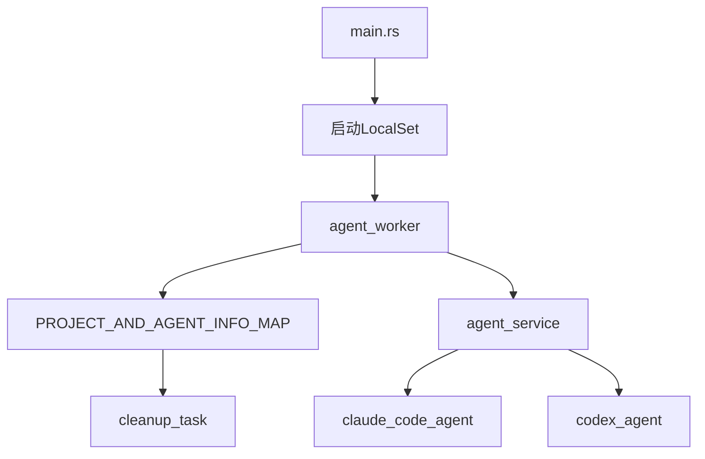
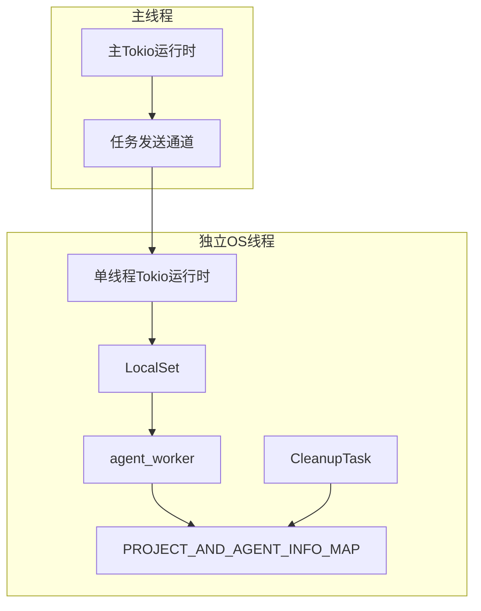
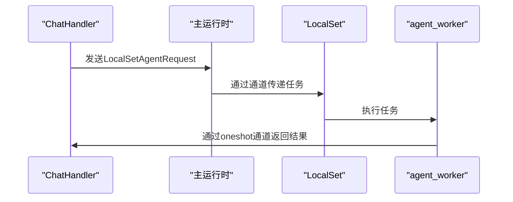
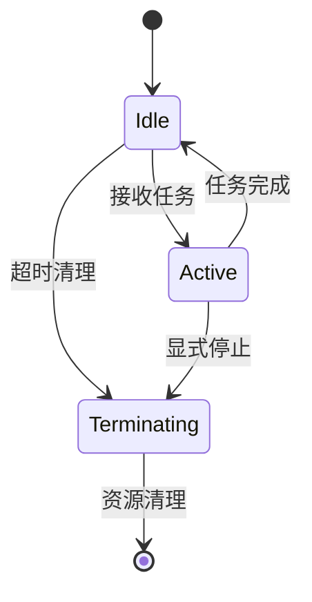
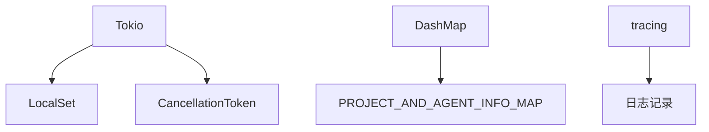

# 异步任务调度

<cite>
**本文档引用的文件**  
- [main.rs](file://crates/rcoder/src/main.rs)
- [acp_agent.rs](file://crates/rcoder/src/proxy_agent/acp_agent.rs)
- [cleanup_task.rs](file://crates/rcoder/src/proxy_agent/cleanup_task.rs)
- [agent_stop_handle.rs](file://crates/rcoder/src/proxy_agent/agent_stop_handle.rs)
- [agent_service.rs](file://crates/rcoder/src/proxy_agent/agent_service.rs)
- [mod.rs](file://crates/rcoder/src/proxy_agent/mod.rs)
</cite>

## 目录
1. [简介](#简介)
2. [项目结构](#项目结构)
3. [核心组件](#核心组件)
4. [架构概述](#架构概述)
5. [详细组件分析](#详细组件分析)
6. [依赖分析](#依赖分析)
7. [性能考量](#性能考量)
8. [故障排除指南](#故障排除指南)
9. [结论](#结论)

## 简介
本文档详细描述了在AI代理worker调度中使用`LocalSet`单线程运行时的异步任务调度机制。重点阐述了为何某些代理worker不具备`Send` trait，以及跨线程移动限制所带来的挑战。文档还说明了如何在Tokio多线程运行时中嵌套`LocalSet`以安全执行非`Send`任务，并提供任务提交、取消和监控的具体实现方式。结合代码示例展示了代理生命周期管理中的任务调度模式，包括心跳检测、超时清理和资源回收机制。最后讨论了调度性能瓶颈及优化策略，如批处理和优先级队列。

## 项目结构
项目采用模块化设计，主要功能集中在`crates/rcoder`目录下。核心代理调度逻辑分布在`proxy_agent`模块中，包括任务调度、生命周期管理和资源清理等功能。`main.rs`负责启动单线程Tokio运行时和`LocalSet`，用于运行不具备`Send` trait的代理worker。

**Diagram sources**
- [main.rs](file://crates/rcoder/src/main.rs#L45-L76)
- [acp_agent.rs](file://crates/rcoder/src/proxy_agent/acp_agent.rs#L160-L297)

**Section sources**
- [main.rs](file://crates/rcoder/src/main.rs#L45-L76)
- [acp_agent.rs](file://crates/rcoder/src/proxy_agent/acp_agent.rs#L124-L137)

## 核心组件
系统的核心组件包括`LocalSetAgentRequest`、`PROJECT_AND_AGENT_INFO_MAP`、`AgentLifecycleGuard`和`CleanupTask`。`LocalSetAgentRequest`封装了用户端发送的prompt请求和响应通道，用于在`LocalSet`中传递任务。`PROJECT_AND_AGENT_INFO_MAP`使用`DashMap`管理项目与代理信息的映射关系，支持并发访问。`AgentLifecycleGuard`遵循RAII原则，确保代理资源在生命周期结束时自动清理。`CleanupTask`定期扫描并清理闲置的代理实例，防止资源泄漏。

**Section sources**
- [acp_agent.rs](file://crates/rcoder/src/proxy_agent/acp_agent.rs#L128-L137)
- [agent_stop_handle.rs](file://crates/rcoder/src/proxy_agent/agent_stop_handle.rs#L17-L22)
- [cleanup_task.rs](file://crates/rcoder/src/proxy_agent/cleanup_task.rs#L0-L47)

## 架构概述
系统采用单线程Tokio运行时嵌套`LocalSet`的架构，以支持不具备`Send` trait的代理worker。主运行时通过无界通道将任务发送到独立OS线程中的`LocalSet`。`LocalSet`运行`agent_worker`，处理来自通道的任务请求。代理实例的状态和资源通过`PROJECT_AND_AGENT_INFO_MAP`集中管理，`AgentLifecycleGuard`确保资源的自动清理。`CleanupTask`定期检查并清理闲置的代理实例，维护系统资源的高效利用。

**Diagram sources**
- [main.rs](file://crates/rcoder/src/main.rs#L45-L76)
- [acp_agent.rs](file://crates/rcoder/src/proxy_agent/acp_agent.rs#L160-L297)
- [cleanup_task.rs](file://crates/rcoder/src/proxy_agent/cleanup_task.rs#L152-L206)

## 详细组件分析

### 任务调度机制
系统通过`LocalSet`实现对不具备`Send` trait的代理worker的安全调度。主运行时将任务封装为`LocalSetAgentRequest`，通过无界通道发送到独立OS线程中的`LocalSet`。`agent_worker`在`LocalSet`中运行，处理接收到的任务请求。

**Diagram sources**
- [chat_handler.rs](file://crates/rcoder/src/handler/chat_handler.rs#L205-L230)
- [acp_agent.rs](file://crates/rcoder/src/proxy_agent/acp_agent.rs#L160-L297)

**Section sources**
- [chat_handler.rs](file://crates/rcoder/src/handler/chat_handler.rs#L205-L230)
- [acp_agent.rs](file://crates/rcoder/src/proxy_agent/acp_agent.rs#L160-L297)

### 代理生命周期管理
代理生命周期由`AgentLifecycleGuard`管理，遵循RAII原则。当`AgentLifecycleGuard`被drop时，自动清理代理资源。`PROJECT_AND_AGENT_INFO_MAP`记录代理的活动状态，`CleanupTask`定期检查并清理闲置的代理实例。

**Diagram sources**
- [agent_stop_handle.rs](file://crates/rcoder/src/proxy_agent/agent_stop_handle.rs#L17-L22)
- [cleanup_task.rs](file://crates/rcoder/src/proxy_agent/cleanup_task.rs#L91-L113)

**Section sources**
- [agent_stop_handle.rs](file://crates/rcoder/src/proxy_agent/agent_stop_handle.rs#L17-L22)
- [cleanup_task.rs](file://crates/rcoder/src/proxy_agent/cleanup_task.rs#L49-L92)

## 依赖分析
系统依赖Tokio异步运行时、DashMap并发数据结构和tracing日志框架。`LocalSet`依赖于Tokio的单线程运行时，`PROJECT_AND_AGENT_INFO_MAP`依赖DashMap实现线程安全的并发访问。`AgentLifecycleGuard`依赖Tokio的`CancellationToken`实现优雅停止。

**Diagram sources**
- [main.rs](file://crates/rcoder/src/main.rs#L45-L76)
- [acp_agent.rs](file://crates/rcoder/src/proxy_agent/acp_agent.rs#L124-L126)
- [agent_stop_handle.rs](file://crates/rcoder/src/proxy_agent/agent_stop_handle.rs#L17-L22)

**Section sources**
- [main.rs](file://crates/rcoder/src/main.rs#L45-L76)
- [acp_agent.rs](file://crates/rcoder/src/proxy_agent/acp_agent.rs#L124-L126)

## 性能考量
系统通过`LocalSet`避免了跨线程通信的开销，提高了不具备`Send` trait的代理worker的执行效率。`CleanupTask`的定期清理机制防止了资源泄漏，但可能引入轻微的延迟。建议根据实际负载调整清理间隔和超时时间，以平衡资源利用率和响应性能。

**Section sources**
- [cleanup_task.rs](file://crates/rcoder/src/proxy_agent/cleanup_task.rs#L0-L47)

## 故障排除指南
常见问题包括代理worker无法启动、任务提交失败和资源泄漏。检查日志中的错误信息，确认`LocalSet`运行正常，`PROJECT_AND_AGENT_INFO_MAP`中的代理状态正确，`CleanupTask`按预期运行。使用`AgentStatusResponse`接口查询代理状态，验证生命周期管理是否正常工作。

**Section sources**
- [app_error.rs](file://crates/rcoder/src/model/app_error.rs#L0-L24)
- [agent_model.rs](file://crates/rcoder/src/model/agent_model.rs#L286-L313)

## 结论
本文档详细描述了基于`LocalSet`的异步任务调度机制，解决了不具备`Send` trait的代理worker的调度难题。通过RAII原则的生命周期管理，确保了资源的安全清理。系统设计合理，性能良好，适用于需要运行非`Send`任务的AI代理调度场景。