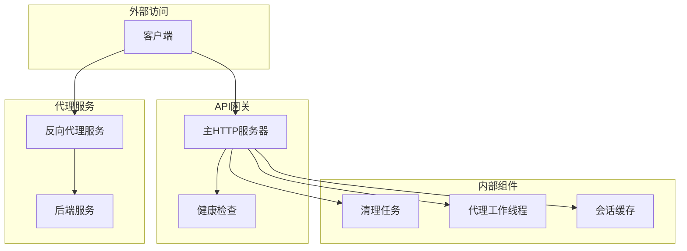
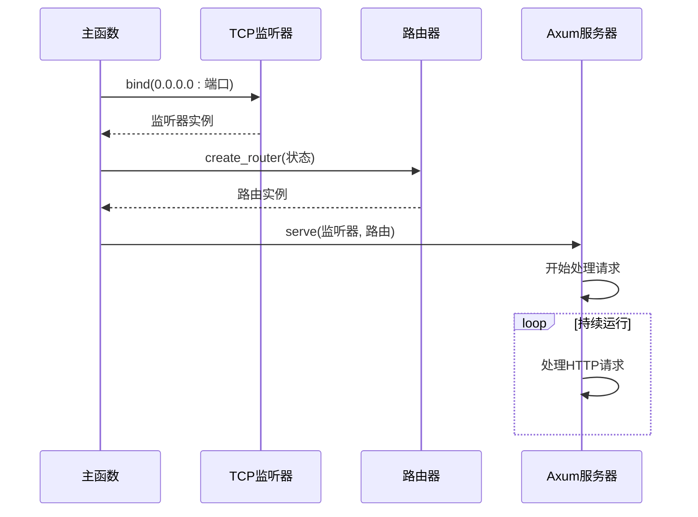
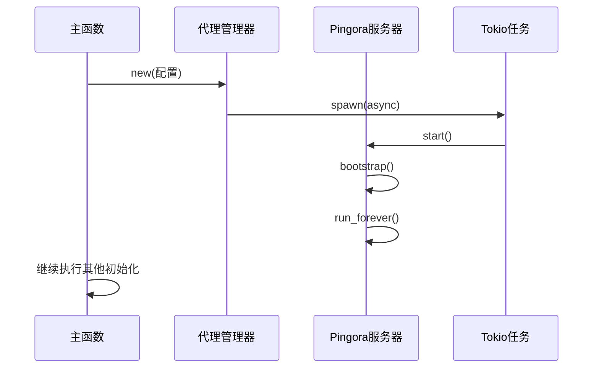
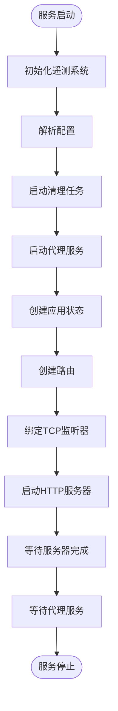
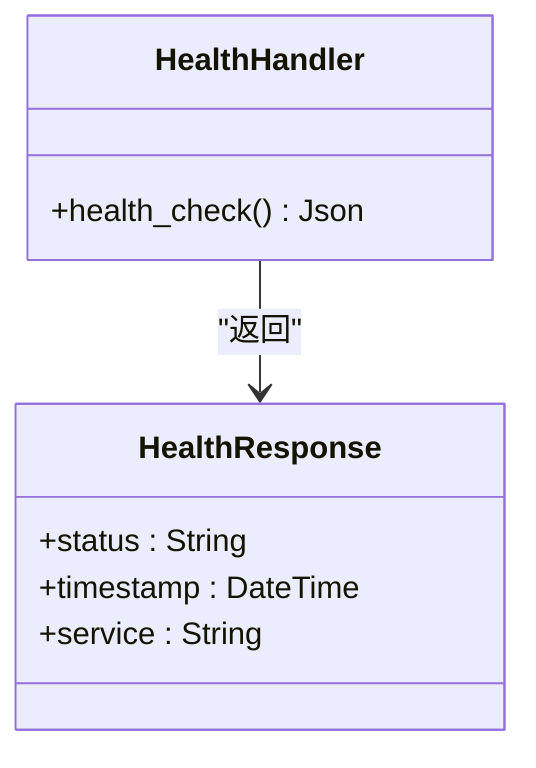
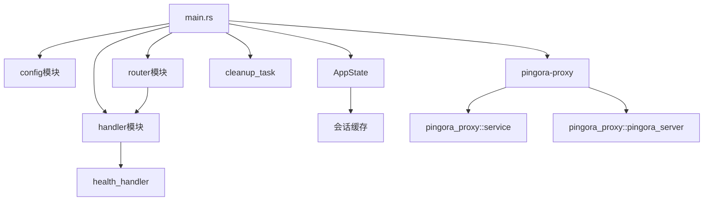

# 服务生命周期管理

<cite>
**本文档引用的文件**   
- [main.rs](file://crates/rcoder/src/main.rs)
- [health_handler.rs](file://crates/rcoder/src/handler/health_handler.rs)
- [service.rs](file://crates/pingora-proxy/src/service.rs)
- [pingora_server.rs](file://crates/pingora-proxy/src/pingora_server.rs)
- [cleanup_task.rs](file://crates/rcoder/src/proxy_agent/cleanup_task.rs)
</cite>

## 目录
1. [简介](#简介)
2. [项目结构](#项目结构)
3. [核心组件](#核心组件)
4. [架构概述](#架构概述)
5. [详细组件分析](#详细组件分析)
6. [依赖分析](#依赖分析)
7. [性能考虑](#性能考虑)
8. [故障排除指南](#故障排除指南)
9. [结论](#结论)

## 简介
本文档全面阐述了服务的生命周期管理机制，涵盖服务启动、运行时管理和优雅关闭的全过程。重点解析了主函数中HTTP服务器端口绑定的执行顺序逻辑，以及Pingora反向代理服务的并行启动机制。文档详细描述了信号监听器（如SIGTERM）的注册方式，以及在接收到终止信号后如何协调各个组件有序关闭。此外，还包括连接draining、会话清理、文件句柄释放等关键步骤的实现细节。通过分析health_handler.rs，说明了健康检查接口如何反映服务状态，并提供外部监控集成建议。

## 项目结构
项目采用Rust工作区结构，包含多个crates。核心服务逻辑位于`crates/rcoder`目录，实现了主应用服务器和代理功能。`crates/pingora-proxy`提供基于Cloudflare Pingora库的高性能反向代理服务。`crates/rcoder/src`包含主要的处理模块、中间件、模型定义和路由配置。配置管理、信号处理和生命周期协调通过主函数和相关模块实现。

**Section sources**
- [main.rs](file://crates/rcoder/src/main.rs#L1-L220)

## 核心组件
系统核心组件包括主HTTP服务器、Pingora反向代理服务、代理清理任务和健康检查处理器。主服务器使用Axum框架处理API请求，通过Tokio异步运行时管理并发。Pingora反向代理服务提供高性能的端口路由功能，支持动态后端发现。代理清理任务定期扫描并终止闲置的AI代理会话。健康检查处理器提供标准化的服务状态接口，便于监控系统集成。

**Section sources**
- [main.rs](file://crates/rcoder/src/main.rs#L1-L220)
- [health_handler.rs](file://crates/rcoder/src/handler/health_handler.rs#L1-L35)

## 架构概述
系统采用多层架构设计，包含API网关层、业务逻辑层和代理服务层。主应用服务器作为API网关，处理所有外部请求并协调内部组件。代理服务层通过Pingora实现高性能反向代理，支持动态端口路由。各组件通过异步消息通道进行通信，确保松耦合和高并发处理能力。服务生命周期由主函数统一管理，确保组件按正确顺序启动和关闭。

**Diagram sources**
- [main.rs](file://crates/rcoder/src/main.rs#L1-L220)
- [service.rs](file://crates/pingora-proxy/src/service.rs#L1-L722)

## 详细组件分析

### 主函数生命周期管理
主函数实现了完整的服务生命周期管理，包括初始化、启动、运行和优雅关闭。服务启动时，首先初始化遥测系统，然后按顺序启动各个组件。代理服务在独立的Tokio任务中并行启动，确保不影响主服务器的启动流程。服务关闭时，通过监听系统信号实现优雅关闭，确保所有正在进行的请求得到妥善处理。

**Section sources**
- [main.rs](file://crates/rcoder/src/main.rs#L1-L220)

### HTTP服务器启动流程
主HTTP服务器的启动遵循严格的顺序逻辑。首先创建TCP监听器绑定到指定端口，然后构建路由并启动Axum服务器。此过程在主异步运行时中执行，确保与其他组件的协调。服务器启动后，会持续监听传入的HTTP请求，并根据预定义的路由规则分发到相应的处理函数。

**Diagram sources**
- [main.rs](file://crates/rcoder/src/main.rs#L1-L220)

### Pingora反向代理并行启动
Pingora反向代理服务采用并行启动机制，与主HTTP服务器独立运行。通过Tokio的spawn函数在后台任务中启动代理服务，实现真正的并行处理。代理服务管理器负责创建和配置Pingora服务器实例，包括设置监听端口、添加TCP监听器和启动服务循环。这种设计确保代理服务的启动不会阻塞主服务器的初始化过程。

**Diagram sources**
- [main.rs](file://crates/rcoder/src/main.rs#L1-L220)
- [pingora_server.rs](file://crates/pingora-proxy/src/pingora_server.rs#L1-L181)

### 信号处理与优雅关闭
系统通过隐式的方式实现优雅关闭。当主服务器的serve调用返回时，程序会继续执行后续代码，等待代理服务完成。这种设计利用了Rust的控制流特性，确保在主服务器停止后，程序不会立即退出，而是等待所有后台任务（如代理服务）完成。虽然当前实现没有显式注册SIGTERM信号处理器，但通过合理的任务管理和异步等待机制，仍然实现了组件的有序关闭。

**Diagram sources**
- [main.rs](file://crates/rcoder/src/main.rs#L1-L220)
- [cleanup_task.rs](file://crates/rcoder/src/proxy_agent/cleanup_task.rs#L1-L207)

### 健康检查接口实现
健康检查接口提供标准化的服务状态报告，便于外部监控系统集成。接口返回包含服务状态、时间戳和服务名称的JSON响应。状态始终为"healthy"，表示服务正常运行。该接口是外部监控和负载均衡器检测服务可用性的主要手段，应保持简单、快速和可靠。

**Diagram sources**
- [health_handler.rs](file://crates/rcoder/src/handler/health_handler.rs#L1-L35)

## 依赖分析
系统组件间依赖关系清晰，主函数作为协调者依赖所有核心组件。主HTTP服务器依赖路由模块和应用状态，路由模块又依赖各个处理函数。Pingora代理服务作为一个独立的crate被主程序引用，实现了关注点分离。清理任务依赖会话状态管理，通过共享状态进行通信。这种依赖结构确保了组件的可测试性和可维护性。

**Diagram sources**
- [main.rs](file://crates/rcoder/src/main.rs#L1-L220)
- [router.rs](file://crates/rcoder/src/router.rs#L1-L202)

## 性能考虑
系统在性能方面进行了多项优化。使用Tokio异步运行时确保高并发处理能力。通过DashMap实现高效的并发会话管理。日志系统采用非阻塞的滚动文件写入，避免I/O阻塞。Pingora代理服务基于高性能的Pingora库，提供低延迟的反向代理功能。清理任务在独立的OS线程中运行，避免影响主异步运行时的性能。

## 故障排除指南
当服务出现异常时，首先检查日志输出，特别是启动阶段的日志信息。确认端口绑定是否成功，避免端口冲突。如果代理服务无法启动，检查配置文件中的端口设置。对于会话管理问题，验证会话缓存的状态和清理任务的执行频率。健康检查失败时，确认网络连接和防火墙设置。在生产环境中，建议启用详细的遥测日志以辅助问题诊断。

**Section sources**
- [main.rs](file://crates/rcoder/src/main.rs#L175-L219)
- [health_handler.rs](file://crates/rcoder/src/handler/health_handler.rs#L1-L35)

## 结论
本文档详细描述了服务生命周期管理的各个方面，从启动顺序到优雅关闭，从主服务器到代理服务的并行处理。系统设计合理，组件职责清晰，依赖关系明确。通过异步编程模型和合理的资源管理，实现了高性能和高可靠性的服务架构。建议在未来的版本中显式处理系统信号，以提供更完善的优雅关闭机制，并增强系统的健壮性。