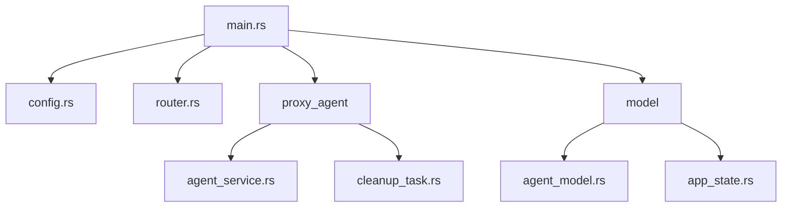
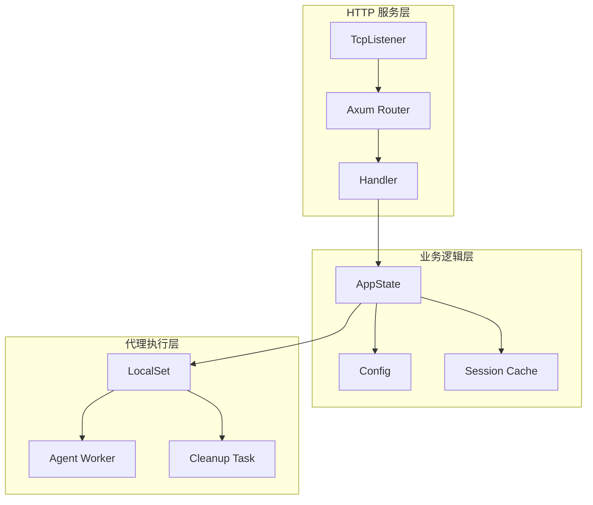
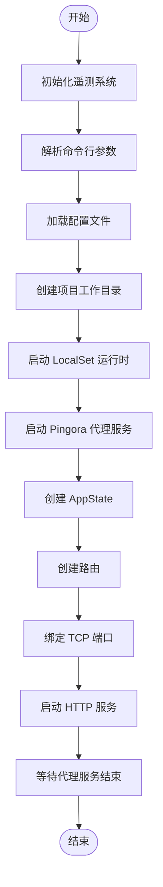
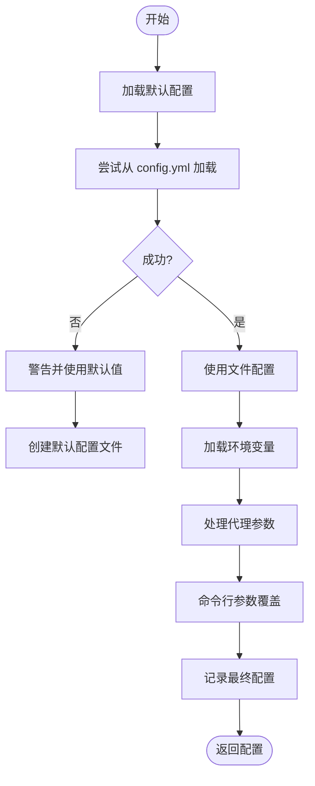
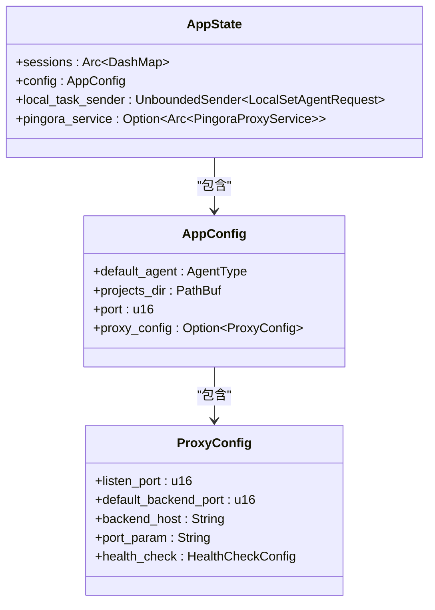
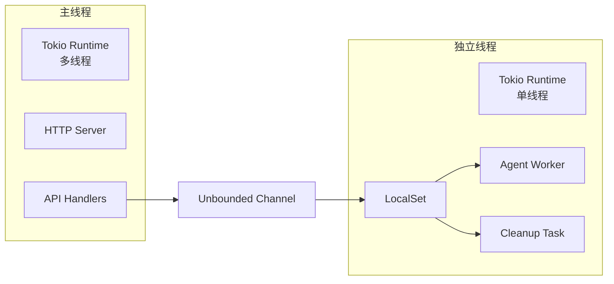
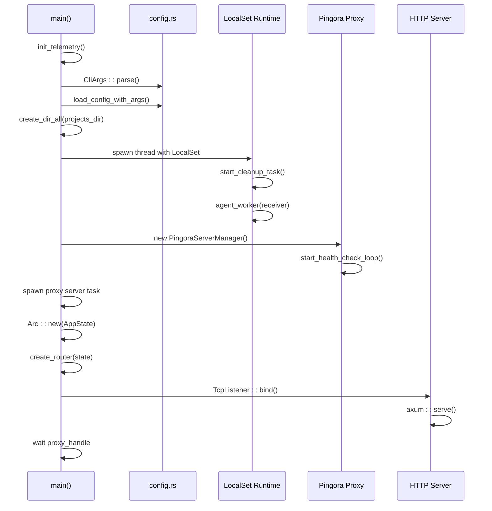
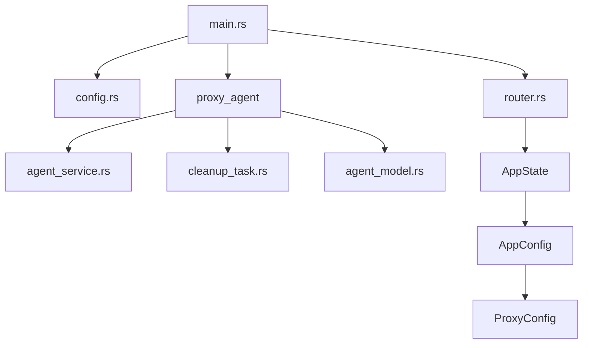

# 核心服务初始化

<cite>
**本文档中引用的文件**  
- [main.rs](file://crates/rcoder/src/main.rs)
- [config.rs](file://crates/rcoder/src/config.rs)
- [router.rs](file://crates/rcoder/src/router.rs)
- [agent_service.rs](file://crates/rcoder/src/proxy_agent/agent_service.rs)
- [cleanup_task.rs](file://crates/rcoder/src/proxy_agent/cleanup_task.rs)
- [agent_model.rs](file://crates/rcoder/src/model/agent_model.rs)
- [app_state.rs](file://crates/rcoder/src/model/app_state.rs)
</cite>

## 目录
1. [简介](#简介)
2. [项目结构](#项目结构)
3. [核心组件](#核心组件)
4. [架构概览](#架构概览)
5. [详细组件分析](#详细组件分析)
6. [依赖分析](#依赖分析)
7. [性能考虑](#性能考虑)
8. [故障排除指南](#故障排除指南)
9. [结论](#结论)

## 简介
本文档详细描述了 `rcoder` 主应用的核心服务初始化流程。重点分析了 `main` 函数如何初始化 Tokio 运行时、构建全局配置上下文、实现依赖注入机制，并配置异步任务调度器。文档涵盖 LocalSet 单线程运行时如何安全执行非 Send 类型的 AI 代理 worker，提供从二进制入口到 HTTP 服务器绑定端口的完整启动时序图。同时，详细说明了错误处理策略和优雅关闭机制的实现。

## 项目结构
`rcoder` 项目采用 Rust 的模块化 crate 结构，核心服务位于 `crates/rcoder` 目录下。主要模块包括配置管理、HTTP 路由、AI 代理服务、会话状态管理等。服务启动入口为 `main.rs`，通过 `tokio::main` 宏驱动异步运行时。

**图示来源**  
- [main.rs](file://crates/rcoder/src/main.rs#L1-L217)
- [config.rs](file://crates/rcoder/src/config.rs#L1-L267)
- [router.rs](file://crates/rcoder/src/router.rs#L1-L203)

**本节来源**  
- [main.rs](file://crates/rcoder/src/main.rs#L1-L217)
- [config.rs](file://crates/rcoder/src/config.rs#L1-L267)

## 核心组件
核心组件包括应用状态管理、配置加载、代理服务调度和清理任务。`AppState` 结构体封装了会话缓存、全局配置和任务通道，通过 `Arc` 实现跨线程共享。配置系统支持命令行参数、环境变量、配置文件和默认值的多级覆盖。

**本节来源**  
- [main.rs](file://crates/rcoder/src/main.rs#L25-L100)
- [router.rs](file://crates/rcoder/src/router.rs#L1-L203)
- [config.rs](file://crates/rcoder/src/config.rs#L1-L267)

## 架构概览
`rcoder` 服务采用分层架构，顶层为 HTTP 接口层，中间为业务逻辑层，底层为代理执行层。通过 `tokio::main` 启动多线程运行时，同时在独立 OS 线程中创建单线程 `LocalSet` 运行时，专门处理非 Send 类型的 AI 代理任务，实现安全的并发隔离。

**图示来源**  
- [main.rs](file://crates/rcoder/src/main.rs#L1-L217)
- [router.rs](file://crates/rcoder/src/router.rs#L1-L203)

## 详细组件分析

### 主函数初始化流程
`main` 函数是服务的入口点，负责初始化遥测系统、加载配置、创建工作目录、启动代理服务和 HTTP 服务器。

#### 初始化流程

**图示来源**  
- [main.rs](file://crates/rcoder/src/main.rs#L1-L217)

**本节来源**  
- [main.rs](file://crates/rcoder/src/main.rs#L1-L217)

### 配置系统
配置系统实现了多级优先级覆盖，支持命令行参数 > 环境变量 > 配置文件 > 默认配置的优先级顺序。

#### 配置加载流程

**图示来源**  
- [config.rs](file://crates/rcoder/src/config.rs#L1-L267)

**本节来源**  
- [config.rs](file://crates/rcoder/src/config.rs#L1-L267)

### 依赖注入与应用状态
应用状态通过 `AppState` 结构体集中管理，包含会话缓存、配置、任务发送器和代理服务引用，通过 `Arc` 实现跨组件共享。

#### 应用状态结构

**图示来源**  
- [router.rs](file://crates/rcoder/src/router.rs#L1-L203)
- [config.rs](file://crates/rcoder/src/config.rs#L1-L267)

**本节来源**  
- [router.rs](file://crates/rcoder/src/router.rs#L1-L203)
- [config.rs](file://crates/rcoder/src/config.rs#L1-L267)

### 异步任务调度器
服务采用双运行时架构：主线程使用多线程 Tokio 运行时处理 HTTP 请求，独立线程使用单线程 `LocalSet` 运行时处理非 Send 的 AI 代理任务。

#### 任务调度架构

**图示来源**  
- [main.rs](file://crates/rcoder/src/main.rs#L1-L217)
- [cleanup_task.rs](file://crates/rcoder/src/proxy_agent/cleanup_task.rs#L1-L208)

**本节来源**  
- [main.rs](file://crates/rcoder/src/main.rs#L1-L217)
- [cleanup_task.rs](file://crates/rcoder/src/proxy_agent/cleanup_task.rs#L1-L208)

### 服务启动时序
完整展示从 `main` 函数调用到 HTTP 服务器监听端口的全过程。

#### 启动时序图

**图示来源**  
- [main.rs](file://crates/rcoder/src/main.rs#L1-L217)
- [config.rs](file://crates/rcoder/src/config.rs#L1-L267)

**本节来源**  
- [main.rs](file://crates/rcoder/src/main.rs#L1-L217)

## 依赖分析
服务依赖关系清晰，`main.rs` 依赖 `config.rs`、`router.rs` 和 `proxy_agent` 模块，`proxy_agent` 又依赖 `agent_service.rs` 和 `cleanup_task.rs`。外部依赖包括 `tokio`、`axum`、`dashmap` 等异步运行时和 Web 框架。

**图示来源**  
- [main.rs](file://crates/rcoder/src/main.rs#L1-L217)
- [config.rs](file://crates/rcoder/src/config.rs#L1-L267)
- [router.rs](file://crates/rcoder/src/router.rs#L1-L203)

**本节来源**  
- [main.rs](file://crates/rcoder/src/main.rs#L1-L217)
- [config.rs](file://crates/rcoder/src/config.rs#L1-L267)

## 性能考虑
服务设计考虑了性能优化：使用 `DashMap` 实现高性能会话缓存，`UnboundedChannel` 实现零等待任务传递，`LocalSet` 避免跨线程同步开销。日志系统采用 `tracing_appender` 按天滚动，减少 I/O 压力。

## 故障排除指南
常见问题包括配置文件加载失败、端口占用、代理服务启动失败等。日志系统提供详细的启动过程记录，可通过 `RCODER_PORT` 环境变量覆盖端口配置，`enable_proxy` 命令行参数控制代理服务启停。

**本节来源**  
- [main.rs](file://crates/rcoder/src/main.rs#L1-L217)
- [config.rs](file://crates/rcoder/src/config.rs#L1-L267)

## 结论
`rcoder` 服务初始化设计合理，采用双运行时架构有效隔离了不同类型的异步任务，配置系统灵活可扩展，依赖注入清晰。通过详细的启动流程和错误处理机制，确保了服务的稳定性和可维护性。