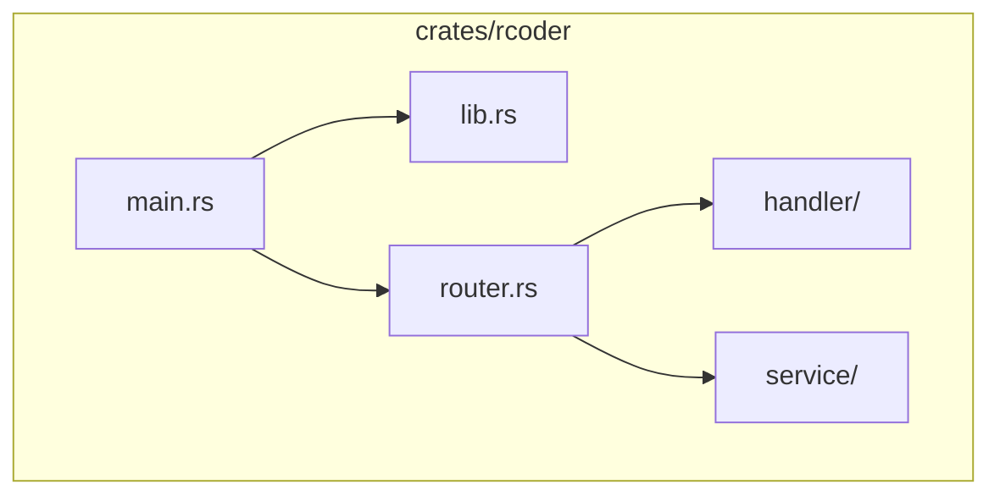
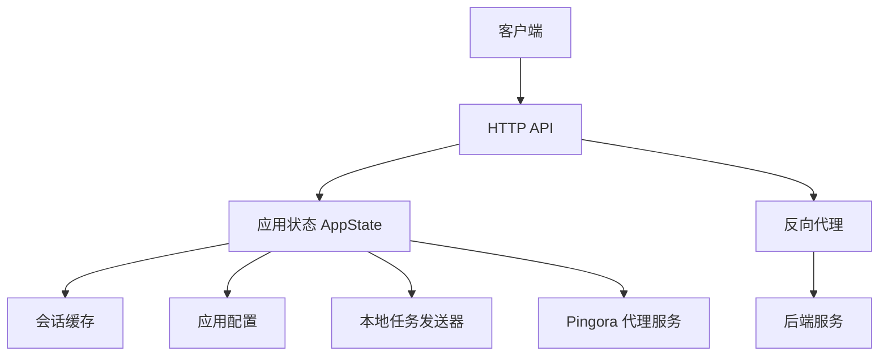
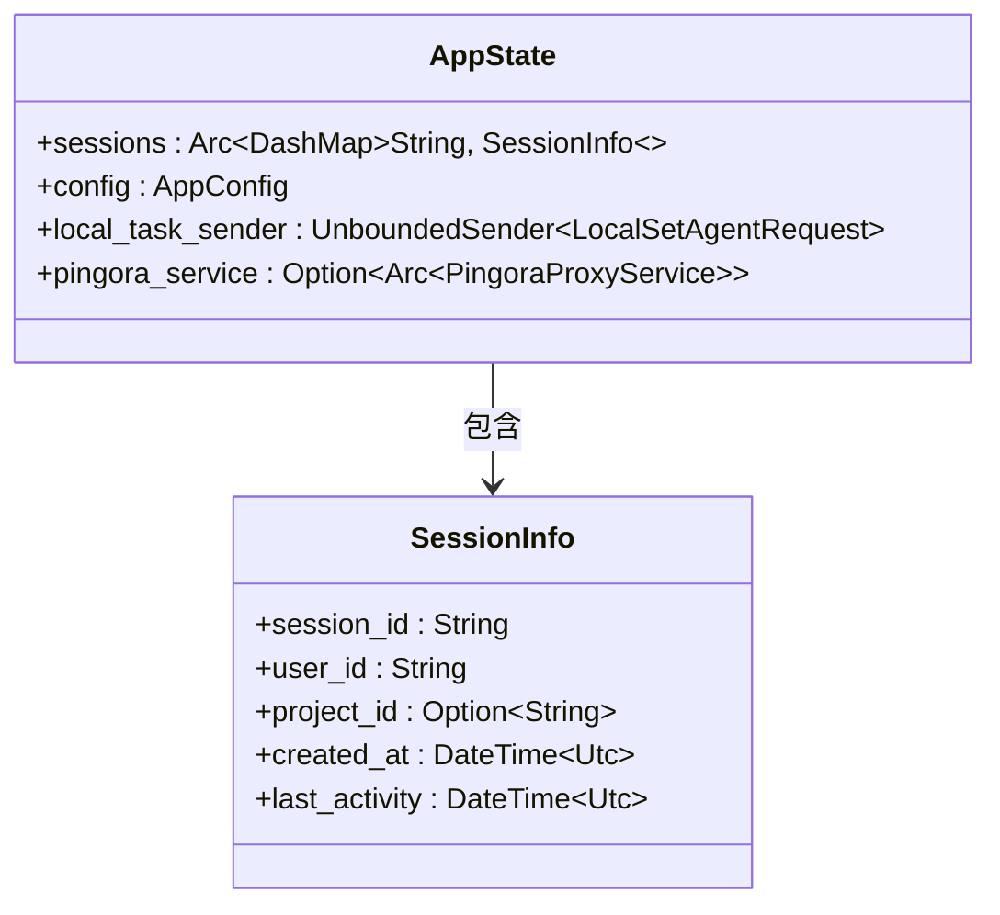
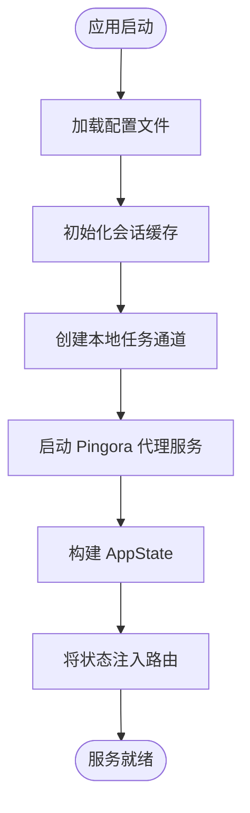
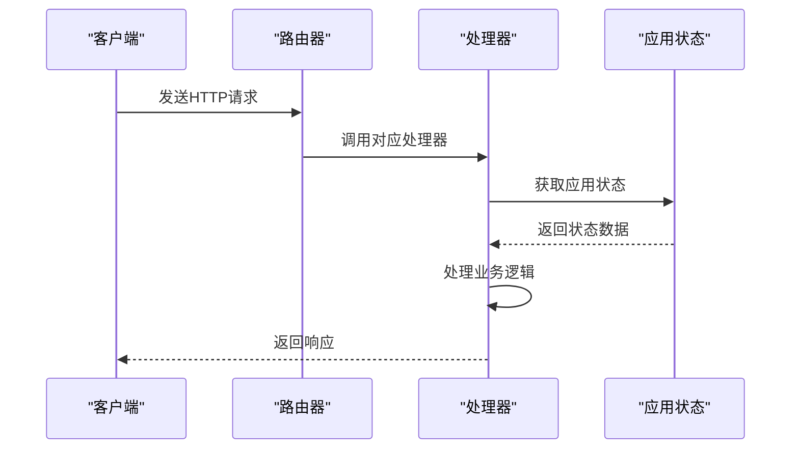
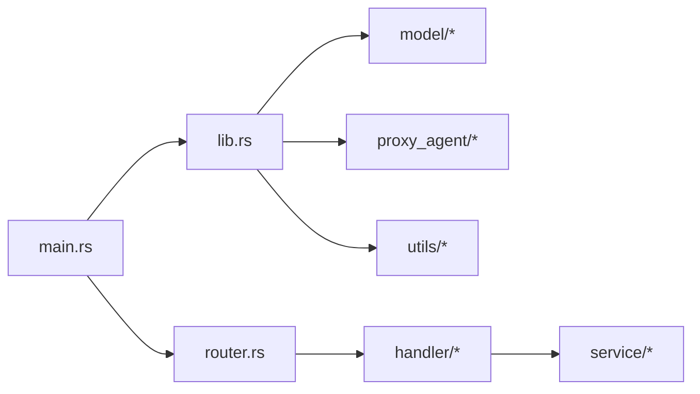

# 组件依赖注入

<cite>
**本文档引用的文件**
- [main.rs](file://crates/rcoder/src/main.rs)
- [lib.rs](file://crates/rcoder/src/lib.rs)
- [router.rs](file://crates/rcoder/src/router.rs)
- [session_cache.rs](file://crates/rcoder/src/service/session_cache.rs)
- [handler/mod.rs](file://crates/rcoder/src/handler/mod.rs)
</cite>

## 目录
1. [简介](#简介)
2. [项目结构](#项目结构)
3. [核心组件](#核心组件)
4. [架构概览](#架构概览)
5. [详细组件分析](#详细组件分析)
6. [依赖分析](#依赖分析)
7. [性能考虑](#性能考虑)
8. [故障排除指南](#故障排除指南)
9. [结论](#结论)

## 简介
本文档深入探讨了 `rcoder` 主应用中的组件依赖注入机制。重点分析了如何组织和注入各个功能模块，包括 `lib.rs` 中公共接口的导出方式，以及 `main.rs` 如何组合 HTTP 服务、代理管理器、会话缓存等组件。详细说明了 Axum 应用状态（AppState）的设计模式，涵盖其字段构成、线程安全保障及在请求处理器中的使用方法。结合实际代码展示服务间依赖关系的建立过程，如代理服务如何获取配置和日志句柄，并提供最佳实践建议，避免循环依赖和内存泄漏问题。

## 项目结构
`rcoder` 项目采用模块化设计，核心功能位于 `crates/rcoder` 目录下。主要模块包括：
- `handler`：HTTP 请求处理器
- `middleware`：中间件处理
- `model`：数据模型定义
- `proxy_agent`：代理服务管理
- `router`：路由配置
- `service`：核心服务
- `utils`：工具函数

**图示来源**
- [main.rs](file://crates/rcoder/src/main.rs#L1-L50)
- [lib.rs](file://crates/rcoder/src/lib.rs#L1-L15)
- [router.rs](file://crates/rcoder/src/router.rs#L1-L20)

**本节来源**
- [main.rs](file://crates/rcoder/src/main.rs#L1-L50)
- [lib.rs](file://crates/rcoder/src/lib.rs#L1-L15)

## 核心组件
`rcoder` 的核心组件包括应用状态管理、HTTP 路由、代理服务和会话缓存。这些组件通过依赖注入机制紧密协作，确保系统的高效运行。

**本节来源**
- [main.rs](file://crates/rcoder/src/main.rs#L25-L100)
- [router.rs](file://crates/rcoder/src/router.rs#L24-L37)

## 架构概览
`rcoder` 采用分层架构，通过 Axum 框架构建 HTTP 服务，利用 Pingora 实现高性能反向代理。应用状态（AppState）作为全局共享数据结构，贯穿整个请求处理流程。

**图示来源**
- [main.rs](file://crates/rcoder/src/main.rs#L150-L200)
- [router.rs](file://crates/rcoder/src/router.rs#L35-L70)

## 详细组件分析

### 应用状态分析
`AppState` 是 `rcoder` 的核心数据结构，封装了应用运行所需的所有共享状态。

#### 类图

**图示来源**
- [router.rs](file://crates/rcoder/src/router.rs#L24-L37)

#### 状态初始化流程

**图示来源**
- [main.rs](file://crates/rcoder/src/main.rs#L50-L150)

**本节来源**
- [main.rs](file://crates/rcoder/src/main.rs#L50-L200)
- [router.rs](file://crates/rcoder/src/router.rs#L24-L37)

### 处理器模块分析
处理器模块负责处理具体的 HTTP 请求，通过依赖注入获取应用状态。

#### 请求处理序列图

**图示来源**
- [router.rs](file://crates/rcoder/src/router.rs#L35-L70)
- [handler/mod.rs](file://crates/rcoder/src/handler/mod.rs#L1-L15)

**本节来源**
- [router.rs](file://crates/rcoder/src/router.rs#L35-L70)
- [handler/mod.rs](file://crates/rcoder/src/handler/mod.rs#L1-L15)

## 依赖分析
`rcoder` 通过模块化设计和依赖注入实现组件间的松耦合。`lib.rs` 通过重新导出关键模块，为外部使用提供统一接口。

**图示来源**
- [lib.rs](file://crates/rcoder/src/lib.rs#L10-L15)
- [main.rs](file://crates/rcoder/src/main.rs#L1-L20)

**本节来源**
- [lib.rs](file://crates/rcoder/src/lib.rs#L1-L15)
- [main.rs](file://crates/rcoder/src/main.rs#L1-L50)

## 性能考虑
`rcoder` 在设计时充分考虑了性能因素：
- 使用 `Arc` 和 `DashMap` 实现线程安全的共享状态
- 通过 `tokio::sync::mpsc` 实现高效的异步消息传递
- 采用 `LazyLock` 延迟初始化全局资源
- 使用 `ringbuf` 实现高效的循环消息缓冲

## 故障排除指南
常见问题及解决方案：
- **会话丢失**：检查 `SESSION_CACHE` 是否正确初始化
- **代理服务未启动**：确认 `proxy_config` 配置正确
- **内存泄漏**：确保 `DashMap` 中的过期会话被及时清理
- **性能下降**：监控 `pingora_service` 的指标数据

**本节来源**
- [session_cache.rs](file://crates/rcoder/src/service/session_cache.rs#L1-L33)
- [main.rs](file://crates/rcoder/src/main.rs#L100-L150)

## 结论
`rcoder` 的组件依赖注入机制设计精良，通过 `AppState` 统一管理共享状态，实现了组件间的高效协作。模块化设计和清晰的依赖关系使得系统易于维护和扩展。建议在使用时遵循最佳实践，避免循环依赖，合理管理资源生命周期。