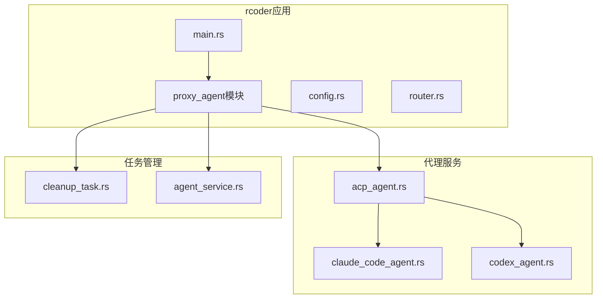
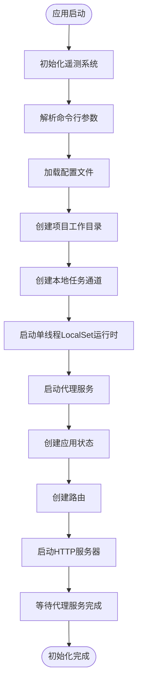
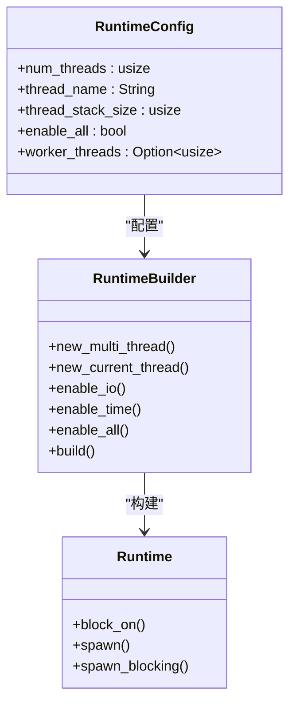
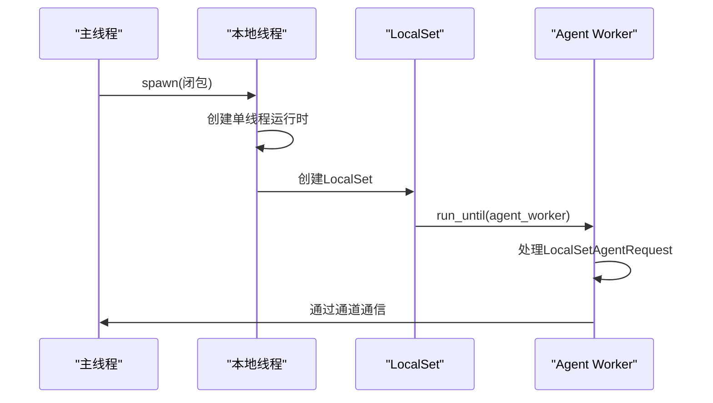
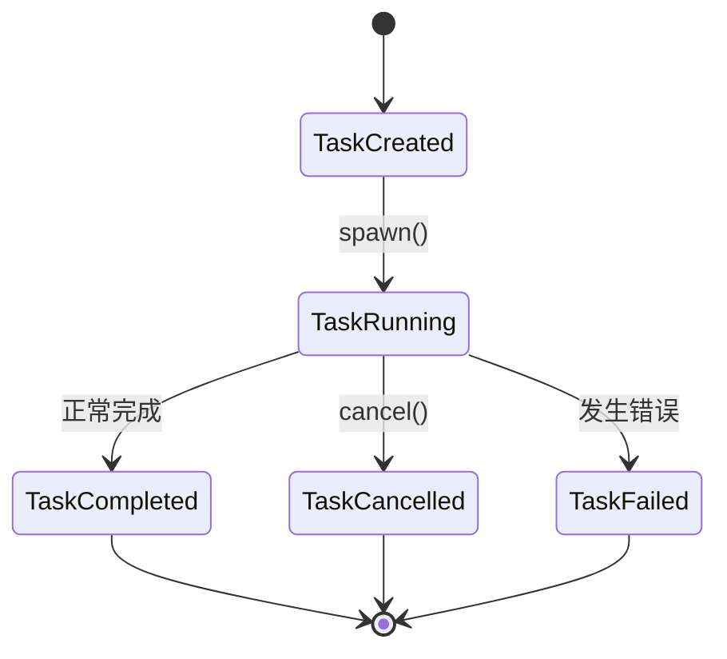
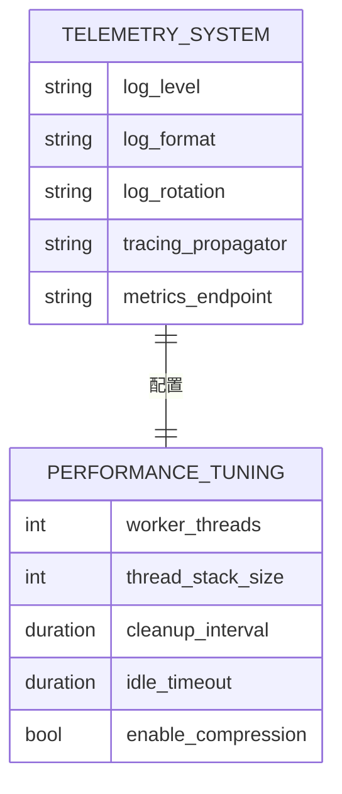

# 运行时初始化

<cite>
**本文档中引用的文件**   
- [main.rs](file://crates/rcoder/src/main.rs)
- [acp_agent.rs](file://crates/rcoder/src/proxy_agent/acp_agent.rs)
- [cleanup_task.rs](file://crates/rcoder/src/proxy_agent/cleanup_task.rs)
- [claude_code_agent.rs](file://crates/rcoder/src/proxy_agent/claude_code_agent.rs)
- [agent_service.rs](file://crates/rcoder/src/proxy_agent/agent_service.rs)
</cite>

## 目录
1. [项目结构](#项目结构)
2. [核心组件](#核心组件)
3. [运行时初始化流程](#运行时初始化流程)
4. [多线程Tokio运行时配置](#多线程tokio运行时配置)
5. [单线程LocalSet设计](#单线程localset设计)
6. [服务初始化与任务管理](#服务初始化与任务管理)
7. [异步任务生命周期管理](#异步任务生命周期管理)
8. [运行时钩子与性能调优](#运行时钩子与性能调优)

## 项目结构

**图示来源**
- [main.rs](file://crates/rcoder/src/main.rs#L1-L220)
- [proxy_agent](file://crates/rcoder/src/proxy_agent/mod.rs#L1-L217)

**本节来源**
- [main.rs](file://crates/rcoder/src/main.rs#L1-L220)
- [project_structure](file://./#L1-L100)

## 核心组件

rcoder应用的核心组件围绕Tokio异步运行时构建，主要包括主应用服务、代理服务管理和清理任务三大模块。主应用通过Axum框架提供HTTP接口，代理服务处理AI代理的生命周期，清理任务负责回收闲置资源。

**本节来源**
- [main.rs](file://crates/rcoder/src/main.rs#L1-L220)
- [proxy_agent](file://crates/rcoder/src/proxy_agent/mod.rs#L1-L217)

## 运行时初始化流程

rcoder应用的运行时初始化流程始于`main.rs`文件中的`#[tokio::main]`宏。该宏启动一个多线程Tokio运行时，执行异步的`main`函数。初始化过程包括遥测系统设置、配置加载、工作目录创建和代理服务启动等关键步骤。

**图示来源**
- [main.rs](file://crates/rcoder/src/main.rs#L1-L220)

**本节来源**
- [main.rs](file://crates/rcoder/src/main.rs#L1-L220)

## 多线程Tokio运行时配置

主应用使用`#[tokio::main]`宏配置多线程Tokio运行时，该宏在编译时生成适当的运行时初始化代码。多线程运行时默认启用所有功能（I/O、定时器等），并根据系统核心数自动配置工作线程。

**图示来源**
- [main.rs](file://crates/rcoder/src/main.rs#L55-L60)

**本节来源**
- [main.rs](file://crates/rcoder/src/main.rs#L1-L220)

## 单线程LocalSet设计

为处理非Send类型的AI代理worker，应用创建了一个独立的单线程Tokio运行时，并在其上运行`LocalSet`。这种设计允许在特定线程上执行不能跨线程移动的任务，确保AI代理worker的稳定运行。

**图示来源**
- [main.rs](file://crates/rcoder/src/main.rs#L55-L65)
- [acp_agent.rs](file://crates/rcoder/src/proxy_agent/acp_agent.rs#L1-L298)

**本节来源**
- [main.rs](file://crates/rcoder/src/main.rs#L50-L70)
- [acp_agent.rs](file://crates/rcoder/src/proxy_agent/acp_agent.rs#L1-L298)

## 服务初始化与任务管理

应用通过通道机制在不同运行时之间通信。主运行时通过`unbounded_channel`向LocalSet中的agent worker发送请求，实现了跨运行时的任务调度。这种设计分离了HTTP服务和代理服务的关注点。

**图示来源**
- [main.rs](file://crates/rcoder/src/main.rs#L50-L70)
- [acp_agent.rs](file://crates/rcoder/src/proxy_agent/acp_agent.rs#L1-L298)

**本节来源**
- [main.rs](file://crates/rcoder/src/main.rs#L50-L70)
- [acp_agent.rs](file://crates/rcoder/src/proxy_agent/acp_agent.rs#L1-L298)

## 异步任务生命周期管理

应用使用`JoinHandle`管理异步任务的生命周期。代理服务通过`tokio::spawn`启动，并返回`JoinHandle`用于等待任务完成。清理任务使用`spawn_local`在LocalSet中运行，确保与特定运行时绑定。

**图示来源**
- [cleanup_task.rs](file://crates/rcoder/src/proxy_agent/cleanup_task.rs#L1-L208)
- [main.rs](file://crates/rcoder/src/main.rs#L1-L220)

**本节来源**
- [cleanup_task.rs](file://crates/rcoder/src/proxy_agent/cleanup_task.rs#L1-L208)
- [main.rs](file://crates/rcoder/src/main.rs#L1-L220)

## 运行时钩子与性能调优

应用通过`init_telemetry`函数注册运行时钩子，配置了结构化日志和分布式追踪系统。性能调优方面，建议根据实际负载调整工作线程数，并监控LocalSet中的任务执行情况。

**图示来源**
- [main.rs](file://crates/rcoder/src/main.rs#L175-L219)
- [cleanup_task.rs](file://crates/rcoder/src/proxy_agent/cleanup_task.rs#L1-L208)

**本节来源**
- [main.rs](file://crates/rcoder/src/main.rs#L175-L219)
- [cleanup_task.rs](file://crates/rcoder/src/proxy_agent/cleanup_task.rs#L1-L208)