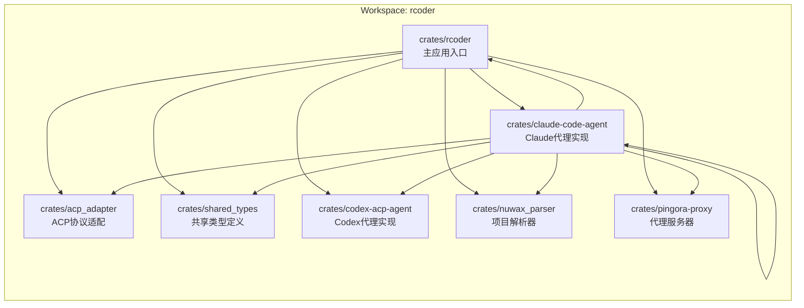
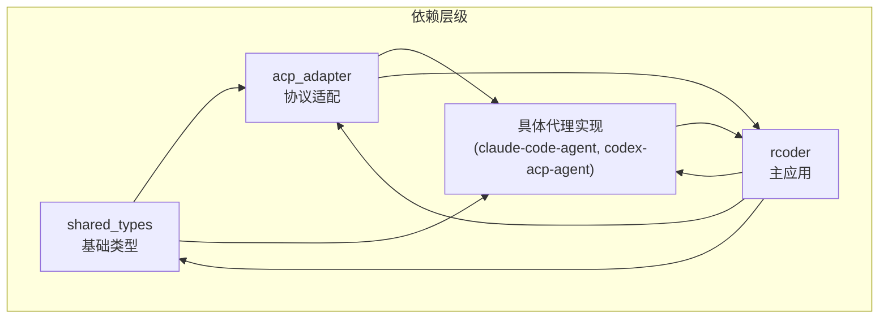
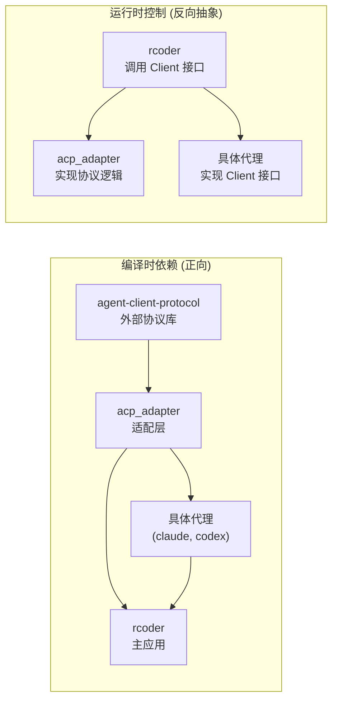

# Crate依赖关系

<cite>
**本文档中引用的文件**  
- [Cargo.toml](file://Cargo.toml)
- [Cargo.lock](file://Cargo.lock)
- [rcoder/Cargo.toml](file://crates/rcoder/Cargo.toml)
- [acp_adapter/Cargo.toml](file://crates/acp_adapter/Cargo.toml)
- [shared_types/Cargo.toml](file://crates/shared_types/Cargo.toml)
- [claude-code-agent/Cargo.toml](file://crates/claude-code-agent/Cargo.toml)
- [codex-acp-agent/Cargo.toml](file://crates/codex-acp-agent/Cargo.toml)
- [rcoder/src/lib.rs](file://crates/rcoder/src/lib.rs)
- [rcoder/src/proxy_agent/mod.rs](file://crates/rcoder/src/proxy_agent/mod.rs)
- [acp_adapter/src/lib.rs](file://crates/acp_adapter/src/lib.rs)
- [shared_types/src/lib.rs](file://crates/shared_types/src/lib.rs)
- [claude-code-agent/src/lib.rs](file://crates/claude-code-agent/src/lib.rs)
- [codex-acp-agent/src/lib.rs](file://crates/codex-acp-agent/src/lib.rs)
</cite>

## 目录
1. [引言](#引言)
2. [项目结构](#项目结构)
3. [核心组件](#核心组件)
4. [架构概览](#架构概览)
5. [详细组件分析](#详细组件分析)
6. [依赖分析](#依赖分析)
7. [性能考量](#性能考量)
8. [故障排除指南](#故障排除指南)
9. [结论](#结论)

## 引言
本文档深入分析了 `rcoder` 工作区中各 crate 之间的编译时依赖与运行时调用关系。重点阐述了主 crate `rcoder` 如何通过 `acp_adapter` 实现协议转换，如何利用 `shared_types` 实现跨 crate 类型共享，以及 `claude-code-agent` 与 `codex-acp-agent` 如何实现统一接口。文档绘制了详细的依赖图谱，标识了正向依赖与反向抽象，并解释了依赖隔离原则的应用。结合 `Cargo.lock` 和 `Cargo.toml` 文件，说明了版本锁定策略、可选功能开关（features）的使用方式，并提供了新增外部依赖的审查流程指南。

## 项目结构
`rcoder` 项目采用多 crate 工作区（workspace）结构，核心功能被拆分为多个独立的 crate，以实现模块化和职责分离。工作区根目录下的 `Cargo.toml` 定义了所有成员 crate，而每个 crate 拥有自己独立的 `Cargo.toml` 文件来管理其特定依赖。

**图示来源**
- [Cargo.toml](file://Cargo.toml#L1-L10)
- [项目结构](file://#L1-L100)

**本节来源**
- [Cargo.toml](file://Cargo.toml#L1-L174)
- [项目结构](file://#L1-L100)

## 核心组件
`rcoder` 工作区的核心组件包括主应用 `rcoder`、协议适配器 `acp_adapter`、共享类型库 `shared_types` 以及两个具体的 AI 代理实现 `claude-code-agent` 和 `codex-acp-agent`。`rcoder` 作为主 crate，负责集成和协调所有其他组件。`acp_adapter` 提供了与 ACP (Agent Client Protocol) 协议交互的通用功能。`shared_types` 则封装了跨多个 crate 共享的数据模型和类型，确保了类型一致性。

**本节来源**
- [Cargo.toml](file://Cargo.toml#L1-L174)
- [rcoder/Cargo.toml](file://crates/rcoder/Cargo.toml#L1-L79)
- [acp_adapter/Cargo.toml](file://crates/acp_adapter/Cargo.toml#L1-L29)
- [shared_types/Cargo.toml](file://crates/shared_types/Cargo.toml#L1-L16)

## 架构概览
整个系统的架构遵循了清晰的依赖层次。`rcoder` 主 crate 位于顶层，直接或间接依赖于所有其他功能 crate。`acp_adapter` 作为协议转换层，被 `rcoder` 和具体的代理实现所依赖。`shared_types` 作为基础类型库，被需要共享数据结构的 crate 所引用。两个代理实现 `claude-code-agent` 和 `codex-acp-agent` 都实现了与 ACP 协议兼容的接口，从而可以在 `rcoder` 中被统一管理和调用。

**图示来源**
- [Cargo.toml](file://Cargo.toml#L1-L174)
- [rcoder/Cargo.toml](file://crates/rcoder/Cargo.toml#L1-L79)
- [acp_adapter/Cargo.toml](file://crates/acp_adapter/Cargo.toml#L1-L29)
- [shared_types/Cargo.toml](file://crates/shared_types/Cargo.toml#L1-L16)

## 详细组件分析

### rcoder 主 crate 分析
`rcoder` 是整个应用的主 crate，它负责集成所有功能模块。其 `Cargo.toml` 文件清晰地列出了对内部 crate 的依赖，包括 `shared_types`、`acp-adapter`、`codex-acp-agent` 和 `claude-code-agent`。这表明 `rcoder` 在编译时直接依赖这些组件。在运行时，`rcoder` 通过 `proxy_agent` 模块与这些代理进行交互。`proxy_agent` 模块中的 `acp_agent` 组件实现了 `agent_client_protocol::Client` trait，作为 ACP 协议的客户端，处理来自代理的会话通知、文件读写等请求。

**本节来源**
- [rcoder/Cargo.toml](file://crates/rcoder/Cargo.toml#L1-L79)
- [rcoder/src/lib.rs](file://crates/rcoder/src/lib.rs#L1-L17)
- [rcoder/src/proxy_agent/mod.rs](file://crates/rcoder/src/proxy_agent/mod.rs#L1-L217)

### acp_adapter 协议转换分析
`acp_adapter` crate 的核心作用是为上层应用提供一个与 ACP 协议解耦的接口。它依赖于 `agent-client-protocol` 这个外部库来定义协议的具体结构。`acp_adapter` 本身不直接与 AI 模型通信，而是作为一个中间层，将 `rcoder` 或具体代理的业务逻辑转换为符合 ACP 协议的消息。其 `lib.rs` 文件导出了 `types` 模块中的各种状态和更新类型，如 `ConnectionState`、`SessionState` 和 `StreamUpdate`，这些类型被上层 crate 用来表示和处理协议状态。

**本节来源**
- [acp_adapter/Cargo.toml](file://crates/acp_adapter/Cargo.toml#L1-L29)
- [acp_adapter/src/lib.rs](file://crates/acp_adapter/src/lib.rs#L1-L13)

### shared_types 类型共享分析
`shared_types` crate 是一个纯粹的类型定义库，它不包含任何业务逻辑，只负责定义跨 crate 共享的数据结构。其 `Cargo.toml` 文件显示它依赖于 `serde`、`uuid` 和 `agent-client-protocol` 等基础库，以支持序列化和协议兼容性。`src/lib.rs` 文件导出了 `model` 模块中的 `ModelApiProtocol`、`ModelProviderConfig` 和 `ModelProviderSafeInfo` 等类型。这些类型被 `rcoder` 和其他代理 crate 使用，确保了在整个工作区中对模型配置等信息的表示是一致的，避免了类型重复定义和潜在的不一致。

**本节来源**
- [shared_types/Cargo.toml](file://crates/shared_types/Cargo.toml#L1-L16)
- [shared_types/src/lib.rs](file://crates/shared_types/src/lib.rs#L1-L4)

### 统一接口实现分析
`claude-code-agent` 和 `codex-acp-agent` 这两个 crate 都实现了与 ACP 协议兼容的代理功能。它们的 `Cargo.toml` 文件都声明了对 `acp-adapter` 和 `agent-client-protocol` 的依赖，这表明它们都遵循了相同的协议规范。`claude-code-agent` 的 `lib.rs` 文件表明它通过 `util` 模块提供功能，而 `codex-acp-agent` 的 `lib.rs` 文件则导出了 `agent` 模块中的 `CodexAgent` 结构体。尽管它们的后端实现不同（分别对接 Claude 和 Codex），但通过依赖 `acp_adapter` 并实现 `agent_client_protocol` 定义的接口，它们向 `rcoder` 主 crate 暴露了统一的调用方式，实现了接口的统一。

**本节来源**
- [claude-code-agent/Cargo.toml](file://crates/claude-code-agent/Cargo.toml#L1-L46)
- [claude-code-agent/src/lib.rs](file://crates/claude-code-agent/src/lib.rs#L1-L9)
- [codex-acp-agent/Cargo.toml](file://crates/codex-acp-agent/Cargo.toml#L1-L54)
- [codex-acp-agent/src/lib.rs](file://crates/codex-acp-agent/src/lib.rs#L1-L11)

## 依赖分析
工作区的依赖关系清晰地体现了正向依赖与反向抽象的原则。正向依赖指编译时的依赖方向，例如 `rcoder` 编译时依赖 `acp_adapter`，`acp_adapter` 编译时依赖 `agent-client-protocol`。反向抽象则体现在运行时的行为上，`rcoder` 通过 `AcpAgentClient` 结构体实现了 `agent_client_protocol::Client` trait，这意味着 `rcoder`（高层模块）定义了它所依赖的接口，而 `acp_adapter` 和具体的代理（低层模块）则负责实现这些接口，从而实现了依赖倒置。

**图示来源**
- [Cargo.toml](file://Cargo.toml#L1-L174)
- [rcoder/Cargo.toml](file://crates/rcoder/Cargo.toml#L1-L79)
- [acp_adapter/Cargo.toml](file://crates/acp_adapter/Cargo.toml#L1-L29)
- [rcoder/src/proxy_agent/mod.rs](file://crates/rcoder/src/proxy_agent/mod.rs#L1-L217)

**本节来源**
- [Cargo.toml](file://Cargo.toml#L1-L174)
- [Cargo.lock](file://Cargo.lock#L1-L6426)
- [rcoder/Cargo.toml](file://crates/rcoder/Cargo.toml#L1-L79)
- [acp_adapter/Cargo.toml](file://crates/acp_adapter/Cargo.toml#L1-L29)
- [rcoder/src/proxy_agent/mod.rs](file://crates/rcoder/src/proxy_agent/mod.rs#L1-L217)

## 性能考量
由于 `rcoder` 工作区大量使用了异步运行时（`tokio`）和高效的序列化库（`serde`），整体架构具备良好的并发处理能力。`acp_adapter` 作为协议适配层，其设计应尽量轻量，避免成为性能瓶颈。`shared_types` 库通过共享类型减少了不必要的数据转换和内存拷贝。然而，具体的性能表现还需通过实际的压力测试来评估，特别是代理与主应用之间的消息传递延迟和吞吐量。

## 故障排除指南
当遇到依赖相关的问题时，首先应检查 `Cargo.toml` 文件中的版本是否与 `Cargo.lock` 文件锁定的版本一致。如果出现编译错误，应确认依赖的 crate 是否正确地导出了所需的模块和类型。对于运行时的协议通信问题，可以检查 `rcoder` 中 `AcpAgentClient` 的实现是否正确处理了所有 `agent_client_protocol` 定义的方法。日志信息（通过 `tracing` 库）是诊断问题的关键，应关注 `debug` 和 `error` 级别的日志输出。

**本节来源**
- [Cargo.toml](file://Cargo.toml#L1-L174)
- [Cargo.lock](file://Cargo.lock#L1-L6426)
- [rcoder/src/proxy_agent/mod.rs](file://crates/rcoder/src/proxy_agent/mod.rs#L1-L217)

## 结论
`rcoder` 工作区通过精心设计的多 crate 架构，成功实现了功能的模块化和解耦。`rcoder` 主 crate 通过依赖 `acp_adapter` 实现了与 ACP 协议的集成，并通过 `shared_types` 确保了类型安全和一致性。`claude-code-agent` 和 `codex-acp-agent` 通过实现统一的接口，使得主应用可以无缝地支持不同的 AI 代理。依赖图谱清晰地展示了正向依赖与反向抽象的应用，符合良好的软件设计原则。`Cargo.lock` 文件确保了依赖版本的可重现性，而 `workspace` 的配置则简化了依赖管理。新增外部依赖时，应优先考虑将其添加到 `workspace.dependencies` 中，并通过 `workspace = true` 在各个 crate 中引用，以保持版本统一。