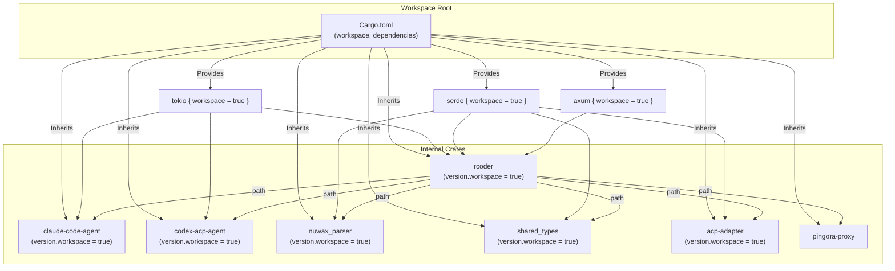
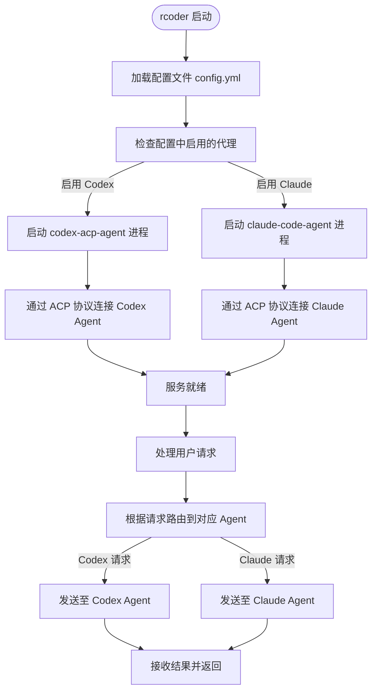

# 版本管理与功能特性

<cite>
**本文档引用的文件**  
- [Cargo.toml](file://Cargo.toml)
- [crates/rcoder/Cargo.toml](file://crates/rcoder/Cargo.toml)
- [crates/claude-code-agent/Cargo.toml](file://crates/claude-code-agent/Cargo.toml)
- [crates/codex-acp-agent/Cargo.toml](file://crates/codex-acp-agent/Cargo.toml)
- [crates/nuwax_parser/Cargo.toml](file://crates/nuwax_parser/Cargo.toml)
- [crates/pingora-proxy/Cargo.toml](file://crates/pingora-proxy/Cargo.toml)
- [crates/shared_types/Cargo.toml](file://crates/shared_types/Cargo.toml)
- [crates/acp_adapter/Cargo.toml](file://crates/acp_adapter/Cargo.toml)
</cite>

## 目录
1. [引言](#引言)
2. [依赖版本锁定机制](#依赖版本锁定机制)
3. [工作区内的版本协同策略](#工作区内的版本协同策略)
4. [可选功能特性的定义与启用](#可选功能特性的定义与启用)
5. [外部依赖的升级流程与破坏性变更评估](#外部依赖的升级流程与破坏性变更评估)
6. [新增依赖的审查清单](#新增依赖的审查清单)
7. [最佳配置模式示例](#最佳配置模式示例)
8. [结论](#结论)

## 引言
本项目 `rcoder` 是一个基于 Rust 构建的 AI 代理框架，采用 Cargo 工作区（workspace）管理多个内部 crate。其依赖管理机制体现了现代 Rust 项目的典型实践：通过 `Cargo.lock` 锁定精确版本以确保构建可重现性，利用 workspace 统一管理公共依赖，并通过功能特性（features）实现模块化功能控制。本文档深入分析该项目的版本管理机制、功能特性开关设计、外部依赖升级策略以及新增依赖的合规性审查流程。

## 依赖版本锁定机制

项目通过 `Cargo.lock` 文件精确锁定所有依赖项（包括传递依赖）的版本，确保在不同环境和时间点执行 `cargo build` 时获得完全一致的构建结果。`Cargo.lock` 由 Cargo 自动维护，首次构建时生成，并在后续构建中优先使用锁定版本，除非显式执行 `cargo update`。

项目根目录下的 `Cargo.toml` 定义了工作区配置，其中 `resolver = "2"` 启用了新版依赖解析器，允许不同 crate 使用同一依赖的不同版本（若无版本冲突），提升了灵活性。`Cargo.lock` 记录了所有依赖的精确版本、来源（crates.io、git、path 等）和校验和（checksum），是构建可重现性的核心保障。

**Section sources**
- [Cargo.toml](file://Cargo.toml#L1-L10)

## 工作区内的版本协同策略

项目采用 workspace 结构，所有内部 crate（如 `rcoder`, `claude-code-agent`, `nuwax_parser` 等）均位于 `crates/` 目录下，并在根 `Cargo.toml` 中通过 `members = ["crates/*"]` 声明。这种结构实现了高效的版本协同：

1.  **统一版本管理**：在根 `Cargo.toml` 的 `[workspace.package]` 部分定义了 `version = "0.1.0"`。所有内部 crate 的 `Cargo.toml` 使用 `version.workspace = true` 来继承此版本号，确保所有组件版本同步，简化发布流程。
2.  **共享依赖声明**：根 `Cargo.toml` 的 `[workspace.dependencies]` 部分集中声明了所有 workspace 内 crate 可能用到的公共依赖（如 `tokio`, `serde`, `axum` 等）。内部 crate 在其 `Cargo.toml` 中通过 `{ workspace = true }` 来引用这些依赖，避免了版本分散和潜在的版本冲突。
3.  **路径依赖**：内部 crate 之间通过 `path` 依赖进行引用（如 `rcoder` 依赖 `nuwax_parser = { path = "../nuwax_parser" }`），Cargo 会自动处理这些本地依赖的构建顺序。



**Diagram sources**
- [Cargo.toml](file://Cargo.toml#L1-L174)
- [crates/rcoder/Cargo.toml](file://crates/rcoder/Cargo.toml#L1-L79)
- [crates/claude-code-agent/Cargo.toml](file://crates/claude-code-agent/Cargo.toml#L1-L46)
- [crates/codex-acp-agent/Cargo.toml](file://crates/codex-acp-agent/Cargo.toml#L1-L54)
- [crates/nuwax_parser/Cargo.toml](file://crates/nuwax_parser/Cargo.toml#L1-L35)
- [crates/shared_types/Cargo.toml](file://crates/shared_types/Cargo.toml#L1-L16)
- [crates/acp_adapter/Cargo.toml](file://crates/acp_adapter/Cargo.toml#L1-L29)

**Section sources**
- [Cargo.toml](file://Cargo.toml#L1-L174)
- [crates/rcoder/Cargo.toml](file://crates/rcoder/Cargo.toml#L1-L79)

## 可选功能特性的定义与启用

项目通过 Cargo 的 `features` 机制实现功能的可选性，允许用户根据需要启用或禁用特定功能，从而控制二进制文件大小和依赖范围。

在 `rcoder` crate 的 `Cargo.toml` 中，虽然没有显式定义自定义 features，但它通过依赖项的 features 来间接控制功能。例如：
- `axum = { workspace = true, features = ["multipart"] }`：为 `axum` 框架启用了 `multipart` 功能，以支持文件上传。
- `tracing-subscriber = { workspace = true, features = ["fmt", "env-filter", "json"] }`：为日志库启用了格式化、环境过滤和 JSON 输出功能。

更重要的是，`rcoder` 主程序通过条件编译和动态加载的方式，实现了对不同 AI 代理（如 Codex 和 Claude）的支持。`rcoder` 的依赖项 `codex-acp-agent` 和 `claude-code-agent` 是独立的二进制 crate。`rcoder` 通过 `proxy_agent` 模块中的 `codex_agent.rs` 和 `claude_code_agent.rs` 分别与它们通信。是否支持某个代理，取决于 `rcoder` 是否链接了对应的 agent crate。这种设计将功能开关从编译时的 `features` 转移到了运行时的模块集成，提供了更大的灵活性。



**Diagram sources**
- [crates/rcoder/Cargo.toml](file://crates/rcoder/Cargo.toml#L1-L79)
- [crates/rcoder/src/proxy_agent/codex_agent.rs](file://crates/rcoder/src/proxy_agent/codex_agent.rs)
- [crates/rcoder/src/proxy_agent/claude_code_agent.rs](file://crates/rcoder/src/proxy_agent/claude_code_agent.rs)

**Section sources**
- [crates/rcoder/Cargo.toml](file://crates/rcoder/Cargo.toml#L1-L79)

## 外部依赖的升级流程与破坏性变更评估

外部依赖的升级是项目维护的重要环节。本项目依赖了多种来源的依赖：
- **crates.io**：如 `tokio`, `serde` 等，通过版本号（如 `1.0`）指定。
- **Git 仓库**：如 `codex-core` 依赖 `git = "https://github.com/openai/codex", branch = "main"`，直接从主分支拉取最新代码。
- **本地路径**：如 `nuwax_parser = { path = "../nuwax_parser" }`。

**升级流程**：
1.  **crates.io 依赖**：使用 `cargo update -p <package-name>` 或 `cargo update` 更新 `Cargo.lock` 中的版本。Cargo 会遵循语义化版本（SemVer）规则，通常只升级补丁和次要版本。
2.  **Git 依赖**：更新 `Cargo.toml` 中的 `rev` 或 `tag` 字段，或确保 `branch` 指向期望的提交。由于使用 `branch = "main"`，每次构建都可能获取最新代码，风险较高。

**破坏性变更（Breaking Change）评估**：
- **依赖项自身**：在升级前，必须检查依赖项的 CHANGELOG 或发布说明，确认新版本是否存在破坏性变更。
- **编译检查**：执行 `cargo build` 和 `cargo test`，编译器会捕获大部分 API 变更导致的错误。
- **运行时行为**：即使编译通过，行为变更也可能引入 bug。需要进行充分的集成测试。
- **依赖树影响**：使用 `cargo tree` 分析依赖树，评估升级对其他间接依赖的影响。

对于 `codex-core` 这类 Git 依赖，由于其来源不稳定，建议尽快锁定到一个稳定的 `rev` 或 `tag`，以保证构建的可重现性。

**Section sources**
- [Cargo.toml](file://Cargo.toml#L1-L174)
- [crates/rcoder/Cargo.toml](file://crates/rcoder/Cargo.toml#L1-L79)
- [crates/codex-acp-agent/Cargo.toml](file://crates/codex-acp-agent/Cargo.toml#L1-L54)

## 新增依赖的审查清单

为确保项目质量和安全性，新增依赖需经过严格审查：

1.  **许可证合规性**：检查依赖的许可证（如 MIT, Apache-2.0）是否与项目兼容。根 `Cargo.toml` 中 `license = "MIT OR Apache-2.0"` 定义了可接受的许可证。可使用 `cargo-deny` 工具进行自动化检查。
2.  **维护活跃度**：评估仓库的更新频率、issue 响应速度、社区活跃度。避免引入已废弃或无人维护的包。
3.  **安全漏洞扫描**：使用 `cargo-audit` 定期扫描 `Cargo.lock`，检查已知的安全漏洞。
4.  **依赖树复杂度**：评估新依赖引入的传递依赖数量，避免过度复杂的依赖树。使用 `cargo tree -p <package>` 查看。
5.  **功能必要性**：确认该依赖提供的功能无法通过现有依赖或少量自研代码实现，避免过度依赖。
6.  **文档与测试**：检查依赖是否有良好的文档和充分的测试，以保证其可靠性。

**Section sources**
- [Cargo.toml](file://Cargo.toml#L1-L174)

## 最佳配置模式示例

结合项目实际，以下是依赖管理的最佳配置模式：

1.  **根 `Cargo.toml`**：集中声明所有公共依赖及其版本和 features，使用 `workspace.dependencies`。
2.  **内部 crate `Cargo.toml`**：使用 `version.workspace = true` 继承版本，使用 `{ workspace = true }` 引用公共依赖，使用 `path` 引用其他内部 crate。
3.  **外部依赖**：优先选择 crates.io 上维护良好的稳定版本。对于必须的 Git 依赖，应尽可能使用 `tag` 或 `rev` 而非 `branch`。
4.  **功能特性**：对于可选功能，优先使用 Cargo 的 `features` 进行编译时开关。对于需要独立部署的模块（如 AI Agent），可采用独立 crate + 运行时集成的模式。
5.  **工具链**：定期使用 `cargo-audit` 扫描漏洞，使用 `cargo-deny` 检查许可证和依赖图。

```toml
# 示例：根 Cargo.toml 中的 workspace.dependencies
[workspace.dependencies]
tokio = { version = "1.0", features = ["full"] }
serde = { version = "1.0", features = ["derive"] }
axum = { version = "0.8", features = ["http2", "tracing"] }

# 示例：内部 crate 中的依赖引用
[dependencies]
tokio = { workspace = true }
serde = { workspace = true, features = ["derive"] }
my_internal_crate = { path = "../my_internal_crate" }
```

**Section sources**
- [Cargo.toml](file://Cargo.toml#L1-L174)
- [crates/rcoder/Cargo.toml](file://crates/rcoder/Cargo.toml#L1-L79)

## 结论

`rcoder` 项目通过 Cargo workspace、`Cargo.lock` 和 `features` 机制，建立了一套有效的依赖和版本管理体系。`Cargo.lock` 保证了构建的可重现性，workspace 实现了内部 crate 的版本协同和依赖共享，而功能特性和模块化设计则提供了灵活的功能扩展能力。对于外部依赖，特别是不稳定的 Git 依赖，需要建立严格的升级和审查流程。遵循最佳实践，如集中管理依赖、审查许可证和安全漏洞，是维护项目长期健康发展的关键。