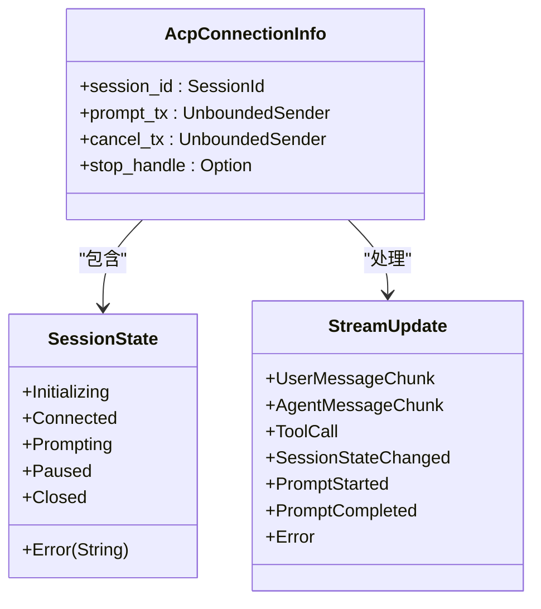

# 编译时依赖关系

<cite>
**本文档中引用的文件**   
- [rcoder/Cargo.toml](file://crates/rcoder/Cargo.toml)
- [acp_adapter/Cargo.toml](file://crates/acp_adapter/Cargo.toml)
- [shared_types/Cargo.toml](file://crates/shared_types/Cargo.toml)
- [claude-code-agent/Cargo.toml](file://crates/claude-code-agent/Cargo.toml)
- [codex-acp-agent/Cargo.toml](file://crates/codex-acp-agent/Cargo.toml)
- [shared_types/src/lib.rs](file://crates/shared_types/src/lib.rs)
- [acp_adapter/src/lib.rs](file://crates/acp_adapter/src/lib.rs)
- [rcoder/src/proxy_agent/claude_code_agent.rs](file://crates/rcoder/src/proxy_agent/claude_code_agent.rs)
- [rcoder/src/proxy_agent/acp_agent.rs](file://crates/rcoder/src/proxy_agent/acp_agent.rs)
</cite>

## 目录
1. [引言](#引言)
2. [主crate依赖分析](#主crate依赖分析)
3. [共享类型机制](#共享类型机制)
4. [代理客户端依赖实现](#代理客户端依赖实现)
5. [依赖声明与版本管理](#依赖声明与版本管理)
6. [路径依赖与编译优化](#路径依赖与编译优化)
7. [依赖冲突排查](#依赖冲突排查)
8. [最佳实践](#最佳实践)

## 引言
本项目采用多crate架构，通过Cargo工作区管理多个功能模块。核心设计原则是通过内部crate依赖实现功能解耦和代码复用。`rcoder`作为主应用crate，依赖多个专用crate实现特定功能，其中`acp_adapter`负责ACP协议解析与转换，`shared_types`提供跨crate统一的数据结构定义。这种架构设计确保了类型一致性、降低了模块间耦合度，并支持独立开发和测试。

## 主crate依赖分析

`rcoder`主crate通过路径依赖方式引用`acp_adapter`，实现对ACP协议的解析与转换功能。在`Cargo.toml`文件中，`acp-adapter`被声明为内部依赖：

```toml
acp-adapter = { path = "../acp_adapter" }
```

`rcoder`通过`proxy_agent`模块与`acp_adapter`交互，具体体现在`acp_agent.rs`文件中。该模块使用`agent_client_protocol`定义的类型与`acp_adapter`提供的功能进行通信，实现了会话管理、消息处理和状态同步等核心功能。

`acp_adapter`crate提供了通用的ACP适配器功能，包括连接管理、会话生命周期控制和消息处理。`rcoder`通过引用`acp_adapter`的公开API，实现了与ACP兼容的AI代理通信能力，而无需直接处理底层协议细节。

**本节来源**
- [rcoder/Cargo.toml](file://crates/rcoder/Cargo.toml#L15-L78)
- [acp_adapter/Cargo.toml](file://crates/acp_adapter/Cargo.toml#L1-L28)
- [rcoder/src/proxy_agent/acp_agent.rs](file://crates/rcoder/src/proxy_agent/acp_agent.rs#L1-L297)

## 共享类型机制

`shared_types`crate是项目中实现类型一致性的核心组件，通过路径依赖被多个crate引用。其主要功能是定义跨crate共享的数据结构，确保在整个项目中使用统一的类型定义。

在`shared_types/src/model/model_provider.rs`中，定义了`ModelApiProtocol`、`ModelProviderConfig`和`ModelProviderSafeInfo`等关键类型：

```rust
pub enum ModelApiProtocol { ... }
pub struct ModelProviderConfig { ... }
pub struct ModelProviderSafeInfo { ... }
```

这些类型被`rcoder`、`claude-code-agent`和`codex-acp-agent`等crate直接引用，确保了模型配置、会话状态等关键数据结构在整个系统中的一致性。`shared_types`通过重新导出机制，在`lib.rs`中将`model`模块的内容公开：

```rust
pub use model::{ModelApiProtocol, ModelProviderConfig, ModelProviderSafeInfo};
```

这种设计避免了类型重复定义，减少了维护成本，并确保了类型安全。

**本节来源**
- [shared_types/Cargo.toml](file://crates/shared_types/Cargo.toml#L1-L15)
- [shared_types/src/lib.rs](file://crates/shared_types/src/lib.rs#L1-L3)
- [shared_types/src/model/model_provider.rs](file://crates/shared_types/src/model/model_provider.rs#L1-L104)

## 代理客户端依赖实现

`claude-code-agent`和`codex-acp-agent`作为具体的代理实现，都依赖`acp_adapter`来实现标准化的通信接口。两个crate在各自的`Cargo.toml`文件中声明了对`acp_adapter`的路径依赖：

```toml
# claude-code-agent/Cargo.toml
acp-adapter = { path = "../acp_adapter" }

# codex-acp-agent/Cargo.toml
acp-adapter = { path = "../acp_adapter" }
```

通过依赖`acp_adapter`，两个代理实现了统一的ACP协议处理能力。`acp_adapter`提供了`ConnectionState`、`SessionState`、`StreamUpdate`等类型，确保了不同代理在会话管理、状态更新和消息传递方面的行为一致性。

`claude-code-agent`在`claude_code_agent.rs`中使用`acp_adapter`提供的类型和功能，实现了与Claude Code ACP服务的通信。代理通过`start_claude_code_acp_agent_service`函数启动服务，并使用`AcpConnectionInfo`结构体管理连接信息，该结构体中的类型直接来自`acp_adapter`。



**图表来源**
- [acp_adapter/src/lib.rs](file://crates/acp_adapter/src/lib.rs#L1-L12)
- [acp_adapter/src/types.rs](file://crates/acp_adapter/src/types.rs#L1-L799)
- [rcoder/src/proxy_agent/claude_code_agent.rs](file://crates/rcoder/src/proxy_agent/claude_code_agent.rs#L1-L305)

**本节来源**
- [claude-code-agent/Cargo.toml](file://crates/claude-code-agent/Cargo.toml#L1-L45)
- [codex-acp-agent/Cargo.toml](file://crates/codex-acp-agent/Cargo.toml#L1-L53)
- [rcoder/src/proxy_agent/claude_code_agent.rs](file://crates/rcoder/src/proxy_agent/claude_code_agent.rs#L1-L305)

## 依赖声明与版本管理

项目采用Cargo工作区模式进行依赖管理，通过`workspace = true`声明共享依赖项。在`rcoder/Cargo.toml`中，可以看到多种依赖声明方式：

```toml
# 路径依赖 - 内部crate
shared_types = { path = "../shared_types" }
acp-adapter = { path = "../acp_adapter" }

# Git依赖 - 外部crate
codex-core = { git = "https://github.com/openai/codex", branch = "main" }

# 版本依赖 - 外部crate
parking_lot = "0.12"
serde_json = { workspace = true }
```

版本语义遵循Cargo的语义化版本控制规则。对于内部crate，使用路径依赖确保开发过程中的即时更新；对于外部crate，使用精确版本或Git仓库引用确保依赖的可重现性。

工作区级别的依赖（如`serde_json`）通过`workspace = true`声明，确保所有crate使用相同版本，避免版本冲突。这种集中式管理简化了依赖更新流程，提高了项目的一致性。

**本节来源**
- [rcoder/Cargo.toml](file://crates/rcoder/Cargo.toml#L15-L78)
- [acp_adapter/Cargo.toml](file://crates/acp_adapter/Cargo.toml#L1-L28)
- [shared_types/Cargo.toml](file://crates/shared_types/Cargo.toml#L1-L15)

## 路径依赖与编译优化

项目广泛使用路径依赖（path dependencies）来组织内部crate，这种设计带来了多项优势：

1. **避免重复编译**：当多个crate依赖同一个内部crate时，Cargo会自动优化编译过程，确保每个crate只编译一次。
2. **即时开发反馈**：路径依赖允许开发者在修改一个crate后立即在依赖它的crate中看到效果，无需发布和更新版本。
3. **简化本地开发**：开发者可以在本地同时开发和测试多个crate，而不需要复杂的发布流程。

`rcoder`主crate依赖`shared_types`的方式展示了路径依赖的典型用法：

```toml
shared_types = { path = "../shared_types" }
```

这种相对路径引用确保了项目结构的清晰性，并支持工作区内的无缝集成。当`shared_types`被修改时，Cargo会自动重新编译所有依赖它的crate，确保类型一致性。

为了进一步优化编译性能，项目应考虑使用`[patch]`段落来重写依赖，或在`Cargo.toml`中配置`build-override`来优化构建过程。

**本节来源**
- [rcoder/Cargo.toml](file://crates/rcoder/Cargo.toml#L15-L78)
- [acp_adapter/Cargo.toml](file://crates/acp_adapter/Cargo.toml#L1-L28)
- [shared_types/Cargo.toml](file://crates/shared_types/Cargo.toml#L1-L15)

## 依赖冲突排查

在多crate项目中，依赖冲突是常见问题。以下是排查和解决依赖冲突的方法：

1. **使用`cargo tree`命令**：分析依赖树，识别重复或冲突的依赖项。
   ```bash
   cargo tree -p rcoder
   ```

2. **检查版本不一致**：当多个crate依赖同一crate的不同版本时，可能导致编译错误或运行时问题。使用`cargo tree --duplicates`查找重复依赖。

3. **解决方法**：
   - 使用`[patch]`段落强制使用特定版本
   - 在工作区根`Cargo.toml`中统一依赖版本
   - 使用`public`依赖声明确保版本传播

4. **验证依赖一致性**：使用`cargo check --all`确保所有crate都能成功编译。

对于本项目，由于广泛使用工作区依赖和路径依赖，依赖冲突的风险较低。但当引入新的外部依赖时，仍需仔细检查依赖树，确保没有版本冲突。

**本节来源**
- [rcoder/Cargo.toml](file://crates/rcoder/Cargo.toml#L15-L78)
- [Cargo.toml](file://Cargo.toml)

## 最佳实践

基于本项目的依赖管理设计，以下是多crate项目的最佳实践：

1. **合理划分crate边界**：按功能模块划分crate，如`acp_adapter`专注于协议处理，`shared_types`专注于数据定义。

2. **使用工作区统一管理**：通过`Cargo.toml`工作区配置集中管理依赖版本和编译选项。

3. **优先使用路径依赖**：对于内部crate，使用路径依赖而非版本发布，提高开发效率。

4. **最小化公共依赖**：只将必要的类型和功能公开，减少模块间耦合。

5. **定期清理依赖树**：使用`cargo tree`定期检查依赖关系，移除未使用的依赖。

6. **文档化依赖关系**：在README或文档中明确说明crate间的依赖关系和设计意图。

这些实践确保了项目的可维护性、可扩展性和编译效率，为大型Rust项目的成功奠定了基础。

**本节来源**
- [rcoder/Cargo.toml](file://crates/rcoder/Cargo.toml#L1-L78)
- [acp_adapter/Cargo.toml](file://crates/acp_adapter/Cargo.toml#L1-L28)
- [shared_types/Cargo.toml](file://crates/shared_types/Cargo.toml#L1-L15)