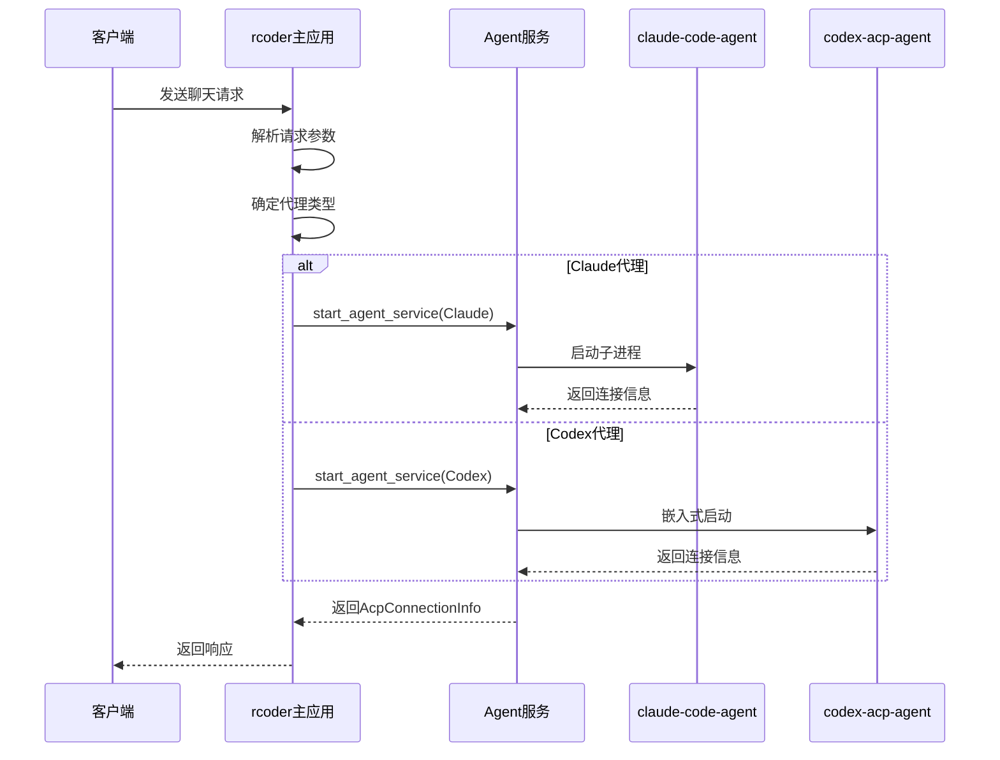
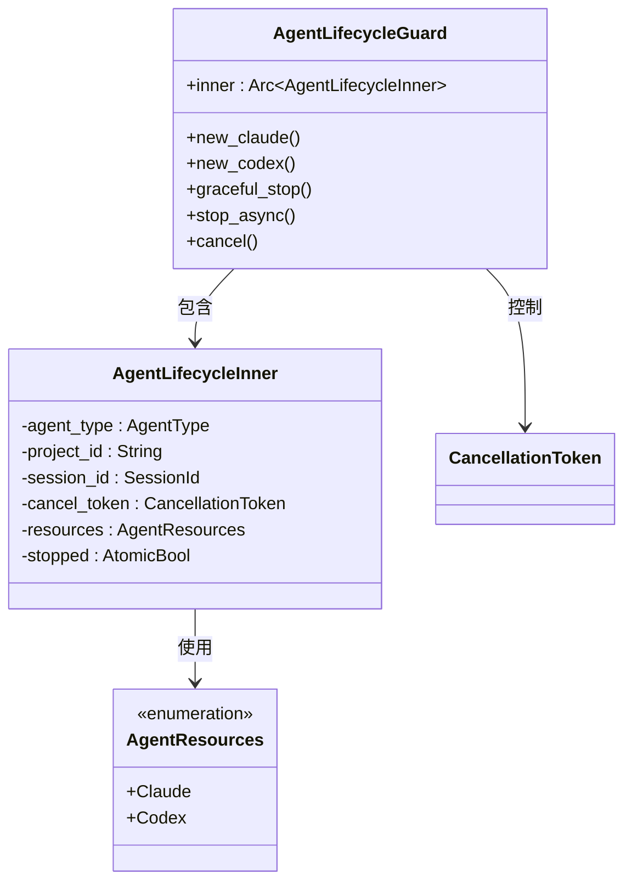
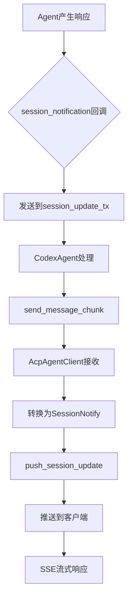
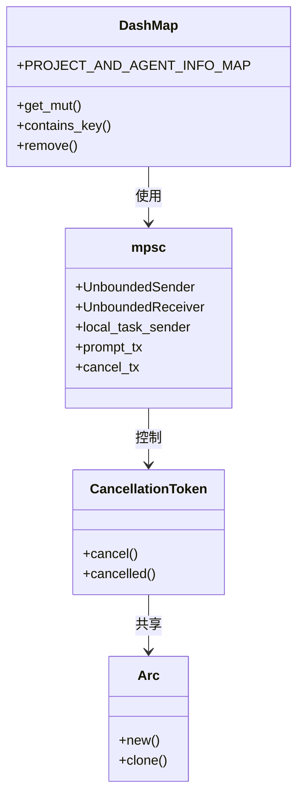
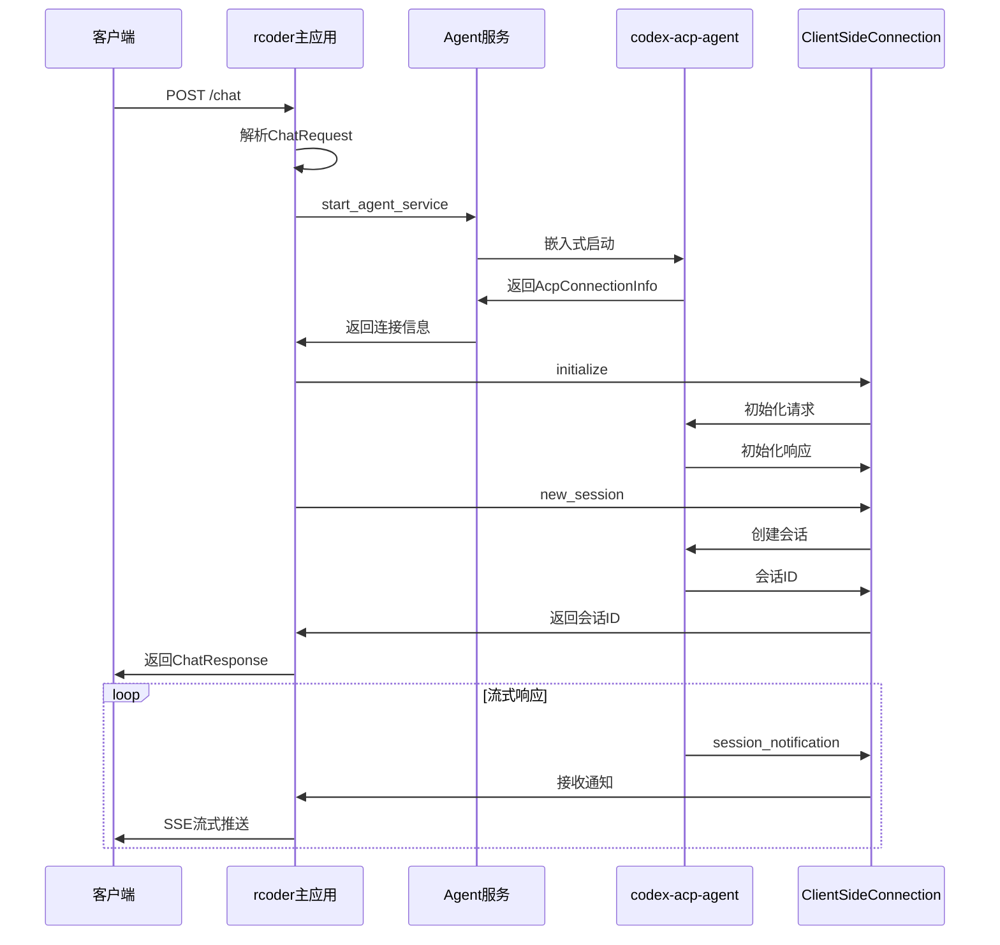

# 运行时调用关系

<cite>
**本文档引用的文件**
- [chat_handler.rs](file://crates/rcoder/src/handler/chat_handler.rs)
- [agent_service.rs](file://crates/rcoder/src/proxy_agent/agent_service.rs)
- [channel_utils.rs](file://crates/rcoder/src/proxy_agent/channel_utils.rs)
- [cleanup_task.rs](file://crates/rcoder/src/proxy_agent/cleanup_task.rs)
- [claude_code_agent.rs](file://crates/rcoder/src/proxy_agent/claude_code_agent.rs)
- [codex_agent.rs](file://crates/rcoder/src/proxy_agent/codex_agent.rs)
- [agent_stop_handle.rs](file://crates/rcoder/src/proxy_agent/agent_stop_handle.rs)
- [mod.rs](file://crates/rcoder/src/proxy_agent/mod.rs)
- [main.rs](file://crates/claude-code-agent/src/main.rs)
- [lib.rs](file://crates/claude-code-agent/src/lib.rs)
- [main.rs](file://crates/codex-acp-agent/src/main.rs)
- [agent.rs](file://crates/codex-acp-agent/src/agent.rs)
- [lib.rs](file://crates/acp_adapter/src/lib.rs)
- [types.rs](file://crates/acp_adapter/src/types.rs)
</cite>

## 目录
1. [运行时调用流程概述](#运行时调用流程概述)
2. [主应用动态调度机制](#主应用动态调度机制)
3. [Agent生命周期管理](#agent生命周期管理)
4. [SSE流式响应传递机制](#sse流式响应传递机制)
5. [跨Crate调用的线程安全机制](#跨crate调用的线程安全机制)
6. [典型请求链路时序图](#典型请求链路时序图)
7. [性能瓶颈与优化策略](#性能瓶颈与优化策略)

## 运行时调用流程概述

本系统采用模块化架构，通过多个独立的crate实现功能分离。主应用rcoder负责接收客户端请求并动态调度相应的AI代理服务。系统通过ACP（Agent Client Protocol）协议实现与后端AI服务的通信，支持Claude和Codex两种代理类型。整个调用流程涉及多个异步任务、消息通道和共享状态管理，确保了系统的高并发处理能力和资源的有效利用。

**Section sources**
- [chat_handler.rs](file://crates/rcoder/src/handler/chat_handler.rs#L1-L231)
- [agent_service.rs](file://crates/rcoder/src/proxy_agent/agent_service.rs#L1-L71)

## 主应用动态调度机制

rcoder主应用通过`handle_chat`函数接收客户端的聊天请求。该函数首先解析请求参数，包括prompt、项目ID、会话ID等信息，并根据模型提供商配置自动选择相应的代理类型。系统通过`AgentType`枚举来区分不同的代理类型，并在`agent_service.rs`中实现`AcpAgentService` trait，为每种代理类型提供统一的接口。

动态调度的核心在于`start_agent_service`方法，该方法根据代理类型调用相应的启动函数。对于Claude代理，调用`start_claude_code_acp_agent_service`；对于Codex代理，调用`start_codex_acp_agent_service`。这些函数返回`AcpConnectionInfo`结构体，包含会话ID、消息通道等连接信息，供后续通信使用。

**Diagram sources**
- [chat_handler.rs](file://crates/rcoder/src/handler/chat_handler.rs#L1-L231)
- [agent_service.rs](file://crates/rcoder/src/proxy_agent/agent_service.rs#L1-L71)
- [claude_code_agent.rs](file://crates/rcoder/src/proxy_agent/claude_code_agent.rs#L1-L305)
- [codex_agent.rs](file://crates/rcoder/src/proxy_agent/codex_agent.rs#L1-L247)

**Section sources**
- [chat_handler.rs](file://crates/rcoder/src/handler/chat_handler.rs#L1-L231)
- [agent_service.rs](file://crates/rcoder/src/proxy_agent/agent_service.rs#L1-L71)
- [claude_code_agent.rs](file://crates/rcoder/src/proxy_agent/claude_code_agent.rs#L1-L305)
- [codex_agent.rs](file://crates/rcoder/src/proxy_agent/codex_agent.rs#L1-L247)

## Agent生命周期管理

系统通过`agent_stop_handle.rs`中的`AgentLifecycleGuard`结构体实现代理的生命周期管理。该结构体遵循RAII（Resource Acquisition Is Initialization）原则，当其被drop时自动清理相关资源。生命周期管理主要包括三个核心组件：`agent_service`、`channel_utils`和`cleanup_task`。

`agent_service`负责代理的启动和停止，通过`start_agent_service`和`stop_agent_service`方法提供统一的接口。`channel_utils`提供通用的通道处理工具，包括`spawn_cancel_handler_for_agent`和`spawn_prompt_handler_for_agent`函数，用于处理取消通知和提示消息。`cleanup_task`则负责定期清理闲置的代理实例，避免资源浪费。

**Diagram sources**
- [agent_stop_handle.rs](file://crates/rcoder/src/proxy_agent/agent_stop_handle.rs#L1-L263)
- [channel_utils.rs](file://crates/rcoder/src/proxy_agent/channel_utils.rs#L1-L153)
- [cleanup_task.rs](file://crates/rcoder/src/proxy_agent/cleanup_task.rs#L1-L207)

**Section sources**
- [agent_stop_handle.rs](file://crates/rcoder/src/proxy_agent/agent_stop_handle.rs#L1-L263)
- [channel_utils.rs](file://crates/rcoder/src/proxy_agent/channel_utils.rs#L1-L153)
- [cleanup_task.rs](file://crates/rcoder/src/proxy_agent/cleanup_task.rs#L1-L207)

## SSE流式响应传递机制

系统通过handler模块实现SSE（Server-Sent Events）流式响应的传递。当代理服务产生响应时，通过`session_notification`回调函数将消息发送到`session_update_tx`通道。`agent.rs`中的`CodexAgent`结构体负责处理这些通知，并通过`send_message_chunk`和`send_thought_chunk`方法将消息分块发送。

在rcoder主应用中，`AcpAgentClient`实现了`session_notification`方法，将接收到的会话更新转换为`SessionNotify`并存入全局缓存。`push_session_update`函数负责将这些更新推送到客户端，实现流式响应的传递。整个过程通过异步任务和消息通道实现，确保了响应的实时性和可靠性。

**Diagram sources**
- [agent.rs](file://crates/codex-acp-agent/src/agent.rs#L1-L799)
- [mod.rs](file://crates/rcoder/src/proxy_agent/mod.rs#L1-L216)
- [types.rs](file://crates/acp_adapter/src/types.rs#L1-L799)

**Section sources**
- [agent.rs](file://crates/codex-acp-agent/src/agent.rs#L1-L799)
- [mod.rs](file://crates/rcoder/src/proxy_agent/mod.rs#L1-L216)
- [types.rs](file://crates/acp_adapter/src/types.rs#L1-L799)

## 跨Crate调用的线程安全机制

系统通过多种机制确保跨crate调用的线程安全性和性能。首先，使用`DashMap`作为共享状态存储，`PROJECT_AND_AGENT_INFO_MAP`全局变量存储所有代理实例的信息，支持高并发的读写操作。其次，通过`mpsc`（多生产者单消费者）通道实现异步任务间的通信，`local_task_sender`用于接收本地任务请求，`prompt_tx`和`cancel_tx`用于发送提示和取消通知。

异步任务通过`tokio::task::spawn_local`创建，确保非Send类型的任务能在当前线程执行。`CancellationToken`用于控制任务的生命周期，当需要停止代理时，通过取消令牌通知所有相关任务。`Arc`（原子引用计数）智能指针用于共享所有权，确保资源在多任务间的安全访问。

**Diagram sources**
- [channel_utils.rs](file://crates/rcoder/src/proxy_agent/channel_utils.rs#L1-L153)
- [agent_stop_handle.rs](file://crates/rcoder/src/proxy_agent/agent_stop_handle.rs#L1-L263)
- [mod.rs](file://crates/rcoder/src/proxy_agent/mod.rs#L1-L216)

**Section sources**
- [channel_utils.rs](file://crates/rcoder/src/proxy_agent/channel_utils.rs#L1-L153)
- [agent_stop_handle.rs](file://crates/rcoder/src/proxy_agent/agent_stop_handle.rs#L1-L263)
- [mod.rs](file://crates/rcoder/src/proxy_agent/mod.rs#L1-L216)

## 典型请求链路时序图

以下是一个典型的请求处理链路时序图，展示了从客户端请求到代理响应的完整流程：

**Diagram sources**
- [chat_handler.rs](file://crates/rcoder/src/handler/chat_handler.rs#L1-L231)
- [codex_agent.rs](file://crates/rcoder/src/proxy_agent/codex_agent.rs#L1-L247)
- [agent.rs](file://crates/codex-acp-agent/src/agent.rs#L1-L799)
- [mod.rs](file://crates/rcoder/src/proxy_agent/mod.rs#L1-L216)

## 性能瓶颈与优化策略

系统可能存在以下几个性能瓶颈：首先，子进程通信的开销，特别是Claude代理通过子进程方式启动，stdio管道的读写可能成为瓶颈；其次，全局共享状态`PROJECT_AND_AGENT_INFO_MAP`的并发访问，虽然使用`DashMap`，但在高并发场景下仍可能产生竞争；最后，SSE流式响应的网络传输，大量小消息的频繁发送可能影响性能。

针对这些瓶颈，可以采取以下优化策略：对于子进程通信，可以考虑使用更高效的IPC机制，如Unix域套接字；对于共享状态，可以通过分片或局部缓存减少全局竞争；对于SSE流式响应，可以实现消息批处理，将多个小消息合并为一个大消息发送，减少网络开销。此外，还可以引入连接池机制，复用已创建的代理实例，避免频繁的创建和销毁开销。

**Section sources**
- [claude_code_agent.rs](file://crates/rcoder/src/proxy_agent/claude_code_agent.rs#L1-L305)
- [channel_utils.rs](file://crates/rcoder/src/proxy_agent/channel_utils.rs#L1-L153)
- [cleanup_task.rs](file://crates/rcoder/src/proxy_agent/cleanup_task.rs#L1-L207)