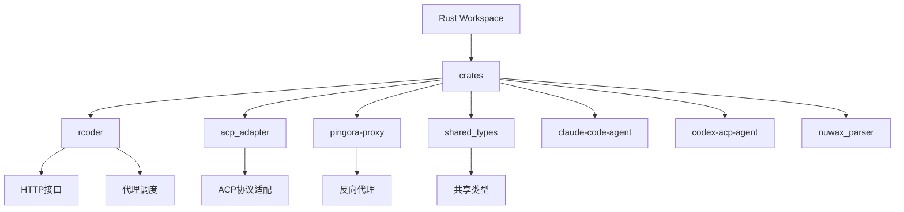
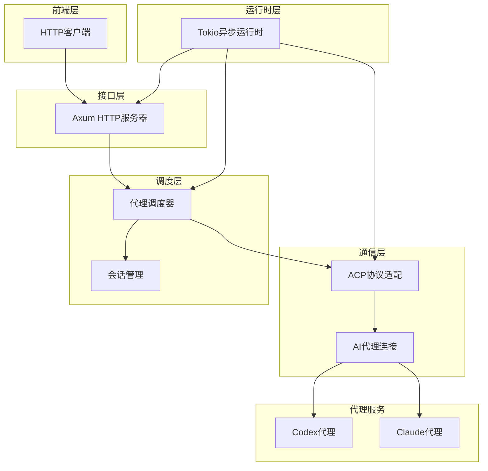
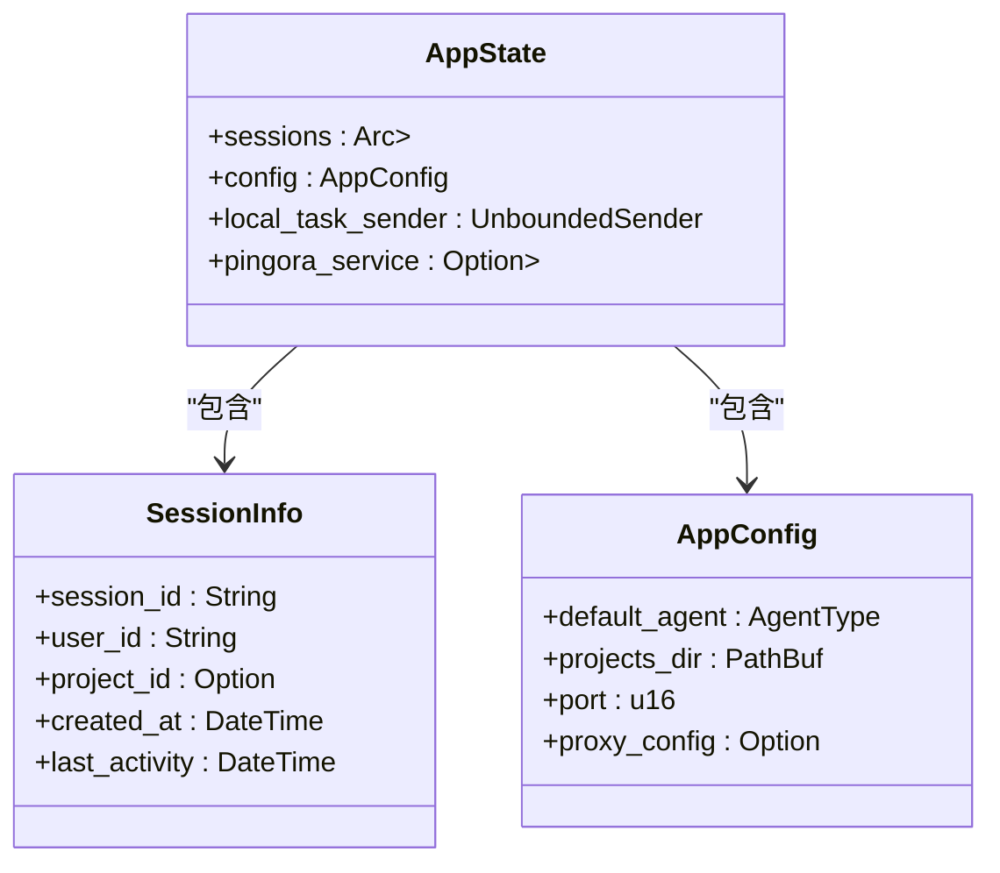
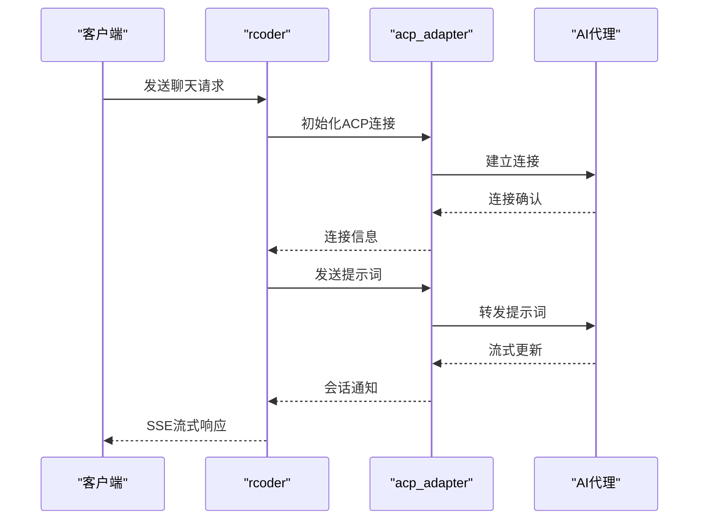
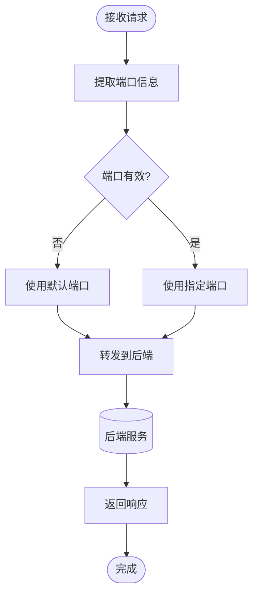
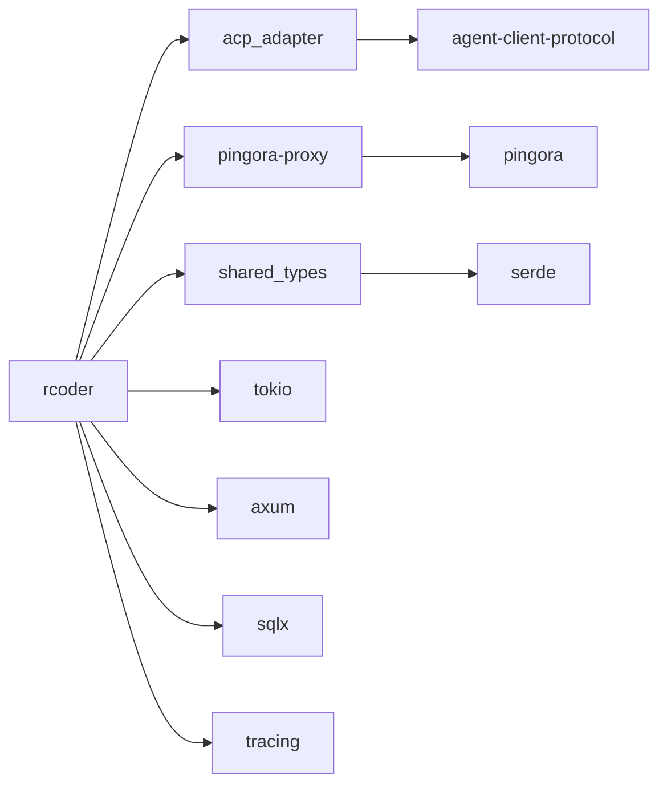

# 架构概览

<cite>
**本文档引用的文件**
- [main.rs](file://crates/rcoder/src/main.rs)
- [lib.rs](file://crates/rcoder/src/lib.rs)
- [router.rs](file://crates/rcoder/src/router.rs)
- [config.rs](file://crates/rcoder/src/config.rs)
- [agent_service.rs](file://crates/rcoder/src/proxy_agent/agent_service.rs)
- [codex_agent.rs](file://crates/rcoder/src/proxy_agent/codex_agent.rs)
- [claude_code_agent.rs](file://crates/rcoder/src/proxy_agent/claude_code_agent.rs)
- [channel_utils.rs](file://crates/rcoder/src/proxy_agent/channel_utils.rs)
- [agent_stop_handle.rs](file://crates/rcoder/src/proxy_agent/agent_stop_handle.rs)
- [acp_agent.rs](file://crates/rcoder/src/proxy_agent/acp_agent.rs)
- [lib.rs](file://crates/acp_adapter/src/lib.rs)
- [lib.rs](file://crates/pingora-proxy/src/lib.rs)
- [lib.rs](file://crates/shared_types/src/lib.rs)
- [Cargo.toml](file://Cargo.toml)
</cite>

## 目录
1. [简介](#简介)
2. [项目结构](#项目结构)
3. [核心组件](#核心组件)
4. [架构概览](#架构概览)
5. [详细组件分析](#详细组件分析)
6. [依赖分析](#依赖分析)
7. [性能考量](#性能考量)
8. [故障排除指南](#故障排除指南)
9. [结论](#结论)

## 简介
本项目是一个基于Rust的AI代理服务平台，采用多crate工作区架构，集成了acp_adapter、pingora-proxy、shared_types等核心模块。系统通过Axum构建HTTP接口层，利用Tokio异步运行时实现高性能并发处理。平台支持多种AI代理（Codex、Claude），通过ACP协议进行通信，并通过Pingora反向代理实现动态端口路由和负载均衡。系统设计注重可扩展性和模块化，各组件通过清晰的接口进行交互，实现了从请求接收、代理调度到AI通信的完整工作流。

## 项目结构

**图示来源**
- [Cargo.toml](file://Cargo.toml)

**本节来源**
- [Cargo.toml](file://Cargo.toml)

## 核心组件

系统由多个核心组件构成，包括主应用rcoder、ACP协议适配器、Pingora反向代理和共享类型库。rcoder作为主应用负责集成各模块，提供HTTP接口和代理调度功能。acp_adapter实现ACP协议的通信能力，使系统能够与不同AI代理进行交互。pingora-proxy提供高性能的反向代理服务，支持动态端口路由。shared_types定义了各组件间共享的数据结构和类型，确保类型一致性。

**本节来源**
- [lib.rs](file://crates/rcoder/src/lib.rs)
- [lib.rs](file://crates/acp_adapter/src/lib.rs)
- [lib.rs](file://crates/pingora-proxy/src/lib.rs)
- [lib.rs](file://crates/shared_types/src/lib.rs)

## 架构概览

**图示来源**
- [main.rs](file://crates/rcoder/src/main.rs)
- [router.rs](file://crates/rcoder/src/router.rs)

**本节来源**
- [main.rs](file://crates/rcoder/src/main.rs)
- [router.rs](file://crates/rcoder/src/router.rs)

## 详细组件分析

### rcoder主应用分析

rcoder是系统的核心主应用，负责集成所有模块并提供统一的服务。它通过Axum框架构建HTTP服务器，处理客户端请求，并通过代理调度器管理AI代理的生命周期。应用采用模块化设计，各功能被组织在不同的模块中，如handler处理HTTP请求，proxy_agent管理代理连接，router定义路由等。

#### 对于对象导向组件：

**图示来源**
- [router.rs](file://crates/rcoder/src/router.rs#L30-L60)
- [config.rs](file://crates/rcoder/src/config.rs#L45-L60)

### ACP适配器分析

ACP适配器模块提供与AI代理通信的核心功能，包括连接管理、会话生命周期和消息处理。它通过acp_adapter crate实现，封装了ACP协议的细节，为上层应用提供简洁的接口。

#### 对于API/服务组件：

**图示来源**
- [acp_agent.rs](file://crates/rcoder/src/proxy_agent/acp_agent.rs#L150-L200)
- [agent_service.rs](file://crates/rcoder/src/proxy_agent/agent_service.rs#L10-L30)

### Pingora代理分析

Pingora代理模块提供高性能的反向代理服务，支持通过URL参数或路径指定目标端口，实现动态路由。它基于Cloudflare的Pingora库构建，具有高并发处理能力。

#### 对于复杂逻辑组件：

**图示来源**
- [lib.rs](file://crates/pingora-proxy/src/lib.rs#L50-L80)
- [server.rs](file://crates/pingora-proxy/src/server.rs#L20-L40)

**本节来源**
- [main.rs](file://crates/rcoder/src/main.rs)
- [lib.rs](file://crates/rcoder/src/lib.rs)
- [router.rs](file://crates/rcoder/src/router.rs)
- [config.rs](file://crates/rcoder/src/config.rs)
- [agent_service.rs](file://crates/rcoder/src/proxy_agent/agent_service.rs)
- [codex_agent.rs](file://crates/rcoder/src/proxy_agent/codex_agent.rs)
- [claude_code_agent.rs](file://crates/rcoder/src/proxy_agent/claude_code_agent.rs)
- [channel_utils.rs](file://crates/rcoder/src/proxy_agent/channel_utils.rs)
- [agent_stop_handle.rs](file://crates/rcoder/src/proxy_agent/agent_stop_handle.rs)
- [acp_agent.rs](file://crates/rcoder/src/proxy_agent/acp_agent.rs)
- [lib.rs](file://crates/acp_adapter/src/lib.rs)
- [lib.rs](file://crates/pingora-proxy/src/lib.rs)
- [lib.rs](file://crates/shared_types/src/lib.rs)

## 依赖分析

**图示来源**
- [Cargo.toml](file://Cargo.toml)
- [lib.rs](file://crates/rcoder/src/lib.rs)

**本节来源**
- [Cargo.toml](file://Cargo.toml)

## 性能考量
系统采用Tokio异步运行时，能够高效处理大量并发连接。通过LocalSet在单线程运行时中管理非Send的代理连接，避免了跨线程同步的开销。Pingora反向代理基于高性能的异步I/O，能够处理高吞吐量的代理请求。会话状态使用DashMap进行管理，提供了高效的并发访问性能。日志系统采用无锁设计，通过多层输出（文件和控制台）确保调试信息的完整性而不影响主流程性能。

## 故障排除指南

当系统出现连接问题时，首先检查配置文件中的端口设置是否正确。对于代理服务启动失败，验证相关环境变量是否已正确设置。若遇到会话管理问题，检查项目工作目录的权限和磁盘空间。对于性能瓶颈，可通过OpenTelemetry收集的指标分析热点路径。日志文件按天滚动保存在logs目录中，包含详细的请求处理信息，是诊断问题的重要依据。

**本节来源**
- [main.rs](file://crates/rcoder/src/main.rs#L200-L220)
- [config.rs](file://crates/rcoder/src/config.rs#L100-L150)

## 结论
该AI代理服务平台采用现代化的Rust技术栈，通过清晰的分层架构和模块化设计，实现了高性能、可扩展的服务。系统成功集成了多种AI代理，通过统一的ACP协议进行通信，并提供了灵活的反向代理功能。架构设计充分考虑了实际部署需求，包含了完善的配置管理、日志记录和监控支持，为构建可靠的AI应用提供了坚实的基础。