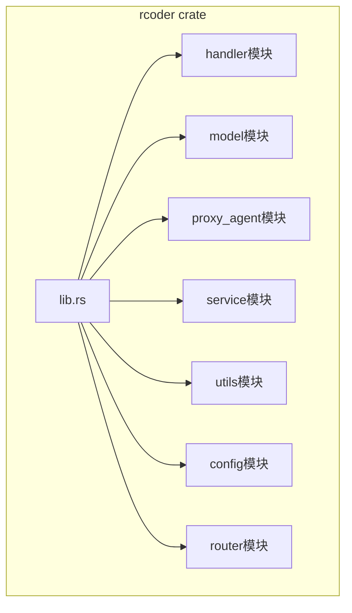
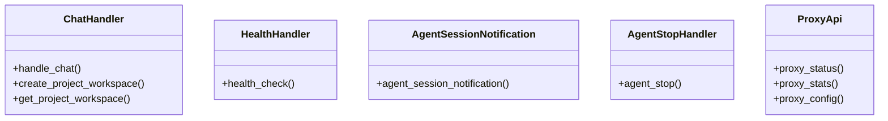
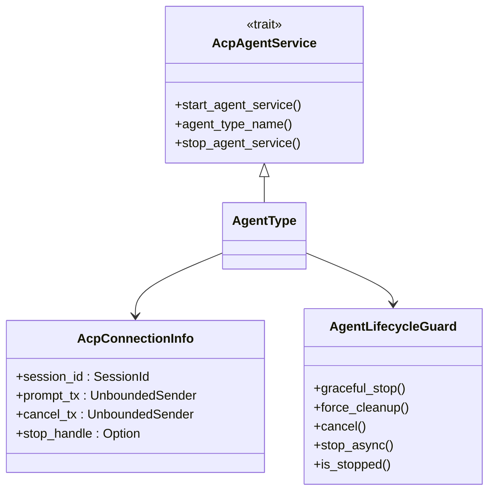
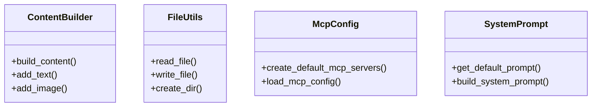
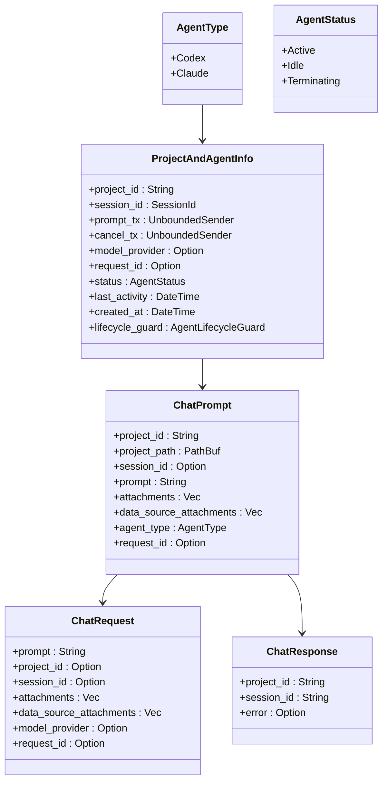
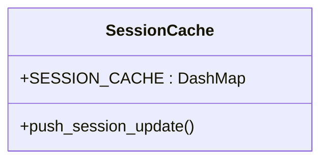
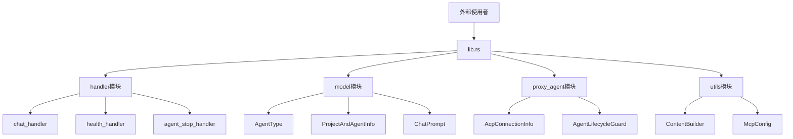
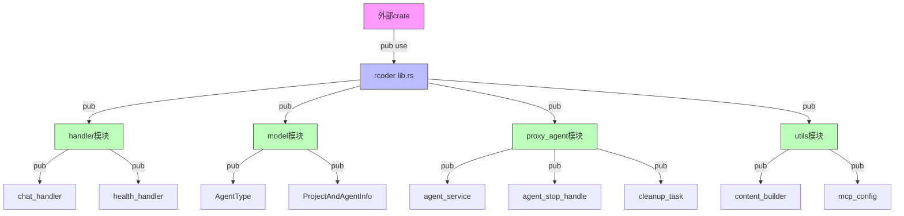
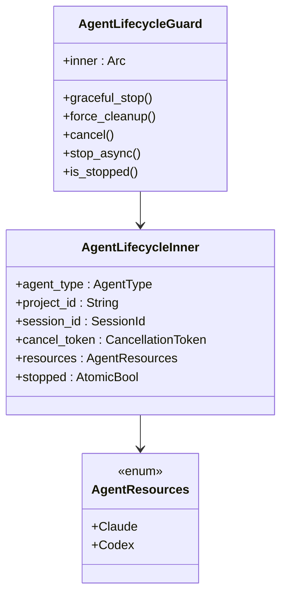
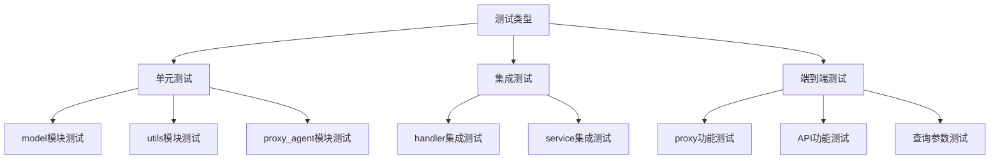

# 模块化设计模式

<cite>
**本文档引用的文件**   
- [lib.rs](file://crates/rcoder/src/lib.rs)
- [handler/mod.rs](file://crates/rcoder/src/handler/mod.rs)
- [proxy_agent/mod.rs](file://crates/rcoder/src/proxy_agent/mod.rs)
- [utils/mod.rs](file://crates/rcoder/src/utils/mod.rs)
- [model/mod.rs](file://crates/rcoder/src/model/mod.rs)
- [service/mod.rs](file://crates/rcoder/src/service/mod.rs)
- [config.rs](file://crates/rcoder/src/config.rs)
- [router.rs](file://crates/rcoder/src/router.rs)
- [agent_model.rs](file://crates/rcoder/src/model/agent_model.rs)
- [agent_service.rs](file://crates/rcoder/src/proxy_agent/agent_service.rs)
- [codex_agent.rs](file://crates/rcoder/src/proxy_agent/codex_agent.rs)
- [claude_code_agent.rs](file://crates/rcoder/src/proxy_agent/claude_code_agent.rs)
- [agent_stop_handle.rs](file://crates/rcoder/src/proxy_agent/agent_stop_handle.rs)
- [chat_handler.rs](file://crates/rcoder/src/handler/chat_handler.rs)
</cite>

## 目录
1. [项目结构概览](#项目结构概览)
2. [模块组织与功能分组](#模块组织与功能分组)
3. [公有接口与私有实现边界控制](#公有接口与私有实现边界控制)
4. [模块可见性规则与内部状态安全](#模块可见性规则与内部状态安全)
5. [模块测试策略](#模块测试策略)

## 项目结构概览

本项目采用多crate架构，核心功能集中在`crates/rcoder`目录下。主crate通过清晰的模块划分实现了功能解耦，主要包含handler、model、proxy_agent、service、utils等模块，每个模块负责特定的职责域。



**图源**
- [lib.rs](file://crates/rcoder/src/lib.rs)

## 模块组织与功能分组

### 功能模块职责划分

项目遵循高内聚低耦合的设计原则，将功能按领域进行分组：

#### handler模块
负责HTTP请求的处理和路由，包含各类处理器：
- `chat_handler`: 处理聊天请求
- `health_handler`: 健康检查
- `agent_session_notification`: 代理会话通知
- `agent_stop_handler`: 停止代理
- `proxy_api`: 代理相关API



**图源**
- [handler/mod.rs](file://crates/rcoder/src/handler/mod.rs)
- [chat_handler.rs](file://crates/rcoder/src/handler/chat_handler.rs)

#### proxy_agent模块
管理AI代理的生命周期和通信，是系统的核心组件：
- `acp_agent`: ACP协议实现
- `agent_service`: 代理服务抽象
- `agent_stop_handle`: 代理停止句柄
- `channel_utils`: 通道工具
- `claude_code_agent`: Claude代理实现
- `codex_agent`: Codex代理实现
- `cleanup_task`: 清理任务



**图源**
- [proxy_agent/mod.rs](file://crates/rcoder/src/proxy_agent/mod.rs)
- [agent_service.rs](file://crates/rcoder/src/proxy_agent/agent_service.rs)
- [agent_stop_handle.rs](file://crates/rcoder/src/proxy_agent/agent_stop_handle.rs)

#### utils模块
提供通用工具函数：
- `content_builder`: 内容构建器
- `file_utils`: 文件工具
- `mcp_config`: MCP配置
- `system_prompt`: 系统提示



**图源**
- [utils/mod.rs](file://crates/rcoder/src/utils/mod.rs)

#### model模块
定义系统数据模型：
- `agent_model`: 代理相关模型
- `attachment`: 附件模型
- `chat_prompt`: 聊天提示模型
- `agent_session_notify`: 代理会话通知模型
- `app_error`: 应用错误模型
- `http_result`: HTTP结果模型



**图源**
- [model/mod.rs](file://crates/rcoder/src/model/mod.rs)
- [agent_model.rs](file://crates/rcoder/src/model/agent_model.rs)

#### service模块
提供共享服务：
- `session_cache`: 会话缓存



**图源**
- [service/mod.rs](file://crates/rcoder/src/service/mod.rs)

## 公有接口与私有实现边界控制

### 模块导出策略

项目通过精心设计的模块导出策略，实现了清晰的接口边界：

#### 根模块导出
`lib.rs`作为crate的入口，有选择地重新导出关键类型和函数：

```rust
// 重新导出主要的类型和函数
pub use model::*;
pub use proxy_agent::*;
pub use utils::*;
```

这种策略使得外部使用者可以直接访问核心功能，而无需了解内部模块结构。

#### 子模块导出
各子模块通过`mod.rs`文件控制内部符号的可见性：

```rust
// handler/mod.rs
pub use agent_cancel_handler::*;
pub use agent_session_notification::*;
pub use agent_stop_handler::*;
pub use chat_handler::*;
pub use health_handler::*;
pub use proxy_api::*;
pub use proxy_handler_api::*;
```

```rust
// utils/mod.rs
pub use content_builder::*;
pub use mcp_config::*;
pub use system_prompt::*;
```

```rust
// model/mod.rs
pub use agent_model::{
    AgentStatus, AgentStatusResponse, AgentType, CancelNotificationRequest,
    CancelNotificationResponse, ProjectAndAgentInfo,
};
pub use agent_session_notify::*;
pub use attachment::*;
pub use chat_prompt::{ChatPrompt, ChatPromptBuilder, ChatPromptResponse};
pub use app_error::AppError;
pub use http_result::*;
```



**图源**
- [lib.rs](file://crates/rcoder/src/lib.rs)
- [handler/mod.rs](file://crates/rcoder/src/handler/mod.rs)
- [utils/mod.rs](file://crates/rcoder/src/utils/mod.rs)
- [model/mod.rs](file://crates/rcoder/src/model/mod.rs)

### 私有实现封装

项目通过`pub`关键字的精确使用，实现了良好的封装：

#### 私有模块
使用`mod`关键字声明的模块默认为私有：

```rust
// proxy_agent/mod.rs
mod acp_agent;
mod channel_utils;
mod claude_code_agent;
mod codex_agent;
```

这些模块只能在`proxy_agent`内部访问，外部无法直接使用。

#### 私有结构体字段
结构体字段的可见性通过`pub`关键字控制：

```rust
struct AgentLifecycleInner {
    agent_type: AgentType,
    project_id: String,
    session_id: SessionId,
    cancel_token: CancellationToken,
    resources: AgentResources,
    stopped: AtomicBool,
}
```

所有字段都是私有的，只能通过公共方法访问。

#### 私有枚举变体
枚举变体的可见性也可以控制：

```rust
enum AgentResources {
    Claude {
        child_process: Arc<Mutex<Option<tokio::process::Child>>>,
        stderr_task: Arc<Mutex<Option<JoinHandle<()>>>>,
    },
    Codex {
        client_conn: Arc<ClientSideConnection>,
        io_tasks: Arc<Mutex<Vec<JoinHandle<Result<(), anyhow::Error>>>>>,
        channel_tasks: Arc<Mutex<Vec<JoinHandle<()>>>>,
    },
}
```

虽然`AgentResources`是公共的，但其内部结构对外部是隐藏的。

## 模块可见性规则与内部状态安全

### 可见性层级

项目遵循Rust的模块可见性规则，建立了清晰的访问控制层级：



**图源**
- [lib.rs](file://crates/rcoder/src/lib.rs)

### 内部状态安全保障

项目通过多种机制保障内部状态安全：

#### RAII原则的生命周期管理
`AgentLifecycleGuard`结构体实现了RAII（Resource Acquisition Is Initialization）原则：

```rust
impl Drop for AgentLifecycleGuard {
    fn drop(&mut self) {
        // 只有最后一个引用被drop时才执行清理
        if Arc::strong_count(&self.inner) == 1 && !self.inner.stopped.load(Ordering::SeqCst) {
            // 发送取消信号
            self.inner.cancel_token.cancel();
            // 同步清理关键资源
            // ...
            self.inner.stopped.store(true, Ordering::SeqCst);
        }
    }
}
```

#### 原子操作保护共享状态
使用`AtomicBool`和`Ordering`确保线程安全：

```rust
stopped: AtomicBool,

fn is_stopped(&self) -> bool {
    self.inner.stopped.load(Ordering::SeqCst)
}
```

#### Arc保护共享资源
使用`Arc`实现多所有者共享：

```rust
inner: Arc<AgentLifecycleInner>,
```

#### Mutex保护可变状态
使用`Mutex`保护可能并发访问的状态：

```rust
child_process: Arc<Mutex<Option<tokio::process::Child>>>,
stderr_task: Arc<Mutex<Option<JoinHandle<()>>>>,
```



**图源**
- [agent_stop_handle.rs](file://crates/rcoder/src/proxy_agent/agent_stop_handle.rs)

## 模块测试策略

### 单元测试组织

项目采用标准的Rust单元测试组织方式，在各个模块中直接编写测试：

#### model模块测试
在`model`模块中，测试数据结构的正确性：

```rust
// model/mod.rs
#[cfg(test)]
mod tests {
    use super::*;
    
    #[test]
    fn test_agent_type_default() {
        assert_eq!(AgentType::default(), AgentType::Claude);
    }
}
```

#### utils模块测试
在`utils`模块中，测试工具函数的正确性：

```rust
// utils/mod.rs
#[cfg(test)]
mod tests {
    use super::*;
    
    #[test]
    fn test_create_default_mcp_servers() {
        let servers = create_default_mcp_servers(None);
        assert!(!servers.is_empty());
    }
}
```

#### proxy_agent模块测试
在`proxy_agent`模块中，测试代理服务的正确性：

```rust
// proxy_agent/mod.rs
#[cfg(test)]
mod tests {
    use super::*;
    
    #[test]
    fn test_acp_connection_info_creation() {
        // 测试AcpConnectionInfo的创建
    }
}
```

### 集成测试组织

项目通过独立的测试文件组织集成测试：

#### handler集成测试
在`handler`模块中，测试HTTP处理器的集成：

```rust
// handler/chat_handler.rs
#[cfg(test)]
mod tests {
    use super::*;
    use axum::http::StatusCode;
    use serde_json::json;
    
    #[tokio::test]
    async fn test_handle_chat_success() {
        // 测试聊天处理器的成功场景
    }
    
    #[tokio::test]
    async fn test_handle_chat_with_project_id() {
        // 测试带项目ID的聊天请求
    }
}
```

#### 端到端测试
项目还提供了shell脚本作为端到端测试：

```bash
# test_proxy.sh
# test_proxy_api.sh
# test_query_params.sh
```

这些脚本测试了代理功能的完整工作流。



**图源**
- [chat_handler.rs](file://crates/rcoder/src/handler/chat_handler.rs)