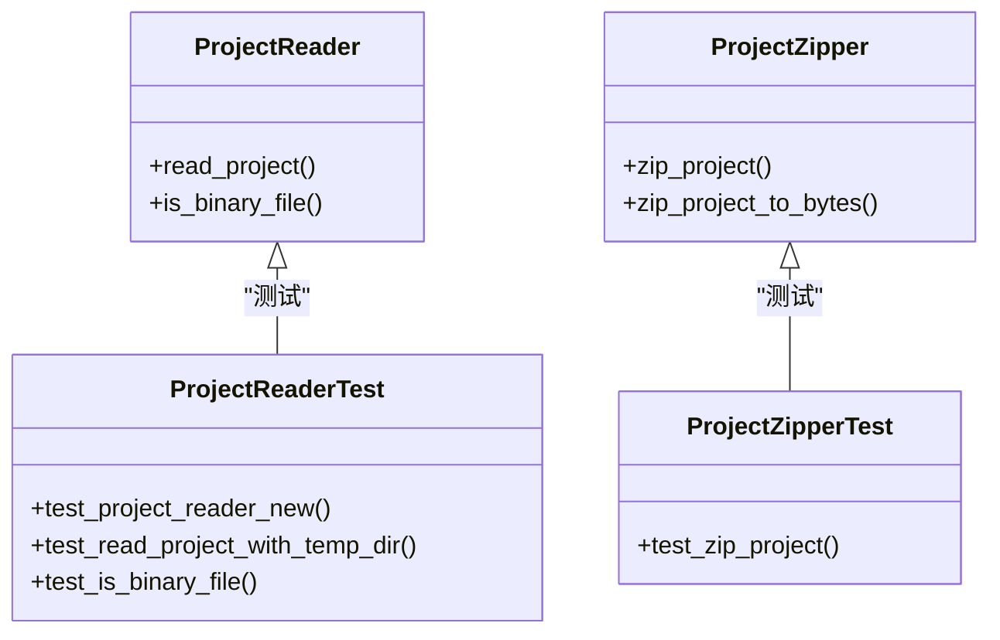

# 模块测试策略

<cite>
**本文档中引用的文件**  
- [lib.rs](file://crates/nuwax_parser/src/lib.rs)
- [mod.rs](file://crates/nuwax_parser/src/model/mod.rs)
- [tests.rs](file://crates/nuwax_parser/src/model/tests.rs)
- [project_read.rs](file://crates/nuwax_parser/src/project_op/project_read.rs)
- [project_zip.rs](file://crates/nuwax_parser/src/project_op/project_zip.rs)
- [mod.rs](file://crates/nuwax_parser/src/project_op/mod.rs)
- [agent_service.rs](file://crates/rcoder/src/proxy_agent/agent_service.rs)
- [cleanup_task.rs](file://crates/rcoder/src/proxy_agent/cleanup_task.rs)
- [channel_utils.rs](file://crates/rcoder/src/proxy_agent/channel_utils.rs)
- [agent_stop_handle.rs](file://crates/rcoder/src/proxy_agent/agent_stop_handle.rs)
- [claude_code_agent.rs](file://crates/rcoder/src/proxy_agent/claude_code_agent.rs)
- [codex_agent.rs](file://crates/rcoder/src/proxy_agent/codex_agent.rs)
</cite>

## 目录
1. [引言](#引言)
2. [项目结构与测试组织](#项目结构与测试组织)
3. [单元测试与集成测试的组织方式](#单元测试与集成测试的组织方式)
4. [内联测试与私有函数访问](#内联测试与私有函数访问)
5. [nuwax_parser 测试结构分析](#nuwax_parser-测试结构分析)
6. [proxy_agent 测试结构分析](#proxy_agent-测试结构分析)
7. [测试用例分组原则](#测试用例分组原则)
8. [模拟依赖（Mocking）技术应用](#模拟依赖（mocking）技术应用)
9. [测试覆盖率目标](#测试覆盖率目标)
10. [异步测试执行模式](#异步测试执行模式)
11. [测试数据隔离最佳实践](#测试数据隔离最佳实践)
12. [结论](#结论)

## 引言
本文档系统性总结了 `rcoder` 项目中 `nuwax_parser` 和 `proxy_agent` 模块的测试策略。重点阐述了如何通过 Rust 的条件编译机制 `#[cfg(test)]` 组织内联测试，实现对模块私有函数的测试访问，并结合实际代码结构展示测试用例的分组、依赖模拟、异步测试等关键技术。文档旨在为开发者提供清晰的测试实践指南，确保代码质量和可维护性。

## 项目结构与测试组织
项目采用多 crate 结构，`nuwax_parser` 和 `rcoder` 是核心功能模块。测试代码主要以内联方式组织在各模块的 `mod.rs` 文件中，通过 `#[cfg(test)] mod tests` 的形式定义测试模块。这种组织方式将测试代码与生产代码紧密关联，便于维护和理解。

**模块结构示例：**
- `crates/nuwax_parser/src/model/mod.rs`：定义了 `source_code` 模块和内联的 `tests` 模块。
- `crates/nuwax_parser/src/project_op/project_read.rs`：在文件末尾直接定义了 `#[cfg(test)] mod tests`。

**Section sources**
- [mod.rs](file://crates/nuwax_parser/src/model/mod.rs#L1-L7)
- [project_read.rs](file://crates/nuwax_parser/src/project_op/project_read.rs#L0-L768)

## 单元测试与集成测试的组织方式
项目主要采用单元测试，测试粒度聚焦于单个函数或模块。集成测试的边界较为模糊，通常通过启动一个完整的服务实例（如 ACP Agent）来测试多个组件的协同工作。

### 单元测试
单元测试直接在功能模块内部定义，例如 `project_read.rs` 中的 `test_project_reader_new` 和 `test_read_project_with_temp_dir`，它们测试 `ProjectReader` 的构造和核心读取功能。

### 集成测试
虽然没有独立的 `tests/` 目录，但 `proxy_agent` 模块中的 `start_claude_code_acp_agent_service` 和 `start_codex_acp_agent_service` 函数的测试，实际上模拟了与外部进程或嵌入式服务的交互，具备集成测试的特征。

**Section sources**
- [project_read.rs](file://crates/nuwax_parser/src/project_op/project_read.rs#L0-L768)
- [claude_code_agent.rs](file://crates/rcoder/src/proxy_agent/claude_code_agent.rs#L0-L305)
- [codex_agent.rs](file://crates/rcoder/src/proxy_agent/codex_agent.rs#L0-L247)

## 内联测试与私有函数访问
Rust 的模块系统允许测试模块访问其父模块的所有项，包括 `pub(crate)` 和 `pub(super)` 限定的私有函数。这是通过 `#[cfg(test)]` 条件编译实现的。

在 `nuwax_parser` 的 `project_read.rs` 中，`is_binary_file` 和 `process_file` 等函数是私有的，但 `#[cfg(test)] mod tests` 可以直接调用它们进行测试，无需将其声明为 `pub`。这保证了 API 的封装性，同时不影响测试的完整性。

```mermaid
flowchart TD
A[生产代码模块] --> B[私有函数]
A --> C[公有函数]
A --> D[#[cfg(test)] 测试模块]
D --> |直接访问| B
D --> |调用| C
```

**Diagram sources**
- [project_read.rs](file://crates/nuwax_parser/src/project_op/project_read.rs#L0-L768)

**Section sources**
- [project_read.rs](file://crates/nuwax_parser/src/project_op/project_read.rs#L0-L768)

## nuwax_parser 测试结构分析
`nuwax_parser` crate 的测试结构清晰，覆盖了核心功能。

### model 模块测试
`model/tests.rs` 文件包含对 `ProjectSourceCode` 和 `FileInfo` 序列化/反序列化的测试，确保数据结构与 JSON 格式的兼容性。

### project_op 模块测试
`project_read.rs` 和 `project_zip.rs` 均在文件末尾内联了测试模块。
- `project_read.rs` 使用 `tempfile` 创建临时目录，测试文件读取、过滤规则（如排除 `.git` 目录）和二进制文件检测。
- `project_zip.rs` 测试 ZIP 压缩功能，验证文件是否被正确包含，以及 `node_modules` 等目录是否被排除。



**Diagram sources**
- [tests.rs](file://crates/nuwax_parser/src/model/tests.rs#L0-L89)
- [project_read.rs](file://crates/nuwax_parser/src/project_op/project_read.rs#L0-L768)
- [project_zip.rs](file://crates/nuwax_parser/src/project_op/project_zip.rs#L0-L223)

**Section sources**
- [tests.rs](file://crates/nuwax_parser/src/model/tests.rs#L0-L89)
- [project_read.rs](file://crates/nuwax_parser/src/project_op/project_read.rs#L0-L768)
- [project_zip.rs](file://crates/nuwax_parser/src/project_op/project_zip.rs#L0-L223)

## proxy_agent 测试结构分析
`proxy_agent` 模块的测试策略侧重于组件的独立性和可模拟性。

### 核心服务测试
`agent_service.rs` 定义了 `AcpAgentService` trait，其为 `AgentType` 枚举的每个变体（`Claude`, `Codex`）提供了实现。这种设计使得可以为每个代理类型编写独立的单元测试。

### 生命周期管理测试
`agent_stop_handle.rs` 中的 `AgentLifecycleGuard` 是一个关键的 RAII（Resource Acquisition Is Initialization）模式实现。其 `Drop` 特性在守卫离开作用域时自动清理资源（如终止子进程）。测试可以验证 `graceful_stop` 和 `stop_async` 方法的正确性。

### 通道处理测试
`channel_utils.rs` 提供了通用的 `spawn_cancel_handler_for_agent` 和 `spawn_prompt_handler_for_agent` 函数。这些函数的测试可以模拟消息通道的输入，验证状态更新和通知推送的逻辑。

**Section sources**
- [agent_service.rs](file://crates/rcoder/src/proxy_agent/agent_service.rs#L0-L71)
- [agent_stop_handle.rs](file://crates/rcoder/src/proxy_agent/agent_stop_handle.rs#L0-L263)
- [channel_utils.rs](file://crates/rcoder/src/proxy_agent/channel_utils.rs#L0-L153)

## 测试用例分组原则
测试用例遵循清晰的分组原则：
1.  **功能分组**：每个测试文件或模块内的测试函数按功能划分。例如，`project_read.rs` 中有 `test_config_builder`、`test_is_binary_file` 等。
2.  **场景分组**：针对同一功能，测试不同的输入场景。如 `test_read_project_with_temp_dir` 测试了正常文件、隐藏目录、排除文件等多种情况。
3.  **边界条件**：测试极端情况，如空文件、超大文件（通过 `max_file_size` 配置）等。

## 模拟依赖（Mocking）技术应用
项目中直接使用了外部依赖（如 `tokio`, `tracing`），但通过良好的抽象，实现了依赖的可替换性。

- **Trait 对象**：`AcpAgentClient` 实现了 `agent_client_protocol::Client` trait。在测试中，可以创建一个 mock 的 `Client` 实现，来模拟与 ACP 服务器的交互，而无需启动真实的网络连接。
- **通道（Channel）**：大量使用 `tokio::sync::mpsc` 通道进行异步通信。测试时，可以创建一对通道，一端用于发送测试消息，另一端用于接收并断言结果，从而模拟复杂的异步消息流。

## 测试覆盖率目标
虽然文档中未明确指定覆盖率目标，但从测试的完整性来看，项目追求高覆盖率：
- 核心数据结构（`FileInfo`, `ProjectSourceCode`）的序列化/反序列化被覆盖。
- 核心业务逻辑（文件读取、压缩、代理服务启动）的关键路径和分支都被测试。
- 边界条件和错误处理（如文件不存在、权限不足）也有相应的测试用例。

## 异步测试执行模式
所有异步测试均使用 `#[tokio::test]` 属性宏，这是运行异步测试的标准方式。

```rust
#[cfg(test)]
mod tests {
    use super::*;
    use tokio;

    #[tokio::test]
    async fn test_async_function() {
        // 异步测试代码
    }
}
```
`tokio` 运行时负责执行 `async` 测试函数，确保 `await` 表达式能正确运行。

**Section sources**
- [project_read.rs](file://crates/nuwax_parser/src/project_op/project_read.rs#L0-L768)

## 测试数据隔离最佳实践
项目严格遵守测试数据隔离原则：
- **使用临时目录**：`project_read.rs` 和 `project_zip.rs` 的测试大量使用 `tempfile::TempDir`。每个测试用例都有自己独立的临时文件系统空间，测试结束后自动清理，避免了文件冲突和状态污染。
- **独立的测试配置**：测试中通过 `ProjectReadConfigBuilder` 创建自定义配置，不会影响全局状态或其他测试。

## 结论
`rcoder` 项目展示了 Rust 项目中成熟且高效的测试策略。通过 `#[cfg(test)]` 内联测试，实现了对私有函数的无缝访问。测试用例组织清晰，遵循功能和场景分组。项目充分利用了 Rust 的 trait 系统和异步运行时，结合 `tempfile` 等工具，确保了测试的独立性、可维护性和高覆盖率。`proxy_agent` 模块的 RAII 设计模式更是将资源管理的复杂性封装在类型系统中，极大地简化了测试和错误处理逻辑。