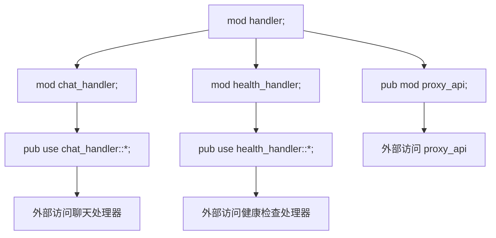
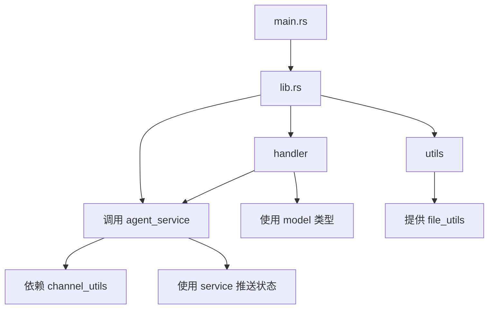

# 模块组织原则

<cite>
**本文档中引用的文件**  
- [mod.rs](file://crates/rcoder/src/handler/mod.rs)
- [mod.rs](file://crates/rcoder/src/proxy_agent/mod.rs)
- [mod.rs](file://crates/rcoder/src/utils/mod.rs)
- [lib.rs](file://crates/rcoder/src/lib.rs)
- [main.rs](file://crates/rcoder/src/main.rs)
- [agent_stop_handle.rs](file://crates/rcoder/src/proxy_agent/agent_stop_handle.rs)
- [file_utils.rs](file://crates/rcoder/src/utils/file_utils.rs)
</cite>

## 目录
1. [项目结构概览](#项目结构概览)
2. [核心模块功能划分](#核心模块功能划分)
3. [mod.rs 文件的作用机制](#modrs-文件的作用机制)
4. [模块依赖关系与调用链路](#模块依赖关系与调用链路)
5. [公共接口暴露策略](#公共接口暴露策略)
6. [高内聚低耦合设计实践](#高内聚低耦合设计实践)

## 项目结构概览

项目采用多 crate 架构，核心业务逻辑集中在 `crates/rcoder` 目录下。该模块通过清晰的目录结构划分功能域，主要包括 `handler`（HTTP 请求处理）、`proxy_agent`（代理生命周期管理）、`utils`（通用工具函数）等子模块。每个子模块通过 `mod.rs` 文件进行封装和接口导出，形成层次分明的模块体系。

**模块来源**
- [handler](file://crates/rcoder/src/handler)
- [proxy_agent](file://crates/rcoder/src/proxy_agent)
- [utils](file://crates/rcoder/src/utils)

## 核心模块功能划分

### handler 模块：HTTP 请求处理中心
`handler` 模块负责处理所有外部 HTTP 请求，包括健康检查、会话通知、聊天交互、代理控制等。该模块通过多个专用处理器文件实现职责分离，如 `chat_handler.rs` 处理对话请求，`health_handler.rs` 提供健康检查接口，`agent_stop_handler.rs` 管理代理停止逻辑。

**模块来源**
- [mod.rs](file://crates/rcoder/src/handler/mod.rs#L1-L16)

### proxy_agent 模块：代理生命周期管理
`proxy_agent` 模块专注于 ACP 协议代理的创建、通信与销毁。包含 `acp_agent`、`claude_code_agent`、`codex_agent` 等具体代理实现，以及 `agent_service` 和 `cleanup_task` 等管理组件。`AcpConnectionInfo` 结构体封装了会话 ID、消息通道等连接信息，`AcpAgentClient` 实现了 ACP 客户端协议。

**模块来源**
- [mod.rs](file://crates/rcoder/src/proxy_agent/mod.rs#L1-L216)

### utils 模块：通用工具函数库
`utils` 模块提供跨领域复用的工具函数，包括内容构建、文件操作、系统提示生成等。`FileUtils` 结构体封装了文件处理逻辑，`mcp_config` 模块管理 MCP 配置，`content_builder` 负责构建请求内容。

**模块来源**
- [mod.rs](file://crates/rcoder/src/utils/mod.rs#L1-L10)

## mod.rs 文件的作用机制

`mod.rs` 文件在 Rust 模块系统中扮演着核心角色，作为目录的入口文件，定义了模块的公共接口。通过在 `mod.rs` 中声明子模块（`mod xxx;`）并使用 `pub use` 导出关键类型，实现了模块内部实现与外部接口的解耦。

例如，`handler/mod.rs` 通过 `pub mod proxy_api;` 和 `pub use chat_handler::*;` 将内部处理器模块暴露给外部使用者，而 `utils/mod.rs` 则选择性地导出 `content_builder`、`mcp_config` 和 `system_prompt` 模块，隐藏 `file_utils` 的实现细节。

**图示来源**
- [handler/mod.rs](file://crates/rcoder/src/handler/mod.rs#L1-L16)
- [utils/mod.rs](file://crates/rcoder/src/utils/mod.rs#L1-L10)

## 模块依赖关系与调用链路

模块间通过明确的依赖关系实现功能协作。`lib.rs` 作为库的根模块，统一导入并重新导出 `handler`、`proxy_agent`、`utils` 等核心模块，形成统一的对外接口。

`proxy_agent` 模块依赖 `model` 和 `service` 模块进行会话状态管理，同时通过 `channel_utils` 模块处理异步通信。`handler` 模块调用 `proxy_agent` 提供的 `agent_service` 启动代理实例，并通过 `cleanup_task` 确保资源释放。

**图示来源**
- [lib.rs](file://crates/rcoder/src/lib.rs#L1-L16)
- [main.rs](file://crates/rcoder/src/main.rs#L10-L17)

## 公共接口暴露策略

项目采用分层暴露策略控制接口可见性。在 `lib.rs` 中通过 `pub use model::*;`、`pub use proxy_agent::*;` 等语句将核心类型统一导出，简化外部使用。各子模块的 `mod.rs` 文件则精细控制内部符号的可见性。

例如，`utils/mod.rs` 选择性导出 `content_builder`、`mcp_config` 和 `system_prompt`，而 `file_utils` 仅在内部使用，体现了"对外暴露最小必要接口"的设计原则。`proxy_agent::agent_stop_handle` 中定义的 `AgentStopHandleArc` 类型通过 `pub use` 被上层模块引用，确保类型一致性。

**代码来源**
- [lib.rs](file://crates/rcoder/src/lib.rs#L14-L16)
- [proxy_agent/mod.rs](file://crates/rcoder/src/proxy_agent/mod.rs#L20-L21)
- [agent_stop_handle.rs](file://crates/rcoder/src/proxy_agent/agent_stop_handle.rs#L262-L262)

## 高内聚低耦合设计实践

项目通过以下实践确保高内聚低耦合：
1. **功能域划分**：按 HTTP 处理、代理管理、工具函数划分模块，每个模块职责单一
2. **接口抽象**：`AcpAgentClient` 实现 `Client` trait，便于替换不同代理实现
3. **依赖注入**：通过通道（mpsc）传递 `prompt_tx`、`cancel_tx` 等依赖，降低耦合度
4. **状态集中管理**：`PROJECT_AND_AGENT_INFO_MAP` 全局映射表统一管理代理状态
5. **异步通信**：使用 `tokio::sync::mpsc` 实现模块间非阻塞通信

这些设计使得各模块可独立开发、测试和维护，同时通过清晰的接口契约实现高效协作。

**代码来源**
- [proxy_agent/mod.rs](file://crates/rcoder/src/proxy_agent/mod.rs#L30-L35)
- [acp_agent.rs](file://crates/rcoder/src/proxy_agent/acp_agent.rs)
- [agent_service.rs](file://crates/rcoder/src/proxy_agent/agent_service.rs)