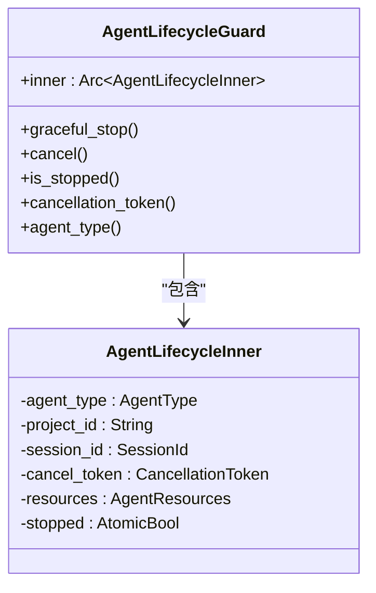
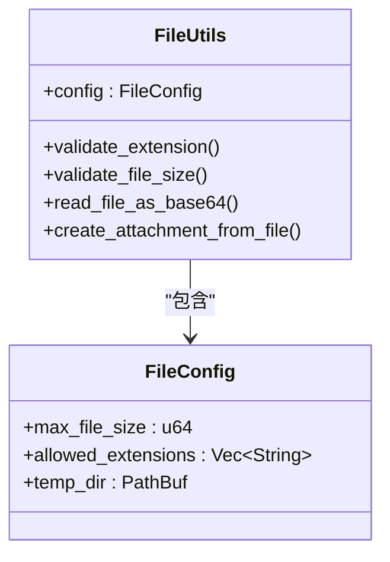

# 访问控制策略

<cite>
**本文档引用的文件**
- [agent_stop_handle.rs](file://crates/rcoder/src/proxy_agent/agent_stop_handle.rs)
- [file_utils.rs](file://crates/rcoder/src/utils/file_utils.rs)
</cite>

## 目录
1. [引言](#引言)
2. [Rust访问控制机制概述](#rust访问控制机制概述)
3. [AgentStopHandleArc类型分析](#agentstophandlearc类型分析)
4. [FileUtils结构体设计](#fileutils结构体设计)
5. [类型封装与Arc智能指针结合模式](#类型封装与arc智能指针结合模式)
6. [模块层级访问权限控制](#模块层级访问权限控制)
7. [结论](#结论)

## 引言
本文档详细阐述了项目中Rust访问控制机制的应用，重点分析了`pub`、`pub(crate)`、`pub(in path)`等可见性修饰符的实际使用场景。通过`AgentStopHandleArc`类型和`FileUtils`结构体的实例，说明如何通过私有字段与公共API的组合设计来保障内部状态安全。同时，文档还解释了类型封装与`Arc`智能指针结合使用的模式，确保跨线程共享时的数据安全性，以及模块层级间的访问权限控制机制。

## Rust访问控制机制概述
Rust的访问控制机制通过可见性修饰符来管理代码的可见性，确保模块间的封装性和安全性。主要的可见性修饰符包括：
- `pub`：使项对所有作用域可见
- `pub(crate)`：使项仅在当前crate内可见
- `pub(in path)`：使项在指定路径内可见

这些修饰符帮助开发者控制代码的暴露程度，防止外部模块直接访问内部实现细节，从而提高代码的安全性和可维护性。

## AgentStopHandleArc类型分析
`AgentStopHandleArc`类型定义在`agent_stop_handle.rs`文件中，作为`Arc<AgentLifecycleGuard>`的类型别名，用于管理Agent的生命周期。该类型通过RAII（Resource Acquisition Is Initialization）原则，确保在守卫被drop时自动清理Agent资源。

`AgentLifecycleGuard`结构体包含一个`Arc<AgentLifecycleInner>`字段，`AgentLifecycleInner`结构体则封装了Agent的类型、项目ID、会话ID、取消令牌、资源和停止状态等信息。通过`pub`修饰符，`AgentLifecycleGuard`的公共方法如`graceful_stop`、`cancel`和`is_stopped`对外暴露，允许外部代码优雅地停止Agent、发送取消信号和检查停止状态。

**图表来源**
- [agent_stop_handle.rs](file://crates/rcoder/src/proxy_agent/agent_stop_handle.rs#L262-L262)

**章节来源**
- [agent_stop_handle.rs](file://crates/rcoder/src/proxy_agent/agent_stop_handle.rs#L262-L262)

## FileUtils结构体设计
`FileUtils`结构体定义在`file_utils.rs`文件中，用于提供文件处理工具函数。该结构体包含一个`FileConfig`字段，用于配置文件处理的参数，如最大文件大小、允许的文件扩展名和临时文件目录。

`FileUtils`结构体通过`pub`修饰符暴露其公共方法，如`validate_extension`、`validate_file_size`、`read_file_as_base64`和`create_attachment_from_file`，允许外部代码验证文件扩展名、检查文件大小、读取文件内容为base64编码和从文件路径创建附件。这些方法通过内部的`FileConfig`配置，确保文件处理的安全性和一致性。

**图表来源**
- [file_utils.rs](file://crates/rcoder/src/utils/file_utils.rs#L42-L45)

**章节来源**
- [file_utils.rs](file://crates/rcoder/src/utils/file_utils.rs#L42-L45)

## 类型封装与Arc智能指针结合模式
`AgentStopHandleArc`类型通过`Arc<AgentLifecycleGuard>`的封装，实现了跨线程共享时的数据安全性。`Arc`（Atomically Reference Counted）智能指针允许多个所有者共享同一数据，通过原子引用计数确保数据在所有引用被drop时才被清理。

`AgentLifecycleGuard`的`Drop`实现确保在最后一个引用被drop时执行清理操作，包括发送取消信号和同步清理关键资源。这种设计模式结合了RAII原则和`Arc`智能指针，确保了资源的自动管理和线程安全。

## 模块层级访问权限控制
项目通过模块层级的访问权限控制，防止外部模块直接访问内部实现细节。例如，`agent_stop_handle`模块中的`AgentLifecycleInner`结构体和`AgentResources`枚举被定义为私有，仅在模块内部使用。通过`pub`修饰符，模块仅暴露必要的公共接口，如`AgentStopHandleArc`和`AgentLifecycleGuard`的公共方法。

这种设计模式确保了模块的封装性，外部模块只能通过定义好的公共API与模块交互，无法直接访问或修改内部状态，从而提高了代码的安全性和可维护性。

## 结论
本文档详细分析了项目中Rust访问控制机制的应用，通过`AgentStopHandleArc`类型和`FileUtils`结构体的实例，展示了如何通过私有字段与公共API的组合设计来保障内部状态安全。同时，文档还解释了类型封装与`Arc`智能指针结合使用的模式，确保跨线程共享时的数据安全性，以及模块层级间的访问权限控制机制。这些设计模式和实践为项目的稳定性和安全性提供了有力保障。