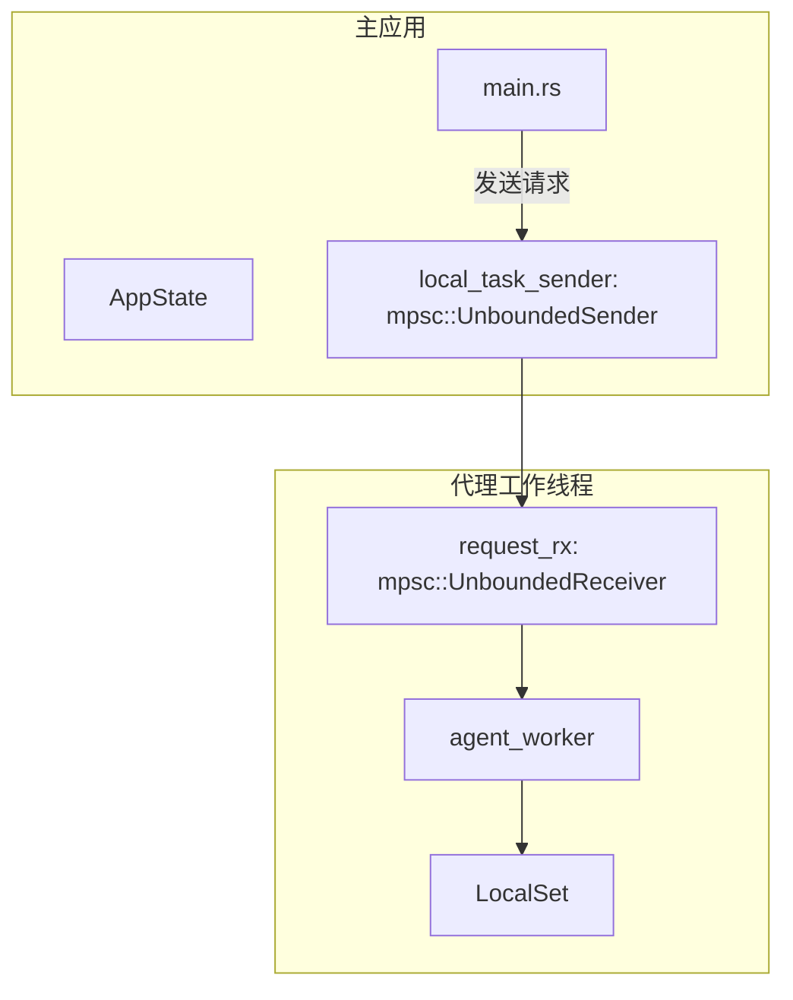
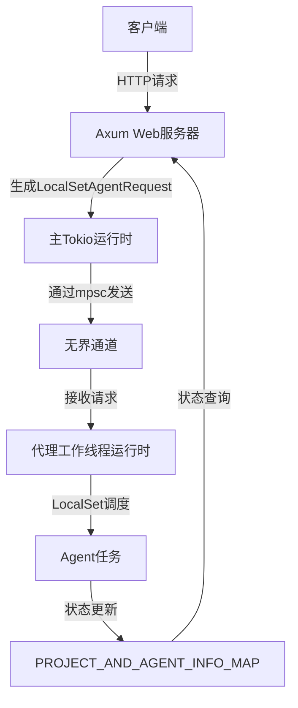
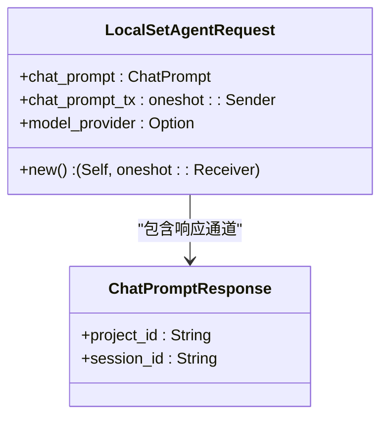
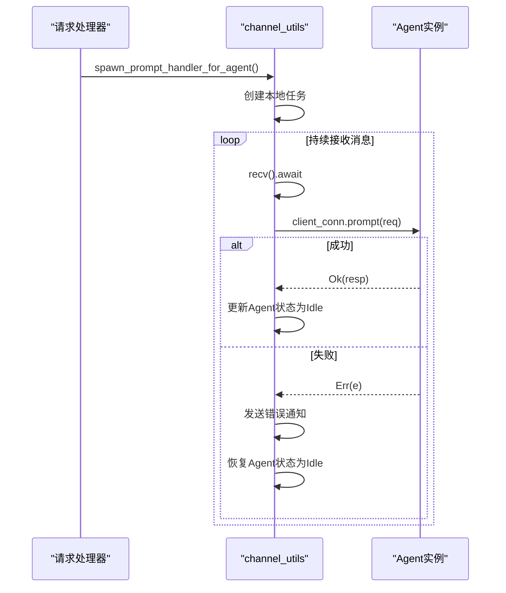
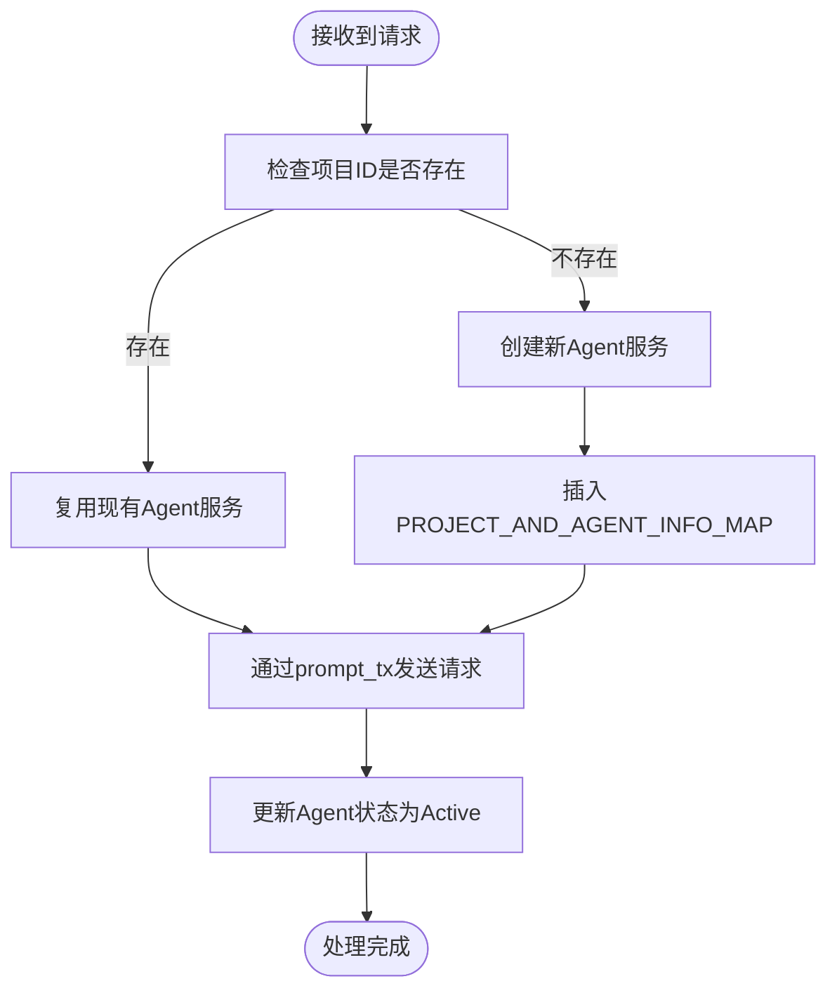
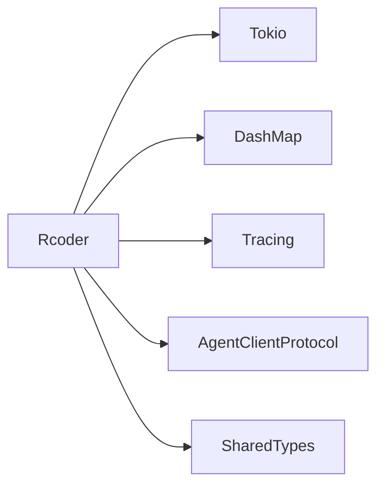

# 异步消息传递机制

<cite>
**本文档引用的文件**   
- [main.rs](file://crates/rcoder/src/main.rs)
- [acp_agent.rs](file://crates/rcoder/src/proxy_agent/acp_agent.rs)
- [channel_utils.rs](file://crates/rcoder/src/proxy_agent/channel_utils.rs)
- [agent_model.rs](file://crates/rcoder/src/model/agent_model.rs)
</cite>

## 目录
1. [引言](#引言)
2. [项目结构](#项目结构)
3. [核心组件](#核心组件)
4. [架构概述](#架构概述)
5. [详细组件分析](#详细组件分析)
6. [依赖分析](#依赖分析)
7. [性能考量](#性能考量)
8. [故障排除指南](#故障排除指南)
9. [结论](#结论)

## 引言
本文档系统化讲解基于Tokio通道（mpsc/oneshot）的异步通信架构，重点说明主应用如何通过`mpsc::Sender<AgentCommand>`向代理工作线程发送控制指令（如启动、停止），以及`oneshot`通道如何实现请求-响应模式的精确匹配。同时剖析`LocalSet`在单线程运行时中隔离`!Send`类型任务的作用机制，并结合`channel_utils`中的工具函数展示通道创建、错误传播与超时处理的实现细节。

## 项目结构
本项目采用模块化设计，主要功能集中在`crates/rcoder`目录下，核心异步通信逻辑分布在`proxy_agent`、`model`和`main.rs`中。通过`tokio::sync::mpsc`实现多生产者单消费者通道通信，使用`oneshot`通道完成请求-响应交互。

**Diagram sources**
- [main.rs](file://crates/rcoder/src/main.rs#L45-L76)
- [acp_agent.rs](file://crates/rcoder/src/proxy_agent/acp_agent.rs#L110-L155)

**Section sources**
- [main.rs](file://crates/rcoder/src/main.rs#L45-L76)
- [acp_agent.rs](file://crates/rcoder/src/proxy_agent/acp_agent.rs#L110-L155)

## 核心组件
系统通过`LocalSetAgentRequest`结构体封装用户请求，利用`oneshot::Sender<ChatPromptResponse>`实现异步响应回执。主应用通过`unbounded_channel`创建无界通道，将请求发送至运行在独立OS线程中的单线程Tokio运行时。

**Section sources**
- [acp_agent.rs](file://crates/rcoder/src/proxy_agent/acp_agent.rs#L128-L137)
- [main.rs](file://crates/rcoder/src/main.rs#L45-L76)

## 架构概述
系统采用主从架构，主应用运行多线程Tokio运行时处理HTTP请求，而代理工作线程运行在独立的单线程Tokio运行时中，通过`LocalSet`隔离非`Send`类型的Agent任务。

**Diagram sources**
- [main.rs](file://crates/rcoder/src/main.rs#L45-L76)
- [acp_agent.rs](file://crates/rcoder/src/proxy_agent/acp_agent.rs#L110-L155)

## 详细组件分析

### 代理请求处理分析
`LocalSetAgentRequest`包含用户prompt请求和`oneshot`响应通道，确保每个请求都能获得精确的响应匹配。

**Diagram sources**
- [acp_agent.rs](file://crates/rcoder/src/proxy_agent/acp_agent.rs#L128-L137)

#### 通道工具函数分析
`channel_utils`模块提供通用的消息处理任务，支持对实现`Agent` trait的类型进行统一处理。

**Diagram sources**
- [channel_utils.rs](file://crates/rcoder/src/proxy_agent/channel_utils.rs#L56-L88)

**Section sources**
- [channel_utils.rs](file://crates/rcoder/src/proxy_agent/channel_utils.rs#L56-L88)
- [acp_agent.rs](file://crates/rcoder/src/proxy_agent/acp_agent.rs#L128-L137)

### 概念概述
系统通过`PROJECT_AND_AGENT_INFO_MAP`全局映射维护项目与Agent服务的关系，每个项目对应一个Agent服务实例，实现资源复用和状态管理。

[无来源，此图为概念性工作流]

[无来源，此节不分析具体文件]

## 依赖分析
系统依赖Tokio异步运行时、dashmap用于线程安全的哈希映射、tracing用于日志记录，以及agent_client_protocol定义的Agent通信协议。

**Diagram sources**
- [Cargo.toml](file://crates/rcoder/Cargo.toml)

**Section sources**
- [Cargo.toml](file://crates/rcoder/Cargo.toml)

## 性能考量
建议配置通道容量以避免内存溢出，采用背压控制策略限制请求速率。对于高并发场景，可考虑使用有界通道替代无界通道，防止资源耗尽。

- 通道容量配置：根据预期并发量设置合理上限
- 背压控制：当通道满时拒绝新请求或返回限流响应
- 任务调度：利用`LocalSet`优化单线程内任务调度效率
- 状态管理：通过`AgentLifecycleGuard`自动清理闲置Agent资源

[无来源，此节提供通用性能建议]

## 故障排除指南
当遇到Agent通信失败时，应检查以下方面：
- 确认`local_task_sender`是否已正确初始化
- 验证`oneshot`通道是否在超时前完成响应
- 检查`PROJECT_AND_AGENT_INFO_MAP`中Agent状态是否正常
- 查看日志中是否有"发送Prompt失败"等相关错误信息

**Section sources**
- [acp_agent.rs](file://crates/rcoder/src/proxy_agent/acp_agent.rs#L110-L155)
- [channel_utils.rs](file://crates/rcoder/src/proxy_agent/channel_utils.rs#L56-L88)

## 结论
本文档详细解析了基于Tokio通道的异步通信架构，展示了如何通过`mpsc`和`oneshot`通道实现高效的任务调度与响应机制。`LocalSet`的使用确保了非`Send`类型任务的安全执行，而`channel_utils`提供的通用处理函数增强了代码复用性。合理的性能调优策略可进一步提升系统稳定性和响应能力。

[无来源，此节为总结性内容]