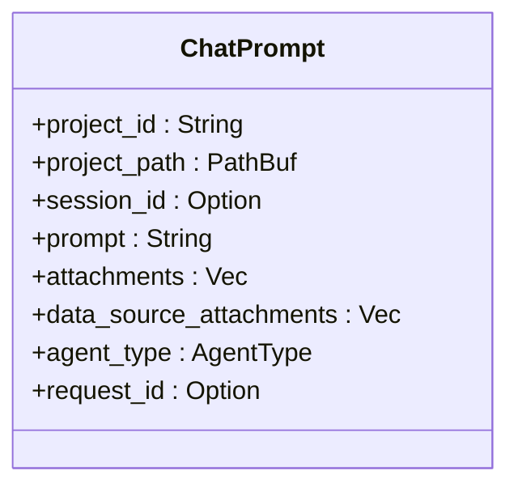
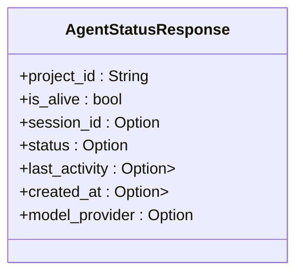
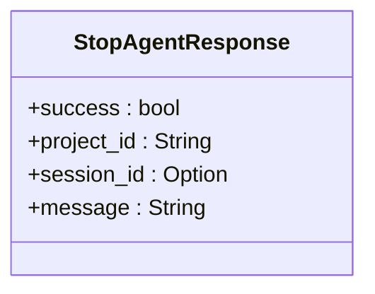
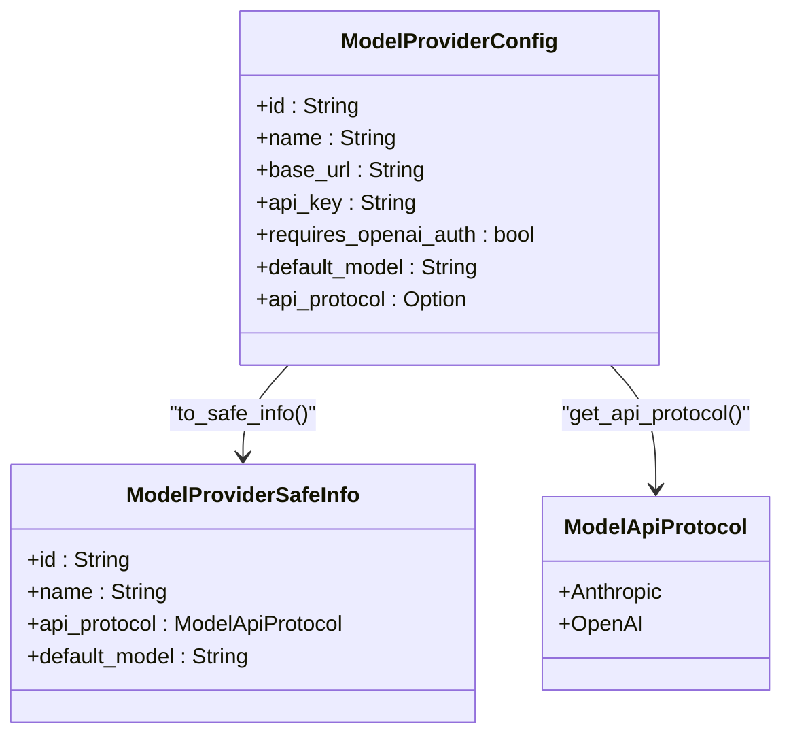
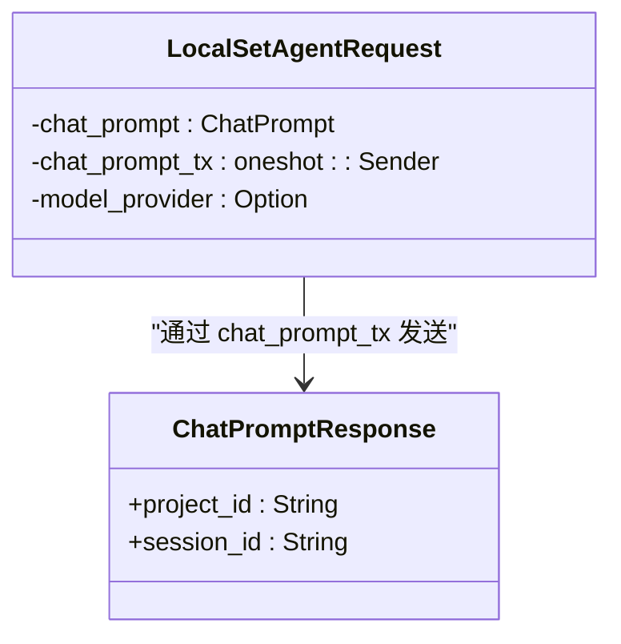
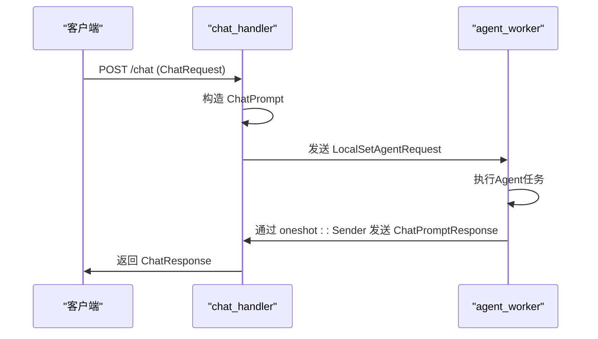
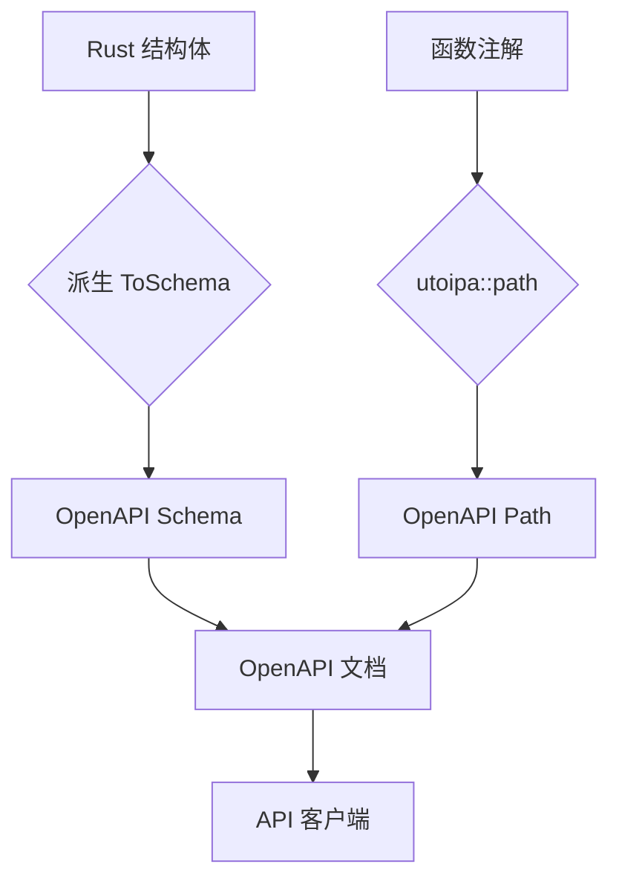

# 消息格式与接口契约

<cite>
**本文档中引用的文件**  
- [agent_model.rs](file://crates/rcoder/src/model/agent_model.rs)
- [chat_prompt.rs](file://crates/rcoder/src/model/chat_prompt.rs)
- [acp_agent.rs](file://crates/rcoder/src/proxy_agent/acp_agent.rs)
- [agent_service.rs](file://crates/rcoder/src/proxy_agent/agent_service.rs)
- [channel_utils.rs](file://crates/rcoder/src/proxy_agent/channel_utils.rs)
- [codex_agent.rs](file://crates/rcoder/src/proxy_agent/codex_agent.rs)
- [claude_code_agent.rs](file://crates/rcoder/src/proxy_agent/claude_code_agent.rs)
- [chat_handler.rs](file://crates/rcoder/src/handler/chat_handler.rs)
- [shared_types/src/model/model_provider.rs](file://crates/shared_types/src/model/model_provider.rs)
- [shared_types/src/lib.rs](file://crates/shared_types/src/lib.rs)
</cite>

## 目录
1. [引言](#引言)
2. [核心消息结构](#核心消息结构)
3. [跨Crate类型共享机制](#跨crate类型共享机制)
4. [响应结构设计与序列化支持](#响应结构设计与序列化支持)
5. [异步通信与通道封装](#异步通信与通道封装)
6. [消息构造与传递流程](#消息构造与传递流程)
7. [类型安全与API文档一致性](#类型安全与api文档一致性)
8. [结论](#结论)

## 引言
本系统通过定义清晰的数据结构与接口契约，实现组件间的高效、安全通信。重点在于`shared_types`中定义的通用模型如何在多个crate间共享，以及`rcoder`中各类响应结构的设计原则与序列化支持。系统采用`serde`进行序列化，`utoipa::ToSchema`生成OpenAPI文档，确保类型安全与API文档的一致性。

## 核心消息结构

### ChatPrompt：聊天请求载体
`ChatPrompt`结构体封装了用户端发送的完整聊天请求，包含项目标识、会话信息、提示内容、附件及数据源等关键字段。该结构通过`derive_builder`宏支持构建器模式，确保字段的灵活配置与默认值处理。

**Diagram sources**  
- [chat_prompt.rs](file://crates/rcoder/src/model/chat_prompt.rs#L6-L39)

**Section sources**  
- [chat_prompt.rs](file://crates/rcoder/src/model/chat_prompt.rs#L6-L39)
- [chat_handler.rs](file://crates/rcoder/src/handler/chat_handler.rs#L10-L98)

### AgentStatusResponse：Agent状态响应
`AgentStatusResponse`用于查询Agent的运行状态，包含项目ID、存活状态、会话ID、服务状态、时间戳及模型提供商安全信息。通过`serde::skip_serializing_if`优化序列化输出，仅当Agent存活时才包含详细信息。

**Diagram sources**  
- [agent_model.rs](file://crates/rcoder/src/model/agent_model.rs#L286-L313)

**Section sources**  
- [agent_model.rs](file://crates/rcoder/src/model/agent_model.rs#L286-L313)

### StopAgentResponse：停止Agent响应
`StopAgentResponse`结构体定义了停止Agent操作的响应，包含操作结果、项目ID、会话ID及消息描述，为客户端提供明确的操作反馈。

**Diagram sources**  
- [agent_stop_handler.rs](file://crates/rcoder/src/handler/agent_stop_handler.rs#L18-L29)

**Section sources**  
- [agent_stop_handler.rs](file://crates/rcoder/src/handler/agent_stop_handler.rs#L18-L29)

## 跨Crate类型共享机制

### shared_types crate：通用模型定义
`shared_types` crate 作为类型共享中心，定义了`ModelProviderConfig`、`ModelProviderSafeInfo`和`ModelApiProtocol`等通用模型。这些类型通过`pub use`在`lib.rs`中重新导出，供其他crate直接引用。

**Diagram sources**  
- [model_provider.rs](file://crates/shared_types/src/model/model_provider.rs#L50-L104)
- [lib.rs](file://crates/shared_types/src/lib.rs#L1-L3)

**Section sources**  
- [model_provider.rs](file://crates/shared_types/src/model/model_provider.rs#L50-L104)
- [lib.rs](file://crates/shared_types/src/lib.rs#L1-L3)

### 类型安全与依赖管理
通过将共享类型独立为专用crate，实现了类型定义与业务逻辑的解耦。各业务crate（如`rcoder`、`codex-acp-agent`）通过Cargo.toml依赖`shared_types`，确保类型定义的唯一性与一致性，避免了类型重复定义和版本冲突。

## 响应结构设计与序列化支持

### serde与ToSchema集成
所有关键响应结构（如`AgentStatusResponse`、`StopAgentResponse`）均派生`serde::Serialize`和`utoipa::ToSchema`，实现无缝的JSON序列化与OpenAPI文档生成。`#[schema(example = "...")]`属性提供文档示例，增强API可读性。

### 序列化优化
利用`#[serde(skip_serializing_if = "Option::is_none")]`特性，避免序列化`Option`类型的`None`值，使输出JSON更加简洁。例如，当Agent未存活时，`session_id`、`status`等字段不会出现在响应中。

## 异步通信与通道封装

### LocalSetAgentRequest：异步任务封装
`LocalSetAgentRequest`结构体封装了在`LocalSet`中运行的Agent请求，其核心是携带`oneshot::Sender<ChatPromptResponse>`的回执通道，用于异步返回执行结果。

**Diagram sources**  
- [acp_agent.rs](file://crates/rcoder/src/proxy_agent/acp_agent.rs#L128-L137)
- [chat_prompt.rs](file://crates/rcoder/src/model/chat_prompt.rs#L32-L39)

**Section sources**  
- [acp_agent.rs](file://crates/rcoder/src/proxy_agent/acp_agent.rs#L128-L137)
- [chat_prompt.rs](file://crates/rcoder/src/model/chat_prompt.rs#L32-L39)

### 消息传递流程
1. **请求发起**：`chat_handler`接收HTTP请求，构造`ChatRequest`。
2. **本地任务创建**：将`ChatPrompt`和`model_provider`封装为`LocalSetAgentRequest`，并通过`mpsc::UnboundedSender`发送至`agent_worker`。
3. **异步执行**：`agent_worker`处理请求，执行Agent逻辑。
4. **结果回传**：通过`oneshot::Sender`将`ChatPromptResponse`发送回调用方，完成异步通信。

**Diagram sources**  
- [chat_handler.rs](file://crates/rcoder/src/handler/chat_handler.rs#L130-L231)
- [acp_agent.rs](file://crates/rcoder/src/proxy_agent/acp_agent.rs#L180-L297)

**Section sources**  
- [chat_handler.rs](file://crates/rcoder/src/handler/chat_handler.rs#L130-L231)
- [acp_agent.rs](file://crates/rcoder/src/proxy_agent/acp_agent.rs#L180-L297)

## 消息构造与传递流程

### PromptRequest构建
`build_prompt_to_acp_agent`函数负责将`ChatPrompt`转换为ACP协议的`PromptRequest`。它整合系统提示词、用户输入和数据源信息，并将附件转换为`ContentBlock`列表。

**Section sources**  
- [acp_agent.rs](file://crates/rcoder/src/proxy_agent/acp_agent.rs#L250-L297)

### 通用通道处理
`channel_utils`模块提供`spawn_cancel_handler_for_agent`和`spawn_prompt_handler_for_agent`两个通用函数，用于为不同类型的Agent（如`CodexAgent`、`ClaudeCodeAgent`）创建取消和提示处理任务，实现代码复用。

**Section sources**  
- [channel_utils.rs](file://crates/rcoder/src/proxy_agent/channel_utils.rs#L10-L153)

## 类型安全与API文档一致性

### 编译时类型检查
Rust的强类型系统确保了消息结构在编译时即被验证，防止了运行时类型错误。`AgentType`枚举和`ModelApiProtocol`枚举的使用，限制了配置的合法值。

### 运行时序列化安全
`serde`的`Deserialize`派生确保了从JSON反序列化时的类型安全。`#[serde(default)]`属性为可选字段提供默认值，提高API的健壮性。

### API文档自动生成
`utoipa::ToSchema`与`#[utoipa::path]`宏结合，根据代码注解和类型定义自动生成OpenAPI文档。`#[schema(example = "...")]`确保文档示例与实际行为一致，减少文档与实现的偏差。

**Diagram sources**  
- [chat_handler.rs](file://crates/rcoder/src/handler/chat_handler.rs#L100-L128)

**Section sources**  
- [chat_handler.rs](file://crates/rcoder/src/handler/chat_handler.rs#L100-L128)

## 结论
本系统通过精心设计的数据结构与接口契约，实现了组件间的高效、安全通信。`shared_types` crate 的引入确保了跨crate类型共享的统一性，`serde`与`utoipa`的深度集成保障了序列化与API文档的一致性。异步通信通过`oneshot`通道优雅地解决了结果回传问题。整体设计体现了Rust在类型安全、异步编程和模块化方面的优势，为系统的可维护性和可靠性奠定了坚实基础。