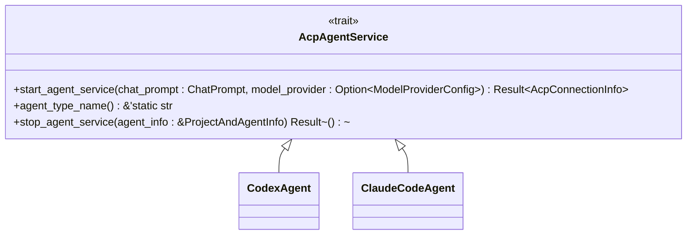
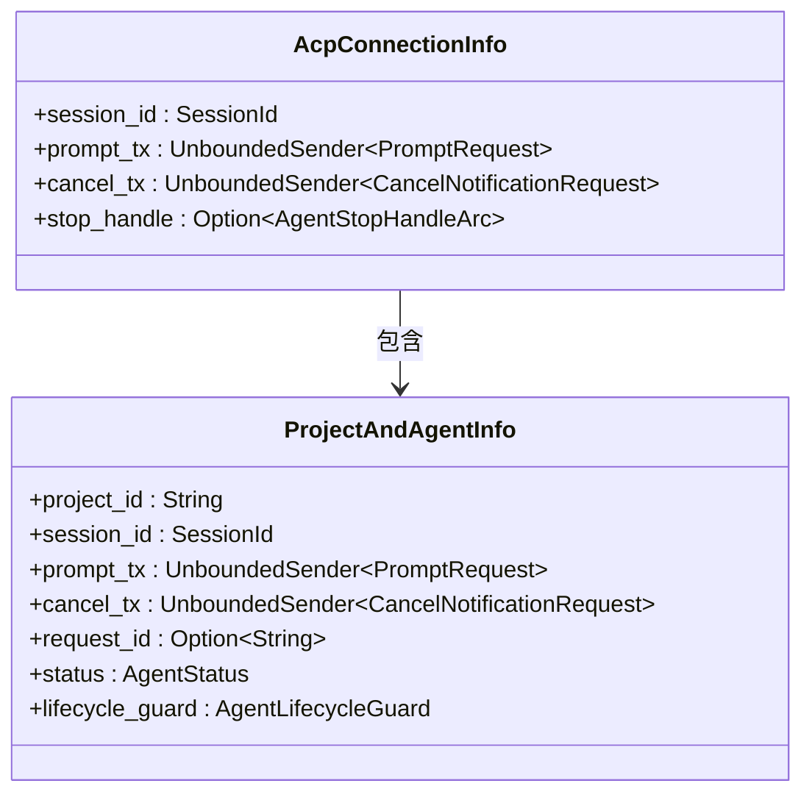
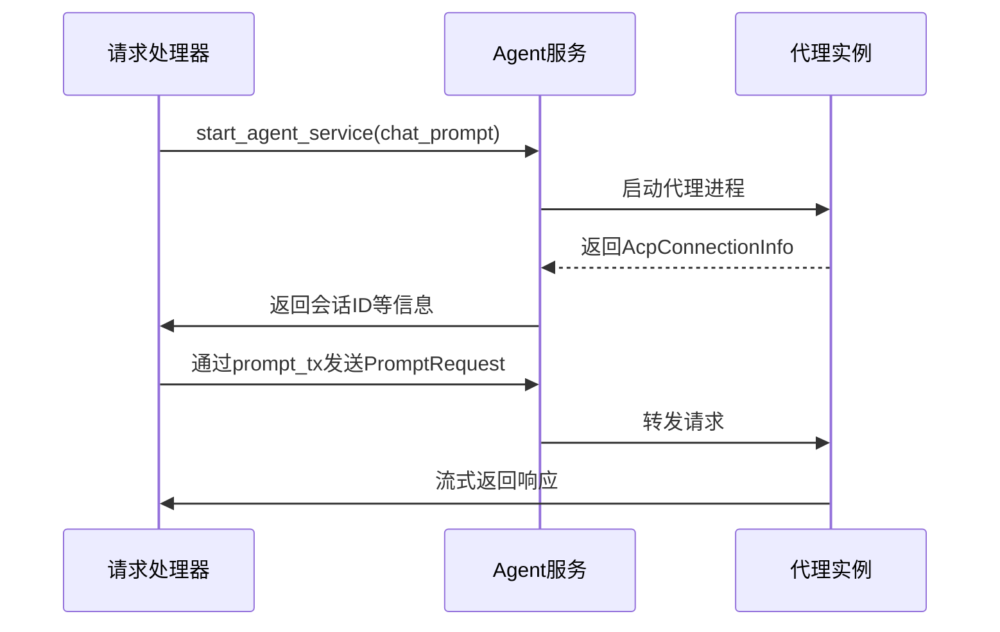

# 组件间通信机制

<cite>
**本文档引用的文件**  
- [shared_types/src/lib.rs](file://crates/shared_types/src/lib.rs)
- [shared_types/src/model/model_provider.rs](file://crates/shared_types/src/model/model_provider.rs)
- [acp_adapter/src/lib.rs](file://crates/acp_adapter/src/lib.rs)
- [rcoder/src/lib.rs](file://crates/rcoder/src/lib.rs)
- [rcoder/src/proxy_agent/agent_service.rs](file://crates/rcoder/src/proxy_agent/agent_service.rs)
- [rcoder/src/proxy_agent/acp_agent.rs](file://crates/rcoder/src/proxy_agent/acp_agent.rs)
- [rcoder/src/proxy_agent/mod.rs](file://crates/rcoder/src/proxy_agent/mod.rs)
- [rcoder/src/model/chat_prompt.rs](file://crates/rcoder/src/model/chat_prompt.rs)
- [rcoder/src/model/agent_model.rs](file://crates/rcoder/src/model/agent_model.rs)
- [rcoder/src/proxy_agent/agent_stop_handle.rs](file://crates/rcoder/src/proxy_agent/agent_stop_handle.rs)
- [codex-acp-agent/src/agent.rs](file://crates/codex-acp-agent/src/agent.rs)
</cite>

## 目录
1. [引言](#引言)
2. [统一数据模型设计](#统一数据模型设计)
3. [ACP协议适配层](#acp协议适配层)
4. [异步通信架构](#异步通信架构)
5. [消息传递流程](#消息传递流程)
6. [错误传播与超时控制](#错误传播与超时控制)
7. [解耦设计与插件扩展](#解耦设计与插件扩展)
8. [总结](#总结)

## 引言
本系统采用模块化架构，通过清晰的接口契约和异步通信机制实现各功能组件之间的松耦合协作。核心通信模式围绕`shared_types`提供的统一数据模型展开，结合`acp_adapter`的协议转换能力，以及`rcoder`主模块的通道与trait对象机制，构建了高效、可扩展的代理服务通信体系。

## 统一数据模型设计
`shared_types` crate作为跨模块数据交换的基础，定义了标准化的数据结构，确保各组件间通信的类型一致性。

### 核心数据结构
- **ModelProviderConfig**：模型提供商配置，包含API地址、密钥、协议类型等安全与连接信息
- **ChatPrompt**：用户端发起的代理请求，携带项目ID、会话ID、提示内容、附件等上下文
- **ChatPromptResponse**：请求响应，返回项目与会话标识，用于后续交互追踪

这些类型在多个crate中被直接引用，形成统一的输入输出契约。

**Section sources**
- [shared_types/src/model/model_provider.rs](file://crates/shared_types/src/model/model_provider.rs#L41-L66)
- [rcoder/src/model/chat_prompt.rs](file://crates/rcoder/src/model/chat_prompt.rs#L5-L29)

## ACP协议适配层
`acp_adapter` crate负责将内部消息格式转换为符合ACP（Agent Client Protocol）标准的序列化结构，实现与外部代理的协议兼容。

### 功能职责
- 提供`ConnectionState`、`SessionState`等状态类型，映射代理会话生命周期
- 定义`StreamUpdate`、`Tool`等消息类型，支持流式响应与工具调用
- 封装`Plan`、`PlanEntry`等任务规划结构，支持复杂任务编排

该层作为协议转换中间件，屏蔽了底层通信细节，使上层模块无需关心具体协议实现。

**Section sources**
- [acp_adapter/src/lib.rs](file://crates/acp_adapter/src/lib.rs#L1-L12)
- [acp_adapter/src/types.rs](file://crates/acp_adapter/src/types.rs)

## 异步通信架构
系统采用基于`tokio`通道（channel）和`async_trait`的异步通信模型，实现非阻塞的消息传递与服务调用。

### 核心抽象：AcpAgentService

**Diagram sources**
- [rcoder/src/proxy_agent/agent_service.rs](file://crates/rcoder/src/proxy_agent/agent_service.rs#L7-L31)

该trait定义了代理服务的统一接口，支持多态调用，为插件化扩展奠定基础。

### 通信通道设计

**Diagram sources**
- [rcoder/src/proxy_agent/mod.rs](file://crates/rcoder/src/proxy_agent/mod.rs#L21-L31)
- [rcoder/src/model/agent_model.rs](file://crates/rcoder/src/model/agent_model.rs#L249-L274)

`AcpConnectionInfo`封装了与代理实例通信所需的通道句柄，包括：
- `prompt_tx`：用于发送`PromptRequest`消息
- `cancel_tx`：用于发送取消通知
- `stop_handle`：用于优雅停止代理服务

## 消息传递流程
系统通过多层通道实现请求的分发与响应的回传。

### 请求处理流程

**Diagram sources**
- [rcoder/src/proxy_agent/acp_agent.rs](file://crates/rcoder/src/proxy_agent/acp_agent.rs#L128-L137)
- [rcoder/src/proxy_agent/agent_service.rs](file://crates/rcoder/src/proxy_agent/agent_service.rs#L7-L31)

1. 用户请求经由`ChatPrompt`封装，通过`AcpAgentService::start_agent_service`启动代理
2. 成功启动后返回`AcpConnectionInfo`，其中包含用于后续通信的通道
3. 后续交互通过`prompt_tx`发送`PromptRequest`，代理通过流式通道返回结果

## 错误传播与超时控制
系统通过`Result`类型和通道的`oneshot`接收器实现错误传播与超时处理。

### 错误处理机制
- 所有异步方法返回`Result<T, Error>`，错误沿调用链向上传播
- 通道通信使用`oneshot::Sender`进行响应回传，确保请求-响应配对
- `AgentLifecycleGuard`实现RAII机制，确保代理资源在异常时自动清理

### 超时策略
- 在高层调用中通过`tokio::time::timeout`设置操作超时
- 代理内部实现心跳检测与空闲超时自动关闭
- 通道发送不阻塞，避免因下游阻塞导致整个系统停滞

**Section sources**
- [rcoder/src/proxy_agent/agent_stop_handle.rs](file://crates/rcoder/src/proxy_agent/agent_stop_handle.rs#L17-L22)
- [rcoder/src/model/agent_model.rs](file://crates/rcoder/src/model/agent_model.rs#L286-L313)

## 解耦设计与插件扩展
系统的分层架构与接口抽象为插件化扩展提供了良好支持。

### 解耦优势
- **数据解耦**：`shared_types`提供统一模型，避免模块间直接依赖
- **协议解耦**：`acp_adapter`封装协议细节，支持未来协议演进
- **实现解耦**：`AcpAgentService` trait允许不同代理实现共存

### 扩展能力
- 新增代理只需实现`AcpAgentService` trait
- 可通过配置动态加载不同代理实现
- 数据模型向后兼容设计支持渐进式升级

此设计显著降低了模块间耦合度，提高了系统的可维护性与可扩展性。

## 总结
本系统通过`shared_types`的统一数据模型、`acp_adapter`的协议适配和`rcoder`的异步通道通信，构建了高效、灵活的组件间通信体系。基于trait的多态设计和RAII资源管理机制，不仅保障了系统的稳定性与响应性，也为未来的功能扩展和协议演进提供了坚实基础。