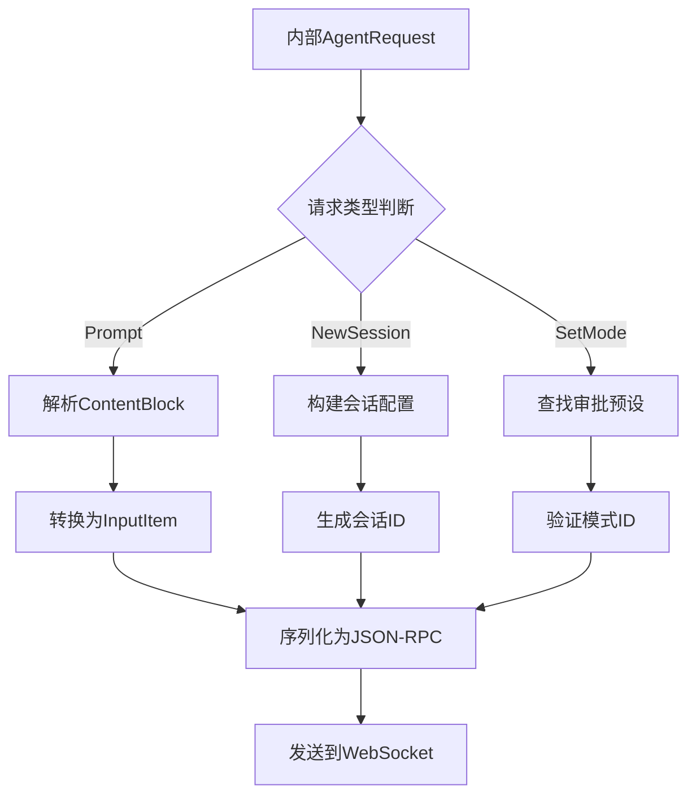
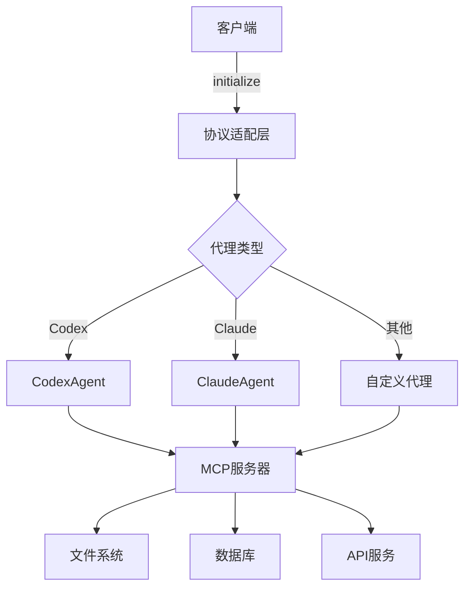

# 通信协议与适配机制

<cite>
**本文档中引用的文件**   
- [lib.rs](file://crates/acp_adapter/src/lib.rs)
- [types.rs](file://crates/acp_adapter/src/types.rs)
- [agent.rs](file://crates/codex-acp-agent/src/agent.rs)
- [bridge.rs](file://crates/codex-acp-agent/src/fs/bridge.rs)
- [codex_agent.rs](file://crates/rcoder/src/proxy_agent/codex_agent.rs)
</cite>

## 目录
1. [引言](#引言)
2. [ACP协议适配层设计](#acp协议适配层设计)
3. [内部请求到JSON-RPC转换流程](#内部请求到json-rpc转换流程)
4. [WebSocket连接管理机制](#websocket连接管理机制)
5. [消息编码解码与心跳维持](#消息编码解码与心跳维持)
6. [多代理兼容性支持分析](#多代理兼容性支持分析)
7. [错误码映射与异常处理最佳实践](#错误码映射与异常处理最佳实践)
8. [总结](#总结)

## 引言
本文档详细描述了ACP（Agent Client Protocol）协议在系统中的实现方式及适配层设计。重点阐述了`acp_adapter`如何将内部`AgentRequest`转换为符合ACP规范的JSON-RPC格式消息，包括请求ID生成、方法名映射、参数序列化等关键步骤。结合`codex-acp-agent`中的实际调用流程，说明WebSocket连接管理、消息编码解码、心跳维持等机制。分析协议适配层对多代理兼容性的支撑作用，并提供错误码映射与异常处理的最佳实践。

## ACP协议适配层设计
ACP协议适配层作为系统核心通信桥梁，实现了标准化协议与内部业务逻辑的解耦。该层通过`acp_adapter`模块提供统一接口，封装了ACP协议的复杂性，使上层应用无需直接处理底层通信细节。

适配层采用分层架构设计，包含类型定义层、连接管理层和消息处理层。类型定义层在`types.rs`中重新导出并扩展了`agent_client_protocol`的基础类型，如`UserMessageId`、`ToolCallId`等，确保类型安全性和可扩展性。连接管理层负责WebSocket连接的建立、维护和销毁，实现自动重连和连接状态监控。消息处理层则完成内部数据结构与ACP协议消息之间的双向转换。

**Section sources**
- [lib.rs](file://crates/acp_adapter/src/lib.rs#L1-L12)
- [types.rs](file://crates/acp_adapter/src/types.rs#L1-L838)

## 内部请求到JSON-RPC转换流程
`acp_adapter`实现了将内部`AgentRequest`转换为符合ACP规范的JSON-RPC格式消息的完整流程。该转换过程包含请求ID生成、方法名映射和参数序列化三个关键步骤。

请求ID生成采用UUID v4算法，确保全局唯一性。`UserMessageId`和`ToolCallId`类型均通过`Uuid::new_v4().to_string()`生成，并封装为`Arc<str>`以优化内存使用。方法名映射通过`agent_client_protocol`定义的标准方法名进行转换，如`prompt`、`new_session`等。参数序列化利用`serde`框架自动完成，将Rust结构体序列化为JSON格式。

转换流程在`CodexAgent`的`Agent` trait实现中完成。当接收到`PromptRequest`时，系统首先解析请求内容块，将文本、图像等不同类型的内容转换为对应的`InputItem`，然后通过`submit`方法提交给底层引擎。整个过程确保了消息格式的标准化和数据完整性。

**Diagram sources **
- [types.rs](file://crates/acp_adapter/src/types.rs#L15-L80)
- [agent.rs](file://crates/codex-acp-agent/src/agent.rs#L600-L700)

**Section sources**
- [types.rs](file://crates/acp_adapter/src/types.rs#L15-L80)
- [agent.rs](file://crates/codex-acp-agent/src/agent.rs#L600-L700)

## WebSocket连接管理机制
系统通过`ClientSideConnection`和`AgentSideConnection`实现WebSocket连接的全生命周期管理。连接管理机制包含初始化、会话创建、状态同步和连接终止四个阶段。

初始化阶段，客户端发送`initialize`请求，携带`ClientCapabilities`信息，服务端返回`InitializeResponse`，包含协议版本、代理能力和认证方法。会话创建阶段，通过`new_session`请求建立新会话，系统生成唯一的`SessionId`并初始化会话状态。状态同步通过`SessionNotification`机制实现，包括消息分块、工具调用更新和会话状态改变等事件。连接终止时，系统会清理相关资源并通知所有监听者。

连接管理还包含重连机制和超时控制。`ConnectionConfig`定义了最大重试次数、重试延迟和超时时间等参数，确保在网络不稳定情况下的可靠性。

**Section sources**
- [agent.rs](file://crates/codex-acp-agent/src/agent.rs#L200-L300)
- [types.rs](file://crates/acp_adapter/src/types.rs#L200-L250)

## 消息编码解码与心跳维持
消息编码解码基于JSON-RPC 2.0规范实现，利用`serde_json`进行高效序列化和反序列化。系统定义了`StreamUpdate`枚举类型，包含`UserMessageChunk`、`AgentMessageChunk`、`ToolCall`等多种消息类型，支持流式传输。

编码过程将Rust结构体转换为JSON对象，包含`jsonrpc`、`method`、`params`和`id`字段。解码过程则反向操作，通过`serde`的`Deserialize` trait自动完成类型转换。为防止消息粘连，每条消息以换行符分隔。

心跳维持机制通过定期发送ping/pong消息实现。`ConnectionConfig`中的`heartbeat_interval_seconds`参数定义了心跳间隔，默认为30秒。客户端和服务端在连接建立后启动心跳定时器，超时未收到响应则触发重连逻辑。心跳机制确保了长连接的活跃性，及时发现并处理网络中断。

**Section sources**
- [types.rs](file://crates/acp_adapter/src/types.rs#L100-L150)
- [agent.rs](file://crates/codex-acp-agent/src/agent.rs#L400-L450)

## 多代理兼容性支持分析
协议适配层通过抽象化设计实现了对多代理的兼容性支持。核心机制包括统一接口定义、能力协商和动态配置。

统一接口通过`AcpAgentService` trait定义，所有代理服务必须实现`start_agent_service`、`stop_agent_service`等方法。能力协商在初始化阶段完成，客户端和服务端交换`ClientCapabilities`和`AgentCapabilities`，确定双方支持的功能集。动态配置允许在运行时调整代理行为，如通过`set_session_mode`切换审批模式。

`CodexAgent`实现了完整的多代理支持，可通过环境变量或配置文件加载不同模型提供商。系统还支持MCP（Model Control Protocol）服务器的动态注册，允许扩展文件系统、数据库等外部工具。

**Diagram sources **
- [codex_agent.rs](file://crates/rcoder/src/proxy_agent/codex_agent.rs#L1-L30)
- [agent_service.rs](file://crates/rcoder/src/proxy_agent/agent_service.rs#L1-L31)

**Section sources**
- [codex_agent.rs](file://crates/rcoder/src/proxy_agent/codex_agent.rs#L1-L30)
- [agent_service.rs](file://crates/rcoder/src/proxy_agent/agent_service.rs#L1-L31)

## 错误码映射与异常处理最佳实践
系统实现了完善的错误码映射和异常处理机制。错误码分为客户端错误、服务端错误和协议错误三类，分别对应4xx、5xx和ACP特定错误。

异常处理遵循以下最佳实践：
1. **分层处理**：在适配层捕获底层异常，转换为标准化错误码
2. **上下文保留**：使用`anyhow`库保留错误链和上下文信息
3. **用户友好**：将技术性错误转换为用户可理解的提示
4. **日志记录**：通过`tracing`记录详细错误信息用于诊断

关键错误码映射包括：
- `invalid_params` (400): 请求参数无效
- `auth_required` (401): 认证信息缺失
- `internal_error` (500): 服务端内部错误
- `session_not_found` (404): 会话不存在

错误处理在`CodexAgent`的`Agent` trait实现中集中管理，所有方法返回`Result<T, Error>`类型，确保错误的统一处理。

**Section sources**
- [agent.rs](file://crates/codex-acp-agent/src/agent.rs#L150-L200)
- [types.rs](file://crates/acp_adapter/src/types.rs#L300-L350)

## 总结
ACP协议适配层通过标准化的设计实现了高效、可靠的代理通信。其核心价值在于：
1. **协议解耦**：将ACP协议细节与业务逻辑分离，提高代码可维护性
2. **多代理支持**：通过统一接口和能力协商，支持多种AI代理的无缝集成
3. **可靠性保障**：完善的连接管理、心跳机制和错误处理确保系统稳定性
4. **扩展性**：MCP服务器架构支持功能的动态扩展

该适配层设计为系统提供了坚实的通信基础，是实现智能代理功能的关键组件。