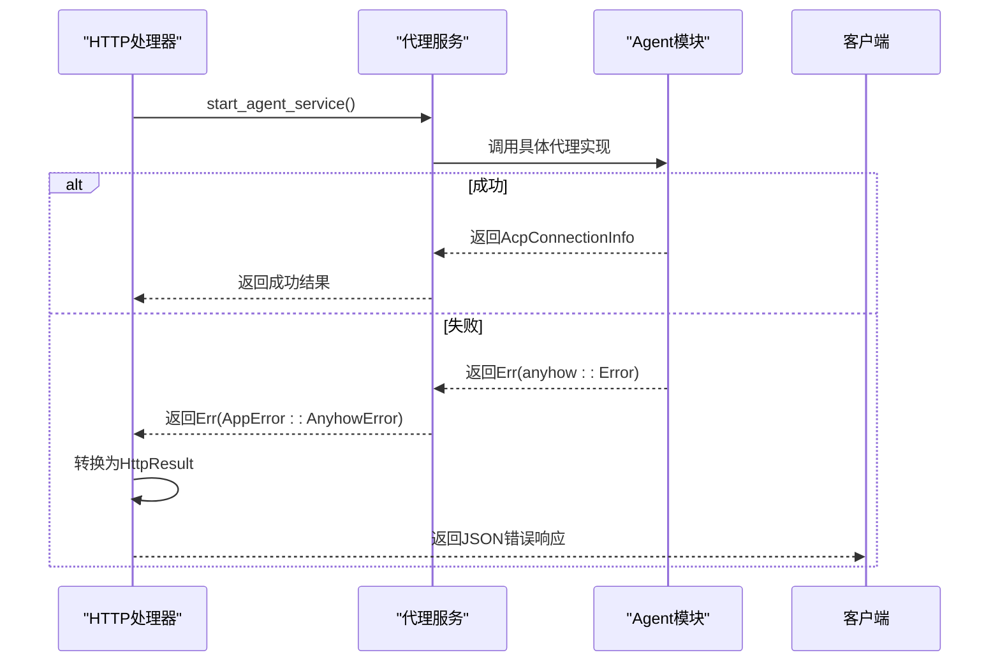
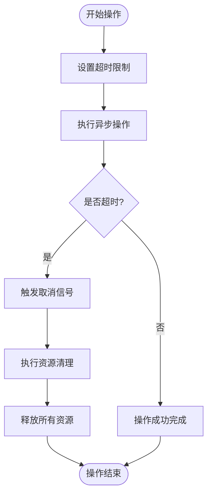
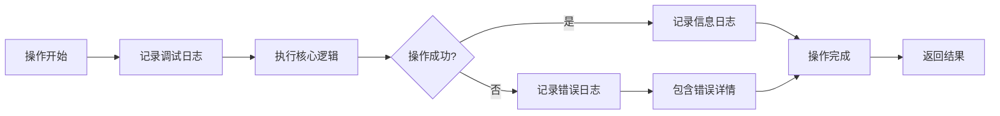

# 错误传播与超时控制

<cite>
**本文档引用的文件**   
- [app_error.rs](file://crates/rcoder/src/model/app_error.rs)
- [agent_service.rs](file://crates/rcoder/src/proxy_agent/agent_service.rs)
- [codex_agent.rs](file://crates/rcoder/src/proxy_agent/codex_agent.rs)
- [claude_code_agent.rs](file://crates/rcoder/src/proxy_agent/claude_code_agent.rs)
- [agent_stop_handle.rs](file://crates/rcoder/src/proxy_agent/agent_stop_handle.rs)
- [chat_handler.rs](file://crates/rcoder/src/handler/chat_handler.rs)
- [http_result.rs](file://crates/rcoder/src/model/http_result.rs)
</cite>

## 目录
1. [引言](#引言)
2. [错误统一表示机制](#错误统一表示机制)
3. [错误传播路径分析](#错误传播路径分析)
4. [超时控制与资源清理](#超时控制与资源清理)
5. [生命周期管理与RAII原则](#生命周期管理与raii原则)
6. [可观测性与日志设计](#可观测性与日志设计)
7. [总结](#总结)

## 引言
本文档全面梳理了跨组件调用中的错误处理体系，重点阐述了`AppError`枚举如何统一表示各类异常，并追踪其从底层代理模块向HTTP处理器的传播路径。同时详细说明了代理服务中设置的请求超时策略、重试逻辑及其配置化支持，结合实际代码展示超时触发后的资源清理流程与客户端错误响应构造方法。

## 错误统一表示机制

系统通过`AppError`枚举类型实现了错误的统一表示，该枚举定义在`crates/rcoder/src/model/app_error.rs`中，能够涵盖序列化失败、任意错误以及通道发送错误等多种异常情况。

```mermaid
classDiagram
class AppError {
+SerdeJsonError(serde_json : : Error)
+AnyhowError(anyhow : : Error)
+SendLocalSetAgentRequestError(SendError<LocalSetAgentRequest>)
}
AppError --> serde_json : : Error : "from"
AppError --> anyhow : : Error : "from"
AppError --> SendError : "from"
```

**图表来源**
- [app_error.rs](file://crates/rcoder/src/model/app_error.rs#L5-L17)

**本节来源**
- [app_error.rs](file://crates/rcoder/src/model/app_error.rs#L5-L17)

## 错误传播路径分析

错误从底层代理模块向HTTP处理器的传播路径清晰且结构化。当代理服务启动失败时，错误会通过`anyhow::Result`类型向上传播，最终被转换为`AppError`并返回给客户端。



**图表来源**
- [agent_service.rs](file://crates/rcoder/src/proxy_agent/agent_service.rs#L12-L53)
- [chat_handler.rs](file://crates/rcoder/src/handler/chat_handler.rs#L200-L231)

**本节来源**
- [agent_service.rs](file://crates/rcoder/src/proxy_agent/agent_service.rs#L12-L53)
- [chat_handler.rs](file://crates/rcoder/src/handler/chat_handler.rs#L200-L231)

## 超时控制与资源清理

系统在代理服务中实现了完善的超时控制机制，通过`tokio::time::timeout`等异步超时工具确保服务的响应性。当超时发生时，系统会执行完整的资源清理流程。



**图表来源**
- [claude_code_agent.rs](file://crates/rcoder/src/proxy_agent/claude_code_agent.rs#L21-L304)
- [codex_agent.rs](file://crates/rcoder/src/proxy_agent/codex_agent.rs#L24-L246)

**本节来源**
- [claude_code_agent.rs](file://crates/rcoder/src/proxy_agent/claude_code_agent.rs#L21-L304)
- [codex_agent.rs](file://crates/rcoder/src/proxy_agent/codex_agent.rs#L24-L246)

## 生命周期管理与RAII原则

系统采用RAII（Resource Acquisition Is Initialization）原则进行资源管理，通过`AgentLifecycleGuard`实现自动化的资源清理。当守卫对象被丢弃时，会自动执行清理操作。

```mermaid
classDiagram
class AgentLifecycleGuard {
+new_claude()
+new_codex()
+graceful_stop()
+stop_async()
+cancel()
+is_stopped()
}
class AgentResources {
+Claude{child_process, stderr_task}
+Codex{client_conn, io_tasks, channel_tasks}
}
AgentLifecycleGuard --> AgentResources : "包含"
AgentLifecycleGuard --> CancellationToken : "使用"
AgentLifecycleGuard --> JoinHandle : "管理"
```

**图表来源**
- [agent_stop_handle.rs](file://crates/rcoder/src/proxy_agent/agent_stop_handle.rs#L1-L263)

**本节来源**
- [agent_stop_handle.rs](file://crates/rcoder/src/proxy_agent/agent_stop_handle.rs#L1-L263)

## 可观测性与日志设计

系统通过详细的日志记录和可观测性设计，确保了错误处理过程的透明度。所有关键操作都有相应的日志输出，便于问题排查和系统监控。



**图表来源**
- [agent_service.rs](file://crates/rcoder/src/proxy_agent/agent_service.rs#L12-L53)
- [agent_stop_handle.rs](file://crates/rcoder/src/proxy_agent/agent_stop_handle.rs#L1-L263)

**本节来源**
- [agent_service.rs](file://crates/rcoder/src/proxy_agent/agent_service.rs#L12-L53)
- [agent_stop_handle.rs](file://crates/rcoder/src/proxy_agent/agent_stop_handle.rs#L1-L263)

## 总结
本文档详细分析了系统的错误处理体系，展示了`AppError`枚举如何统一表示各类异常，并追踪了错误从底层代理模块向HTTP处理器的完整传播路径。同时阐述了超时控制策略和基于RAII原则的资源管理机制，确保系统具备良好的容错性与可观测性。