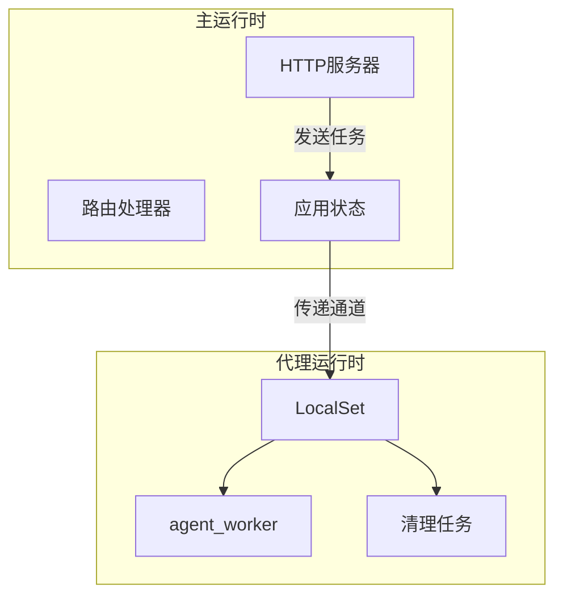
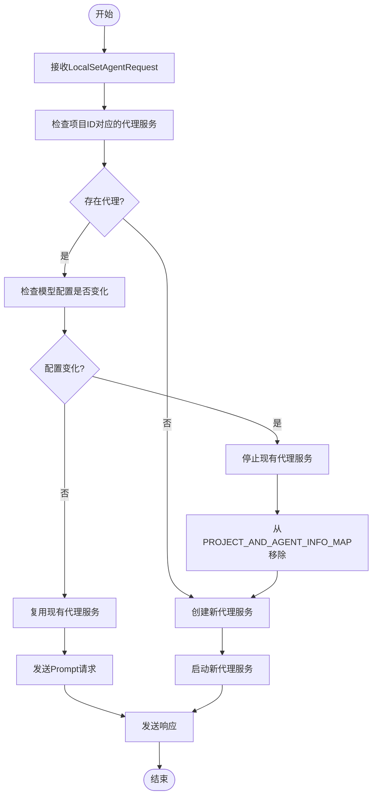
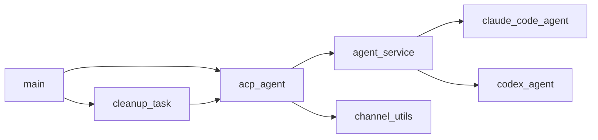

# 任务调度机制

<cite>
**本文档引用的文件**
- [main.rs](file://crates/rcoder/src/main.rs)
- [acp_agent.rs](file://crates/rcoder/src/proxy_agent/acp_agent.rs)
- [cleanup_task.rs](file://crates/rcoder/src/proxy_agent/cleanup_task.rs)
- [agent_service.rs](file://crates/rcoder/src/proxy_agent/agent_service.rs)
</cite>

## 目录
1. [简介](#简介)
2. [项目结构](#项目结构)
3. [核心组件](#核心组件)
4. [架构概述](#架构概述)
5. [详细组件分析](#详细组件分析)
6. [依赖分析](#依赖分析)
7. [性能考量](#性能考量)
8. [故障排除指南](#故障排除指南)
9. [结论](#结论)

## 简介
本文档深入解析基于Tokio的异步任务调度系统，重点描述如何通过LocalSet支持!Send类型的AI代理实例运行。结合main.rs中的运行时初始化代码，说明单线程运行时的配置与优势。详细解释agent worker的_spawn过程、任务超时控制机制以及清理任务（cleanup_task.rs）的触发条件与执行流程。提供代码示例展示如何在非线程安全环境下安全调度代理任务，并分析其对系统并发性能的影响。

## 项目结构
项目采用模块化设计，主要功能集中在crates/rcoder目录下。核心任务调度相关代码位于proxy_agent模块中，包括agent_worker、清理任务和各种代理服务实现。系统通过main.rs启动单线程Tokio运行时，专门处理非线程安全的AI代理任务。

**Section sources**
- [main.rs](file://crates/rcoder/src/main.rs#L1-L220)
- [acp_agent.rs](file://crates/rcoder/src/proxy_agent/acp_agent.rs#L1-L297)

## 核心组件
系统核心组件包括LocalSet任务调度器、agent_worker任务处理器和基于RAII的清理机制。通过单线程运行时确保!Send类型的AI代理实例安全执行，同时利用DashMap全局映射管理项目与代理的对应关系。

**Section sources**
- [main.rs](file://crates/rcoder/src/main.rs#L45-L76)
- [acp_agent.rs](file://crates/rcoder/src/proxy_agent/acp_agent.rs#L128-L137)

## 架构概述
系统采用分离式架构，主运行时处理HTTP请求，独立线程中的单线程Tokio运行时通过LocalSet处理AI代理任务。这种设计既保证了主服务的高并发性能，又解决了非线程安全代理实例的执行问题。



**Diagram sources**
- [main.rs](file://crates/rcoder/src/main.rs#L45-L76)
- [acp_agent.rs](file://crates/rcoder/src/proxy_agent/acp_agent.rs#L110-L155)

## 详细组件分析

### agent_worker分析
agent_worker是核心任务处理器，负责接收和处理AI代理请求。它通过mpsc通道接收LocalSetAgentRequest，检查是否存在对应的代理服务，根据模型配置变化决定是否重启代理，并复用或创建新的代理实例。



**Diagram sources**
- [acp_agent.rs](file://crates/rcoder/src/proxy_agent/acp_agent.rs#L155-L297)
- [agent_service.rs](file://crates/rcoder/src/proxy_agent/agent_service.rs#L20-L71)

### 清理任务分析
清理任务定期检查闲置的AI代理实例并进行清理，基于RAII原则自动释放资源。清理器通过定时扫描PROJECT_AND_AGENT_INFO_MAP，识别超过闲置超时时间且处于Idle状态的代理实例。

```mermaid
classDiagram
class AgentCleaner {
+config : CleanupConfig
+stats : CleanupStats
+new(config) AgentCleaner
+is_agent_idle_timeout(last_activity, current_time) bool
+cleanup_idle_agents() Result~CleanupStats~
+cleanup_agent_raii(project_id) Result~()~
+run() async
+get_stats() &CleanupStats
}
class CleanupConfig {
+idle_timeout : Duration
+cleanup_interval : Duration
}
class CleanupStats {
+total_cleaned : u64
+success_cleaned : u64
+failed_cleaned : u64
+last_cleanup : Option~DateTime~Utc~~
}
class AgentCleaner --> CleanupConfig : "包含"
class AgentCleaner --> CleanupStats : "包含"
```

**Diagram sources**
- [cleanup_task.rs](file://crates/rcoder/src/proxy_agent/cleanup_task.rs#L49-L206)
- [acp_agent.rs](file://crates/rcoder/src/proxy_agent/acp_agent.rs#L110-L155)

## 依赖分析
系统依赖关系清晰，main.rs初始化运行时并启动agent_worker和清理任务。proxy_agent模块内部各组件协同工作，通过通道和全局映射进行通信。DashMap作为全局状态存储，确保项目与代理信息的一致性访问。



**Diagram sources**
- [main.rs](file://crates/rcoder/src/main.rs#L45-L76)
- [mod.rs](file://crates/rcoder/src/proxy_agent/mod.rs#L1-L216)

## 性能考量
单线程运行时配置避免了跨线程同步开销，特别适合处理非线程安全的AI代理实例。LocalSet确保所有代理相关任务在同一线程执行，消除了数据竞争风险。清理任务的定期执行机制平衡了资源利用率和系统性能，避免了长时间运行的闲置代理占用过多资源。

通过将代理任务隔离到独立线程，主HTTP服务保持高并发处理能力，不受代理任务执行时间的影响。这种架构设计实现了计算密集型AI任务与高并发Web服务的完美分离，最大化系统整体性能。

**Section sources**
- [main.rs](file://crates/rcoder/src/main.rs#L45-L76)
- [cleanup_task.rs](file://crates/rcoder/src/proxy_agent/cleanup_task.rs#L0-L47)

## 故障排除指南
常见问题包括代理启动失败、清理任务异常和通道通信错误。日志记录显示了详细的执行流程，便于定位问题。特别注意检查模型配置变化导致的代理重启，以及闲置超时设置是否合理。

当遇到代理任务无法正常执行时，首先检查PROJECT_AND_AGENT_INFO_MAP中的状态信息，确认代理是否处于正确状态。对于清理任务问题，验证清理间隔和闲置超时配置是否符合预期。

**Section sources**
- [cleanup_task.rs](file://crates/rcoder/src/proxy_agent/cleanup_task.rs#L152-L206)
- [acp_agent.rs](file://crates/rcoder/src/proxy_agent/acp_agent.rs#L110-L155)

## 结论
本系统通过创新的单线程运行时+LocalSet架构，成功解决了非线程安全AI代理实例的调度难题。基于RAII的清理机制确保了资源的自动释放，而清晰的组件划分和通信机制保证了系统的可维护性和扩展性。这种设计模式为类似场景提供了有价值的参考实现。