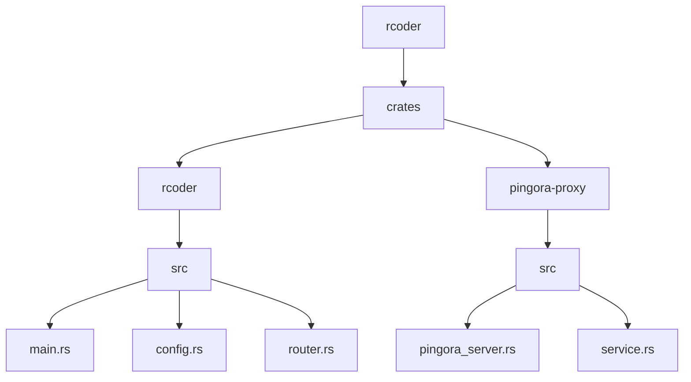
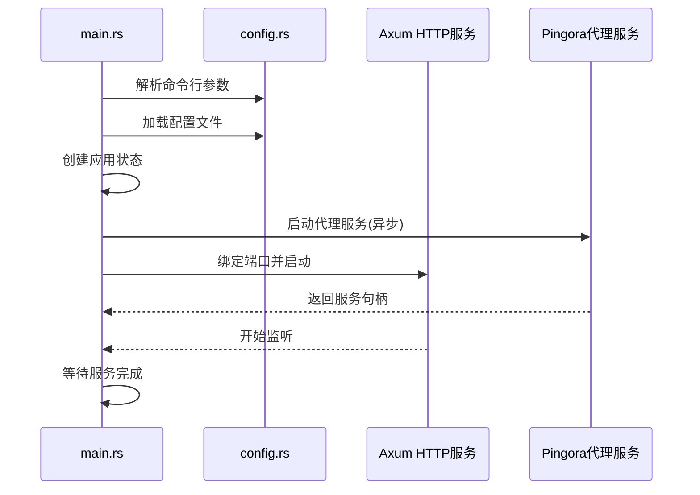
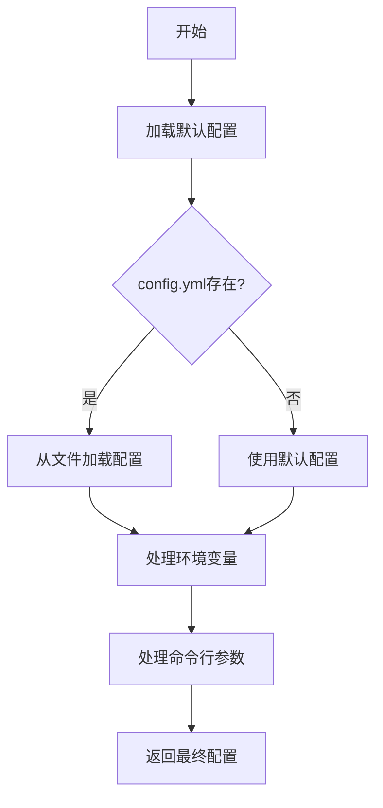

# 服务初始化流程

<cite>
**本文档引用的文件**
- [main.rs](file://crates/rcoder/src/main.rs)
- [config.rs](file://crates/rcoder/src/config.rs)
- [pingora_server.rs](file://crates/pingora-proxy/src/pingora_server.rs)
- [service.rs](file://crates/pingora-proxy/src/service.rs)
</cite>

## 目录
1. [项目结构](#项目结构)
2. [核心组件](#核心组件)
3. [并行初始化流程](#并行初始化流程)
4. [配置系统解析](#配置系统解析)
5. [服务绑定与中间件](#服务绑定与中间件)
6. [信号处理与优雅关闭](#信号处理与优雅关闭)

## 项目结构

**图示来源**
- [main.rs](file://crates/rcoder/src/main.rs#L1-L221)
- [pingora_server.rs](file://crates/pingora-proxy/src/pingora_server.rs#L1-L182)

## 核心组件

**核心组件来源**
- [main.rs](file://crates/rcoder/src/main.rs#L1-L221)
- [service.rs](file://crates/pingora-proxy/src/service.rs#L1-L723)

## 并行初始化流程

系统启动时，HTTP服务（Axum）与反向代理服务（Pingora）采用并行初始化策略。在`main.rs`中，程序首先解析命令行参数并加载配置，然后根据配置决定是否启动Pingora反向代理服务。

当启用代理配置时，系统会创建`PingoraServerManager`实例，并通过`tokio::spawn`异步任务启动Pingora服务器。与此同时，主程序继续执行HTTP服务的初始化流程。两个服务共享运行时资源，但独立监听不同端口：Axum服务监听由`config.port`指定的端口，而Pingora代理服务监听`config.proxy_config.listen_port`指定的端口。

这种并行初始化设计确保了服务启动的高效性，避免了串行启动可能带来的延迟。两个服务通过`AppState`结构体共享应用状态，其中包含配置信息、会话管理器和代理服务引用等共享资源。

**图示来源**
- [main.rs](file://crates/rcoder/src/main.rs#L25-L221)
- [pingora_server.rs](file://crates/pingora-proxy/src/pingora_server.rs#L1-L182)

**本节来源**
- [main.rs](file://crates/rcoder/src/main.rs#L25-L221)

## 配置系统解析

配置系统采用多层级优先级机制，确保配置的灵活性和可覆盖性。配置加载优先级从高到低依次为：命令行参数 > 环境变量 > 配置文件 > 默认配置。

在`config.rs`中，`load_config_with_args`函数实现了这一优先级逻辑。系统首先加载默认配置，然后尝试从当前目录读取`config.yml`文件进行覆盖。接着处理环境变量，最后应用命令行参数，确保最高优先级的配置项能够覆盖低优先级的设置。

配置结构包含`AppConfig`主配置和`ProxyConfig`代理配置。代理配置包含监听端口、默认后端端口、后端主机地址等关键参数。当首次启动时，若配置文件不存在，系统会自动创建包含详细注释的默认配置文件，便于用户理解和修改。

**图示来源**
- [config.rs](file://crates/rcoder/src/config.rs#L1-L267)

**本节来源**
- [config.rs](file://crates/rcoder/src/config.rs#L1-L267)

## 服务绑定与中间件

HTTP服务通过`axum::serve`绑定到指定端口，使用`TcpListener::bind`创建监听器。在`main.rs`中，程序通过`router::create_router`创建路由实例，并将其与监听器结合启动服务。

中间件系统通过`tracing_subscriber`实现，包含文件日志层和控制台日志层。文件日志采用JSON格式，便于后续分析；控制台日志则采用简洁格式，便于实时观察。日志系统支持按天滚动，自动创建`logs`目录存储日志文件。

反向代理服务通过`PingoraServerManager`实现，支持HTTP/1.1和HTTP/2协议。代理服务实现了路径重写功能，将`/proxy/{port}/{path}`格式的请求转换为对目标端口的代理请求。同时，服务支持动态后端管理，能够根据请求自动发现和添加后端服务。

**本节来源**
- [main.rs](file://crates/rcoder/src/main.rs#L25-L221)
- [config.rs](file://crates/rcoder/src/config.rs#L1-L267)

## 信号处理与优雅关闭

系统通过`tokio::select!`宏实现优雅关闭机制。在`pingora_server.rs`中，`PingoraServerManager`创建了`oneshot`通道用于接收关闭信号。当收到SIGTERM信号时，主程序会等待代理服务完成当前任务后再退出。

主程序在启动Axum服务后，会等待代理服务的任务句柄。通过`handle.await?`确保代理服务正常完成。这种设计确保了在关闭过程中，正在进行的请求能够被完整处理，避免了 abrupt termination 可能导致的数据丢失或连接中断。

健康检查机制通过`start_health_check_loop`方法实现，定期检查后端服务的可用性。检查间隔和超时时间均可通过配置文件设置，确保系统能够及时发现并处理不可用的后端服务。

**本节来源**
- [main.rs](file://crates/rcoder/src/main.rs#L25-L221)
- [pingora_server.rs](file://crates/pingora-proxy/src/pingora_server.rs#L1-L182)