# 资源管理与生命周期

<cite>
**本文档中引用的文件**
- [agent_service.rs](file://crates/rcoder/src/proxy_agent/agent_service.rs)
- [session_cache.rs](file://crates/rcoder/src/service/session_cache.rs)
- [cleanup_task.rs](file://crates/rcoder/src/proxy_agent/cleanup_task.rs)
- [agent_stop_handle.rs](file://crates/rcoder/src/proxy_agent/agent_stop_handle.rs)
- [main.rs](file://crates/rcoder/src/main.rs)
</cite>

## 目录
1. [引言](#引言)
2. [代理实例生命周期管理](#代理实例生命周期管理)
3. [会话缓存设计与线程安全](#会话缓存设计与线程安全)
4. [后台资源清理机制](#后台资源清理机制)
5. [实际应用场景分析](#实际应用场景分析)
6. [系统集成与启动流程](#系统集成与启动流程)
7. [结论](#结论)

## 引言
本文档全面阐述了AI代理系统中代理实例、会话缓存和系统资源的生命周期管理策略。基于`agent_service.rs`、`session_cache.rs`和`cleanup_task.rs`等核心模块，详细说明了代理实例的创建、激活与销毁流程，分析了DashMap会话缓存的数据结构设计及其线程安全特性，并结合后台资源清理任务描述了长时间运行下的内存稳定性保障机制。

**文档来源**
- [agent_service.rs](file://crates/rcoder/src/proxy_agent/agent_service.rs)
- [session_cache.rs](file://crates/rcoder/src/service/session_cache.rs)
- [cleanup_task.rs](file://crates/rcoder/src/proxy_agent/cleanup_task.rs)

## 代理实例生命周期管理

### 代理服务接口设计
系统通过`AcpAgentService` trait定义了统一的代理服务接口，支持不同类型的AI代理（如Claude和Codex）。该接口提供了启动、停止代理服务的标准方法，并通过`agent_type_name`方法标识代理类型。

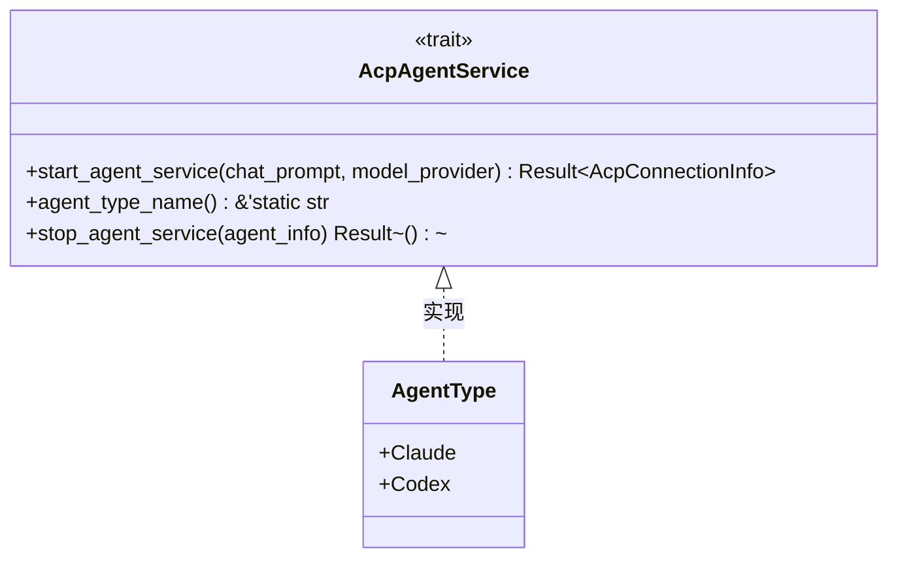

**图示来源**
- [agent_service.rs](file://crates/rcoder/src/proxy_agent/agent_service.rs#L10-L70)

### 代理生命周期守卫机制
系统采用RAII（Resource Acquisition Is Initialization）原则实现资源管理，核心是`AgentLifecycleGuard`结构体。当代理实例被创建时，会生成一个生命周期守卫对象，该对象在被丢弃（drop）时自动执行资源清理。

```mermaid
classDiagram
class AgentLifecycleGuard {
+new_claude(project_id, session_id, child_process, stderr_task, cancel_token) Self
+new_codex(project_id, session_id, client_conn, io_tasks, channel_tasks, cancel_token) Self
+graceful_stop() Result~()~
+stop_async() Result~()~
+cancel() void
+is_stopped() bool
}
class AgentResources {
<<enum>>
+Claude{child_process, stderr_task}
+Codex{client_conn, io_tasks, channel_tasks}
}
AgentLifecycleGuard --> AgentResources : 包含
AgentLifecycleGuard --> CancellationToken : 使用
```

**图示来源**
- [agent_stop_handle.rs](file://crates/rcoder/src/proxy_agent/agent_stop_handle.rs#L17-L22)
- [agent_stop_handle.rs](file://crates/rcoder/src/proxy_agent/agent_stop_handle.rs#L204-L226)

### 代理创建与销毁流程
代理实例的创建由`create_new_agent_service`函数处理，根据`chat_prompt.agent_type`自动选择相应的代理类型。销毁过程则通过`stop_agent_service`方法实现，该方法会调用`AgentLifecycleGuard`的`stop_async`方法进行优雅停止。

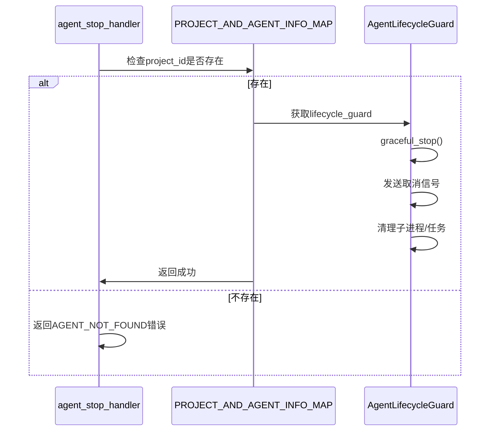

**图示来源**
- [agent_service.rs](file://crates/rcoder/src/proxy_agent/agent_service.rs#L50-L70)
- [agent_stop_handle.rs](file://crates/rcoder/src/proxy_agent/agent_stop_handle.rs#L168-L210)

**本节来源**
- [agent_service.rs](file://crates/rcoder/src/proxy_agent/agent_service.rs#L10-L70)
- [agent_stop_handle.rs](file://crates/rcoder/src/proxy_agent/agent_stop_handle.rs#L17-L263)

## 会话缓存设计与线程安全

### 全局会话缓存架构
系统使用`LazyLock`初始化全局`DashMap`来管理会话缓存，实现了按`session_id`分组的统一会话消息缓存。每个会话的数据由`SessionData`结构体包装，内部使用`ringbuf`实现的循环缓冲区存储消息。

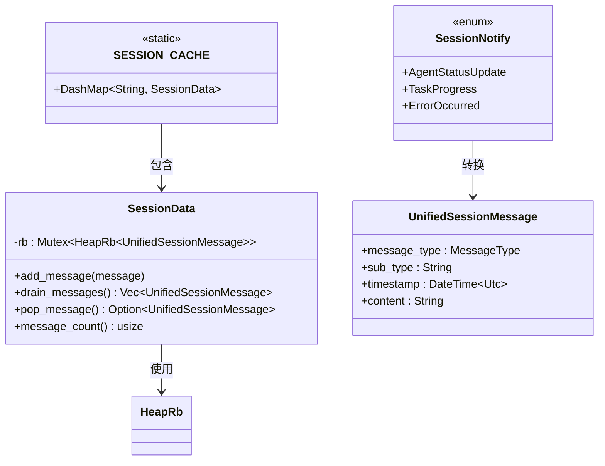

**图示来源**
- [session_cache.rs](file://crates/rcoder/src/service/session_cache.rs#L10-L33)
- [session_cache.rs](file://crates/rcoder/src/service/session_cache.rs#L35-L82)

### 线程安全实现机制
会话缓存系统通过多层并发控制确保线程安全：
1. 外层使用`DashMap`提供分片锁机制，减少锁竞争
2. 内层使用`Mutex`保护`HeapRb`循环缓冲区的访问
3. `LazyLock`确保全局静态变量的线程安全初始化

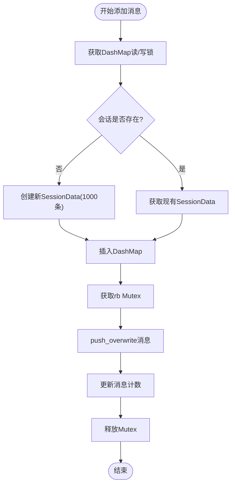

**图示来源**
- [session_cache.rs](file://crates/rcoder/src/service/session_cache.rs#L80-L95)
- [session_cache.rs](file://crates/rcoder/src/service/session_cache.rs#L35-L50)

### 消息推送与消费模式
系统提供了两种消息消费模式：
- `drain_messages`: 获取所有消息并清空缓存，用于SSE初始推送
- `pop_message`: 移除并返回一条消息，用于SSE持续推送

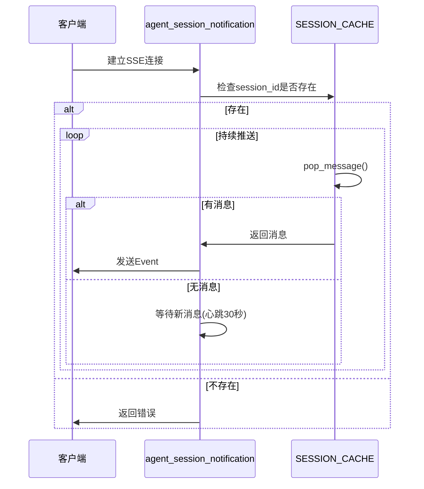

**图示来源**
- [session_cache.rs](file://crates/rcoder/src/service/session_cache.rs#L52-L65)
- [agent_session_notification.rs](file://crates/rcoder/src/handler/agent_session_notification.rs#L355-L378)

**本节来源**
- [session_cache.rs](file://crates/rcoder/src/service/session_cache.rs#L0-L96)
- [agent_session_notification.rs](file://crates/rcoder/src/handler/agent_session_notification.rs#L355-L378)

## 后台资源清理机制

### 清理任务配置
`CleanupConfig`结构体定义了清理任务的核心参数，包括闲置超时时间和清理检查间隔。系统默认配置为30分钟闲置超时和5分钟检查间隔，但在实际部署中可根据需要调整。

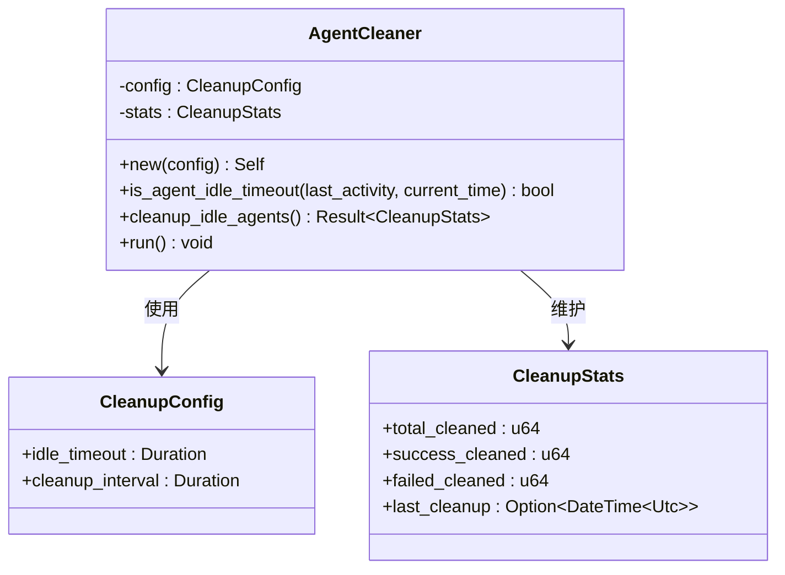

**图示来源**
- [cleanup_task.rs](file://crates/rcoder/src/proxy_agent/cleanup_task.rs#L30-L47)
- [cleanup_task.rs](file://crates/rcoder/src/proxy_agent/cleanup_task.rs#L49-L92)

### 清理执行逻辑
清理任务的核心逻辑在`cleanup_idle_agents`方法中实现，遵循以下步骤：
1. 获取当前时间并统计活动代理数量
2. 遍历`PROJECT_AND_AGENT_INFO_MAP`，识别闲置超时的代理
3. 对每个闲置代理执行RAII清理
4. 更新统计信息并记录日志

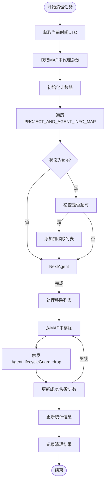

**图示来源**
- [cleanup_task.rs](file://crates/rcoder/src/proxy_agent/cleanup_task.rs#L94-L150)
- [cleanup_task.rs](file://crates/rcoder/src/proxy_agent/cleanup_task.rs#L152-L206)

### RAII资源清理模式
系统采用基于RAII的简化清理模式，关键在于`cleanup_agent_raii`方法。该方法只需从`PROJECT_AND_AGENT_INFO_MAP`中移除代理，`AgentLifecycleGuard`的`Drop`实现会自动处理所有资源清理。

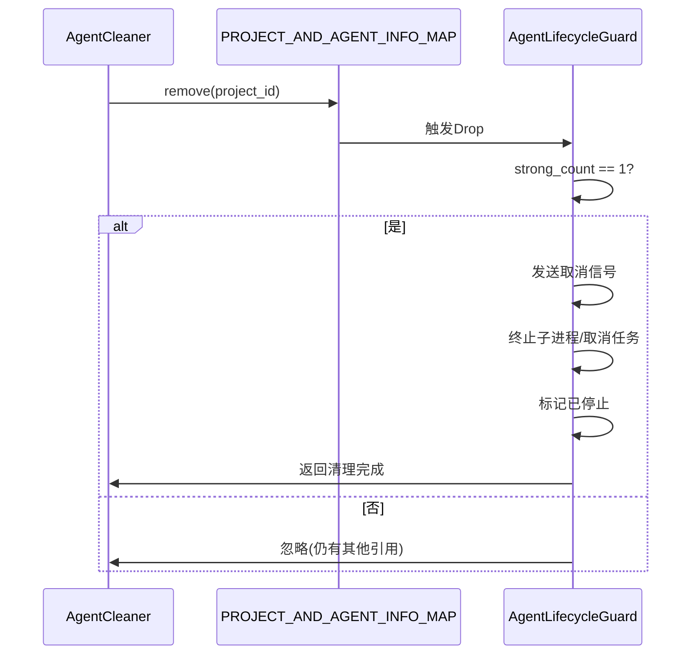

**图示来源**
- [cleanup_task.rs](file://crates/rcoder/src/proxy_agent/cleanup_task.rs#L152-L178)
- [agent_stop_handle.rs](file://crates/rcoder/src/proxy_agent/agent_stop_handle.rs#L204-L226)

**本节来源**
- [cleanup_task.rs](file://crates/rcoder/src/proxy_agent/cleanup_task.rs#L0-L207)
- [agent_stop_handle.rs](file://crates/rcoder/src/proxy_agent/agent_stop_handle.rs#L204-L226)

## 实际应用场景分析

### 会话超时处理流程
当用户长时间不活动时，系统会自动清理闲置的代理实例。这一过程由后台清理任务定期触发，确保系统资源的有效利用。

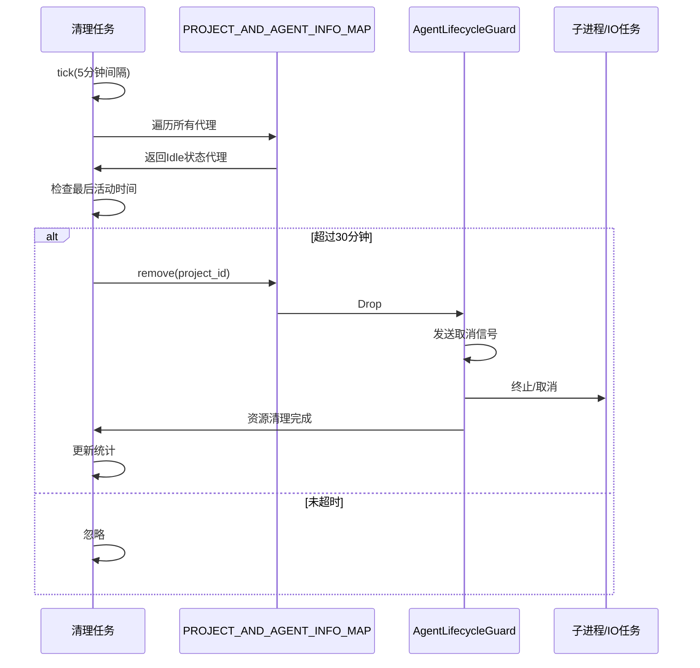

**本节来源**
- [cleanup_task.rs](file://crates/rcoder/src/proxy_agent/cleanup_task.rs#L49-L92)
- [agent_stop_handle.rs](file://crates/rcoder/src/proxy_agent/agent_stop_handle.rs#L168-L210)

### 异常终止资源回收
当系统异常终止或代理服务崩溃时，`AgentLifecycleGuard`的`Drop`实现确保了资源的可靠回收。即使在异常情况下，关键资源如子进程和异步任务也会被正确清理。

```mermaid
flowchart TD
A([程序异常终止]) --> B["AgentLifecycleGuard::drop被调用"]
B --> C{"强引用计数为1?"}
C --> |是| D["发送取消信号"]
D --> E["终止子进程或取消任务"]
E --> F["标记为已停止"]
F --> G[资源完全释放]
C --> |否| H[忽略(仍有其他引用)]
```

**本节来源**
- [agent_stop_handle.rs](file://crates/rcoder/src/proxy_agent/agent_stop_handle.rs#L204-L226)
- [cleanup_task.rs](file://crates/rcoder/src/proxy_agent/cleanup_task.rs#L115-L150)

## 系统集成与启动流程

### 主程序启动与任务初始化
在`main.rs`中，系统启动时会创建独立的OS线程来运行单线程Tokio运行时，并在其中启动清理任务。这种设计确保了非Send类型的代理任务可以在LocalSet中正确运行。

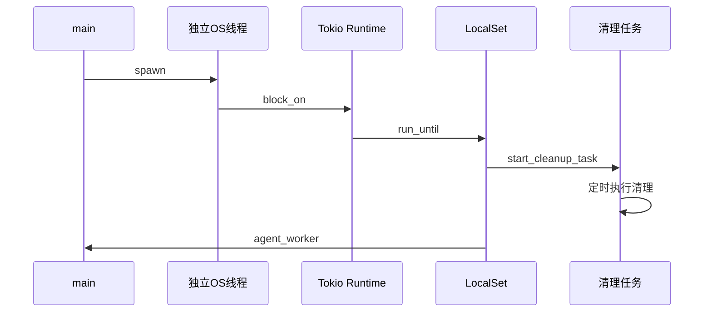

**图示来源**
- [main.rs](file://crates/rcoder/src/main.rs#L45-L76)
- [cleanup_task.rs](file://crates/rcoder/src/proxy_agent/cleanup_task.rs#L200-L206)

### 全局状态管理
系统通过两个关键的全局静态变量管理状态：
- `PROJECT_AND_AGENT_INFO_MAP`: 使用`LazyLock<DashMap>`管理代理实例信息
- `SESSION_CACHE`: 使用`LazyLock<DashMap>`管理会话消息缓存

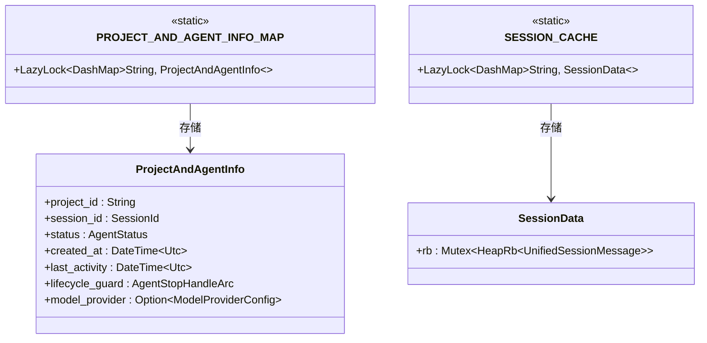

**图示来源**
- [acp_agent.rs](file://crates/rcoder/src/proxy_agent/acp_agent.rs#L124-L126)
- [session_cache.rs](file://crates/rcoder/src/service/session_cache.rs#L10-L15)

**本节来源**
- [main.rs](file://crates/rcoder/src/main.rs#L45-L76)
- [acp_agent.rs](file://crates/rcoder/src/proxy_agent/acp_agent.rs#L124-L126)

## 结论
本系统通过精心设计的生命周期管理策略，实现了AI代理实例、会话缓存和系统资源的高效管理。核心优势包括：
1. **RAII资源管理**: 通过`AgentLifecycleGuard`确保资源的自动清理，避免资源泄漏
2. **线程安全缓存**: 使用`DashMap`和`ringbuf`实现高性能、线程安全的会话消息缓存
3. **智能清理机制**: 基于闲置超时的后台清理任务，保障长时间运行的内存稳定性
4. **优雅停止**: 支持通过API请求或自动超时机制优雅地停止代理服务

这些设计共同确保了系统在高并发场景下的稳定性和可靠性，为AI代理服务提供了坚实的基础设施支持。