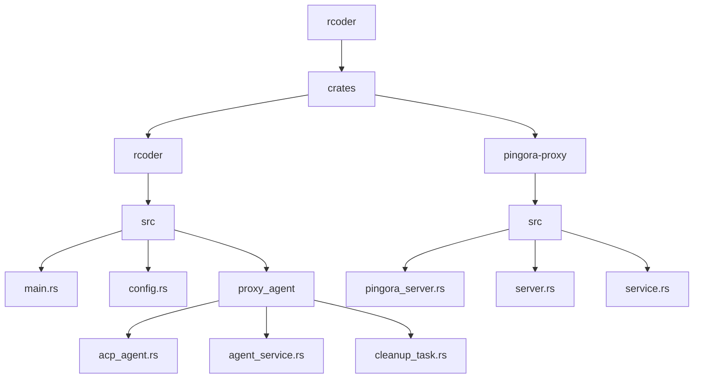
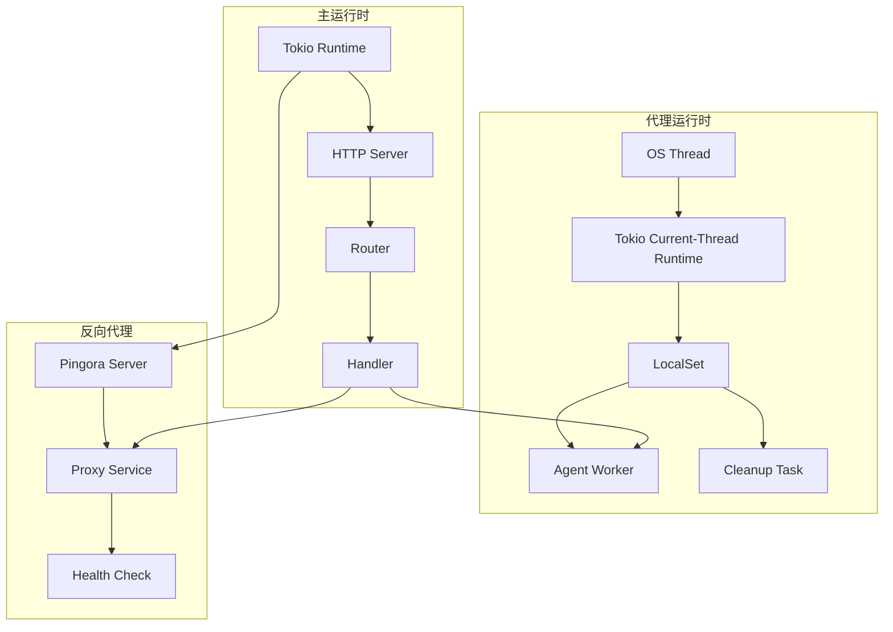
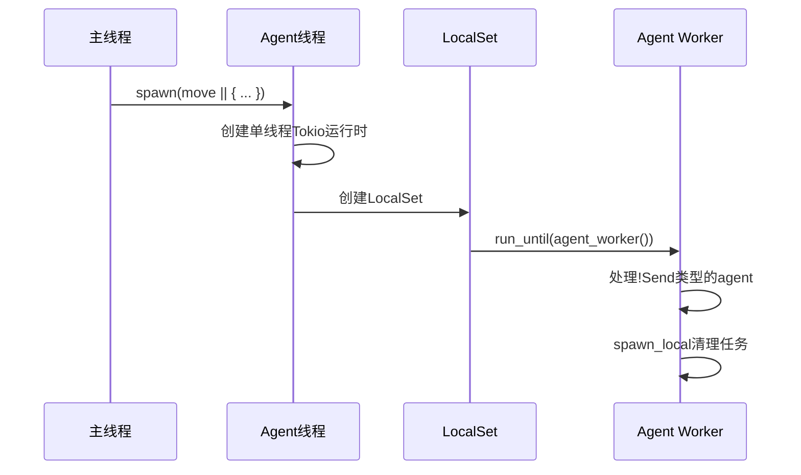
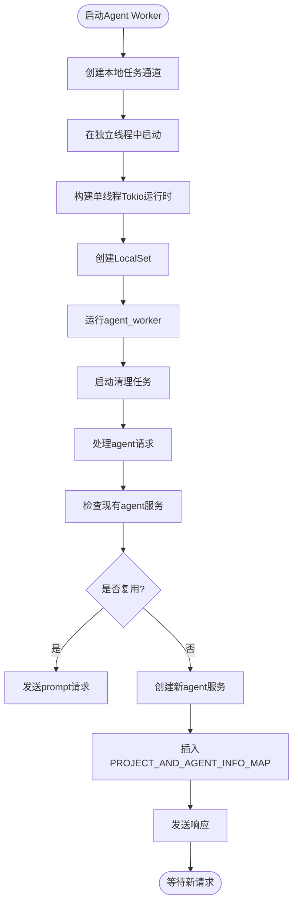
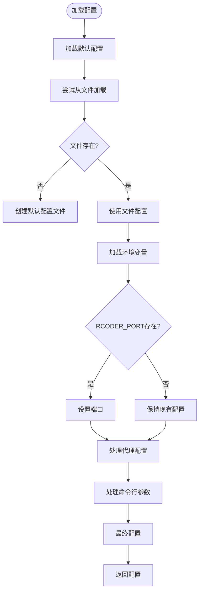
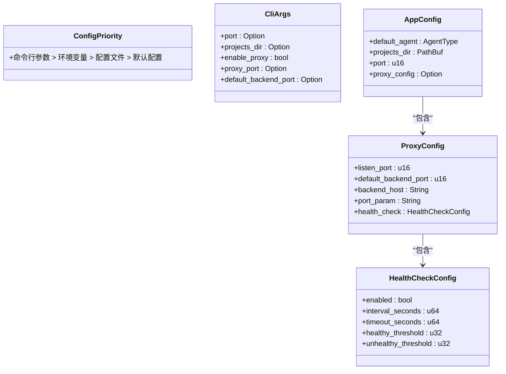
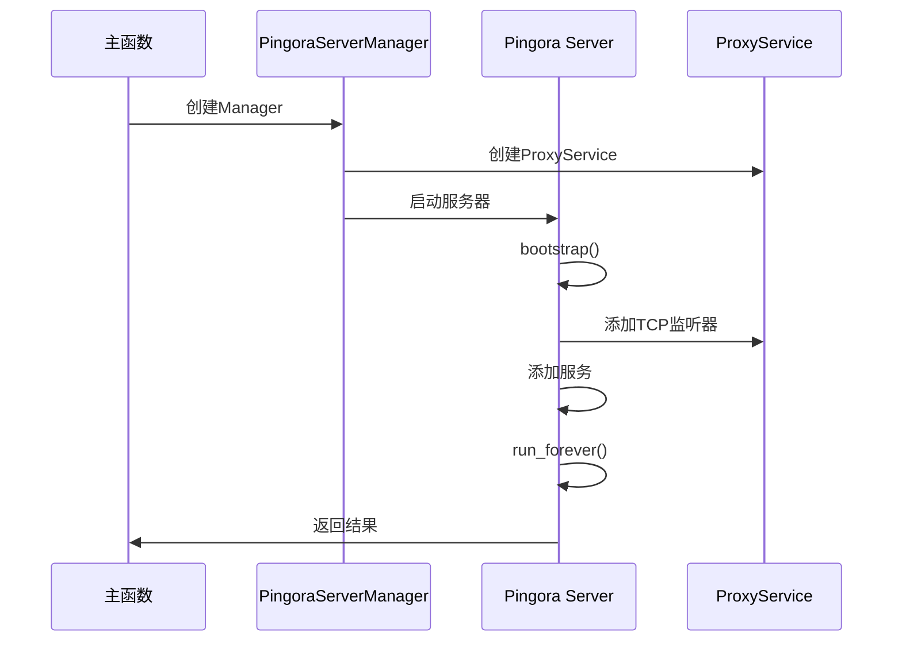
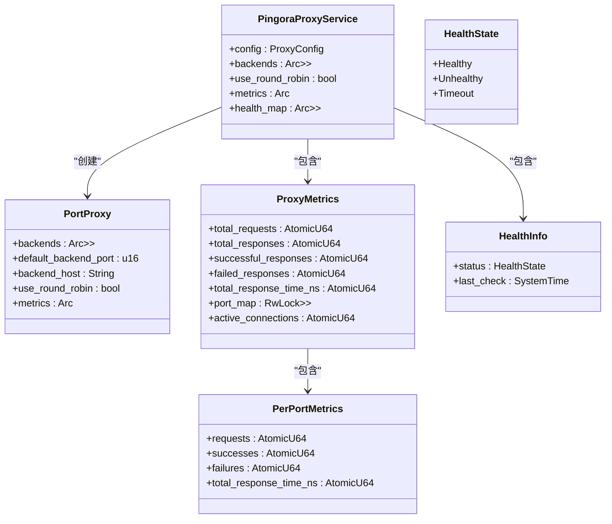
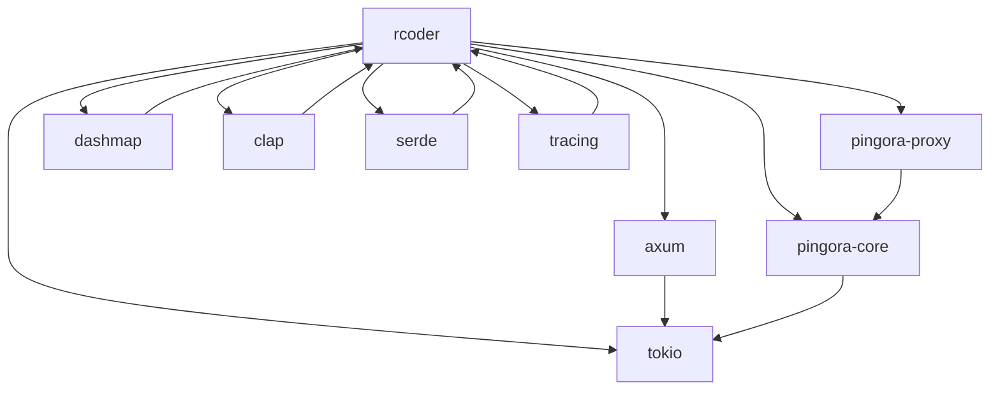

# 运行时架构

<cite>
**本文档中引用的文件**  
- [main.rs](file://crates/rcoder/src/main.rs)
- [acp_agent.rs](file://crates/rcoder/src/proxy_agent/acp_agent.rs)
- [agent_service.rs](file://crates/rcoder/src/proxy_agent/agent_service.rs)
- [cleanup_task.rs](file://crates/rcoder/src/proxy_agent/cleanup_task.rs)
- [config.rs](file://crates/rcoder/src/config.rs)
- [pingora_server.rs](file://crates/pingora-proxy/src/pingora_server.rs)
- [server.rs](file://crates/pingora-proxy/src/server.rs)
- [service.rs](file://crates/pingora-proxy/src/service.rs)
</cite>

## 目录
1. [简介](#简介)
2. [项目结构](#项目结构)
3. [核心组件](#核心组件)
4. [架构概览](#架构概览)
5. [详细组件分析](#详细组件分析)
6. [依赖分析](#依赖分析)
7. [性能考虑](#性能考虑)
8. [故障排除指南](#故障排除指南)
9. [结论](#结论)

## 简介
本文档深入解析系统的运行时架构，重点描述基于Tokio单线程运行时的执行模型及其对!Send类型agent worker的支持机制。说明如何通过LocalSet实现本地任务调度，确保非线程安全的代理实例能够安全运行。阐述HTTP服务（Axum）与反向代理（Pingora）双服务并行启动的初始化流程，以及配置系统如何在运行时动态加载参数。结合代码示例说明任务_spawn、超时控制、信号处理等关键运行时行为的实现细节。

## 项目结构

**图示来源**
- [main.rs](file://crates/rcoder/src/main.rs#L1-L220)
- [config.rs](file://crates/rcoder/src/config.rs#L1-L266)
- [pingora_server.rs](file://crates/pingora-proxy/src/pingora_server.rs#L1-L181)

**本节来源**
- [main.rs](file://crates/rcoder/src/main.rs#L1-L220)
- [config.rs](file://crates/rcoder/src/config.rs#L1-L266)

## 核心组件

系统的核心运行时组件包括：
- **Tokio单线程运行时**：用于处理主HTTP服务（Axum）
- **LocalSet**：在独立线程中运行非Send的agent worker
- **Pingora反向代理**：高性能的端口代理服务
- **配置系统**：支持命令行、环境变量和文件的多级配置加载

这些组件共同构成了系统的运行时基础，确保了高性能、安全性和灵活性。

**本节来源**
- [main.rs](file://crates/rcoder/src/main.rs#L48-L67)
- [acp_agent.rs](file://crates/rcoder/src/proxy_agent/acp_agent.rs#L128-L137)

## 架构概览

**图示来源**
- [main.rs](file://crates/rcoder/src/main.rs#L1-L220)
- [pingora_server.rs](file://crates/pingora-proxy/src/pingora_server.rs#L1-L181)
- [service.rs](file://crates/pingora-proxy/src/service.rs#L1-L722)

## 详细组件分析

### 执行模型分析

系统采用双运行时架构，主运行时处理HTTP请求，而代理运行时专门处理非线程安全的agent worker。

#### 单线程运行时与LocalSet

**图示来源**
- [main.rs](file://crates/rcoder/src/main.rs#L50-L80)
- [cleanup_task.rs](file://crates/rcoder/src/proxy_agent/cleanup_task.rs#L199-L206)

#### 任务调度机制

**图示来源**
- [main.rs](file://crates/rcoder/src/main.rs#L60-L70)
- [acp_agent.rs](file://crates/rcoder/src/proxy_agent/acp_agent.rs#L160-L297)

**本节来源**
- [main.rs](file://crates/rcoder/src/main.rs#L48-L80)
- [acp_agent.rs](file://crates/rcoder/src/proxy_agent/acp_agent.rs#L160-L297)

### 配置系统分析

#### 配置加载流程

**图示来源**
- [config.rs](file://crates/rcoder/src/config.rs#L150-L250)

#### 配置优先级

**图示来源**
- [config.rs](file://crates/rcoder/src/config.rs#L1-L266)

**本节来源**
- [config.rs](file://crates/rcoder/src/config.rs#L1-L266)

### 反向代理分析

#### Pingora服务器启动流程

**图示来源**
- [pingora_server.rs](file://crates/pingora-proxy/src/pingora_server.rs#L50-L100)
- [server.rs](file://crates/pingora-proxy/src/server.rs#L1-L371)

#### 代理服务架构

**图示来源**
- [service.rs](file://crates/pingora-proxy/src/service.rs#L1-L722)
- [server.rs](file://crates/pingora-proxy/src/server.rs#L1-L371)

**本节来源**
- [pingora_server.rs](file://crates/pingora-proxy/src/pingora_server.rs#L1-L181)
- [service.rs](file://crates/pingora-proxy/src/service.rs#L1-L722)

## 依赖分析

**图示来源**
- [Cargo.toml](file://Cargo.toml)
- [main.rs](file://crates/rcoder/src/main.rs#L1-L220)

**本节来源**
- [Cargo.toml](file://Cargo.toml)
- [main.rs](file://crates/rcoder/src/main.rs#L1-L220)

## 性能考虑

系统在设计时充分考虑了性能因素：
- 使用Tokio单线程运行时减少线程切换开销
- 通过LocalSet确保非Send类型的agent worker安全运行
- Pingora反向代理提供高性能的异步I/O处理
- 使用Arc和RwLock实现高效的数据共享
- 采用连接池和连接复用优化网络性能
- 实现健康检查和负载均衡提高服务可用性

这些设计决策共同确保了系统在高并发场景下的稳定性和性能表现。

## 故障排除指南

### 常见问题及解决方案

| 问题 | 可能原因 | 解决方案 |
|------|---------|---------|
| 无法启动代理服务 | 端口被占用 | 检查端口占用情况并更换端口 |
| agent worker无法运行 | 非Send类型问题 | 确保在LocalSet中运行 |
| 配置文件加载失败 | 文件格式错误 | 检查YAML格式并修复 |
| 反向代理无法连接 | 后端服务未启动 | 确认后端服务已正常运行 |
| 性能下降 | 连接数过多 | 调整连接池大小和超时设置 |

**本节来源**
- [main.rs](file://crates/rcoder/src/main.rs#L1-L220)
- [config.rs](file://crates/rcoder/src/config.rs#L1-L266)

## 结论

本文档详细解析了系统的运行时架构，重点介绍了基于Tokio单线程运行时的执行模型和LocalSet对!Send类型agent worker的支持机制。通过双运行时架构，系统成功实现了HTTP服务与反向代理的并行运行，同时保证了非线程安全组件的安全执行。配置系统的多级加载机制提供了灵活的部署选项，而Pingora反向代理则确保了高性能的服务代理能力。整体架构设计充分考虑了性能、安全性和可维护性，为系统的稳定运行提供了坚实的基础。