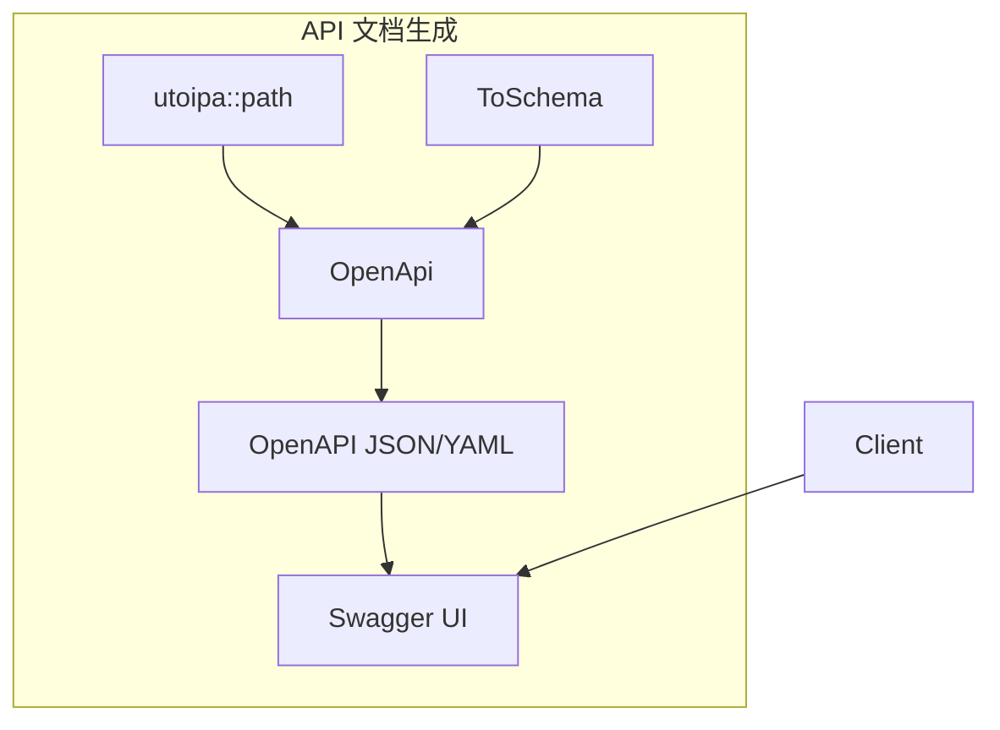
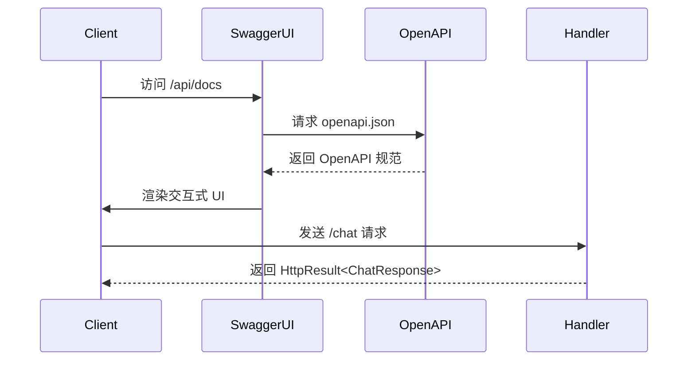
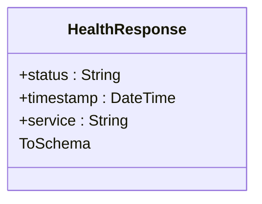
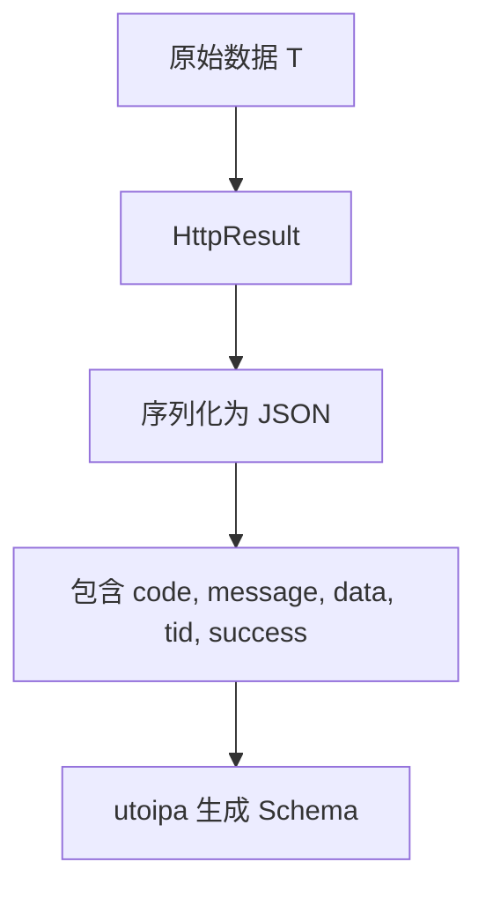
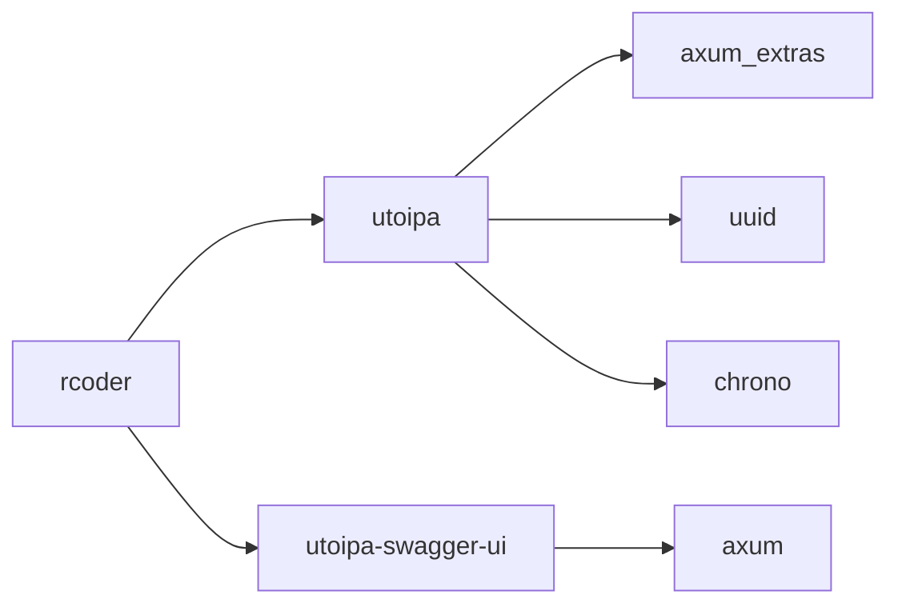

# API文档生成

<cite>
**本文档引用的文件**
- [chat_handler.rs](file://crates/rcoder/src/handler/chat_handler.rs)
- [health_handler.rs](file://crates/rcoder/src/handler/health_handler.rs)
- [router.rs](file://crates/rcoder/src/router.rs)
- [Cargo.toml](file://crates/rcoder/Cargo.toml)
- [app_error.rs](file://crates/rcoder/src/model/app_error.rs)
- [http_result.rs](file://crates/rcoder/src/model/http_result.rs)
</cite>

## 目录
1. [简介](#简介)
2. [项目结构](#项目结构)
3. [核心组件](#核心组件)
4. [架构概览](#架构概览)
5. [详细组件分析](#详细组件分析)
6. [依赖分析](#依赖分析)
7. [性能考虑](#性能考虑)
8. [故障排除指南](#故障排除指南)
9. [结论](#结论)

## 简介
本文档系统性地记录了基于 `utoipa` 与 `Axum` 集成实现的 API 文档自动生成机制。详细说明了如何通过注解自动生成符合 OpenAPI 规范的 API 文档，并支持 Swagger UI 可视化展示。结合 `chat_handler` 和 `health_handler` 中的实际端点，展示了结构体注解方法、请求/响应体的 JSON Schema 生成机制，以及 Swagger UI 的访问路径和定制选项。

## 项目结构
项目采用模块化设计，API 处理器位于 `crates/rcoder/src/handler/` 目录下，核心文档生成逻辑通过 `utoipa` 宏集成在路由和结构体定义中。

```mermaid
flowchart TD
A[API Handlers] --> B[Router]
B --> C[OpenAPI Doc]
C --> D[Swagger UI]
D --> E[/api/docs]
```

**图示来源**
- [router.rs](file://crates/rcoder/src/router.rs#L1-L203)

**本节来源**
- [router.rs](file://crates/rcoder/src/router.rs#L1-L203)

## 核心组件
系统通过 `utoipa` 和 `utoipa-swagger-ui` 实现 API 文档的自动化生成与可视化。所有端点通过 `#[utoipa::path]` 宏进行注解，结构体实现 `ToSchema` 特性以生成 JSON Schema。

**本节来源**
- [Cargo.toml](file://crates/rcoder/Cargo.toml#L75-L76)
- [chat_handler.rs](file://crates/rcoder/src/handler/chat_handler.rs#L15-L231)

## 架构概览
系统通过 `OpenApi` 宏聚合所有 API 路径和组件，自动生成 OpenAPI 规范文档，并通过 `SwaggerUi::new` 挂载到指定路由。



**图示来源**
- [router.rs](file://crates/rcoder/src/router.rs#L100-L202)

**本节来源**
- [router.rs](file://crates/rcoder/src/router.rs#L100-L202)

## 详细组件分析

### 聊天处理器分析
`handle_chat` 端点通过 `#[utoipa::path]` 宏完整定义了 POST 请求的请求体、响应状态码、示例数据和标签信息。`ChatRequest` 和 `ChatResponse` 结构体通过 `#[derive(ToSchema)]` 自动生成 JSON Schema。



**图示来源**
- [chat_handler.rs](file://crates/rcoder/src/handler/chat_handler.rs#L140-L231)
- [router.rs](file://crates/rcoder/src/router.rs#L100-L202)

**本节来源**
- [chat_handler.rs](file://crates/rcoder/src/handler/chat_handler.rs#L1-L231)

### 健康检查处理器分析
`health_check` 端点展示了最简化的 `utoipa` 使用方式，通过 `#[utoipa::path]` 定义 GET 请求，返回 `HealthResponse` 结构体，该结构体实现 `ToSchema` 以生成响应 Schema。



**图示来源**
- [health_handler.rs](file://crates/rcoder/src/handler/health_handler.rs#L10-L35)

**本节来源**
- [health_handler.rs](file://crates/rcoder/src/handler/health_handler.rs#L1-L35)

### 响应结构统一化
`HttpResult<T>` 作为统一响应包装器，通过 `#[derive(ToSchema)]` 支持泛型结构体的 Schema 生成，确保所有 API 响应格式一致。



**图示来源**
- [http_result.rs](file://crates/rcoder/src/model/http_result.rs#L1-L102)

**本节来源**
- [http_result.rs](file://crates/rcoder/src/model/http_result.rs#L1-L102)

## 依赖分析
系统依赖 `utoipa` 和 `utoipa-swagger-ui` 实现文档生成与展示，通过 workspace 依赖统一管理版本。



**图示来源**
- [Cargo.toml](file://crates/rcoder/Cargo.toml#L75-L76)
- [Cargo.toml](file://Cargo.toml#L163-L164)

**本节来源**
- [Cargo.toml](file://Cargo.toml#L163-L164)

## 性能考虑
文档生成在编译期完成，运行时无额外性能开销。Swagger UI 静态资源通过 Axum 路由高效提供，OpenAPI JSON 由 `utoipa` 直接序列化输出。

## 故障排除指南
当文档未正确生成时，检查以下几点：
- 确保结构体实现 `ToSchema` 特性
- 确认 `#[utoipa::path]` 宏正确注解端点
- 验证 `OpenApi` 宏中包含所有路径和组件
- 检查 `create_swagger_ui` 是否正确挂载

**本节来源**
- [router.rs](file://crates/rcoder/src/router.rs#L190-L202)
- [chat_handler.rs](file://crates/rcoder/src/handler/chat_handler.rs#L140-L231)

## 结论
通过 `utoipa` 与 `Axum` 的深度集成，系统实现了 API 文档的自动化生成与可视化。开发者只需在代码中添加少量注解，即可生成符合 OpenAPI 规范的完整文档，并通过 Swagger UI 提供交互式体验。该机制提高了 API 可维护性，降低了文档与代码不一致的风险。