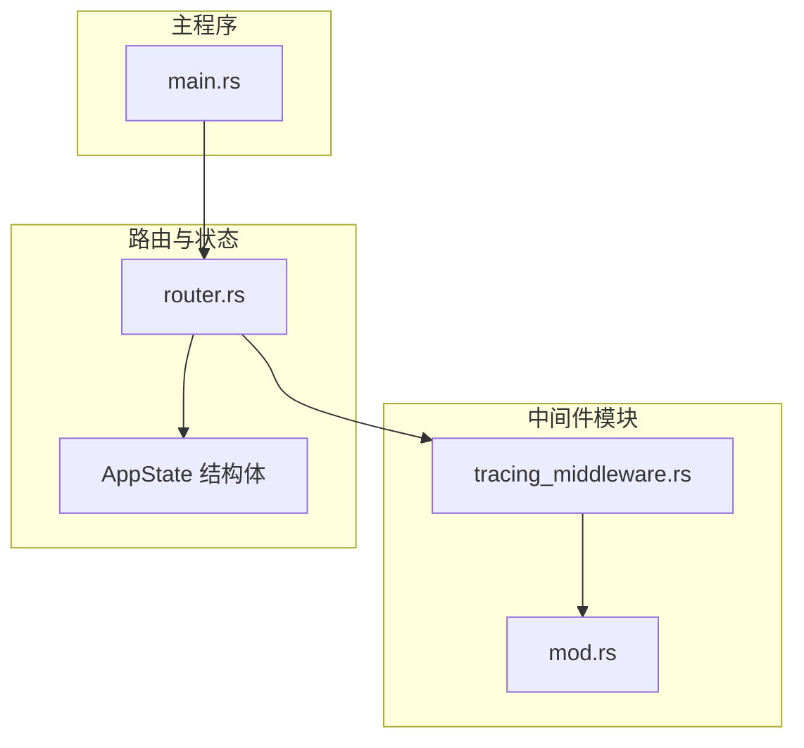
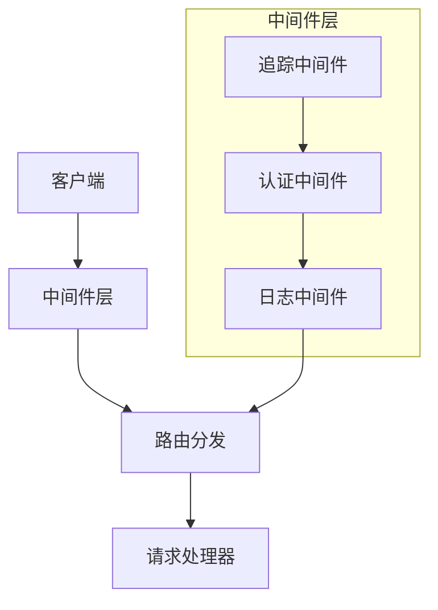
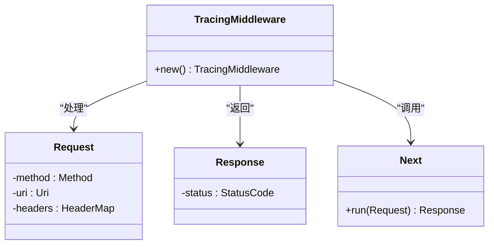
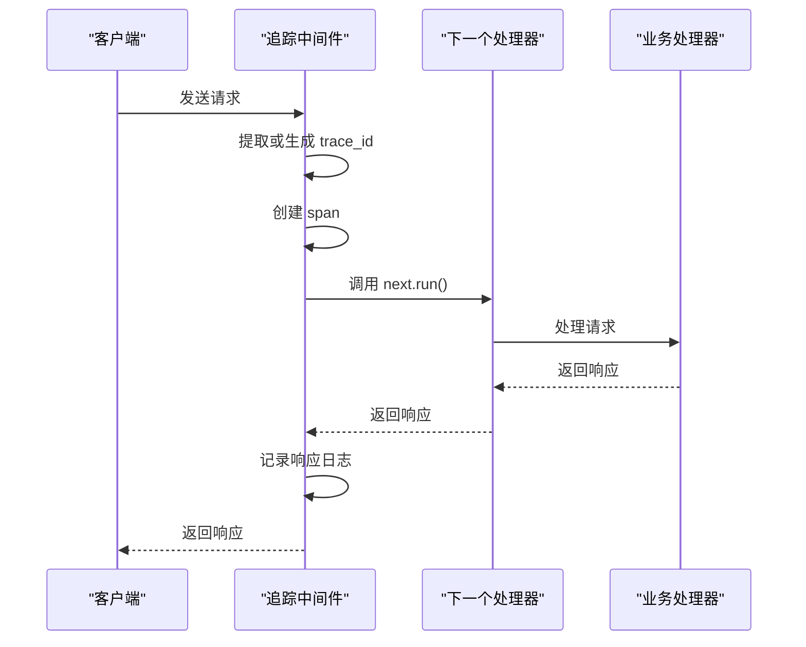
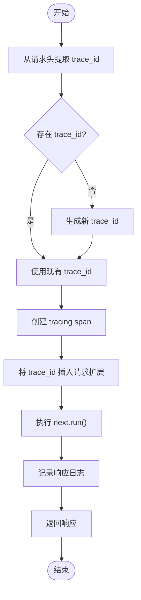
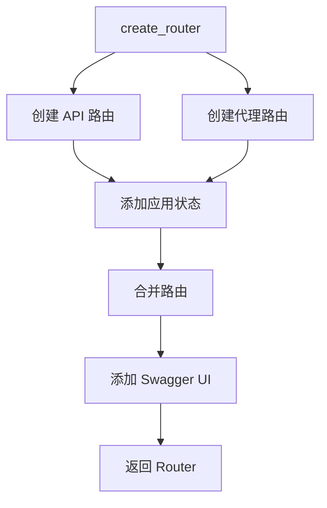
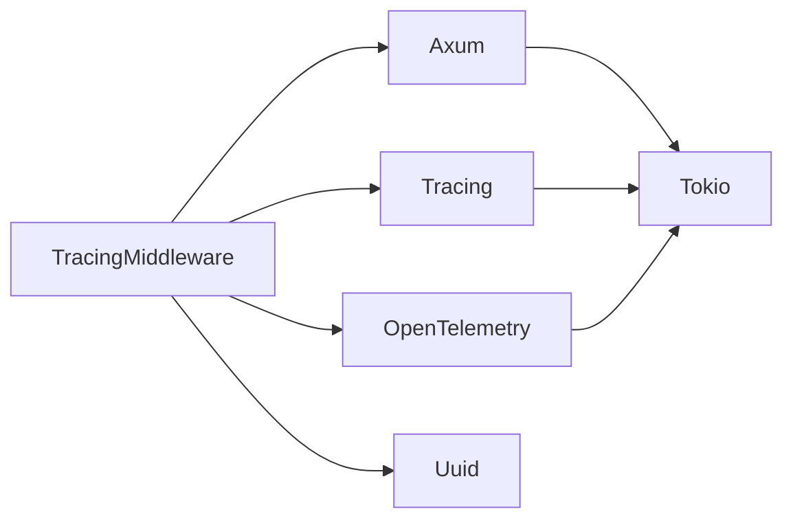

# 中间件集成

<cite>
**本文档引用的文件**
- [router.rs](file://crates/rcoder/src/router.rs)
- [tracing_middleware.rs](file://crates/rcoder/src/middleware/tracing_middleware.rs)
- [main.rs](file://crates/rcoder/src/main.rs)
- [mod.rs](file://crates/rcoder/src/middleware/mod.rs)
</cite>

## 目录
1. [简介](#简介)
2. [项目结构](#项目结构)
3. [核心组件](#核心组件)
4. [架构概述](#架构概述)
5. [详细组件分析](#详细组件分析)
6. [依赖分析](#依赖分析)
7. [性能考量](#性能考量)
8. [故障排除指南](#故障排除指南)
9. [结论](#结论)

## 简介
本文档详细描述了在 `router.rs` 中如何堆叠和配置中间件链，重点分析 `tracing_middleware.rs` 实现的请求日志追踪功能。文档涵盖 Axum 中间件的执行顺序、生命周期钩子、状态共享机制（如 RequestContext），以及如何通过 Layer 和 ServiceBuilder 构建复合中间件栈。同时说明了全局中间件与路由特定中间件的注册方式及其对性能和可观测性的影响。

## 项目结构
项目采用模块化设计，中间件相关代码位于 `crates/rcoder/src/middleware` 目录下，主要包含追踪中间件的实现。路由配置在 `router.rs` 中完成，应用状态通过 `AppState` 结构体进行管理，并在整个请求生命周期中共享。

**Diagram sources**
- [router.rs](file://crates/rcoder/src/router.rs#L24-L37)
- [tracing_middleware.rs](file://crates/rcoder/src/middleware/tracing_middleware.rs#L0-L46)
- [main.rs](file://crates/rcoder/src/main.rs#L1-L221)

**Section sources**
- [router.rs](file://crates/rcoder/src/router.rs#L1-L203)
- [tracing_middleware.rs](file://crates/rcoder/src/middleware/tracing_middleware.rs#L1-L179)
- [main.rs](file://crates/rcoder/src/main.rs#L1-L221)

## 核心组件
核心组件包括 `TracingMiddleware` 追踪中间件、`AppState` 应用状态结构体以及 `create_router` 路由创建函数。这些组件共同实现了请求追踪、状态共享和路由分发功能。

**Section sources**
- [router.rs](file://crates/rcoder/src/router.rs#L24-L37)
- [tracing_middleware.rs](file://crates/rcoder/src/middleware/tracing_middleware.rs#L70-L129)
- [router.rs](file://crates/rcoder/src/router.rs#L39-L70)

## 架构概述
系统采用 Axum 框架构建，通过中间件链实现请求处理的增强功能。追踪中间件作为最外层中间件，负责生成 trace_id、记录请求/响应日志，并将 trace_id 注入 OpenTelemetry 上下文。

**Diagram sources**
- [tracing_middleware.rs](file://crates/rcoder/src/middleware/tracing_middleware.rs#L70-L129)
- [router.rs](file://crates/rcoder/src/router.rs#L39-L70)

## 详细组件分析

### 追踪中间件分析
`tracing_middleware.rs` 实现了完整的请求追踪功能，包括 trace_id 生成、提取、日志记录和上下文传播。

#### 对于面向对象组件：

**Diagram sources**
- [tracing_middleware.rs](file://crates/rcoder/src/middleware/tracing_middleware.rs#L0-L46)

#### 对于API/服务组件：

**Diagram sources**
- [tracing_middleware.rs](file://crates/rcoder/src/middleware/tracing_middleware.rs#L70-L129)

#### 对于复杂逻辑组件：

**Diagram sources**
- [tracing_middleware.rs](file://crates/rcoder/src/middleware/tracing_middleware.rs#L70-L129)

**Section sources**
- [tracing_middleware.rs](file://crates/rcoder/src/middleware/tracing_middleware.rs#L70-L129)
- [tracing_middleware.rs](file://crates/rcoder/src/middleware/tracing_middleware.rs#L131-L137)

### 路由配置分析
`router.rs` 中的 `create_router` 函数展示了如何将中间件应用于路由。

**Diagram sources**
- [router.rs](file://crates/rcoder/src/router.rs#L39-L70)

**Section sources**
- [router.rs](file://crates/rcoder/src/router.rs#L39-L70)

## 依赖分析
中间件系统依赖于多个关键组件，包括 Axum 框架、tracing 库、OpenTelemetry 和 uuid 库。

**Diagram sources**
- [tracing_middleware.rs](file://crates/rcoder/src/middleware/tracing_middleware.rs#L0-L46)
- [main.rs](file://crates/rcoder/src/main.rs#L1-L221)

**Section sources**
- [tracing_middleware.rs](file://crates/rcoder/src/middleware/tracing_middleware.rs#L0-L46)
- [main.rs](file://crates/rcoder/src/main.rs#L188-L197)

## 性能考量
追踪中间件对性能的影响主要体现在：
1. 每个请求都会生成新的 trace_id（UUID v4）
2. 请求和响应日志的记录会增加 I/O 开销
3. span 的创建和销毁会产生一定的内存分配
4. 多层中间件堆叠会增加函数调用开销

然而，这些开销对于可观测性的提升是值得的，特别是在生产环境中进行问题排查时。

## 故障排除指南
常见问题及解决方案：

1. **trace_id 未正确传播**
   - 检查请求头中是否包含标准的 trace 头（x-trace-id, traceparent 等）
   - 确认 OpenTelemetry propagator 已正确初始化

2. **日志中缺少 trace_id**
   - 确保在后续处理器中使用 `req.extensions().get::<String>()` 获取 trace_id
   - 检查 tracing subscriber 配置是否正确

3. **中间件未生效**
   - 确认 `add_tracing_layer` 已正确应用到 Router
   - 检查中间件在堆叠顺序中的位置

**Section sources**
- [tracing_middleware.rs](file://crates/rcoder/src/middleware/tracing_middleware.rs#L70-L129)
- [main.rs](file://crates/rcoder/src/main.rs#L188-L197)

## 结论
本文档详细分析了 RCoder 项目中的中间件集成方案，重点介绍了追踪中间件的实现原理和配置方法。通过合理使用 Axum 的中间件机制，实现了请求的完整追踪能力，为系统的可观测性提供了坚实基础。建议在生产环境中保持追踪中间件的启用，以确保能够有效监控和排查系统问题。