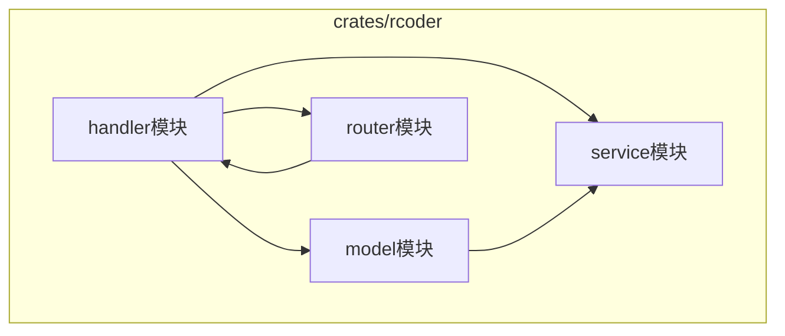
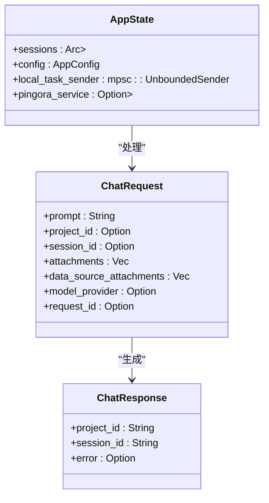
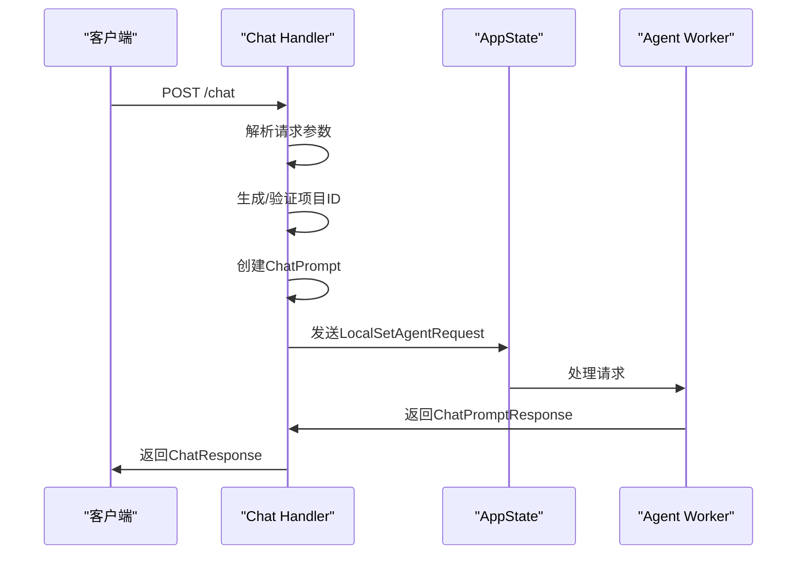
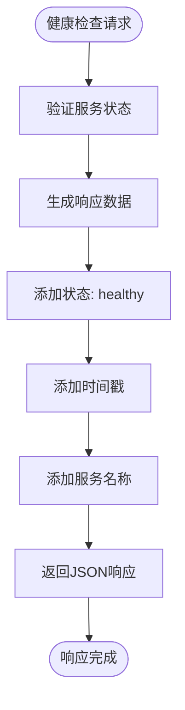
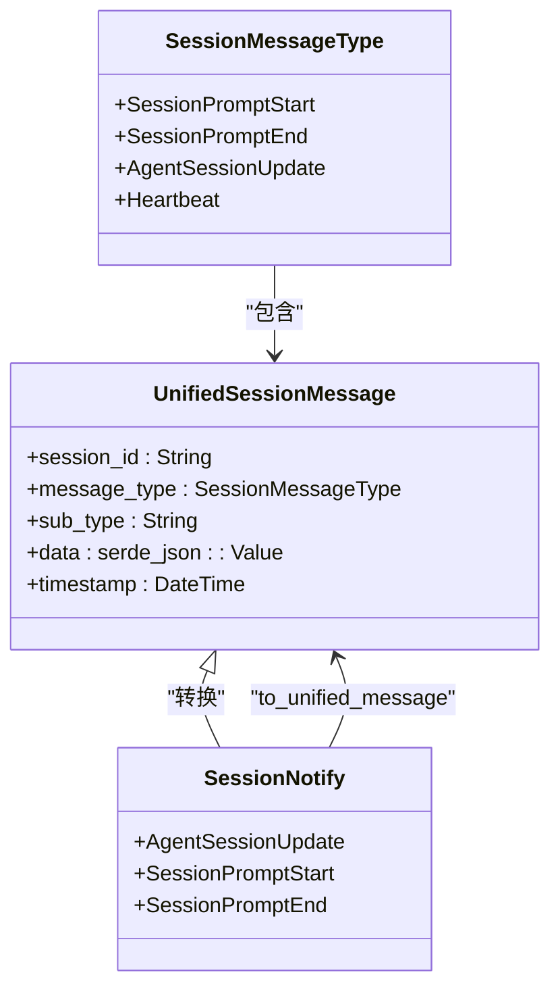
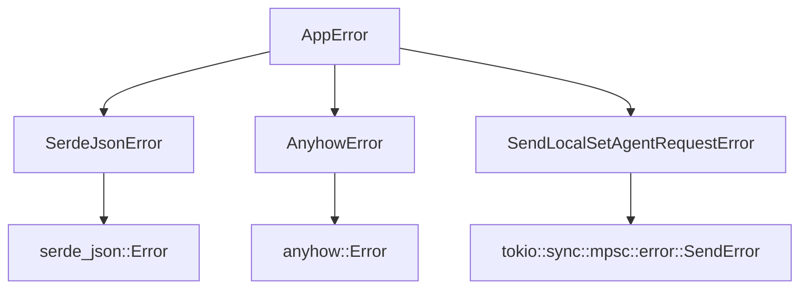

# 请求处理

<cite>
**本文档引用的文件**
- [chat_handler.rs](file://crates/rcoder/src/handler/chat_handler.rs)
- [health_handler.rs](file://crates/rcoder/src/handler/health_handler.rs)
- [agent_session_notification.rs](file://crates/rcoder/src/handler/agent_session_notification.rs)
- [router.rs](file://crates/rcoder/src/router.rs)
- [chat_prompt.rs](file://crates/rcoder/src/model/chat_prompt.rs)
- [agent_model.rs](file://crates/rcoder/src/model/agent_model.rs)
- [agent_session_notify.rs](file://crates/rcoder/src/model/agent_session_notify.rs)
- [session_cache.rs](file://crates/rcoder/src/service/session_cache.rs)
- [app_error.rs](file://crates/rcoder/src/model/app_error.rs)
- [http_result.rs](file://crates/rcoder/src/model/http_result.rs)
</cite>

## 目录
1. [项目结构](#项目结构)
2. [核心组件](#核心组件)
3. [请求处理机制](#请求处理机制)
4. [聊天请求处理](#聊天请求处理)
5. [健康检查处理](#健康检查处理)
6. [SSE事件流机制](#sse事件流机制)
7. [错误处理机制](#错误处理机制)

## 项目结构

**图示来源**
- [router.rs](file://crates/rcoder/src/router.rs#L24-L37)
- [chat_handler.rs](file://crates/rcoder/src/handler/chat_handler.rs#L14-L50)

## 核心组件

本系统的核心组件包括请求处理模块、状态管理模块和响应生成模块。这些组件协同工作，实现了完整的AI代理请求处理流程。

**组件来源**
- [chat_handler.rs](file://crates/rcoder/src/handler/chat_handler.rs#L97-L230)
- [health_handler.rs](file://crates/rcoder/src/handler/health_handler.rs#L17-L34)
- [agent_session_notification.rs](file://crates/rcoder/src/handler/agent_session_notification.rs#L36-L437)

## 请求处理机制

系统采用Axum框架构建RESTful API，通过路由系统将不同类型的请求分发到相应的处理器函数。请求处理机制的核心是状态管理、请求解析和响应生成。

### 处理器函数签名结构

处理器函数使用Axum的提取器模式，主要包含以下组件：
- `State(state): State<Arc<AppState>>`：应用全局状态
- `Json(request): Json<T>`：JSON请求体提取器
- `Path(params): Path<T>`：路径参数提取器

这种设计模式实现了关注点分离，使处理器函数专注于业务逻辑处理。

**图示来源**
- [router.rs](file://crates/rcoder/src/router.rs#L24-L37)
- [chat_handler.rs](file://crates/rcoder/src/handler/chat_handler.rs#L14-L50)
- [chat_handler.rs](file://crates/rcoder/src/handler/chat_handler.rs#L52-L63)

## 聊天请求处理

聊天请求处理是系统的核心功能，负责接收用户输入并触发AI代理的执行。

### 请求解析流程

1. **参数验证**：检查请求参数的有效性
2. **项目ID管理**：如果未提供项目ID，则生成新的项目ID并创建工作目录
3. **会话管理**：根据提供的会话ID或创建新的会话
4. **模型配置**：根据模型提供商配置自动选择代理类型

### 状态管理机制

系统通过`AppState`结构体管理全局状态，包括：
- 活跃会话映射
- 应用配置
- 本地任务发送器
- Pingora代理服务引用

**图示来源**
- [chat_handler.rs](file://crates/rcoder/src/handler/chat_handler.rs#L97-L230)
- [router.rs](file://crates/rcoder/src/router.rs#L24-L37)
- [chat_prompt.rs](file://crates/rcoder/src/model/chat_prompt.rs#L5-L29)

## 健康检查处理

健康检查端点提供了一个轻量级的系统状态监控接口。

### 实现特点

- **简单高效**：仅返回基本的健康状态信息
- **无状态设计**：不依赖任何外部资源
- **标准化响应**：遵循统一的响应格式

**图示来源**
- [health_handler.rs](file://crates/rcoder/src/handler/health_handler.rs#L17-L34)
- [health_handler.rs](file://crates/rcoder/src/handler/health_handler.rs#L6-L15)

## SSE事件流机制

系统使用Server-Sent Events (SSE)协议实现实时消息推送，为前端提供AI代理执行进度的实时更新。

### 事件类型定义

| 事件类型 | 描述 | 子类型 |
|---------|------|-------|
| prompt_start | 用户发送prompt开始 | prompt_start |
| prompt_end | Agent执行结束 | end_turn, max_tokens, cancelled等 |
| user_message_chunk | 用户消息块 | user_message_chunk |
| agent_message_chunk | Agent响应消息块 | agent_message_chunk |
| agent_thought_chunk | Agent思考过程 | agent_thought_chunk |
| tool_call | 工具调用通知 | tool_call |
| tool_call_update | 工具调用状态更新 | tool_call_update |
| heartbeat | 心跳消息 | ping |

### 心跳机制

系统每30秒发送一次心跳消息，确保连接的活跃性。心跳机制的主要作用包括：
- 防止连接超时
- 检测网络中断
- 维持长连接

**图示来源**
- [agent_session_notification.rs](file://crates/rcoder/src/handler/agent_session_notification.rs#L36-L437)
- [agent_session_notify.rs](file://crates/rcoder/src/model/agent_session_notify.rs#L15-L29)
- [session_cache.rs](file://crates/rcoder/src/service/session_cache.rs#L10-L25)

## 错误处理机制

系统实现了完善的错误处理机制，确保异常情况能够被正确捕获和处理。

### 错误传播策略

1. **分层处理**：在不同层次处理不同类型的错误
2. **统一格式**：所有错误都转换为标准的HTTP响应格式
3. **详细信息**：提供错误代码和描述信息

### 错误类型

**图示来源**
- [app_error.rs](file://crates/rcoder/src/model/app_error.rs#L1-L25)
- [http_result.rs](file://crates/rcoder/src/model/http_result.rs#L1-L102)
- [chat_handler.rs](file://crates/rcoder/src/handler/chat_handler.rs#L97-L230)