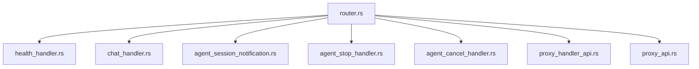
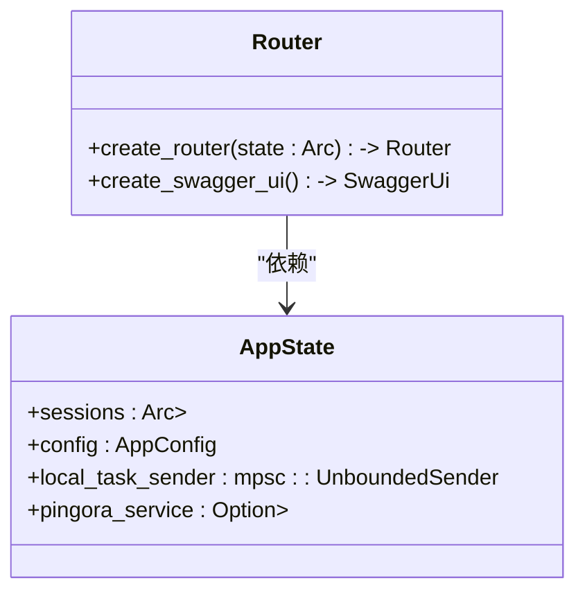
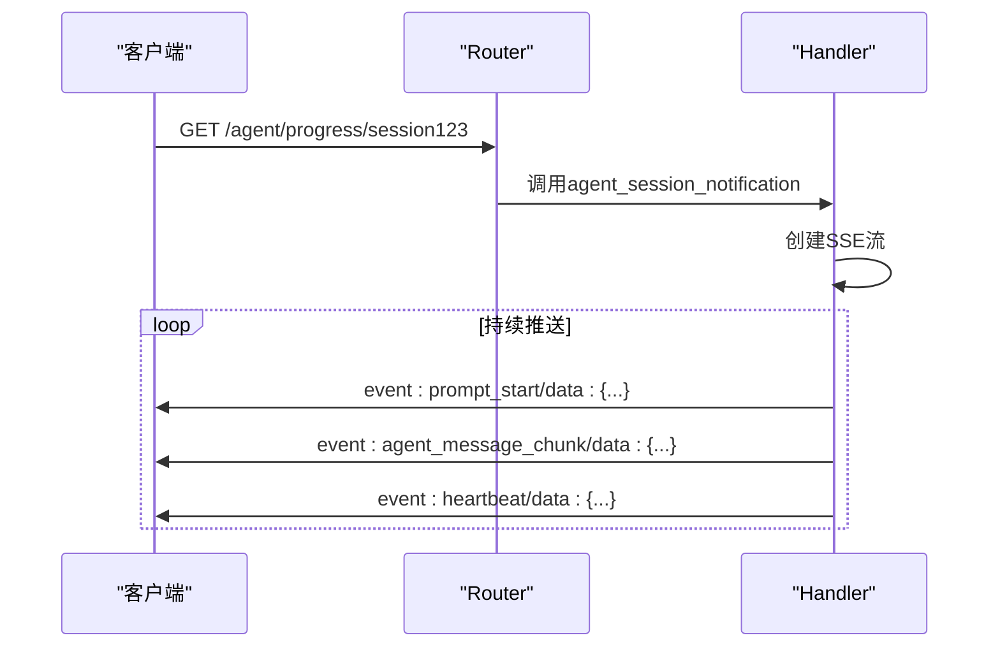
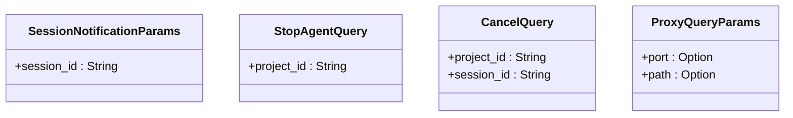
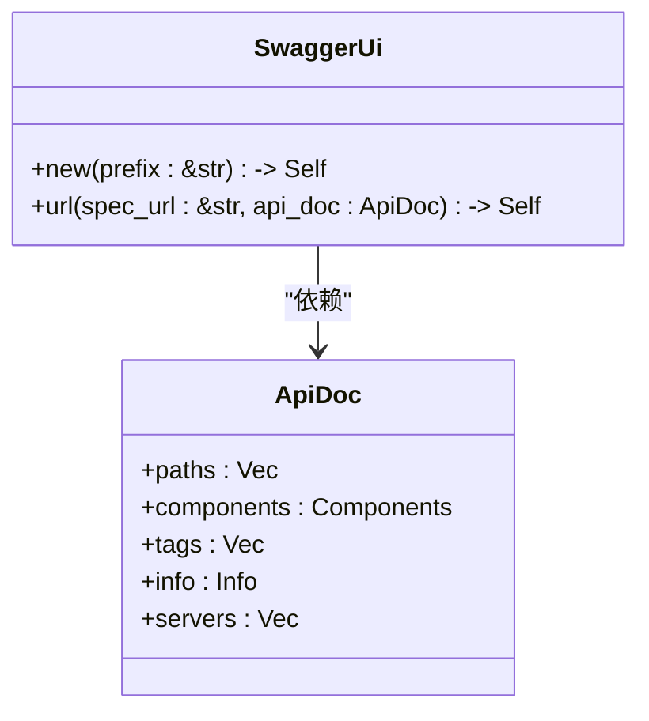

# 路由定义

<cite>
**本文档引用的文件**
- [router.rs](file://crates/rcoder/src/router.rs)
- [health_handler.rs](file://crates/rcoder/src/handler/health_handler.rs)
- [chat_handler.rs](file://crates/rcoder/src/handler/chat_handler.rs)
- [agent_session_notification.rs](file://crates/rcoder/src/handler/agent_session_notification.rs)
- [agent_stop_handler.rs](file://crates/rcoder/src/handler/agent_stop_handler.rs)
- [agent_cancel_handler.rs](file://crates/rcoder/src/handler/agent_cancel_handler.rs)
- [proxy_handler_api.rs](file://crates/rcoder/src/handler/proxy_handler_api.rs)
- [proxy_api.rs](file://crates/rcoder/src/handler/proxy_api.rs)
</cite>

## 目录
1. [项目结构](#项目结构)
2. [核心路由定义](#核心路由定义)
3. [RESTful路由与SSE流式接口](#restful路由与sse流式接口)
4. [路由宏与处理函数绑定](#路由宏与处理函数绑定)
5. [路径参数与查询参数解析](#路径参数与查询参数解析)
6. [嵌套路由组设计模式](#嵌套路由组设计模式)
7. [路由优先级与通配符处理](#路由优先级与通配符处理)
8. [路由冲突场景与解决方案](#路由冲突场景与解决方案)
9. [OpenAPI文档集成](#openapi文档集成)

## 项目结构

本项目采用模块化设计，路由相关代码主要分布在`crates/rcoder/src/router.rs`和`crates/rcoder/src/handler/`目录下。`router.rs`文件负责定义和组织所有路由，而`handler`目录下的各个文件则包含具体的请求处理逻辑。



**图示来源**
- [router.rs](file://crates/rcoder/src/router.rs#L1-L203)
- [handler目录](file://crates/rcoder/src/handler/)

## 核心路由定义

路由系统基于Axum框架构建，通过`create_router`函数创建并返回一个`Router`实例。该函数接收一个`AppState`类型的共享状态，用于在不同路由间共享应用数据。



**图示来源**
- [router.rs](file://crates/rcoder/src/router.rs#L24-L37)
- [router.rs](file://crates/rcoder/src/router.rs#L39-L70)

## RESTful路由与SSE流式接口

### RESTful路由

RESTful路由通过`route`方法定义，支持GET、POST等HTTP方法。例如，健康检查接口通过`get(handler::health_check)`定义，聊天接口通过`post(handler::handle_chat)`定义。

### SSE流式接口

SSE（Server-Sent Events）流式接口用于实时推送AI代理执行进度。`/agent/progress/{session_id}`路由通过`get(handler::agent_session_notification)`定义，返回一个`Sse<impl Stream>`类型的响应，实现持续的数据推送。



**图示来源**
- [router.rs](file://crates/rcoder/src/router.rs#L45-L47)
- [agent_session_notification.rs](file://crates/rcoder/src/handler/agent_session_notification.rs#L1-L439)

## 路由宏与处理函数绑定

路由宏用于将HTTP请求映射到具体的处理函数。处理函数可以通过闭包或函数引用的方式绑定到路由上。例如，`health_check`函数通过`get(handler::health_check)`绑定到`/health`路由。

```mermaid
flowchart TD
A[HTTP请求] --> B{路由匹配}
B --> |/health| C[health_check]
B --> |/chat| D[handle_chat]
B --> |/agent/progress/{session_id}| E[agent_session_notification]
B --> |/agent/session/cancel| F[agent_session_cancel]
B --> |/agent/stop| G[agent_stop]
B --> |/agent/status/{project_id}| H[agent_status]
C --> I[返回健康状态]
D --> J[处理聊天请求]
E --> K[推送SSE消息]
F --> L[取消任务]
G --> M[停止Agent]
H --> N[查询Agent状态]
```

**图示来源**
- [router.rs](file://crates/rcoder/src/router.rs#L39-L70)
- [health_handler.rs](file://crates/rcoder/src/handler/health_handler.rs#L1-L36)
- [chat_handler.rs](file://crates/rcoder/src/handler/chat_handler.rs#L1-L232)

## 路径参数与查询参数解析

### 路径参数

路径参数通过`{param_name}`语法定义，例如`/agent/progress/{session_id}`中的`session_id`。在处理函数中，通过`Path<SessionNotificationParams>`提取参数。

### 查询参数

查询参数通过`Query<StopAgentQuery>`提取，例如`/agent/stop?project_id=test_project`中的`project_id`。



**图示来源**
- [agent_session_notification.rs](file://crates/rcoder/src/handler/agent_session_notification.rs#L50-L58)
- [agent_stop_handler.rs](file://crates/rcoder/src/handler/agent_stop_handler.rs#L10-L18)
- [agent_cancel_handler.rs](file://crates/rcoder/src/handler/agent_cancel_handler.rs#L10-L19)
- [proxy_handler_api.rs](file://crates/rcoder/src/handler/proxy_handler_api.rs#L300-L310)

## 嵌套路由组设计模式

嵌套路由组通过`Router::new()`创建，并通过`merge`方法合并到主路由中。例如，`api_routes`和`proxy_api_routes`分别定义了API接口和代理接口的路由组。

```mermaid
graph TD
A[Router] --> B[api_routes]
A --> C[proxy_api_routes]
A --> D[Swagger UI]
B --> E[/health]
B --> F[/chat]
B --> G[/agent/progress/{session_id}]
B --> H[/agent/session/cancel]
B --> I[/agent/stop]
B --> J[/agent/status/{project_id}]
C --> K[/proxy/status]
C --> L[/proxy/stats]
C --> M[/proxy/config]
C --> N[/proxy]
C --> O[/proxy/{port}]
C --> P[/proxy/{port}/{*path}]
```

**图示来源**
- [router.rs](file://crates/rcoder/src/router.rs#L39-L70)

## 路由优先级与通配符处理

路由匹配遵循定义顺序，先定义的路由优先级更高。通配符路径通过`{*path}`语法定义，例如`/proxy/{port}/{*path}`可以匹配任意路径。

```mermaid
flowchart TD
A[请求路径] --> B{匹配 /proxy/{port}/{*path}?}
B --> |是| C[提取port和path]
B --> |否| D{匹配 /proxy/{port}?}
D --> |是| E[提取port]
D --> |否| F{匹配其他路由}
```

**图示来源**
- [router.rs](file://crates/rcoder/src/router.rs#L62-L64)

## 路由冲突场景与解决方案

### 冲突场景

当多个路由具有相同的路径模式时，可能会发生冲突。例如，`/proxy/{port}`和`/proxy/{port}/{*path}`都可能匹配`/proxy/3000`。

### 解决方案

通过调整路由定义顺序，将更具体的路由放在前面。此外，使用`merge`方法合并路由组时，后合并的路由组中的路由会覆盖前面的同名路由。

```mermaid
flowchart TD
A[定义路由顺序] --> B[先定义具体路由]
A --> C[后定义通配路由]
B --> D[/proxy/{port}]
C --> E[/proxy/{port}/{*path}]
```

**图示来源**
- [router.rs](file://crates/rcoder/src/router.rs#L59-L64)

## OpenAPI文档集成

通过`utoipa`和`utoipa_swagger_ui`库集成OpenAPI文档。`ApiDoc`结构体通过`#[derive(OpenApi)]`宏生成OpenAPI规范，`create_swagger_ui`函数创建Swagger UI路由。



**图示来源**
- [router.rs](file://crates/rcoder/src/router.rs#L72-L194)
- [router.rs](file://crates/rcoder/src/router.rs#L196-L202)