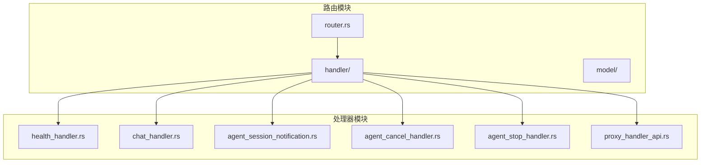
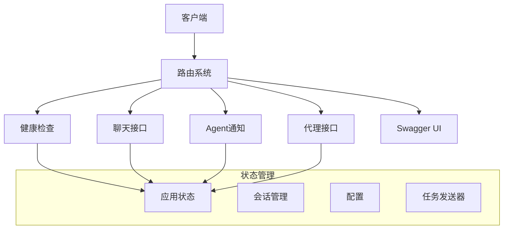
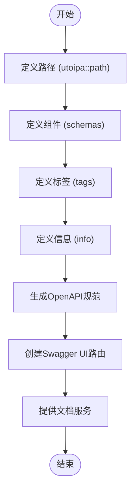
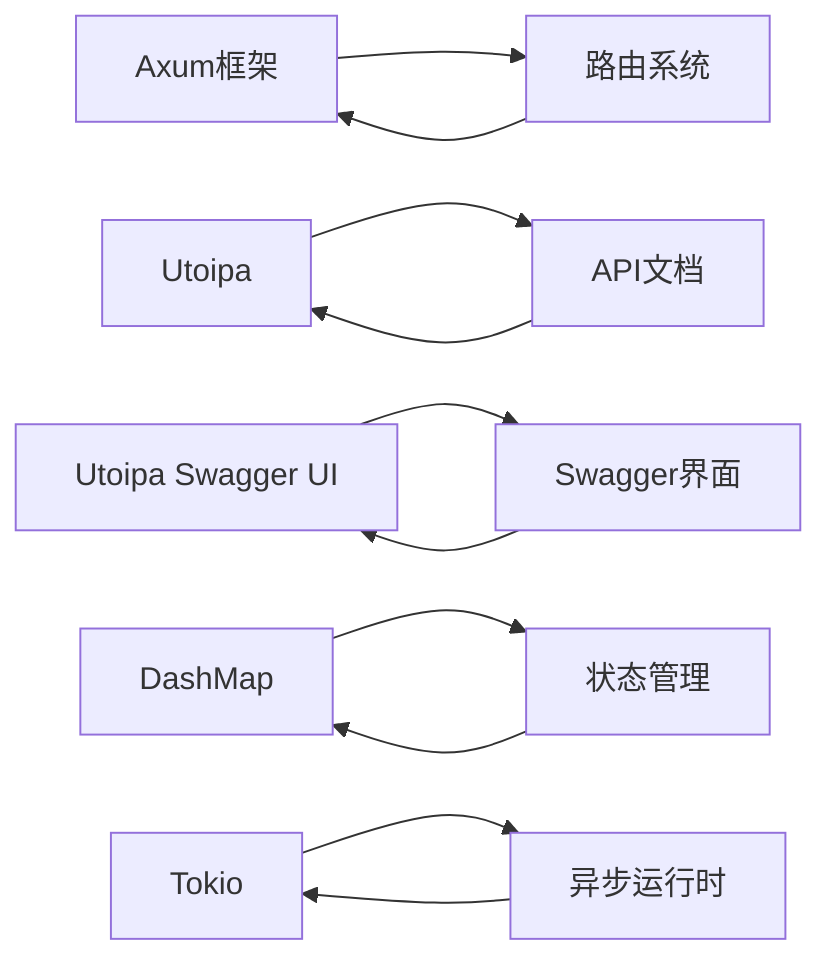

# 路由系统

<cite>
**本文档中引用的文件**   
- [router.rs](file://crates/rcoder/src/router.rs)
- [health_handler.rs](file://crates/rcoder/src/handler/health_handler.rs)
- [chat_handler.rs](file://crates/rcoder/src/handler/chat_handler.rs)
- [agent_session_notification.rs](file://crates/rcoder/src/handler/agent_session_notification.rs)
- [agent_cancel_handler.rs](file://crates/rcoder/src/handler/agent_cancel_handler.rs)
- [agent_stop_handler.rs](file://crates/rcoder/src/handler/agent_stop_handler.rs)
- [proxy_api.rs](file://crates/rcoder/src/handler/proxy_api.rs)
- [proxy_handler_api.rs](file://crates/rcoder/src/handler/proxy_handler_api.rs)
- [mod.rs](file://crates/rcoder/src/handler/mod.rs)
- [ApiDoc](file://crates/rcoder/src/router.rs#L100-L200)
</cite>

## 目录
1. [简介](#简介)
2. [项目结构](#项目结构)
3. [核心组件](#核心组件)
4. [架构概述](#架构概述)
5. [详细组件分析](#详细组件分析)
6. [依赖分析](#依赖分析)
7. [性能考虑](#性能考虑)
8. [故障排除指南](#故障排除指南)
9. [结论](#结论)
10. [附录](#附录)（如有必要）

## 简介
本文档深入探讨了基于Axum框架的路由系统实现，重点阐述了router.rs中如何组合不同handler模块构建RESTful API和SSE流式接口。文档详细分析了路由分组、中间件堆叠和路径参数匹配的实现方式，重点描述了API文档自动生成（utoipa + Swagger UI）的集成过程，以及如何通过OpenAPI规范暴露端点元数据。结合实际代码展示了自定义路由扩展的最佳实践，并说明了路由匹配优先级和冲突解决策略。

## 项目结构
本项目采用模块化设计，路由系统主要由router.rs文件定义，通过组合多个handler模块实现不同的API功能。核心路由逻辑位于crates/rcoder/src/router.rs，该文件负责整合健康检查、聊天、代理等不同功能模块的路由。



**图源**
- [router.rs](file://crates/rcoder/src/router.rs#L1-L20)
- [mod.rs](file://crates/rcoder/src/handler/mod.rs#L1-L10)

**节源**
- [router.rs](file://crates/rcoder/src/router.rs#L1-L50)
- [mod.rs](file://crates/rcoder/src/handler/mod.rs#L1-L20)

## 核心组件
路由系统的核心组件包括API路由、代理API路由和Swagger UI路由三大部分。通过create_router函数将这些路由组合在一起，形成完整的API服务。每个路由组都使用with_state方法注入共享的应用状态，确保处理器能够访问必要的服务和配置。

**节源**
- [router.rs](file://crates/rcoder/src/router.rs#L50-L100)

## 架构概述
系统采用分层架构设计，基于Axum框架构建RESTful API和SSE流式接口。路由系统作为请求分发中心，将不同路径的请求转发到相应的处理器。通过OpenAPI规范自动生成API文档，并集成Swagger UI提供可视化接口测试功能。



**图源**
- [router.rs](file://crates/rcoder/src/router.rs#L50-L80)
- [router.rs](file://crates/rcoder/src/router.rs#L100-L120)

## 详细组件分析
### API路由分析
API路由组负责处理核心业务功能，包括健康检查、聊天交互、Agent状态管理等。每个路由都通过utoipa::path宏注解，自动生成OpenAPI文档所需的元数据。

#### 路由分组实现
```mermaid
classDiagram
class ApiRoutes {
+route("/health", get(health_check))
+route("/chat", post(handle_chat))
+route("/agent/progress/{session_id}", get(agent_session_notification))
+route("/agent/session/cancel", post(agent_session_cancel))
+route("/agent/stop", post(agent_stop))
+route("/agent/status/{project_id}", get(agent_status))
}
ApiRoutes --> health_check : "健康检查"
ApiRoutes --> handle_chat : "聊天处理"
ApiRoutes --> agent_session_notification : "Agent通知"
ApiRoutes --> agent_cancel_handler : "取消处理"
ApiRoutes --> agent_stop_handler : "停止处理"
```

**图源**
- [router.rs](file://crates/rcoder/src/router.rs#L50-L65)
- [health_handler.rs](file://crates/rcoder/src/handler/health_handler.rs#L1-L10)
- [chat_handler.rs](file://crates/rcoder/src/handler/chat_handler.rs#L1-L20)

### 代理API路由分析
代理API路由组提供Pingora反向代理相关的接口，支持端口路由、状态查询和配置管理。这些路由允许通过HTTP接口管理和监控代理服务。

#### 代理路由实现
```mermaid
classDiagram
class ProxyApiRoutes {
+route("/proxy/status", get(proxy_status))
+route("/proxy/stats", get(proxy_stats))
+route("/proxy/config", get(proxy_config))
+route("/proxy", get(proxy_with_query_params))
+route("/proxy/{port}", get(proxy_to_port))
+route("/proxy/{port}/{*path}", get(proxy_to_port_with_path))
}
ProxyApiRoutes --> proxy_status : "状态查询"
ProxyApiRoutes --> proxy_stats : "统计信息"
ProxyApiRoutes --> proxy_config : "配置查询"
ProxyApiRoutes --> proxy_with_query_params : "查询参数代理"
ProxyApiRoutes --> proxy_to_port : "端口代理"
ProxyApiRoutes --> proxy_to_port_with_path : "路径代理"
```

**图源**
- [router.rs](file://crates/rcoder/src/router.rs#L70-L85)
- [proxy_handler_api.rs](file://crates/rcoder/src/handler/proxy_handler_api.rs#L1-L20)

### OpenAPI文档集成
系统通过utoipa和utoipa_swagger_ui crate实现了API文档的自动生成和可视化展示。ApiDoc结构体使用OpenApi宏注解，定义了所有API端点、组件和元数据。

#### 文档生成流程


**图源**
- [router.rs](file://crates/rcoder/src/router.rs#L100-L200)
- [router.rs](file://crates/rcoder/src/router.rs#L201-L202)

**节源**
- [router.rs](file://crates/rcoder/src/router.rs#L100-L202)

## 依赖分析
路由系统依赖于多个核心组件和第三方库，形成了完整的依赖关系网络。通过Cargo.toml文件管理这些依赖，确保版本兼容性和功能完整性。



**图源**
- [Cargo.toml](file://crates/rcoder/Cargo.toml#L10-L30)
- [router.rs](file://crates/rcoder/src/router.rs#L1-L10)

**节源**
- [router.rs](file://crates/rcoder/src/router.rs#L1-L10)
- [Cargo.toml](file://crates/rcoder/Cargo.toml#L1-L50)

## 性能考虑
路由系统在设计时充分考虑了性能因素，采用异步处理、状态共享和高效的数据结构来确保高并发场景下的性能表现。通过Axum框架的异步特性，系统能够高效处理大量并发请求。

## 故障排除指南
当路由系统出现问题时，可以按照以下步骤进行排查：
1. 检查路由定义是否正确
2. 验证处理器函数的签名和返回类型
3. 确认应用状态是否正确注入
4. 检查OpenAPI文档注解是否完整
5. 验证Swagger UI路由配置

**节源**
- [router.rs](file://crates/rcoder/src/router.rs#L1-L202)
- [handler](file://crates/rcoder/src/handler/)

## 结论
本文档详细阐述了基于Axum框架的路由系统实现，展示了如何通过模块化设计构建功能丰富的API服务。系统通过合理的路由分组、状态管理和文档集成，实现了高性能、易维护的RESTful API和SSE流式接口。未来可以进一步优化路由匹配算法，增加更精细的中间件支持，提升系统的可扩展性和灵活性。

## 附录
### OpenAPI标签定义
| 标签名称 | 描述 |
|--------|------|
| system | 系统健康检查和状态监控接口 |
| chat | AI 聊天对话接口，支持多媒体内容 |
| agent | AI 代理会话管理和实时通知接口 |
| proxy | Pingora 反向代理接口，支持端口路由和负载均衡 |

### 服务器配置
| URL | 描述 |
|-----|------|
| http://localhost:3000 | 本地开发环境 |
| https://api.rcoder.com | 生产环境 |
| https://staging-api.rcoder.com | 测试环境 |